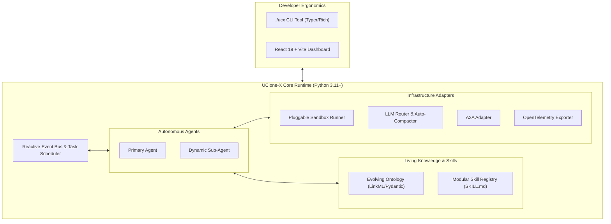

# Product Requirements Document (PRD) — UClone-X

**Project Name**: UClone-X  
**Document Version**: 0.7.0  
**Targets Product Version**: v0.1.0 → v1.0.0 (see §5 Phased Roadmap & Milestones)  
**Status**: Draft — not yet approved  
**Approval**: Requires explicit written approval from the project owner, per [AGENTS.md](../AGENTS.md); to be recorded in this header and in the revision history below once granted.  
**Lead Architect**: the project owner  
**Target Runtimes**: Python 3.11+ (Core Engine) & TypeScript / React 19 (Developer GUI)  
**License**: Apache License 2.0  

> [!IMPORTANT]
> **Implementation status.** This document specifies the product; it does not describe
> running software. What exists today is recorded in [`README.md`](../README.md) and, per
> subsystem, in [`docs/architecture-overview.md`](architecture-overview.md) §0. Read every
> requirement below as intent unless one of those says otherwise.
>
> **Precedence.** Where this document and
> [`docs/principles/core-principles.md`](principles/core-principles.md) disagree, the
> principle wins and this document is wrong. Where it and a subsystem specification
> disagree, the specification wins for mechanism and this document wins for scope.

---

## 1. Executive Summary & Vision

### 1.1 Problem Statement

**For the product's user (U0, §1.3).** Working with AI today means one assistant in one chat
window. A second opinion, a review of the first answer, or a task split between a researcher
and a writer means opening several chats and carrying text between them by hand — and the
person doing the carrying is the only one who sees the whole picture. Putting several agents
into one conversation is possible, but only for someone who can program a multi-agent
framework. The user this product is for does not read code (P0), so that path is closed to
them.

**For the people who build on it (U1–U3).** Modern multi-agent frameworks suffer from
critical architectural bottlenecks:
* **Bloated Dependencies & Heavy Message Brokers**: Running simple multi-agent loops requires spinning up Redis, Kafka, or heavy container stacks, introducing multi-millisecond network hops.
* **Rigid Monolithic Agents**: Most frameworks force a single giant context window rather than lightweight, specialized ephemeral sub-agents.
* **Lack of Interoperability**: Agent-to-Agent (A2A) communication is fragmented across proprietary schemas, preventing cross-organization collaboration.
* **Static, Fragile Knowledge**: Agents rely on ungrounded natural language prompts that hallucinate state transitions and lack structured domain ontologies.

### 1.2 Product Vision
**For U0, UClone-X is a place to work with a team of AI agents.** The user keeps a set of
**clones** — agents, each with its own persona — and brings one or several of them into a
conversation. There they answer in turn, address each other's work, and can be addressed by
name, in one timeline the user reads top to bottom. It installs and runs on the user's own
machine, and its first screen is that conversation (§1.5).

**Underneath, UClone-X is an open-source, ultra-low-latency, event-driven agent core and multi-agent collaboration framework. It provides a zero-dependency, single-machine accelerated engine where agents **reactively execute, dynamically define sub-agents, evolve their own domain ontologies, self-synthesize skills, and interoperate seamlessly over the A2A standard.** The team U0 works with runs on this engine, and
U1–U3 build on it directly.

### 1.3 Target Users

**The product's target user is U0: a person who is not a programmer or a computer
expert.** Recorded as the owner's statement of 2026-09-22. U1–U3 are real audiences, but they
are audiences of the *engine* — they read code, run commands and speak the protocol — and none
of them is who the product is made for. Their requirements are met without ever defining what
U0 sees first.

Requirements are written for these four, in priority order. A requirement that serves
none of them is out of scope by construction.

| | Who | What they need from UClone-X | What they will not tolerate |
| :--- | :--- | :--- | :--- |
| **U0** | **The product's user** — not a programmer or a computer expert; installs UClone-X and runs an agent **without reading its code** | A first run that reaches a working agent with no configuration file, no dependency to resolve and no architecture to read; a first screen that is a conversation rather than an instrument panel; failures worded so the next action is obvious | Being shown the runtime's internals before being shown the product; vocabulary that presupposes the architecture (`FastPath`, `P6`, `provenance`) |
| **U1** | **The framework developer** building agents on a laptop | `git clone` to a running agent with no daemon, no broker and no container; a real type checker; failures that name their cause | A dependency stack to install before the first turn; a framework that hides an error to look smooth |
| **U2** | **The integrator** connecting UClone-X to other vendors' agents | Conformance to the published A2A specification at a pinned version, so an off-the-shelf A2A client works | A proprietary dialect described as a standard |
| **U3** | **The operator** running a swarm unattended | Attributable failures, token ceilings that hold, and a boundary between agent-authored code and the host | Silent degradation; a token overrun discovered after the fact |

U0 is the reason [P0](principles/details/p0-product-purpose.md) exists — P0 names this person
directly ("people who do not read its code", "a desktop head a non-technical user can run",
"a product surface rather than a testbench") — U1 is the reason P3 exists, U2 the reason P2
exists, and U3 the reason P5 and P6 exist.

**U0 was absent from this list until 2026-09-11**, while the sentence above it put anything
serving no listed user out of scope by construction. P0's user was therefore excluded by a
Tier 2 document that P0 governs, and the head was built for both audiences at once because
nothing chose. Recorded as `2026-09-11-001`;
the drift it produced, and why it favoured U1, are described there.

**Division of authority over the head.** U0 decides the head's **default state** — what a new
user sees before touching anything. U1–U3 decide what is **reachable** from it. A capability
U1 needs is not removed to serve U0; it is moved one deliberate action away. This is how P0's
"ease comes from complete defaults, not from a reduced feature set" applies to a surface, and
it is the rule `.claude/skills/ui-authoring/SKILL.md`
operationalises for anyone building one.

When two requirements conflict, the one serving the earlier user wins unless the later
user's requirement is a safety property — safety is not traded for ergonomics. **U0 winning a
conflict never means hiding a failure**: P0's precedence rule is explicit that a beginner's
convenience is not a contradiction with P6, and an honest failure stated in plain words serves
U0 better than a smooth one.

### 1.4 Non-Goals

Stated so that scope is bounded by a decision rather than by whatever nobody has
proposed yet. Each is a deliberate exclusion, not an oversight or a backlog item.

* **A distributed orchestrator.** Multi-host coordination is an optional extension over
  the A2A remote binding, never a requirement of the core. P3 forbids the single-machine
  path from depending on a broker; that is incompatible with a cluster-first design.
* **A hosted or multi-tenant service.** There is no tenancy model, no per-tenant
  isolation and no billing. The unit of deployment is one developer's machine or one
  operator's process.
* **A model provider.** UClone-X routes to providers and never trains, serves or
  fine-tunes a model.
* **A general workflow engine.** Skills package agent-discovered procedures; they are not
  a scheduler, a DAG runner or a replacement for CI.
* **An IDE or an editor.** Code intelligence (FR-11) exists to ground the agent's own
  edits. It is not a language-server product and ships no editor UI.
* **Browser or GUI automation.** No headless browser, no screen control.
* **A security product.** UClone-X defends the machine it runs on to the extent
  [`docs/security-threat-model.md`](security-threat-model.md) states and no further. It
  is not a sandbox vendor, and its isolation levels are not a substitute for OS-level
  controls where those are the right tool.

### 1.5 What U0 Does: Working With a Team of Clones

Recorded as the owner's decision of 2026-09-22. §1.3 says who U0 is and what they will not
tolerate; this section says what they come to do. Mechanism lives in the requirements it
cites — read every item below as intent unless [`README.md`](../README.md) says it is built.

**Product vocabulary.** These are the words the head uses and the words requirements use when
they describe what a user sees. They are defined here, once; a design document links here
rather than restating them.

| Term | Meaning | Not to be confused with |
| :--- | :--- | :--- |
| **Clone** | An agent the user keeps. It has a name, a persona and the permissions it is trusted with, and it outlives any one conversation. | A conversation — one clone opens many conversations. |
| **Persona** | A clone's identity: how it behaves and what role it takes (e.g. obedient, advisor, guide, field-commander; Lead, Critic, Researcher). An attribute *of* a clone. | A clone — a list of personas is not a list of clones. |
| **Conversation** | One timeline in which the user and one or more clones take turns. Any conversation can seat several clones, a one-clone conversation included. | `session` and `room`, which are runtime words. `Room` never appears in anything a user reads (`unified-conversations-and-room-ui.md` Rev 21). |

**Primary scenarios**, in the order a new user meets them:

1. **Talk to one clone.** First launch opens a conversation with a named default clone, with
   no configuration file to write (FR-13.9, P0). This is the single-assistant experience
   the user already knows, and it is where the product starts, not where it ends.
2. **Bring in a second clone to check the first.** The user adds a clone with a reviewing
   persona to the conversation. A lead clone answers and the critic reviews that answer
   without the user re-prompting it; stop halts the whole sequence (FR-13.11, FR-13.13).
3. **Address one member of the team.** In a conversation with several clones, `@name`
   sends the message to that clone alone, and naming a clone that is not present is an
   error rather than a guess (FR-13.12).
4. **Know who said what.** Every turn records which clone and which model produced it,
   shown wherever it carries information (FR-13.4). With several clones in the room this
   is shown on every turn.

**What makes a scenario succeed for U0:** the whole exchange happens in one conversation, the
user never copies text between agents, and the user never has to learn the runtime's
vocabulary to do it (§1.3).

**Scope consequence.** A requirement whose user-facing effect cannot be described in the terms
of the table above is a U1–U3 requirement, and belongs one deliberate action away from the
head's default state (§1.3, *Division of authority over the head*).

---

## 2. Inviolable Guiding Principles

All functional requirements in this document are governed by the nine immutable core
principles. **[`docs/principles/core-principles.md`](principles/core-principles.md)** plus its companion detail specifications under `principles/details/` is the **sole normative text** for P0–P9; the table below is navigation only.

> [!CAUTION]
> Do not restate a principle here. An earlier revision of this section paraphrased all
> nine, four of those paraphrases went stale when the principles were repaired on
> 2026-09-02, and the PRD then contradicted the text it claims to be governed by — see
> `2026-09-02-043`. Any
> conflict between this document and a principle resolves to the principle, always.

| | Principle | Normative text |
| :--- | :--- | :--- |
| **P1** | Reactive Event-Driven Loop | [`p1-reactive-event-driven.md`](principles/details/p1-reactive-event-driven.md) |
| **P2** | A2A Dual-Transport | [`p2-google-a2a-interoperability.md`](principles/details/p2-google-a2a-interoperability.md) |
| **P3** | Single-Machine Acceleration & Pluggable Sandboxing | [`p3-single-machine-acceleration.md`](principles/details/p3-single-machine-acceleration.md) |
| **P4** | Dynamic Specialization & Bounded Execution | [`p4-dynamic-specialization.md`](principles/details/p4-dynamic-specialization.md) |
| **P5** | LLM Provider Agnosticism, Token Management & Auto-Compaction | [`p5-llm-token-management.md`](principles/details/p5-llm-token-management.md) |
| **P6** | Fail-Fast & Zero Silent Fallbacks | [`p6-fail-fast-observability.md`](principles/details/p6-fail-fast-observability.md) |
| **P7** | Evolving Ontology Grounding | [`p7-evolving-ontology.md`](principles/details/p7-evolving-ontology.md) |
| **P8** | Strict Typing & Language Boundaries | [`p8-strict-typing-boundaries.md`](principles/details/p8-strict-typing-boundaries.md) |
| **P9** | Self-Evolving & Pluggable Skills | [`p9-dynamic-skills.md`](principles/details/p9-dynamic-skills.md) |

Amending a principle is governed by
[`docs/governance/principle-amendment-policy.md`](governance/principle-amendment-policy.md),
not by this document. A requirement here that would need a principle changed is blocked
until that amendment lands.

---

## 3. Functional Requirements (FR)



### FR-1: Event-Driven Agent State Machine Core
* **FR-1.1**: The agent lifecycle must implement a reactive state machine (`IDLE` -> `INGESTING` -> `REASONING` -> `CALLING_TOOL` -> `AWAITING_INPUT` -> `EMITTING_RESPONSE`).
* **FR-1.2**: Async execution must be non-blocking. When awaiting tool execution or sub-agent replies, coroutines yield control and wake up reactively upon event arrival.
* **FR-1.3**: Every event must conform to the unified `AgentEvent` envelope: a required closed `type`, a bus-assigned `sequence`, `event_id`, `session_id`, `trace_id`, an immutable payload mapping, and — on any envelope carrying a result — the `provenance` block P6 requires. The envelope is frozen and rejects undeclared fields. Its normative field-by-field contract is [`docs/event-driven-agent-core.md`](event-driven-agent-core.md); this requirement fixes that a single envelope exists, not what its fields are.
* **FR-1.4**: The lifecycle must have a state for **interruption**. P1 gives `INTERRUPT` the highest event priority, and FR-1.1 has no state to arrive in — so cancellation currently has a channel and no destination. Agent-level cancellation, and its propagation to in-flight tool calls, sandboxed processes, LLM streams and sub-agents, must be defined before any component relies on it.
* **Acceptance**: a publish that is never read does not spin (no busy-wait in a CPU profile); an `INTERRUPT` published behind lower-priority traffic is dispatched before it; an envelope missing `type` or carrying an undeclared field is rejected at construction; a result envelope with no `provenance` raises rather than defaulting.

### FR-2: A2A Protocol & Dual-Transport
* **FR-2.1**: Discovery endpoint `/.well-known/agent-card.json` exposing an `AgentCard`: `capabilities` (the `AgentCapabilities` flags) and `skills` (the agent's abilities). A2A's `AgentSkill` carries no input/output schema fields; typed schemas must travel as a declared A2A extension.
* **FR-2.2**: Dual-Transport Engine:
  - **Local Fastpath**: Direct Python object pointer transfer over async queues, with no network or serialization step. Latency budgets are in [`docs/nfr-performance-budgets.md`](nfr-performance-budgets.md); none is measured yet.
  - **Remote Wire Protocol**: a standard A2A binding — JSON-RPC 2.0, gRPC or HTTP+JSON/REST — with SSE (`text/event-stream`) for streaming. A2A has no create-task operation; a task is created as a side effect of `SendMessage`.
* **FR-2.3**: The in-memory fastpath is a **non-standard local binding**, declared as such under the extension mechanism of the pinned specification. It must never appear in a published Agent Card, since a declared interface must be reachable, and it must remain observationally equivalent to the standard binding — the same task states, the same errors, the same ordering.
* **Acceptance**: an off-the-shelf A2A client at the pinned version completes discovery, a blocking send and a streaming send against UClone-X without UClone-X-specific code; the same scripted exchange produces identical task states and errors over the fastpath and over the remote binding. Conformance is tracked row by row in [`docs/a2a-protocol-spec.md`](a2a-protocol-spec.md) §1, which pins the version this is checked against.

### FR-3: Dynamic Persona Definition & Sub-Agent Swarms
* **FR-3.1**: Agents must be able to invoke `define_subagent` and `invoke_subagent` at runtime with custom system prompts, strict tool whitelists, and model tier configurations.
* **FR-3.2**: Safety guardrails must bound depth, fan-out and spend. `max_depth` (default 2) and per-parent fan-out (default 5) are absolute, and a session-wide live-sub-agent ceiling bounds the product. Enabling sub-agent tools permits spawning *within* a limit and never past it; a depth violation is a refusal, never a silent in-context degradation.
* **FR-3.3**: A child's budget is **deducted from its parent's remaining budget**, not tracked in a separate pool — independently capped siblings would otherwise jointly exceed a session ceiling. A child may request less than its parent has and never more: the effective limit is the narrower of the two, applied uniformly to depth, turns and tokens.
* **FR-3.4**: Sub-agents must operate in isolated context windows, returning only final syntheses to the parent. A child inherits its task and its narrowed allocation; it must not inherit the parent's history, scratchpad or credentials.
* **FR-3.5**: Orphan lifecycle must be defined: when a parent terminates, crashes or is cancelled, its children are cancelled, and detection must not depend on observing a single bus event, because a lossy backpressure policy may drop one. Partial output from a cancelled child is non-authoritative metadata and must never be surfaced as a completed result.
* **Acceptance**: a child that exhausts its budget mid-task produces a typed budget error naming which ceiling was hit, never a truncated answer presented as complete; a child requesting a deeper limit than its parent holds is refused; killing a parent process leaves no running child after the documented grace period. Mechanism in [`docs/dynamic-persona-interface.md`](dynamic-persona-interface.md).

### FR-4: Self-Constructing & Human-Guided Evolving Ontology
* **FR-4.1**: **Autonomous Induction**: Agents autonomously extract domain entities, relationships, and state constraints from successful task executions into persistent ontology schemas.
* **FR-4.2**: **Human Guidance**: Developers can seed, override, or instruct ontologies via LinkML/YAML or natural language CLI commands (`./ucx ontology teach`).
* **FR-4.3**: **Tiered Validation**:
  - *Tier 1 (Inline Turn)*: Compiled Pydantic v2 validator hooks, deterministic only against a pinned ontology `content_hash`. Budget in [`docs/nfr-performance-budgets.md`](nfr-performance-budgets.md).
  - *Tier 2 (Background)*: Async knowledge graph expansion and semantic alignment.
* **FR-4.4**: An autonomously induced term must not become enforcing, or matchable across agents, without human promotion. Below the matching confidence threshold the task asks a human or fails with a typed error — there is no proceed-on-best-guess path. Promotion, contradiction and retraction rules are in [`docs/ontology-alignment-spec.md`](ontology-alignment-spec.md).
* **FR-4.5**: **User/Workspace Isolation & Automated Curation Pipeline**:
  - Ontologies and accumulated knowledge are strictly partitioned per user (`~/.ucx/knowledge/users/`) and workspace (`~/.ucx/knowledge/workspaces/`).
  - Knowledge ingestion enforces a 4-stage curation filter: (1) Durable Knowledge Gate (filtering conversational transient noise), (2) Semantic Deduplication & Conflict Superseding, (3) Confidence Scoring (empirical reward/penalty), and (4) Temporal Decay & Automated Pruning of unreinforced or poisoned assertions.
* **Acceptance**: the quality gate validates a pinned ontology snapshot identified by content hash, so two runs of the same commit give the same verdict; an induced candidate cannot reject an action; retracting a term whose dependent is human-asserted is refused rather than silently cascaded; knowledge decayed below threshold is pruned automatically.


### FR-5: Dynamic & Self-Evolving Skill Engine
* **FR-5.1**: Skills must follow the standard folder structure: `ucx-agent-skills/<name>/SKILL.md` (YAML frontmatter + workflow markdown) + `scripts/` + `tests/`.
* **FR-5.2**: **Autonomous Skill Synthesis**: Agents can distill multi-step terminal/coding solutions into new skill packages automatically.
* **FR-5.3**: **Hot-Reloading**: Skills can be added or modified at runtime without restarting the core process.
* **FR-5.4**: **Skill Auditor Agent & Configurable Auto-Approval**: Newly synthesized skills undergo automated security and red-teaming audit by a **Skill Auditor ucx agent**. The auto-approval policy is configurable (`always`, `safe_only`, `never`).
* **FR-5.5**: **The audit must fail closed.** An absent, crashed or timed-out audit is not a passing audit: a synthesized skill is unusable until a verdict exists, the verdict is a closed set with no default, and a risk score is unset until measured. Registration must be unable to accept a skill without its audit report, and an audit is bound to the code it examined by content hash so it cannot be inherited by different code.
* **FR-5.6**: **A synthesized artifact may never raise its own ceiling.** A skill's declared isolation is a *request*; the runtime's floor decides. This is not configurable.
* **FR-5.7**: The `never` policy requires a human path to approve, so the CLI transition (`./ucx skill list --pending`, `approve`, `reject`) must ship in the same release as synthesis. Until it does, `never` cannot be honoured and the safe setting is unusable — see `2026-09-02-041`.
* **Acceptance**: registering a skill with no audit report is a type error, not a runtime check; a skill whose file content changed after audit is refused promotion; with policy `never`, no synthesized skill reaches `ACTIVE` without a recorded human action naming who approved it and when.


### FR-6: LLM-Agnostic Engine, Token Budgeting & Auto-Compaction
* **FR-6.1**: Native connectors for Google Gemini (`google-genai`), Anthropic Claude (`anthropic`), OpenAI (`openai`), and Local models (`ollama`/`vLLM`).
* **FR-6.2**: **Centralized Token & Budget Management**: The LLM layer measures input/output tokens and enforces per-session token ceilings. Cost or price calculation is out of scope: the product counts tokens only, keeps no price table and enforces no monetary ceiling (P5, #1392).
* **FR-6.3**: **Automatic Context Compaction**: Triggers semantic summarization and tool log pruning when context reaches 70% of the model window.
* **FR-6.4**: **Attributable Failover**: Failover to a secondary model is permitted only under P6's attributable-recovery conditions — a declared policy, `provenance` **in-band on the response**, a failover event, and a correlated telemetry span. It is explicitly **not** transparent: a caller must be able to tell that its result came from a fallback path, because an agent that cannot distinguish a primary result from a failover result cannot reason about its own reliability. A span informs a human; provenance informs the calling agent.
* **FR-6.5**: **Provider agnosticism is a requirement, not a feature.** No provider SDK import and no provider-native type may appear outside the connector modules, and adding a provider must touch only its own connector. Token accounting is per provider even though callers see only the normalized type.
* **FR-6.6**: Failover accounting is **undecided and must not be closed by weakening P5 or P6**: which session's token budget a failover request charges needs a P5 accounting rule.
* **Acceptance**: a forced total outage raises rather than returning a value; a forced primary failure returns a result whose `provenance.path` is `failover` with a non-empty attempt list naming the provider that served it; a clean call reports `primary` with no attempts; a consumer handed a result with `provenance` absent raises. A grep for provider SDK imports outside the connector modules returns nothing.

### FR-7: Pluggable & Selective Local Sandbox Execution
* **FR-7.1**: Three configurable execution modes:
  - `workspace` — **the default**: filesystem sandboxing restricting writes to project or worktree bounds. Bounds writes only; it does not scrub the environment or restrict egress.
  - `container` / `wasm` — **by user configuration**: micro-container (Docker/Podman) or WASM isolation for untrusted code. Requires an external runtime; its absence must fail explicitly rather than degrade to a weaker level.
  - `none` — **explicit opt-in only**: direct host execution for trusted local work. Never reached by defaulting, and never grantable by a requesting artifact.
* **FR-7.2**: The field is `isolation_level` and its values are `none`, `workspace`, `container` and `wasm` — four, not three. The name was changed from `mode` to remove a collision with the sub-agent `fs_scope` axis, which is a different question: `isolation_level` decides what is reachable at all, `fs_scope` decides which files a child sees within that. A combination that cannot hold, such as a container with an inherited host workspace, must fail rather than silently downgrade.
* **FR-7.3**: A resource or network limit that a level cannot enforce must be **unexpressible or rejected**, never accepted and ignored. Requesting network restriction from a level that cannot restrict the network is an error.
* **FR-7.4**: **Isolation is not the credential boundary.** Every spawned process gets an environment allowlist that denies credential-shaped variables by default, and egress is denied by default. This applies at every level **including `none`**, because `workspace` bounds writes only and closes no credential path.
* **Acceptance**: the default configuration is constructible without naming a filesystem root, and reaching `none` requires writing it explicitly; a tool run under the default cannot read a variable matching the credential patterns; a request for `container` on a host with no container runtime fails with a named error rather than running unisolated.

### FR-8: Unified Developer CLI (`./ucx`)
* **FR-8.1**: A single entry point (`./ucx`) provides:

| Command | Purpose | Status |
| :--- | :--- | :--- |
| `./ucx test check` | Quality gate: `ruff format --check`, `ruff check`, `pyright` (strict via `pyproject.toml`), `pytest` with a coverage floor. Fails on the first non-zero exit | **Implemented** |
| `./ucx dev task create\|list\|claim\|resolve` | Builder work tracker, backed by GitHub Issues on Project #3 | **Implemented** |
| `./ucx version` | Print version | **Implemented** |
| `./ucx setup` | Bootstrap venv, dependencies and UI assets | **Stub** — prints success, does nothing |
| `./ucx run [agent]` | Start the in-memory runtime | **Stub** |
| `./ucx ui` | Launch the developer dashboard | **Stub** |
| `./ucx skill list --pending\|approve\|reject` | The human gate FR-5.7 requires | **Planned** |
| `./ucx ontology teach\|forget\|arbitrate` | Human ontology steering (FR-4.2) | **Planned** |
| `./ucx test live` | Integration tests consuming real tokens, with token guardrails | **Planned** |

* **FR-8.2**: A command that is not implemented must **fail explicitly**. A stub that prints success is the silent-fallback shape P6 forbids, and three of the rows above currently do exactly that.
* **FR-8.3**: The gate is authoritative: `AGENTS.md` requires it to pass before every commit, so any check the project claims to enforce must be a step in it or must not be claimed. Ontology validation is claimed in several places and is not a step; it is **Planned** and marked as such in [`docs/cli-specification.md`](cli-specification.md).
* **Acceptance**: every row marked Implemented has a test; every row marked Stub or Planned exits non-zero with a message naming its status rather than printing success.

### FR-9: Developer UI Dashboard (React + Vite)
* **FR-9.1**: Real-time Agent Swarm Graph visualizing active primary and sub-agents (React Flow).
* **FR-9.2**: Live Event Ledger streaming A2A JSON envelopes with search, filter, and latency badges.
* **FR-9.3**: Interactive Ontology Explorer, and the chat surface specified in **FR-13**. The dashboard hosts it; FR-13 governs its shape.
* **FR-9.4**: **The dashboard is a control plane and must be authenticated.** It can dispatch events and therefore drive the agent. It binds to loopback only, requires a session token, and validates request origin. An unauthenticated dispatch endpoint is a local privilege-escalation path — threat T7 in [`docs/security-threat-model.md`](security-threat-model.md).
* **Acceptance**: a request to the dispatch or stream endpoint without a valid session token is refused; the listener is not reachable from another host by default.

### FR-10: Native OpenTelemetry (OTel) Observability
* **FR-10.1**: All agent turns, tool calls, LLM spans, and A2A delegations emit standard OTel traces and metrics.
* **FR-10.2**: Zero-config export to Langfuse, Jaeger, Prometheus, or any OTLP collector.
* **FR-10.3**: **Telemetry is an egress path and must be scrubbed.** Spans carry prompts, tool arguments and results. Before export, credential-shaped values and payload contents must be redacted or omitted by default, and enabling full-payload export must be a deliberate opt-in that says what it sends — threat T8.
* **Acceptance**: with export enabled and default settings, no exported span body contains a value matching the credential patterns; enabling payload export requires an explicit setting, not a default.

### FR-11: Code Intelligence & Symbol Knowledge Graph (AST, LSP, SCIP)
* **FR-11.1**: **Tree-sitter AST**: Sub-millisecond syntax parsing for granular symbol definitions and scopes without code execution.
* **FR-11.2**: **LSP Client**: Interactive `definition`, `references`, and real-time `diagnostics` (compiler/type errors) for hallucination-free editing.
* **FR-11.3**: **SCIP Repository Indexing**: Generates repository-scale code knowledge graphs ingested into the agent's ontology store.
* **FR-11.4**: The three technologies have different costs and must be declared separately: Tree-sitter is in-process; an LSP server is a supervised **subprocess** requiring an external toolchain; a SCIP index is a build artefact from an external **binary**. Each is optional, none sits on the agent dispatch path, and a missing one degrades to a named reduced-capability mode or fails — never silently.
* **Acceptance**: the core imports and runs with none of the three installed; a missing LSP toolchain produces a named error or a labelled reduced mode, not a silently empty result.

### FR-12: Security & Trust Boundaries

Derived from [`docs/security-threat-model.md`](security-threat-model.md). Its central
finding shapes this section: the isolation level is decisive for **one** of ten threats
and irrelevant to six, so the controls below are not a restatement of FR-7.

* **FR-12.1**: **Agent-generated code is untrusted input.** A synthesized skill is
  executable text produced by a model from data the model did not control. It is subject
  to the same boundary as a third-party tool, and its declared privileges are requests.
* **FR-12.2**: **Event identity is assigned, not asserted.** The bus stamps origin, as it
  stamps sequence. A publisher cannot claim to be the user. Without this, any
  event-delivered human approval is forgeable by the code it gates.
* **FR-12.3**: **Credential containment**, per FR-7.4: environment allowlist and egress
  deny-by-default at every isolation level. This is the control that closes credential
  exfiltration; the isolation level is not.
* **FR-12.4**: **Every untrusted-code entry point is enumerated and bounded.** Tools,
  synthesized skills, remote A2A tasks, **and MCP tool providers** — the last of which
  spawns a local process and is the surface most easily forgotten.
* **FR-12.5**: **Persistent stores are integrity-checked.** The ontology and skill stores
  survive sessions, so poisoning either persists past the turn that caused it. Content
  hashing and human-gated promotion apply to both.
* **FR-12.6**: **Prompt injection is not solved by isolation** and must not be presented
  as such. Isolation caps what a tool call touches, never whether it is made; the control
  is authorization at the call, not containment after it.
* **FR-12.7**: **Disclosure.** [`SECURITY.md`](../SECURITY.md) states the reporting path,
  and unresolved findings stay linked from the register rather than being described as
  fixed.
* **Acceptance**: each of the ten threats in the threat model maps to a requirement here
  or to a recorded, linked open issue; no threat is marked mitigated while its control is
  unimplemented.


### FR-13: Conversational Chat Surface

The chat surface is the conversation of §1.5 — the first screen U0 sees and where U1
actually works — and it is judged against the interaction
class users already have — Antigravity's agent panel and Claude Desktop — not against a
debug console. FR-9 governs the dashboard that hosts it; this requirement governs its
shape. Nothing here relaxes P8: the surface renders and dispatches, and every piece of
state named below lives in the Core.

* **FR-13.1**: Three fixed regions — a persistent session sidebar, one centred
  conversation column at a readable measure, and a composer pinned to the bottom of that
  column. Conversation content is never split across tabs the user must reassemble.
* **FR-13.2**: The session list is a **view over the Core session store**, not browser
  state. Two windows opened on the same host show the same sessions, and a reload loses
  nothing that the Core holds.
  * **Acceptance**: with the browser's storage cleared, the session list is unchanged.
* **FR-13.3**: Responses stream token-by-token with a stop control that is live for the
  whole generation. A stopped turn is marked as stopped and its text is **never**
  presented as a completed answer (P6: a truncated result is not a result).
* **FR-13.4**: **Every assistant turn carries who answered it, and the surface can show
  that without the user leaving the conversation** — the persona that governed the turn
  and the provider/model that served it, both read from the turn result. This is a
  requirement rather than a nicety because a model's self-report is not evidence of which
  model served a turn: a local `qwen2.5-coder:14b` under a persona preamble stated it was
  "OpenAI GPT-4", and the surface offered the user nothing to contradict it with.

  **The record is unconditional; printing it is not.** A conversation is a conversation,
  not a log of itself, and a line repeating one unchanging value under every turn is
  decoration rather than evidence. The surface renders the attribution where it carries
  information:
  * **On every turn**, when more than one persona is in the conversation — the speaker
    changes at each turn, so the attribution is content.
  * **On the turn**, when it differs from the turn before it — a fallback, a degraded
    serve, a model changed mid-conversation. The change is the news; the steady state is
    not.
  * **In the conversation's own chrome** otherwise, where it is true of every turn beneath
    it, with each turn's own attribution reachable on that turn. Reachable means on the
    message itself, not on a separate screen.
  * **Acceptance**: when a reply's *text* names a different model than the turn's
    attribution, what the surface shows for that turn is the served model, reachable
    without leaving the conversation. The attribution is never derived from message
    content. Reading back through a conversation whose served model changed, every turn's
    attribution is recoverable from the nearest one at or above it.
* **FR-13.5**: Tool calls and sub-agent activity appear **inline in the conversation** as
  collapsible steps at the point they occurred, not in a separate ledger the user must
  correlate by timestamp. The ledger (FR-9.2) remains, for a different job.
* **FR-13.6**: The composer accepts multi-line input, carries the persona selector, and
  supports slash commands. Sending is unambiguous: one key sends, another newlines, and
  the surface says which.
* **FR-13.7**: Per-message affordances: copy, retry, and edit-and-resend. **Edit-and-resend
  truncates the conversation in the Core** at that message and re-runs from there; it does
  not hide messages in the browser while the Core still holds them.
  * **Acceptance**: after an edit-and-resend, the Core's stored history matches what the
    user sees.
* **FR-13.8**: Keyboard-first for the common loop — new session, focus composer, send,
  stop — with the bindings discoverable in the surface.
* **FR-13.9**: First launch opens a usable conversation with a named default agent rather
  than a blank pane or an internal identifier. Builder-layer vocabulary
  (`agent-orchestrator`, `builder`, `reviewer`) must not appear in the surface; per
  `AGENTS.md` §"Rule of Separation" it must not appear in the runtime at all.
* **FR-13.10**: The surface is a control plane and inherits **FR-9.4** unchanged —
  loopback binding, session token, origin validation. A chat box that dispatches to an
  agent is the same privilege-escalation path as any other dispatch endpoint.
* **FR-13.11**: **Multi-Agent Shared Room (User + N Agents in a single room session)**.
  A conversation session supports configuring a participant roster of multiple runtime agents
  (e.g., Lead, Critic, Researcher) alongside the human user within a single unified chat room.
  The conversation column presents a single coherent chronological timeline of all turns
  rather than splitting participants across disconnected tabs or separate sub-threads.
  The room configuration (`RoomConfig`) and active participant roster (`RoomParticipant`)
  are stored exclusively in the Core session state (P8), ensuring the UI remains a stateless
  presentation projection over Core-held room membership.
  * **Acceptance**: In a session configured with multiple agents, turns from any participating
    agent render inline in chronological order in the same room view; closing and reopening
    the browser preserves the exact participant roster and turn history from the Core.
* **FR-13.12**: **Fast-Path Routing via `@mention` Syntax (`@<agent_id>` / `@<role>`)**.
  The composer and turn dispatcher support direct targeted addressing using `@mention` syntax.
  A user message containing `@<agent_id>` or `@<role>` routes execution directly to that
  specific participant agent (Fast-Path), bypassing orchestrator routing latency. If an
  unknown agent or role is addressed, the dispatcher rejects the turn immediately with an
  explicit routing error rather than falling back to an unmentioned agent (P6: fail-fast,
  never guess intent). Mention parsing is strictly decoupled from LLM inference.
  * **Acceptance**: Entering `@critic Review this code` in a room with `@developer` and `@critic`
    dispatches directly to `@critic`, displaying `@critic`'s turn attribution. Entering
    `@unknown ...` rejects the dispatch with an actionable error.
* **FR-13.13**: **Sequential Turn-Taking & Debate (Lead agent generation followed by Critic critique)**.
  The room orchestration engine supports structured multi-agent collaboration and sequential debate
  sequences within the shared room timeline. In debate or multi-stage execution mode, a turn by a
  lead agent can automatically trigger a subsequent evaluation or critique turn by a designated
  critic/reviewer agent without requiring manual user re-prompting. Stop controls remain active
  across the entire sequence: triggering stop halts immediately, cancels pending agent turns in the
  sequence, and records completed turns with their honest terminal state. Turn limits and loop
  guards prevent runaway agent-to-agent cycles.
  * **Acceptance**: In sequential debate mode, a user prompt yields a lead agent response followed
    by a critic agent critique in the same room timeline; triggering stop during lead generation
    prevents the critic from executing and leaves the lead turn marked as stopped.
* **FR-13.14**: **Shared Session Context (Append-only shared log in Core `SessionStore` with CAS revision protection)**.
  All room participants read from and append to a single shared conversation log managed by
  `SessionStore`. Each turn is committed with optimistic concurrency control using compare-and-swap
  (CAS) on `SessionState.revision`: concurrent turn writes or interleaved sub-agent updates are
  arbitrated by the revision counter, raising `StaleSessionWriteError` on conflict to prevent
  silent overwrite or context loss (#219). Context projection guarantees that while the durable log
  is append-only and shared, each agent receives a projected context incorporating its own
  specialized persona preamble and system prompt without mutating the canonical timeline.
  * **Acceptance**: Rapid interleaved turns or concurrent writes to the same room session are
    guarded by CAS; conflicting writes fail loudly, and all participants observe an identical
    committed history.

**Out of scope**, so that "like Claude Desktop" is bounded by a decision rather than by
resemblance: this is not a desktop application, not a multi-account product, and carries
no hosted sync. It is a local surface over one operator's Core, consistent with §1.4.

---

## 4. Non-Functional Requirements (NFR)

### 4.1 Requirements

A requirement with no measurement point and no verification method is not a
requirement. Every row states both, and states honestly whether it holds today.

| Dimension | Requirement | Measured where | Verified how | Status |
| :--- | :--- | :--- | :--- | :--- |
| **Dispatch overhead** | The framework's own in-process dispatch cost, excluding any model call | From `publish()` returning to the subscriber receiving, one process, no network | Benchmark in the gate, reported as a distribution, not a mean | **Unmeasured** — target in [`nfr-performance-budgets.md`](nfr-performance-budgets.md) |
| **Turn latency** | The framework's overhead per agent turn, **excluding provider time** | Turn start to turn end, minus measured provider round-trip | Same benchmark, provider time subtracted and reported separately | **Unmeasured** |
| **Throughput** | Sustained in-process events per second under a stated subscriber count and payload size | One process, stated fan-out, stated payload | Load benchmark; the figure is meaningless without both parameters | **Unmeasured** |
| **Idle footprint** | Memory per idle agent, defined as resident growth per additional idle agent | Delta across N agents, not a per-coroutine estimate | Measured growth, since a coroutine's cost depends on what its frame holds | **Unmeasured** |
| **Type safety** | Zero `pyright` errors in strict mode across `src` and `tests` | Whole package | `./ucx test check` step 3; strict mode pinned in `pyproject.toml` | **Holds** |
| **Test coverage** | Branch coverage at or above the configured floor | Every shipped package | `./ucx test check` step 4 | **Holds**, but the coverage configuration omits packages — see `2026-09-02-028` |
| **Core dependency footprint** | The **core runtime** requires no daemon, no broker and no container | Import and run the core with no optional extra installed | A gate step that installs only base dependencies and runs a turn | **Unverified** — no such step exists |
| **Failure attribution** | No result reaches a caller without stating whether it came from a primary or a recovered path | Every result-bearing envelope | P6's falsifiable checks | Partly enforced in types |
| **Security** | See FR-12; each threat maps to a requirement or a linked open issue | — | Threat-model review per release | **Open** — most controls unimplemented |

> [!CAUTION]
> **Two figures were removed here, deliberately.** Earlier revisions required
> `< 0.05 ms per inter-agent event` **and** `> 500,000 events/sec`. Those are
> inconsistent by a factor of 25 — 0.05 ms per event is at most 20,000 sequential events
> per second — and neither was ever measured. Revisable targets live in
> [`nfr-performance-budgets.md`](nfr-performance-budgets.md) and are marked unmeasured;
> a number restated as a requirement in two documents drifts in one of them, which is how
> the inconsistency arose. See `2026-09-02-009`
> and `2026-09-02-017`.

### 4.2 Prerequisites & External Dependencies

P3 promises no mandatory daemon. That promise covers the **core**, and optional
subsystems do have external requirements. Stating them separately is what makes the
promise checkable rather than rhetorical.

| Capability | Requires | Mandatory? | If absent |
| :--- | :--- | :--- | :--- |
| Core runtime, event bus, CLI, quality gate | Python 3.11+ only | **Yes** | Nothing to degrade — this is the floor |
| LLM connectors | A provider API key, or a local server for local models | No | The engine runs; any model call fails with a named error |
| `container` / `wasm` isolation (FR-7) | Docker or Podman; a WASM host | No | Requesting the level **fails explicitly**; it must never degrade to a weaker level |
| LSP client (FR-11.2) | The language's own server — Node.js for `pyright-langserver`, Go for `gopls` | No | Named reduced-capability mode |
| SCIP indexing (FR-11.3) | An external indexer binary, distributed via npm or Go | No | Named reduced-capability mode |
| Tree-sitter grammars (FR-11.1) | Maintained per-language grammar packages | No | Parsing unavailable for that language. Note: the currently declared `tree-sitter-languages` is broken against the installed `tree-sitter` — `2026-09-02-010` |
| Ontology graph features (FR-4) | The `ontology` extra | No | Tier-1 validation only |
| Developer dashboard (FR-9) | Node.js toolchain to build the frontend | No | CLI-only operation |

Every "if absent" cell is an explicit failure or a **labelled** reduced mode. None is a
silent fallback, per P6.

## 5. Phased Roadmap & Milestones

```text
┌─────────────────────────────────────────────────────────────────────────────┐
│ Milestone 1: Core Engine & CLI Foundation (v0.1.0)                          │
│ • Native Python Asyncio Event Loop & Agent State Machine                   │
│ • Unified `./ucx` CLI and strict quality gates (pyright, ruff)              │
│ • LLM-Agnostic layer (Gemini, Claude, OpenAI) with Token Budgeting          │
│ • Tree-sitter AST parser for instant symbol extraction                      │
├─────────────────────────────────────────────────────────────────────────────┤
│ Milestone 2: A2A, Ontologies, Skills & Code Intelligence (v0.2.0)           │
│ • A2A Dual-Transport (In-Memory Fastpath & Remote Wire Protocol)     │
│ • Self-Constructing & Human-Guided Evolving Ontology Engine                 │
│ • Dynamic Skill Engine (`SKILL.md` parser & autonomous synthesizer)         │
│ • Pluggable Sandbox Runner (`none`, `workspace`, `container`)               │
│ • LSP Client & SCIP Code Knowledge Graph Indexer                            │
├─────────────────────────────────────────────────────────────────────────────┤
│ Milestone 3: UI Dashboard, Observability & Public Launch (v1.0.0)           │
│ • Embedded React 19 + Vite Developer Dashboard                              │
│ • Conversational chat surface, attribution on the turn (FR-13)              │
│ • Native OpenTelemetry & Langfuse exporter integrations                     │
│ • Comprehensive test suite & Public Open Source Release on GitHub           │
└─────────────────────────────────────────────────────────────────────────────┘
```

### 5.1 Exit Criteria

A milestone is complete when its criteria are demonstrable, not when its bullets have
been attempted. Each criterion names something that can be run.

| Milestone | Complete when |
| :--- | :--- |
| **M1 — Core Engine & CLI (v0.1.0)** | An agent completes a real multi-turn task end to end against one live provider, under a token ceiling that is observed to hold. The gate passes with no bypass. Every stub command fails explicitly instead of printing success (FR-8.2). Dispatch overhead and idle footprint are **measured** and recorded — a number, not a target. |
| **M2 — A2A, Ontologies, Skills & Code Intelligence (v0.2.0)** | An off-the-shelf A2A client at the pinned version interoperates with no UClone-X-specific code, and the same scripted exchange behaves identically over the fastpath and the remote binding (FR-2.3). A synthesized skill cannot reach `ACTIVE` without a recorded human approval under policy `never` (FR-5.7). The default isolation level is enforced in code, and a credential-shaped environment variable is unreachable from a tool under the default (FR-7.4). |
| **M3 — Dashboard, Observability & Public Launch (v1.0.0)** | A first launch reaches a usable conversation with a named agent, and what the surface shows for a turn is the model that served it even when the reply's own text disagrees (FR-13.4, FR-13.9). The dashboard refuses an unauthenticated dispatch (FR-9.4) and exported spans carry no credential-shaped values by default (FR-10.3). Every threat in the threat model maps to a requirement or a linked open issue, and no unresolved Critical finding remains in the register. The core installs and runs a turn with only base dependencies. |

Ordering constraint that cuts across all three: a control may not be advertised before it
is enforced. M2 cannot claim skill synthesis before the approval path in FR-5.7 exists,
because the safe policy is otherwise unusable.

---

## 6. Revision History

| Document version | Date | Change | Author |
| :--- | :--- | :--- | :--- |
| 0.1.0 | 2026-09-02 | Initial PRD authored (commit `bc4c3c6`) | Kenny Lim |
| 0.1.0 | 2026-09-02 | Added FR-11 Code Intelligence & Symbol Knowledge Graph, updated Milestone 1/2 roadmap (commit `1b26a4e`) | Kenny Lim |
| 0.1.0 | 2026-09-02 | Added FR-5.4 Skill Auditor agent & configurable auto-approval policy (commit `61ff8d2`) | Kenny Lim |
| 0.3.0 | 2026-09-03 | Added FR-13 Conversational Chat Surface; cross-referenced FR-9.3; added the chat surface to Milestone 3 and its exit criteria | Kenny Lim |
| 0.4.1 | 2026-09-11 | FR-5.1: renamed the runtime skill store from `skills/` to `ucx-agent-skills/`. The short name was read twice as a Builder directory and collected Builder workflow prose, which surfaced in `ucx skill list` as unaudited `pending` packages and contradicted the threat model's record of the store as empty; the new name carries AGENTS.md's canonical Runtime-Layer term. Builder skills live in `swarm/skills/`. | Kenny Lim |
| 0.5.0 | 2026-09-19 | FR-13.4: separated the attribution *record* from its *display*, and repaired the two other places that restated the old rule (§5 Milestone 3 box and its exit criterion). The earlier wording required the line under every assistant turn; in a single-persona conversation that prints one unchanging value tens of times, which is decoration rather than evidence. The requirement's own acceptance criterion never tested repetition — only that the displayed value is read from the turn result and never from the reply's text — so the headline sentence was stronger than the defect it cites. Display is now required where the attribution changes or differs and reachable on the turn elsewhere; the record and the "never derived from message content" rule are unchanged | Kenny Lim |
| 0.6.0 | 2026-09-22 | Stated what the product is *for*, not only whom. §1.1 and §1.2 described only U1–U3's problems although §1.3 ranks U0 first; both now open with U0. Added §1.5: the product vocabulary (clone, persona, conversation) moved up from the design document where it was defined, and U0's primary scenarios — working with a team of clones in one conversation — per the owner's decision of 2026-09-22. FR-13's opening sentence named only U1. §1.3 now states that U0 — not a programmer or a computer expert — is the product's target user, and U1–U3 are audiences of the engine, per the owner's statement of 2026-09-22 | Kenny Lim |
| 0.7.0 | 2026-09-23 | Removed cost from the requirements, per the owner's ruling that cost calculation is out of scope and the product counts tokens only (#1392, P5 amendment). FR-6.2 enforces per-session **token** ceilings and states that cost is out of scope; FR-6.6's open failover question is now only which session's token budget a failover request charges; FR-3.3's uniform narrowing covers depth, turns and tokens; U3's need and the M1 exit criterion name token ceilings; the `./ucx test live` row names token guardrails. FR numbering is unchanged | Kenny Lim |
| 0.4.0 | 2026-09-11 | Added FR-13.11–FR-13.14 Multi-Agent Shared Room, Fast-Path Routing via @mentions, Sequential Turn-Taking & Debate, and Shared Session Context with CAS (Issue #622) | Kenny Lim |
| 0.1.0 | 2026-09-02 | Separated document/product version axes, set Status to Draft (no approval record exists), added this revision-history table (issue `2026-09-02-024`) | Kenny Lim |
| 0.2.0 | 2026-09-02 | Replaced the paraphrased principle summary with a reference after four paraphrases went stale; added target users, non-goals, prerequisites, per-requirement acceptance criteria, milestone exit criteria and FR-12 Security & Trust Boundaries; rewrote the NFR table with measurement points and removed two mutually inconsistent unmeasured figures; repaired FR-1, FR-3, FR-5, FR-6, FR-7, FR-8, FR-9, FR-10 and FR-11 against the current specifications (issue `2026-09-02-043`) | a reviewer |


