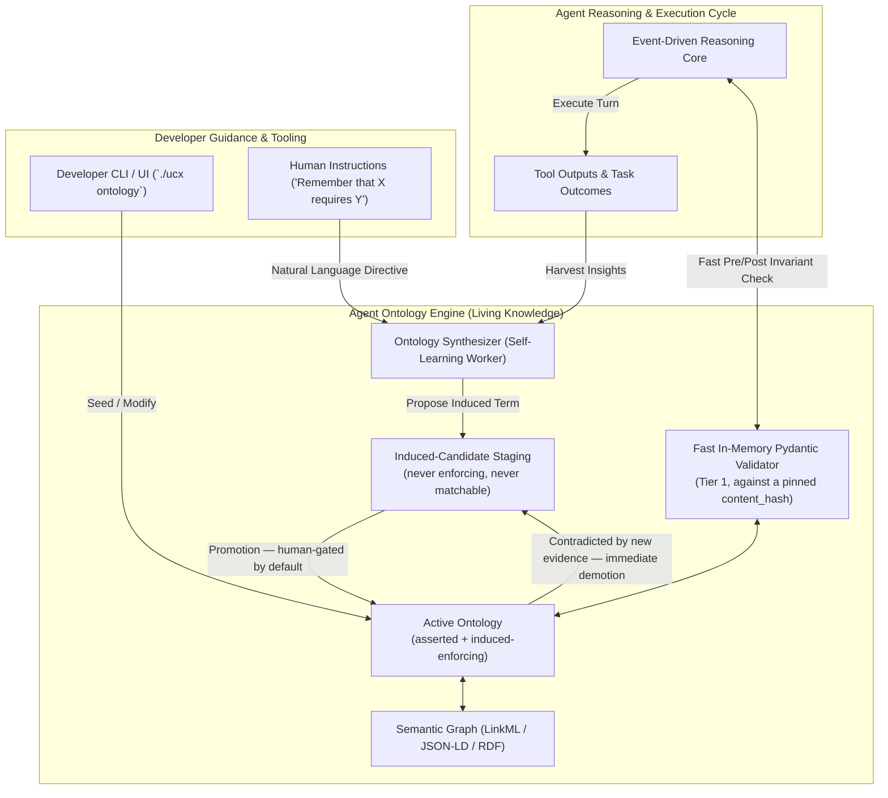

# Agent-Specific Ontology Architecture: Self-Constructing & Human-Guided Knowledge

> [!IMPORTANT]
> **Implementation status.** Nothing in this document is implemented.
> `src/uclone_x/ontology/` holds type stubs only, and the repository-root
> `ontology/` directory is empty. Read every section below as design intent.
> Cross-agent alignment — how two independently induced ontologies are reconciled —
> is specified separately in
> [`docs/ontology-alignment-spec.md`](ontology-alignment-spec.md).

## 1. Executive Summary

Per **Principle 7**, an ontology in UClone-X is not a static read-only database schema. It is a **living, evolving semantic model** that:
1. **Agents Autonomously Self-Construct & Grow**: Agents extract concepts, entity relations, causal rules, and verified solution patterns from task executions and store them in their persistent ontology.
2. **Developers Can Explicitly Guide & Steer**: Developers can inspect, inject initial schemas, override rules, or issue natural language instructions to shape the agent's knowledge graph.

---

## 2. Evolving Ontology Architecture

---

## 3. Two Pillars of Ontology Evolution

### 3.1 Autonomous Self-Construction (Agent Learning)
When an agent solves a complex problem (e.g. debugging an unfamiliar microservice or resolving an architectural dependency), it runs a background compaction step:
- **Entity Extraction**: Identifies key domain nouns and attributes (`AuthService`, `JWTPayload`, `RateLimitPolicy`).
- **Relation Induction**: Establishes links (`AuthService` -> `validates` -> `JWTPayload`).
- **Axiom Derivation**: Codifies discovered invariants (`"Expired token returns HTTP 401, not 500"`).

### 3.2 Human-Guided Steering (Developer Ingestion)
Developers can steer the agent's ontology in two ways:
1. **Declarative Schemas**: Providing LinkML / YAML definitions in `ontology/<agent_name>.yaml`.
2. **Interactive Directives**: Giving structured or natural language instructions via chat or CLI (`./ucx ontology teach`):
   - **Concept Definitions**:
     * Formal syntax: `concept User extends BaseEntity with attributes name:str, email:str requires email`
     * Inheritance assertion: `User is a Person`
     * Defined concept: `define concept Customer: A paying account holder`
   - **Relation Triplets**:
     * Directed relations: `User -> owns -> Repository`
   - **Invariant & Constraint Rules** (parsed into `OntologyInvariant` / `OntologyAxiom`):
     * Universal constraints: `"All internal gRPC calls must use mTLS encryption"`
     * Event triggers: `"Whenever token expires, refresh token"`
     * Requirement rules: `"Deployment requires replicas"`
     * Explicit axioms: `"Rule RequireAdmin: User role == admin"`

> [!IMPORTANT]
> **Principle 6 (Fail-Fast & Zero Silent Fallback)**:
> If an interactive directive cannot be parsed into a structured ontology element (concept, relation, or invariant rule), the engine immediately raises `UnparseableDirectiveError` detailing the uninterpretable text and supported patterns, preventing silent degradation into junk concepts.

### 3.3 Automated Knowledge Curation & Lifecycle Filtering
To prevent knowledge poisoning, obsolete assertions, and context bloat, all self-constructed knowledge must pass through a strict four-stage curation pipeline:

1. **Durable Knowledge Gate**:
   - Discards transient conversational chatter, one-off questions, and localized code snippets.
   - Extracts only durable, reusable domain conventions, architectural invariants, and dependency relationships (`is_durable_knowledge = True`).
2. **Semantic Deduplication & Conflict Resolution**:
   - Compares incoming assertions against existing ontology nodes using semantic equivalence.
   - If identical, reinforces existing nodes (`hit_count += 1`, `last_used_at = now`).
   - If an incoming assertion directly contradicts a prior assertion (e.g. migration from library v1 to v2), the prior assertion is versioned and superseded.
3. **Confidence Scoring & Temporal Decay**:
   - Each induced assertion tracks empirical validation scores (`confidence_score: int`).
   - Successful task execution utilizing the assertion increments confidence (+2).
   - Invalidation by compiler/linter error or human rejection decrements confidence (-5).
   - Assertions unreinforced over time experience temporal decay; items dropping below threshold are automatically pruned to prevent knowledge rot.
4. **User & Workspace Isolation**:
   - Ontologies are strictly partitioned across namespaces:
     * `~/.ucx/knowledge/users/<user_id>/`: Personal developer preferences and coding idioms.
     * `~/.ucx/knowledge/workspaces/<workspace_id>/`: Project-specific architectural invariants and service schemas.
   - Prevents cross-project contamination while enabling reusable cross-session intelligence.

---

## 4. Tiered Performance Design

To satisfy **[P3: Single-Machine Acceleration & Pluggable Sandboxing](principles/details/p3-single-machine-acceleration.md)**, whose numeric budgets live in [`docs/nfr-performance-budgets.md`](nfr-performance-budgets.md) rather than in the principle text:

* **Inline Turn Validation (Tier 1)**: in-memory state-transition checks powered by compiled Pydantic v2 validator hooks. Deterministic **only against a pinned `content_hash` and `ontology_version`** — a validator running against a live, self-extending ontology gives different verdicts for the same input on different days, which is why `./ucx test check` validates the committed `asserted` snapshot and nothing else (see `2026-09-02-013` and the determinism section of the alignment specification).
* **Knowledge Synthesis & Graph Indexing (Tier 2 - Background Async)**: Ontology expansion and semantic graph indexing occur asynchronously without blocking the user conversation or agent response streaming.

---

## 5. Cross-Agent Semantic Alignment

P7 makes each agent's ontology self-constructed through experience, so two agents
will independently induce different terms for the same thing. P2 nonetheless
requires them to interoperate. How that is reconciled — what fragment is exchanged,
how terms are matched, what happens below the confidence threshold, who arbitrates
a conflict between two asserted terms, and how an induced term is promoted,
contradicted or retracted — is specified in
[`docs/ontology-alignment-spec.md`](ontology-alignment-spec.md).

Two properties of that specification are load-bearing here and must not be softened
in this document:

* **An induced-candidate term is never enforcing and never matchable across
  agents.** It cannot reject an action and it cannot satisfy a required field in a
  cross-agent exchange. This is what makes the induced tier auditable rather than a
  silent authority — the gap `2026-09-02-003` reported.
* **There is no "proceed on best guess" outcome.** Below the matching threshold the
  task either asks a human (`TASK_STATE_INPUT_REQUIRED`) or fails with a typed
  error. A similarity score is a proposal generator, never a decision.

That specification also records a genuine limit: full automatic *semantic*
interoperability between two purely self-constructed, never-aligned ontologies is
not achievable without weakening either P7's autonomy or P2's guarantee. It adopts
the narrower reading — protocol-level interoperability always, semantic
interoperability conditional on an alignment record — and flags that making this
scope limit explicit in either principle's text is a Tier A decision for the project owner.
