# UClone-X Architecture Overview

> [!IMPORTANT]
> **This document is a specification, not a description of running software.**
> As of 2026-09-02 the only executable code in this repository is the developer CLI
> (`src/uclone_x/cli/`) and the reactive event bus (`src/uclone_x/engine/`). Every other
> runtime subsystem described below is *specified and approved* but *not implemented*.
> See [§0 Implementation Status](#0-implementation-status-specification-vs-shipped-code)
> for the authoritative per-subsystem breakdown, and treat any statement in §1–§4 as
> design intent unless §0 marks it **Implemented**.

---

## 0. Implementation Status: Specification vs. Shipped Code

The architecture below is derived from the nine immutable principles in
[`docs/principles/core-principles.md`](principles/core-principles.md) and the functional
requirements in [`docs/PRD.md`](PRD.md). The principles are normative; most of the code
is not yet written. This section exists because this document was previously mistaken
for a description of a working system.

### What actually exists today

```text
src/uclone_x/
├── __init__.py                 # Version/author metadata only
├── cli/
│   ├── main.py                 # Typer application, `ucx` console entrypoint
│   └── commands/
│       └── dev.py              # Builder issue & task tracker (./ucx dev …)
└── engine/
    ├── __init__.py             # Public engine exports
    └── event_bus.py            # AgentEvent, EventBus, EventSubscription, backpressure policies
```

Every other directory under `src/uclone_x/` (`agent/`, `a2a/`, `llm/`, `ontology/`,
`skills/`, `sandbox/`, `code_intel/`, `telemetry/`, `ui_static/`) is an **empty
directory** — it contains no modules and, lacking an `__init__.py`, is not yet an
importable package. The repository-root `ontology/` and `ucx-agent-skills/` directories, which the
runtime is specified to read from and write to, are likewise **empty**.

`frontend/` contains a Vite + React scaffold (`index.html`, `src/main.tsx`,
`src/App.tsx`) and is not yet wired to any backend. `tests/` covers the CLI dev tracker
and the event bus only.

### Per-subsystem status

| Subsystem | Governing principle / FR | Specification | Code status |
| :--- | :--- | :--- | :--- |
| Developer CLI (`./ucx`) | P8, FR-8 | [cli-specification.md](cli-specification.md) | **Implemented (partial)** — `ucx version`, `ucx dev …` and `ucx test check` are functional; `ucx setup`, `ucx run` and `ucx ui` currently print placeholder output and start no runtime |
| Builder issue/task protocol | — | builder-issue-resolution-protocol.md | **Implemented (partial)** — `src/uclone_x/cli/commands/dev.py` |
| Reactive event bus | P1, P3, FR-1 | [event-driven-agent-core.md](event-driven-agent-core.md), [local-collaboration-engine.md](local-collaboration-engine.md) | **Implemented (partial)** — `uclone_x.engine.event_bus` provides `AgentEvent`, priority-queue `EventBus`, subscriptions and backpressure policies |
| Reactive scheduler, timer service & context registry | P1, P3, FR-1 | [local-collaboration-engine.md](local-collaboration-engine.md) | Specified only |
| Agent state machine | P1, P4, FR-1 | [event-driven-agent-core.md](event-driven-agent-core.md) | Specified only |
| A2A dual-transport adapter | P2, FR-2 | [a2a-protocol-spec.md](a2a-protocol-spec.md) | Specified only |
| Dynamic persona & sub-agents | P4, FR-3 | [dynamic-persona-interface.md](dynamic-persona-interface.md) | Specified only |
| Ontology Engine | P7, FR-4 | [agent-ontology-architecture.md](agent-ontology-architecture.md) | Specified only; `ontology/` empty |
| Skill subsystem & registry | P9, FR-5 | [skill-system-architecture.md](skill-system-architecture.md) | Specified only; `ucx-agent-skills/` empty |
| LLM-agnostic layer | P5, FR-6 | [llm-agnostic-interface.md](llm-agnostic-interface.md) | Specified only |
| Sandbox Runner | P3, FR-7 | [sandbox-execution-architecture.md](sandbox-execution-architecture.md) | Specified only |
| Developer UI dashboard | P8, FR-9 | [ui-dashboard-architecture.md](ui-dashboard-architecture.md) | Scaffold only (`frontend/`) |
| OpenTelemetry exporter | P6, P8, FR-10 | [telemetry-opentelemetry.md](telemetry-opentelemetry.md) | Specified only |
| Code Intelligence (AST/LSP/SCIP) | FR-11 | [code-intelligence-lsp-scip.md](code-intelligence-lsp-scip.md) | Specified only; dependencies declared in `pyproject.toml` |

Milestone sequencing for these subsystems is owned by [`docs/PRD.md`](PRD.md) §5, not by
this document.

---

## 1. Executive Summary

**UClone-X** is an open-source, high-performance, event-driven agent core and multi-agent
collaboration framework. Originating from the architecture of UClone2, UClone-X abstracts
and generalizes the agent reasoning loop into a low-latency, developer-friendly and
LLM-agnostic foundation.

It is designed to power single autonomous agents, dynamic sub-agent swarms, and
cross-system agent-to-agent interactions over the Google A2A specification — with every
agent decision grounded in an evolving ontology (P7), every capability packaged as a
hot-reloadable skill (P9), every tool invocation routed through a selectable sandbox (P3),
every code edit validated against a real symbol graph (FR-11), and every span exported as
OpenTelemetry (P6/P8).

The diagram below is the **target** runtime topology. Only the `./ucx CLI` node and its
edge into the event bus have any code behind them today.

```mermaid
flowchart TD
    subgraph External["External World / Host Surfaces"]
        Human["Developer via ./ucx CLI"]
        WebUI["React 19 + Vite Developer Dashboard"]
        RemoteAgent["Remote A2A Agent Service"]
        ExtTools["MCP / External Tool Servers"]
        Repo["Target Codebase / Repository"]
        Backends["Observability Backends: Jaeger / Langfuse / Prometheus"]
    end

    subgraph Core["UClone-X Core Runtime"]
        subgraph EngineBox["Local Collaboration Engine — P1 / P3"]
            EventBus["Zero-Copy In-Memory Event Bus"]
            Scheduler["Reactive Task Scheduler"]
            StateRegistry["Active Agent & Context Registry"]
            TimerService["High-Precision Timer Service"]
        end

        subgraph AgentBox["Agent Instances — P4"]
            PrimaryAgent["Primary Orchestrator ucx agent"]
            SubAgents["Ephemeral Sub-Agents, max_depth 2"]
            AuditorAgent["Skill Auditor ucx agent"]
        end

        subgraph ProtocolBox["Protocol & Delegation — P2 / P4"]
            A2AAdapter["A2A Dual-Transport Adapter: in-memory fastpath plus HTTP/SSE"]
            PersonaMgr["Dynamic Persona & Sub-Agent Manager"]
        end

        subgraph OntologyBox["Ontology Engine — P7"]
            OntSynth["Ontology Synthesizer, self-learning worker"]
            OntStore["Active Ontology & Semantic Graph: LinkML / JSON-LD / RDF"]
            OntValidator["Fast In-Memory Pydantic Invariant Validator"]
        end

        subgraph SkillBox["Skill Subsystem — P9"]
            SkillSynth["Autonomous Skill Synthesizer"]
            SkillRegistry["Skill Registry: ucx-agent-skills/ with hot-reload"]
        end

        subgraph CodeIntelBox["Code Intelligence Subsystem — FR-11"]
            TreeSitter["Tree-sitter AST Parser"]
            LSPClient["LSP Client, JSON-RPC over stdio"]
            SCIPIndexer["SCIP Repository Indexer"]
            SymbolGraph["Code Symbol Graph & Live Diagnostics"]
        end

        subgraph ExecBox["Execution Layer — P3"]
            ToolRegistry["Tool Registry & MCP Interop"]
            SandboxRunner["Sandbox Runner: none / workspace / container-wasm"]
        end

        subgraph LLMBox["LLM-Agnostic Layer — P5"]
            Compactor["Context Compactor & Semantic Pruner"]
            Budgeter["Token Budgeter & Quota Controller"]
            Router["Model Router with Observable Failover"]
            Providers["Provider Connectors: Gemini / Claude / OpenAI / Local"]
        end

        subgraph TelemetryBox["Observability — P6 / P8"]
            Tracer["OpenTelemetry Tracer & Meter"]
            Exporter["OTLP Exporter, gRPC / HTTP"]
        end
    end

    %% Host surfaces into the runtime
    Human <--> EventBus
    WebUI <--> EventBus
    Human -->|"seed / steer ontology"| OntStore
    Human -->|"inject / approve skills"| SkillRegistry

    %% A2A boundary: only remote peers speak A2A
    RemoteAgent <-->|"A2A HTTP / SSE"| A2AAdapter
    A2AAdapter <--> EventBus
    A2AAdapter -->|"validate task envelope"| OntValidator

    %% Engine core
    EventBus <--> Scheduler
    Scheduler <--> StateRegistry
    TimerService -->|"timeout / reminder tick"| EventBus
    Scheduler -->|"dispatch event"| PrimaryAgent
    Scheduler -->|"dispatch event"| SubAgents
    Scheduler -->|"dispatch event"| AuditorAgent

    %% Delegation
    PrimaryAgent <--> PersonaMgr
    PersonaMgr -->|"spawn with isolated context"| SubAgents
    SubAgents <--> EventBus
    PrimaryAgent <--> EventBus

    %% Ontology grounding
    PrimaryAgent <-->|"pre/post invariant check"| OntValidator
    SubAgents <-->|"pre/post invariant check"| OntValidator
    OntValidator <--> OntStore
    PrimaryAgent -->|"harvest task outcomes"| OntSynth
    OntSynth -->|"auto-extend classes & rules"| OntStore

    %% Skills
    PrimaryAgent -->|"post-task synthesis"| SkillSynth
    SkillSynth -->|"SKILL.md plus scripts and tests"| AuditorAgent
    AuditorAgent -->|"policy gate: always / safe_only / never"| SkillRegistry
    AuditorAgent -->|"high-risk notification"| Human
    SkillRegistry -->|"hot-load skills"| PrimaryAgent
    SkillRegistry -->|"hot-load skills"| SubAgents

    %% Tools and sandboxing
    PrimaryAgent <--> ToolRegistry
    SubAgents <--> ToolRegistry
    SkillRegistry -->|"skill scripts"| SandboxRunner
    ToolRegistry --> SandboxRunner
    SandboxRunner <--> ExtTools
    SandboxRunner <--> Repo

    %% Code intelligence
    Repo -->|"incremental parse"| TreeSitter
    Repo <-->|"live def / ref / type query"| LSPClient
    Repo -->|"offline index build"| SCIPIndexer
    TreeSitter --> SymbolGraph
    LSPClient --> SymbolGraph
    SCIPIndexer --> SymbolGraph
    SymbolGraph -->|"ingest symbols as ontology entities"| OntStore
    PrimaryAgent <-->|"query symbols / validate edits"| SymbolGraph
    SubAgents <-->|"fix diagnostics on edit"| SymbolGraph

    %% LLM layer
    PrimaryAgent -->|"full context"| Compactor
    SubAgents -->|"full context"| Compactor
    Compactor <--> Budgeter
    Budgeter --> Router
    Router --> Providers

    %% Telemetry: every plane emits spans
    PrimaryAgent --> Tracer
    SubAgents --> Tracer
    A2AAdapter --> Tracer
    SandboxRunner --> Tracer
    Router -->|"failover event, never silent"| Tracer
    OntSynth --> Tracer
    AuditorAgent --> Tracer
    Tracer --> Exporter
    Exporter --> Backends
```



**Reading the diagram.** Three relationships are load-bearing and easy to get wrong:

1. **A2A is agent-to-agent only.** The `A2A HTTP / SSE` label belongs on the edge to the
   remote peer. The provider connectors in the LLM layer are *not* A2A peers; they are
   the model-provider adapter layer (P5).
2. **Code Intelligence feeds the Ontology Engine.** The symbol graph is not a parallel
   store — per FR-11.3 its output is ingested into the agent's ontology, so P7's semantic
   grounding covers code entities too.
3. **Nothing reaches the host except through the Sandbox Runner.** Tool calls and skill
   scripts both pass the sandbox boundary, whose level is selected per P3
   (`none` / `workspace` / `container` / `wasm`).

---

## 2. Core Architectural Pillars

Each pillar is traceable to exactly one immutable principle. The principle documents in
`docs/principles/` are the normative source; this table is a summary and
must never contradict them.

| Pillar | Principle | Description |
| :--- | :--- | :--- |
| **Reactive Event-Driven Loop** | P1 | Agents are non-blocking state machines processing discrete events. No busy-wait or `while sleep` polling; awaiting components yield and register a reactive listener on the bus. |
| **Google A2A Dual-Transport** | P2 | External agent interfaces conform logically to the Google A2A specification (discovery via `/.well-known/agent.json`, capability negotiation, task envelopes), with a zero-copy in-memory fastpath for co-located agents and HTTP/SSE/WebSocket for remote peers. |
| **Single-Machine Acceleration & Pluggable Sandboxing** | P3 | Zero-broker in-process dispatch by default; external brokers are an optional distributed extension. Tool execution runs through a selectable sandbox level. |
| **Dynamic Specialization & Context Isolation** | P4 | Complex tasks are delegated to ephemeral sub-agents with bounded recursion (`max_depth = 2`) and isolated context windows, so parent context is never polluted. |
| **LLM-Layer Token Management & Auto-Compaction** | P5 | Quota tracking, provider switching and semantic context compaction live entirely in the LLM layer, decoupled from agent business logic. |
| **Fail-Fast & Observable Failover** | P6 | No silent suppression, no mock or empty fallback data. Failures propagate to the decision plane; any permitted failover is logged as an OpenTelemetry event. |
| **Evolving Ontology Grounding** | P7 | Every agent operates over a structured ontology that it self-constructs from experience and that developers can steer; decisions and A2A collaboration are validated against it. |
| **Strict Typing & Language Boundaries** | P8 | Python 3.11+ core under `pyright --strict` with Pydantic v2 models; TypeScript React 19 + Vite GUI. Untyped `dict`/`Any` contracts are forbidden across agent interfaces. |
| **Self-Evolving & Pluggable Skills** | P9 | Successful workflows are autonomously packaged as `ucx-agent-skills/<name>/SKILL.md` plus scripts and tests, audited by a Skill Auditor ucx agent under a configurable auto-approval policy, and hot-reloadable by developers. |

---

## 3. High-Level Component Structure

### 3.1 Repository layout

```text
uclone-x/
├── AGENTS.md                                   # Canonical assistant guidelines (Builder vs. ucx agent)
├── CLAUDE.md / GEMINI.md                       # Assistant entrypoints delegating to AGENTS.md
├── README.md                                   # Open source entrypoint & quickstart
├── LICENSE                                     # Apache License 2.0
├── pyproject.toml                              # Hatchling build, src-layout, ruff/pyright/pytest config
├── ucx                                         # Developer CLI shim
├── docs/                                       # Technical specifications (16 documents)
│   ├── PRD.md                                  # Product requirements, FR/NFR, roadmap
│   ├── architecture-overview.md                # THIS document — system architecture & philosophy
│   ├── event-driven-agent-core.md              # Agent state machine, event envelope, reactive wakeup
│   ├── local-collaboration-engine.md           # In-memory bus, scheduler, latency targets
│   ├── a2a-protocol-spec.md                    # Google A2A contracts & dual transport
│   ├── dynamic-persona-interface.md            # Persona specification & sub-agent lifecycle
│   ├── llm-agnostic-interface.md               # Provider connectors, budgeting, compaction
│   ├── agent-ontology-architecture.md          # Self-constructing & human-guided ontology
│   ├── skill-system-architecture.md            # SKILL.md packaging, synthesizer, auditor, registry
│   ├── sandbox-execution-architecture.md       # Three sandbox levels & execution adapters
│   ├── code-intelligence-lsp-scip.md           # Tree-sitter, LSP client, SCIP symbol graph
│   ├── telemetry-opentelemetry.md              # Span hierarchy, exporters, semantic conventions
│   ├── ui-dashboard-architecture.md            # React 19 + Vite embedded dashboard
│   ├── cli-specification.md                    # ./ucx command reference & quality gate
│   ├── meta-agent-development-guide.md         # Builder swarm development guide
│   ├── builder-issue-resolution-protocol.md    # Autonomous Builder issue & task lifecycle
│   ├── principles/                             # NORMATIVE — never modified without the owner's approval
│   │   ├── core-principles.md                  # The 9 inviolable laws (compact reference)
│   │   └── details/p1…p9-*.md                  # One detail document per principle
│   ├── issues/                                 # Historical builder-filed issues (archived)
│   └── tasks/                                  # Historical builder resolution tasks (archived)

├── src/uclone_x/                               # Python 3.11+ core package (src-layout)
│   ├── cli/                                    # ./ucx Typer application — IMPLEMENTED
│   │   ├── main.py                             #   console entrypoint `ucx`
│   │   └── commands/dev.py                     #   Builder issue & task tracker
│   ├── engine/                                 # P1/P3 — event bus IMPLEMENTED; scheduler & timers pending
│   │   └── event_bus.py                        #   AgentEvent, EventBus, subscriptions, backpressure
│   ├── agent/                                  # P1/P4 — BaseAgent state machine        [empty]
│   ├── a2a/                                    # P2 — A2A adapter & dual transport      [empty]
│   ├── llm/                                    # P5 — provider connectors & budgeting   [empty]
│   ├── ontology/                               # P7 — ontology engine & validator       [empty]
│   ├── skills/                                 # P9 — synthesizer, auditor, registry    [empty]
│   ├── sandbox/                                # P3 — sandbox runner & adapters         [empty]
│   ├── code_intel/                             # FR-11 — AST, LSP, SCIP, symbol graph   [empty]
│   ├── telemetry/                              # P6/P8 — tracer & OTLP exporter         [empty]
│   └── ui_static/                              # FR-9 — embedded dashboard build output [empty]
├── frontend/                                   # TypeScript React 19 + Vite GUI (P8)   [scaffold]
├── ontology/                                   # Runtime ontology store (LinkML/JSON-LD) [empty]
├── ucx-agent-skills/                           # Runtime skill packages (SKILL.md)       [empty]
└── tests/                                      # pytest suites — unit / integration / scenarios
```

> `[empty]` marks a directory that exists but contains no modules. `docs/` currently holds
> 16 specification documents plus the `principles/`, `issues/` and `tasks/` subtrees; keep
> the list above in sync with `ls docs/*.md`.

### 3.2 Package-to-principle mapping

There is no `core/` directory. The Python core lives under `src/uclone_x/` (src-layout,
built by Hatchling per `pyproject.toml`). Note that the §1 diagram groups nodes by
*logical plane*, not by package: the Dynamic Persona & Sub-Agent Manager is drawn beside
the A2A adapter because both mediate delegation, but it belongs to `uclone_x.agent` —
there is no separate `persona/` package.

| Package | Principle / FR | Responsibility |
| :--- | :--- | :--- |
| `uclone_x.cli` | P8, FR-8 | Typer CLI, quality gate, Builder tooling |
| `uclone_x.engine` | P1, P3, FR-1 | Zero-copy event bus, reactive scheduler, timer service, context registry |
| `uclone_x.agent` | P1, P4, FR-1/FR-3 | `BaseAgent` state machine, persona specification, sub-agent spawning |
| `uclone_x.a2a` | P2, FR-2 | A2A discovery, task envelopes, in-memory fastpath and remote wire transport |
| `uclone_x.llm` | P5, FR-6 | Provider connectors, token budgeter, compactor, observable-failover router |
| `uclone_x.ontology` | P7, FR-4 | Ontology synthesizer, semantic graph, fast invariant validator |
| `uclone_x.skills` | P9, FR-5 | Skill synthesizer, Skill Auditor agent, registry and hot-reload |
| `uclone_x.sandbox` | P3, FR-7 | Sandbox mode selection and `none` / `workspace` / `container` / `wasm` adapters |
| `uclone_x.code_intel` | FR-11 | Tree-sitter AST, LSP client, SCIP indexer, code symbol graph |
| `uclone_x.telemetry` | P6, P8, FR-10 | OTel tracer and meter, span conventions, OTLP exporter |
| `uclone_x.ui_static` | FR-9 | Packaged dashboard assets served by the CLI |

---

## 4. Key Differences from the UClone2 Monolith

1. **Decoupled from web/chat infrastructure.** UClone-X strips out platform-specific
   database tables, web servers and UI dependencies, making it a pure framework usable
   from a CLI, a backend service, or an embedded runtime.
2. **Standardized A2A communication (P2).** Custom internal Pub/Sub topics are replaced by
   Google A2A envelopes, discovery descriptors and capability negotiation — with a
   zero-copy in-memory fastpath so standards compliance costs nothing locally.
3. **Dynamic agent evolution with hard context isolation (P4).** Sub-agents are spawned
   programmatically with bounded recursion depth, strict tool permissions and isolated
   context windows, rather than sharing one growing monolithic context.
4. **Zero-broker local acceleration (P3).** In-process event dispatch removes the Redis or
   RabbitMQ dependency for single-node setups; brokers become an optional distributed
   extension instead of a prerequisite.
5. **Knowledge is a first-class subsystem, not prompt text (P7).** UClone2 encoded domain
   knowledge in hand-written prompts. UClone-X gives every agent an ontology it
   self-constructs from task outcomes and that developers steer explicitly, with
   invariant validation on every decision. This pillar postdates the original UClone2
   comparison entirely.
6. **Capabilities are synthesized, audited and hot-reloaded, not hardcoded (P9).** Instead
   of tools being compiled into the codebase, successful workflows are packaged as
   `SKILL.md` skill bundles, security-audited by a dedicated Skill Auditor ucx agent under
   a configurable auto-approval policy, and loaded without a restart. This pillar also
   postdates the original comparison.
7. **Selectable execution isolation (P3).** UClone2 executed tools directly in the host
   process. UClone-X routes every tool and skill invocation through a Sandbox Runner with
   three explicit levels, so isolation becomes a per-workload decision rather than an
   architectural constant.
8. **Code understanding is semantic, not textual (FR-11).** Grep-and-regex code handling is
   replaced by a Tree-sitter AST, a live LSP client for definitions, references and
   diagnostics, and a SCIP repository index feeding the ontology's symbol graph.
9. **Observability and failure semantics are architectural (P6, P8).** Every reasoning
   span, A2A event and provider failover emits OpenTelemetry natively; silent fallbacks
   and mock data are forbidden rather than discouraged.
10. **Strict typing across an explicit language boundary (P8).** The core is Python 3.11+
    under `pyright --strict` with Pydantic v2 contracts; the GUI is TypeScript React 19.
    Untyped `dict`/`Any` payloads may not cross agent interfaces.

---

## 5. Maintenance Rule

> [!IMPORTANT]
> **Any change that adds, removes or renames a subsystem MUST update this document in the
> same commit.** A "subsystem" is anything that would appear as a node or subgraph in the
> §1 diagram, a package row in §3.2, or a directory in §3.1.
>
> Concretely, the same commit must update:
> 1. the **§1 Mermaid diagram** — the new node plus its real edges, not just the box;
> 2. the **§3.1 repository layout** and the **§3.2 package-to-principle mapping**;
> 3. the **§0 status table** — moving the subsystem's row to `Implemented` (or
>    `Implemented (partial)`) as soon as any of its code lands, so the specification/code
>    distinction in this document never goes stale again;
> 4. **§2** and **§4** if the change alters a pillar or the UClone2 comparison.
>
> If the change appears to require altering a principle, stop and request written approval
> from **the project owner** per [`AGENTS.md`](../AGENTS.md); do not reconcile the conflict by
> editing this document.
>
> Mermaid authoring note: node labels must be single-line and use `<br/>` for line breaks —
> raw newlines inside quoted labels do not render portably on GitHub.
