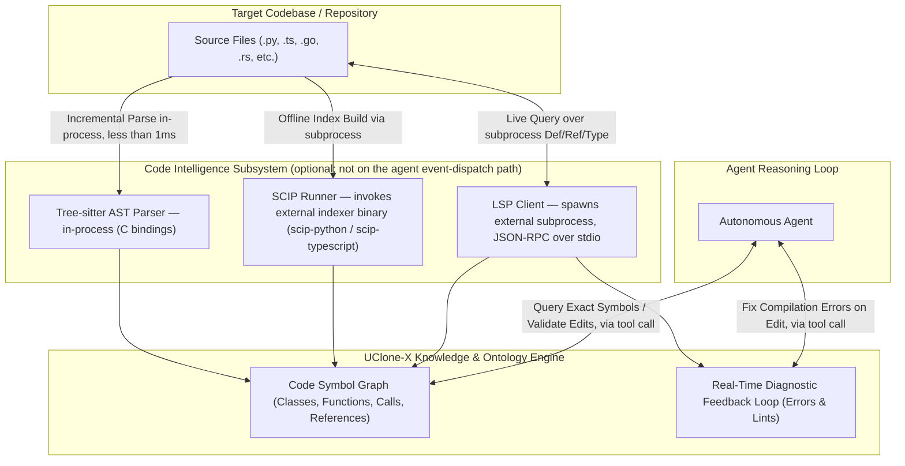

# Code Intelligence & Semantic Code Graph Specification (AST, LSP, SCIP)

> **Implementation status** (verified against `src/uclone_x/code_intel/` on 2026-09-02):
> - `models.py` (`SymbolLocation`, `SymbolNode`, `SymbolLookup`, `IndexFreshness`, `Diagnostic`, `SCIPDocument`, `SCIPIndex`, `SCIPMetadata`, `SCIPOccurrence`, `SCIPRelationship`, `SCIPSymbolInformation`, `SCIPSymbolRole`)
> - `protocols.py` (`ASTParserProtocol`, `SymbolGraphProtocol`, `SCIPIndexerProtocol`, `LSPClientProtocol`)
> - `ast_parser.py` (`ASTParser` implementing `ASTParserProtocol` supporting Python, TypeScript, JavaScript, Rust, Go)
> - `symbol_graph.py` (`SymbolGraph` implementing `SymbolGraphProtocol` with `IndexFreshness` metadata, file invalidation, and SCIP index export)
> - `scip.py` (`SCIPIndexer` / `SCIPIndexGenerator` implementing `SCIPIndexerProtocol` with incremental caching, cross-file navigation, and SCIP export)
> The multi-language AST parser, in-memory symbol graph, and SCIP semantic indexer provide sub-millisecond code structure extraction and repository-scale symbol indexing for agents. LSP client subprocess management remains a planned extension.

## 1. Overview & Objectives

To deliver hallucination-free code analysis, navigation, and refactoring, UClone-X plans to
integrate a three-pillar **Code Intelligence Engine**:
1. **Tree-sitter (AST Parsing)**: Sub-millisecond syntax tree generation for language-aware parsing.
2. **LSP Client (Language Server Protocol)**: Interactive, type-safe symbol definition, reference finding, and real-time diagnostics.
3. **SCIP (Source Code Intelligence Protocol)**: Repository-scale static indexing that transforms codebases into persistent, queryable knowledge graphs.

This engine is intended to feed into the **Agent Evolving Ontology (Principle 7)**, allowing
agents to understand codebase architectures with compiler-grade precision — once built.

**This is an optional subsystem, not part of the core event engine.** It is not required for
`ucx agent` instances to run, dispatch events, or communicate over A2A. See §2.1 for how this
relates to Principle 3.

---

## 2. Cost Model: what actually runs where

The three pillars are not interchangeable in what they cost or where they run. Treating them
as one "Code Intelligence Engine" line item, as earlier drafts of this document did, hid three
very different operational profiles:

| Pillar | Execution model | Process boundary | External toolchain required |
| :--- | :--- | :--- | :--- |
| **Tree-sitter** | In-process library call | None — runs inside the `ucx` Python process via compiled C bindings | No (installed as a Python wheel; no separate binary to install or run) |
| **LSP client** | Long-lived **subprocess**, one per language server, speaking JSON-RPC 2.0 over stdio | Separate OS process the framework must spawn, supervise, and restart on crash | **Yes** — `pyright-langserver` requires a Node.js runtime; `gopls` requires a Go toolchain; each is installed independently of `pip`/`uv` |
| **SCIP indexer** | One-shot **subprocess** invocation of an external indexer binary that emits a `.scip` file, then read back in-process | Separate OS process, but short-lived (build step, not a daemon) | **Yes** — `scip-python`, `scip-typescript` etc. are external binaries (npm/Go-distributed), not PyPI packages |

Only Tree-sitter is in-process. The LSP client model requires the framework to manage
externally-installed, long-running daemon processes. The SCIP model requires an externally-installed
indexer binary and produces a build artifact with its own staleness lifecycle (see §5).
Calling all three "native" or "in-process" is inaccurate and is the root cause of
issue `2026-09-02-010`; this document
no longer does so.

### 2.1 Relationship to Principle 3 (Single-Machine Zero-Broker Acceleration)

[`docs/principles/details/p3-single-machine-acceleration.md`](principles/details/p3-single-machine-acceleration.md)
states its Core Law as: *"On the single-machine path, **event dispatch between agents** must
not traverse an out-of-process message broker."* Read literally, P3 already governs one thing —
the agent-to-agent event/message dispatch path — not every subprocess any subsystem happens to
use.

Under that reading, this subsystem does not violate P3:
* Tree-sitter never leaves the process, so it plainly satisfies P3 even under the broadest reading.
* An LSP server process and a SCIP indexer invocation are **tool-execution side channels** a
  single agent uses to answer its own queries (definitions, references, diagnostics) — they are
  not a broker sitting between two `ucx agent` instances on the event bus. No agent event is
  routed through `pyright-langserver` or `scip-python` to reach another agent.

This is a scoping argument, not a license to ignore cost: an LSP server is still a process the
host machine must have resources for, and it still must not be on the critical path of agent
event dispatch (e.g., an agent must not block its own event loop synchronously waiting on a
misbehaving language server — see §5 for the required async/timeout handling).

**What P3 would need to state for this reading to be uncontestable**: the current text says
"event dispatch between agents," which already implies scope, but it does not say so
affirmatively — a reader can still extend "single-machine path" to mean *every* subprocess
UClone-X spawns for any reason. To close that gap, P3 would need one additional sentence, for
example:

> *"This zero-broker requirement governs the agent event/message dispatch path only. It does not
> constrain optional subsystems (e.g., code intelligence tooling, telemetry exporters) that spawn
> their own subprocesses or require external toolchains to do their own work, provided such
> subsystems are optional, never sit on the agent-to-agent dispatch path, and degrade per
> Principle 6 (explicit failure or explicit reduced-capability mode, never silent fallback) when
> unavailable."*

This is a proposed addition only. **This Builder does not edit `docs/principles/`.** Report this
wording to the Lead / the project owner for a decision on whether it is Tier B (clarifying an already-implicit
scope) or Tier A (narrowing enforcement surface) under
[`docs/governance/principle-amendment-policy.md`](governance/principle-amendment-policy.md).

---

## 3. Architecture & Data Flow



---

## 4. The 3-Pillar Technology Stack

### 4.1 Tree-sitter (Abstract Syntax Tree) — **in-process, required if this subsystem is enabled**
* **Role**: Structural parsing, scope hierarchy, and granular code chunk extraction.
* **Execution**: In-process library call. No subprocess, no external binary, no daemon.
* **Speed**: < 1ms per file (parse call only; excludes any LSP/SCIP round-trip).
* **Capabilities**:
  - Extracts classes, methods, docstrings, and decorator annotations without executing code.
  - Generates structural AST diffs during code modifications.
* **Dependency status**: see §6 — currently declared in `pyproject.toml` base `dependencies`
  (not gated behind an extra), and the pinned combination is **known broken**. This must be
  fixed before this pillar can be relied on at all.

### 4.2 LSP (Language Server Protocol Client) — **subprocess + external toolchain, planned**
* **Role**: Real-time semantic analysis and live diagnostic feedback.
* **Execution**: The framework spawns a long-lived language server process and speaks
  standard JSON-RPC 2.0 over stdio to it. This is a process the framework must supervise:
  start it, detect readiness, restart it on crash, and shut it down cleanly.
* **External toolchain**: `pyright-langserver` requires a **Node.js runtime** (it is distributed
  as an npm package); `gopls` requires a **Go toolchain**; `typescript-language-server` requires
  Node.js. None of these are installed by `pip install uclone-x` — they are the user's
  responsibility, or a future `ucx` bootstrap command's responsibility, to install separately.
* **Core Capabilities** (planned):
  - `textDocument/definition`: Pinpoints exact symbol declaration locations across files.
  - `textDocument/references`: Finds all real call-sites (no regex/grep false positives).
  - `textDocument/publishDiagnostics`: Live compiler feedback for self-healing syntax/type errors before running tests.
* **Dependency status**: No LSP client library (e.g. `pygls`) is declared anywhere in
  `pyproject.toml` today, and no `pyright-langserver`/`gopls`/`typescript-language-server`
  binaries are present on this development machine (verified: `which pyright-langserver
  scip-python scip-typescript` all report not found). This pillar is **planned**, not partially
  implemented.
* **No lifecycle spec exists yet** (startup cost, crash recovery, per-workspace server pooling,
  behavior while a server is still initializing). This must be written before implementation
  starts; it is out of scope for this document's current revision and is tracked separately.

### 4.3 SCIP (Source Code Intelligence Protocol) — **subprocess (one-shot) + external toolchain, planned**
* **Role**: Static full-repository code knowledge graph indexing.
* **Execution**: A one-shot subprocess invocation of an external indexer binary
  (`scip-python`, `scip-typescript`, …) that writes a build artifact (`index.scip`, a Protobuf
  file) to disk. It is not a daemon — it runs, exits, and its output is read back in-process.
  But it is not free: indexing a large repository takes minutes, and the result is a snapshot
  that goes stale the moment the source changes.
* **External toolchain**: these indexer binaries are distributed via npm/Go, not PyPI. They are
  not installable via `pip install uclone-x[code-intel]` — they require a separate install step
  the user (or a future bootstrap command) must perform.
* **Graph store**: earlier drafts of this document named "Kùzu/NetworkX" interchangeably. They
  are not interchangeable: NetworkX is an in-process, in-memory Python graph library with no
  persistence and no query planner; Kùzu is an embedded graph database with on-disk persistence
  and a query language. **Decision needed, not yet made**: this document does not pick one.
  NetworkX is already declared in `pyproject.toml`'s `ontology` extra (`networkx>=3.3`), so
  reusing it avoids adding a new dependency; Kùzu is not declared anywhere in `pyproject.toml`.
  Recommendation to the Lead: default to NetworkX for the initial implementation (already a
  dependency, in-process, no new toolchain) and revisit Kùzu only if profiling shows NetworkX's
  memory footprint or query latency is inadequate at the target repository scale — that scale
  and its memory budget are not yet specified anywhere and should be before "millions of lines
  of code" is claimed again.
* **Staleness policy**: none exists today. §5 states the minimum required behavior.

---

## 5. Dependency Tiers and Degradation Behaviour

Per Principle 6, an optional dependency that is missing or broken must produce an **explicit
failure** or an **explicit reduced-capability mode** — never a silent fallback (e.g., silently
returning grep-based results while claiming they are compiler-verified, or silently skipping
diagnostics with no signal to the agent or the user).

| Dependency | Tier | If missing/broken |
| :--- | :--- | :--- |
| `tree-sitter` (Python package) | **Required**, if the code-intelligence subsystem is enabled at all | Subsystem must fail to initialize with a clear error naming the missing/broken package. No feature of this subsystem works without an AST. |
| `tree-sitter-languages` (Python package) | **Required** today by declaration, but **currently non-functional** — see §6.1 | Must not silently degrade to "no symbols." Must raise at subsystem startup, naming the exact incompatibility (see §6.1), until replaced or repinned. |
| LSP servers (`pyright-langserver`, `typescript-language-server`, `gopls`) | **Optional**, per-language | If a language's server is not installed or fails to start: `go_to_definition`/`find_definitions`/`find_references` for that language must return a `SymbolLookup` whose `freshness` is `IndexFreshness.UNAVAILABLE` with a `reason` naming the missing server (or raise, if the caller requested guaranteed-precision mode), and `get_diagnostics` must fail explicitly rather than returning an empty tuple that reads as "no errors" — never silently fall back to a Tree-sitter-only heuristic while presenting it as LSP-verified. A reduced-capability mode (Tree-sitter-only symbol extraction) is acceptable **only if labeled as such** (`IndexFreshness.STALE` or `UNAVAILABLE` with `reason` set) in the returned result. |
| SCIP indexer binaries (`scip-python`, `scip-typescript`, …) | **Optional / planned** | If not installed, or if the index is missing or older than a defined staleness threshold (threshold not yet defined — must be set before implementation): repository-scale queries that depend on the index must fail explicitly or explicitly state they are running in a degraded, per-file-only mode. Never silently serve a stale index as current. |
| Graph store (NetworkX now / Kùzu, if adopted later) | **Required**, if SCIP ingestion is enabled | If the chosen store's package is missing, SCIP ingestion must fail to initialize with a clear error. |

No part of this subsystem may be a mandatory dependency of `ucx agent` core startup. An
`ucx agent` instance with the code-intelligence subsystem entirely absent must still start,
dispatch events, and execute tools — it simply lacks the tools this document describes.

---

## 6. Python Dependency Declarations (`pyproject.toml`)

**This Builder does not edit `pyproject.toml`.** The following is a report of what was found and
a recommendation for the Lead / whoever owns dependency declarations to act on.

### 6.1 Finding: `tree-sitter` + `tree-sitter-languages` is base-required today and is broken

`pyproject.toml` currently declares, in the base (always-installed) `dependencies` list:

```
"tree-sitter>=0.21.0",
"tree-sitter-languages>=1.10.0",
```

Verified in this repository's `.venv` (Python 3.11.15):

* Installed versions: `tree-sitter==0.26.0`, `tree-sitter-languages==1.10.2`.
* `tree-sitter-languages`'s last PyPI release is **1.10.2, published 2024-02-04** (confirmed via
  the PyPI JSON API release history). It has not been updated since.
* `tree-sitter` has released seven times since then (0.22.0 through 0.26.0; 0.26.0 published
  2026-06-30), and **0.22.0 changed the `Language` binding's constructor signature** (it now
  takes a single capsule argument instead of the old `(pointer, name)` pair that
  `tree-sitter-languages` 1.10.2 was built against).
* Reproduced directly in this `.venv`:

  ```
  >>> import tree_sitter_languages
  >>> tree_sitter_languages.get_language("python")
  TypeError: __init__() takes exactly 1 argument (2 given)
  >>> tree_sitter_languages.get_parser("python")
  TypeError: __init__() takes exactly 1 argument (2 given)
  ```

  Both of `tree-sitter-languages`'s only two public entry points fail on every call.
* This is **not** a resolver/installability failure — `pip`/`uv` install both packages without
  conflict, because `tree-sitter-languages`'s own metadata declares an unbounded
  `Requires-Dist: tree-sitter` with no upper bound. The break only surfaces at runtime, on first
  use, which is worse than an install-time conflict because it is silent until then.

**Recommendation** (for the Lead to action, not this Builder):
1. Move `tree-sitter` and `tree-sitter-languages` out of base `dependencies` into a new optional
   extra, e.g. `[project.optional-dependencies] code-intel = [...]`, since no code in
   `src/uclone_x/` uses them today (§ implementation status note above) and the base install
   should not carry a broken package.
2. Replace `tree-sitter-languages` rather than re-pin it. Options, in order of preference:
   * Depend directly on the individual, actively-maintained per-language grammar packages
     (`tree-sitter-python`, `tree-sitter-javascript`, `tree-sitter-go`, `tree-sitter-rust`, …),
     which track current `tree-sitter` releases, plus a small first-party registry mapping
     language name to grammar module. This avoids depending on an abandoned aggregator.
   * If an aggregator is still wanted, pin `tree-sitter<0.22,>=0.21` and
     `tree-sitter-languages>=1.10.0,<2` together as a matched pair and document why the whole
     subsystem is capped to a two-year-old `tree-sitter` release.
3. Whichever is chosen, add an import-time or subsystem-init-time smoke check that calls
   `get_language`/equivalent once and raises a clear, named error on failure, rather than letting
   the `TypeError` surface deep inside an agent's tool call.

### 6.2 LSP client library and SCIP indexer binaries: not declared, and rightly so for now

No LSP client library (e.g. `pygls`) appears anywhere in `pyproject.toml`, and no SCIP indexer
binary is a `pip`/`uv` dependency at all (they are npm/Go-distributed binaries, outside the
Python packaging boundary entirely). Given §1's implementation-status note, this is consistent —
there is nothing to declare yet because there is no code consuming these. When implementation
begins, the LSP client library belongs in the same `code-intel` extra as tree-sitter; the SCIP
binaries cannot be `pip` dependencies at all and will need a documented separate install step
(and a `ucx` preflight check that gives an explicit, named error — per §5 — when they are absent).

### 6.3 Graph store

`networkx>=3.3` is already declared in the `ontology` extra. If NetworkX is adopted as the SCIP
ingestion target (§4.3's recommendation), no new dependency is needed — only a decision to have
the `code-intel` extra depend on `uclone-x[ontology]` or otherwise ensure NetworkX is present when
SCIP ingestion is enabled. If Kùzu is chosen instead, it must be added explicitly to
`pyproject.toml` with its own extra, since it is not present today.

---

## 7. Python API Contract (`uclone_x.code_intel`) — implemented types, unimplemented behavior

This section previously sketched an intended shape (`CodeSymbol`, `Optional[CodeSymbol]`,
`List[CodeSymbol]`, `str` paths, `kind: str`) before any code existed. `models.py` and
`protocols.py` now exist and are the source of truth; the shape below is transcribed from
them, not aspirational. Where the two disagree, **the code wins** — this document is being
corrected to match it, not the other way around. What is still true is that no
`ASTParserProtocol`, `SymbolGraphProtocol`, or `LSPClientProtocol` implementation exists: the
protocols describe a contract with nothing behind them yet (§1).

### 7.1 Data models (`src/uclone_x/code_intel/models.py`)

```python
from enum import StrEnum
from pathlib import Path
from pydantic import BaseModel, ConfigDict, Field


class SymbolKind(StrEnum):
    FUNCTION = "function"
    METHOD = "method"
    CLASS = "class"
    INTERFACE = "interface"
    VARIABLE = "variable"
    MODULE = "module"


class DiagnosticSeverity(StrEnum):
    ERROR = "error"
    WARNING = "warning"
    INFO = "info"
    HINT = "hint"


class IndexFreshness(StrEnum):
    FRESH = "fresh"
    STALE = "stale"
    UNAVAILABLE = "unavailable"


class SymbolLocation(BaseModel):
    model_config = ConfigDict(frozen=True, extra="forbid", strict=True)
    file_path: Path
    start_line: int
    start_col: int
    end_line: int
    end_col: int


class SymbolNode(BaseModel):
    model_config = ConfigDict(frozen=True, extra="forbid", strict=True)
    name: str
    kind: SymbolKind
    location: SymbolLocation
    signature: str | None = None
    docstring: str | None = None
    children: tuple[str, ...] = Field(default_factory=tuple)


class SymbolLookup(BaseModel):
    model_config = ConfigDict(frozen=True, extra="forbid", strict=True)
    locations: tuple[SymbolLocation, ...] = Field(default_factory=tuple)
    freshness: IndexFreshness
    reason: str | None = None
    indexed_at_ns: int | None = None


class Diagnostic(BaseModel):
    model_config = ConfigDict(frozen=True, extra="forbid", strict=True)
    file_path: Path
    line: int
    col: int
    message: str
    severity: DiagnosticSeverity = DiagnosticSeverity.ERROR
```

### 7.2 Protocols (`src/uclone_x/code_intel/protocols.py`)

```python
from pathlib import Path
from typing import Protocol, runtime_checkable


@runtime_checkable
class ASTParserProtocol(Protocol):
    def parse_file(self, file_path: Path, content: str) -> tuple[SymbolNode, ...]: ...


@runtime_checkable
class SymbolGraphProtocol(Protocol):
    def index_symbols(self, file_path: Path, symbols: tuple[SymbolNode, ...]) -> None: ...
    def invalidate_file(self, file_path: Path) -> None: ...
    def find_definitions(self, symbol_name: str) -> SymbolLookup: ...
    def find_references(self, symbol_name: str) -> SymbolLookup: ...


@runtime_checkable
class LSPClientProtocol(Protocol):
    async def initialize(self, workspace_root: Path) -> None: ...
    async def get_diagnostics(self, file_path: Path) -> tuple[Diagnostic, ...]: ...
    async def go_to_definition(self, file_path: Path, line: int, col: int) -> SymbolLookup: ...
```

### 7.3 Why the shape changed from the earlier draft

**`find_definitions` / `find_references` / `go_to_definition` return `SymbolLookup`, not
`list[SymbolLocation]` or `Optional[CodeSymbol]`.** This is the load-bearing correction: §5
and the earlier §7 draft already *required* that a query "must raise or return an explicit
'unavailable' marker (never a silent `None` indistinguishable from 'no definition found')"
and "must surface index staleness explicitly rather than silently serving a stale result."
A bare list (or an `Optional` that collapses to `None`) **cannot express that** — an empty
list/`None` means "no such symbol exists," "the index was never built," and "no language
server is available for this file" all at once, which is exactly the silent ambiguity P6
forbids. `SymbolLookup` fixes this by making `freshness: IndexFreshness` a required field
(`fresh` / `stale` / `unavailable`, no default) carried alongside the `locations` tuple, plus
an optional `reason` string for *why* it is stale or unavailable. A caller can now tell "zero
locations, fresh index" (the symbol genuinely doesn't exist) apart from "zero locations,
unavailable" (the answer cannot be trusted) — the distinction the old `list`/`Optional`
shape structurally could not draw.

**`index_symbols` is keyed by file** (`index_symbols(file_path, symbols)`), and
**`invalidate_file(file_path)` exists as its inverse.** A whole-repository index with no
per-file eviction path cannot be kept fresh incrementally: re-indexing one changed file would
either require rebuilding the entire index (defeating the point of incremental indexing) or
accumulate stale symbols for files that were deleted or moved, with no way to remove them.
Keying by file makes re-indexing a single file idempotent (`index_symbols` replaces that
file's prior entries), and `invalidate_file` gives an explicit path to drop a file's symbols
entirely (e.g. on delete) rather than leaving them to rot — see issue 2026-09-02-036, filed
against exactly this gap in an earlier signature that took symbols alone with no inverse.

**`DiagnosticSeverity` is a `StrEnum`, not a string.** A free-text severity field invites
typos (`"eror"`) and inconsistent casing that a linter or type checker cannot catch; the enum
gives four fixed, exhaustive values (`ERROR`/`WARNING`/`INFO`/`HINT`) that Pyright strict mode
(P8) can verify at every call site.

**Filesystem arguments are typed `Path`, not `str`.** Every model and protocol method that
takes a file path (`SymbolLocation.file_path`, `Diagnostic.file_path`, `parse_file`,
`index_symbols`, `invalidate_file`, `initialize`'s `workspace_root`, `get_diagnostics`,
`go_to_definition`) uses `pathlib.Path`. This rules out a class of bugs from mixed path
separators or unnormalized strings being compared or hashed as plain text, and is consistent
with P8's Python 3.11+ strict-typing requirement.

**`SymbolKind` gained `VARIABLE` and `MODULE`**, and is a `StrEnum` rather than the earlier
draft's `kind: str  # "class" | "function" | "method" | "interface"` comment-as-documentation.
The earlier four-value comment was never enforced by the type checker; the enum is.

### 7.4 What this does not yet claim

None of the three protocols above have an implementation. `ASTParserProtocol.parse_file` is
not backed by a Tree-sitter call (§4.1's dependency is still broken — see §6.1, re-verified
§7.5); `SymbolGraphProtocol` has no in-memory or persisted graph behind it; `LSPClientProtocol`
spawns no subprocess. Calling any of these methods today would require a caller to have
written their own implementing class — nothing in `src/uclone_x/` provides one.

### 7.5 Re-verification of the `tree-sitter-languages` breakage (§6.1)

Reproduced again in this repository's `.venv` while writing this revision:

```
>>> import tree_sitter_languages
>>> tree_sitter_languages.get_language("python")
TypeError: __init__() takes exactly 1 argument (2 given)
>>> tree_sitter_languages.get_parser("python")
TypeError: __init__() takes exactly 1 argument (2 given)
```

Installed versions are unchanged: `tree-sitter==0.26.0`, `tree-sitter-languages==1.10.2`. The
break, and §6.1's analysis of its cause and recommendation, still hold exactly as written.

---

## 8. Related

* `2026-09-02-010` — the issue this
  document was rewritten to resolve.
* `2026-09-02-011` — P8 typing issues in this
  subsystem's design, tracked separately.
* `2026-09-02-017` — benchmark claims tied to
  this subsystem.
* `2026-09-02-035` — structural
  conformance of any future implementation against §7.2's protocols is checked in
  `tests/unit/test_protocol_conformance.py`, referenced from that file's own docstring.
* `2026-09-02-036` — the issue that
  motivated keying `index_symbols` by file and adding `invalidate_file` (§7.3).
* [`docs/principles/details/p3-single-machine-acceleration.md`](principles/details/p3-single-machine-acceleration.md) — see §2.1 for the scoping argument and the proposed clarifying sentence.
* [`docs/principles/details/p6-fail-fast-observability.md`](principles/details/p6-fail-fast-observability.md) — governs the degradation behavior required in §5.
* [`docs/governance/principle-amendment-policy.md`](governance/principle-amendment-policy.md) — route for the P3 wording proposal in §2.1.
