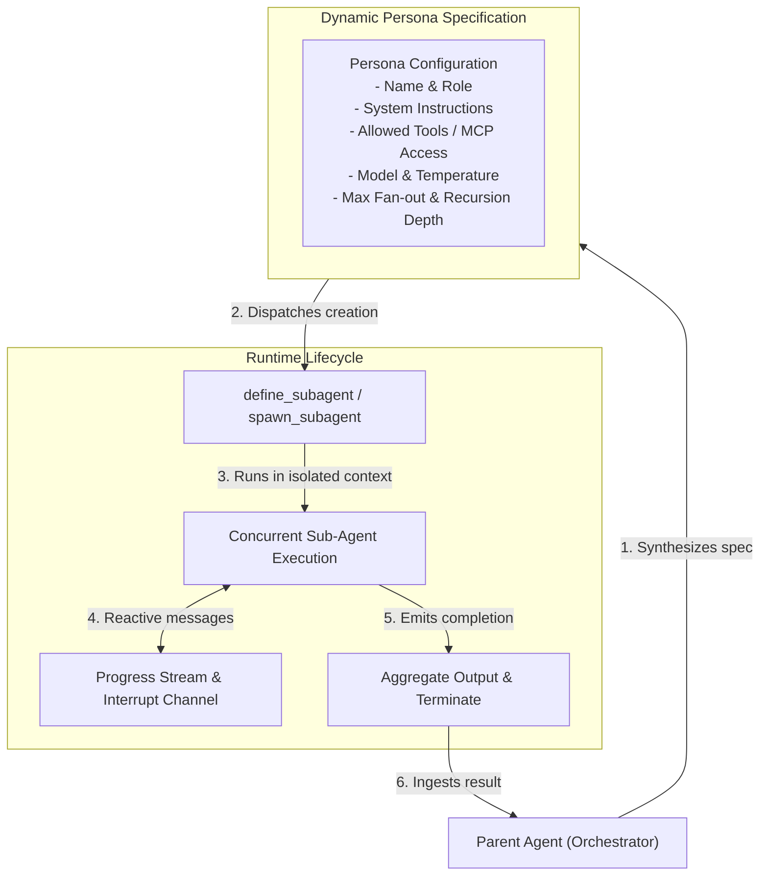

# Dynamic Persona Definition & Sub-Agent Interface

## 1. Motivation

Complex problems require diverse specializations. Rather than relying on a static pool of pre-configured bots, UClone-X empowers agents to **dynamically generate, configure, and supervise other specialized sub-agents** at runtime.

A parent orchestrator agent can analyze a problem, define a targeted Persona (system instructions, role constraints, tool access, and safety boundaries), spawn child workers, coordinate their work, and terminate them when the task concludes.

---

## 2. Dynamic Persona Definition Model



---

## 3. Dynamic Sub-Agent API Interface

### 3.1 Built-in Tool Interface for Agents (Python Pydantic v2)

UClone-X equips agents with first-class primitives: `define_subagent`, `invoke_subagent`, `manage_subagents`, and `send_message`.

```python
from typing import List, Optional, Literal
from pydantic import BaseModel, Field


class PersonaDefinition(BaseModel):
    """Configuration schema for dynamically defined sub-agent personas."""

    name: str = Field(..., description="Unique name identifier for the dynamic agent type")
    role: str = Field(..., description="Human-readable role (e.g. 'Security Reviewer')")
    description: str = Field(..., description="Description of what this subagent does")
    system_prompt: str = Field(..., description="System instructions and constraints")
    allowed_tools: List[str] = Field(default_factory=list, description="Authorized tool names")
    model_tier: Literal["inherit", "fast", "pro"] = "inherit"
    enable_write_tools: bool = False
    enable_subagent_tools: bool = False  # Controls recursive agent creation


class SubagentInvocation(BaseModel):
    """Parameters to invoke a configured sub-agent."""

    type_name: str
    role: str
    prompt: str
    fs_scope: Literal["inherit", "isolated", "shared"] = "inherit"
    timeout_seconds: float = 300.0
    max_turns: Optional[int] = None  # narrows the persona's default; never widens it (§4.2)
    max_depth: Optional[int] = (
        None  # narrows the session ceiling for this subtree; never widens it (§4.2)
    )
```

`max_turns` and `max_depth` on `SubagentInvocation` are **requests**,
not grants. §4.2 defines the one rule — the narrowing invariant — that governs how a
requested value and an inherited ceiling are reconciled, and it applies identically
to budget, depth, and fan-out.

---

## 4. Budget, Recursion Control & Lifecycle

The three questions this section answers —
what a sub-agent's budget is, who wins when a child asks for more than it was given,
and what happens to a child when its parent goes away — share one governing rule,
stated once here and referenced everywhere below:

> **The narrowing invariant.** A node may narrow any ceiling it was itself given
> when it configures a child. It may never widen one. Formally, for any ceiling
> `C` (turns, tokens, depth, or concurrent fan-out):
> `effective_child_C = min(child_requested_C, parent_remaining_C)`.
> A child that asks for more than its parent has left gets what its parent has
> left, silently narrowed to the enforceable value — asking for more is not an
> error, *receiving* more than the parent's remaining allocation would be one.

### 4.1 Budget

**Denomination — two independent ceilings, not one.** A sub-agent's budget is the
pair `(max_turns, token_budget)`, both already shipped as fields on
`SubAgentSpec` (`src/uclone_x/agent/models.py`) and its nested `AgentLLMConfig`:

* `max_turns: int` (default `20`) — a structural ceiling on turn count. Checked by
  the supervisor at each turn boundary without needing the LLM layer at all.
* `llm_config.token_budget: TokenBudget | None` (`src/uclone_x/llm/models.py`) —
  `max_tokens` (default `1_000_000`), with `used_input_tokens` and
  `used_output_tokens` as the running counters. The budget is denominated in tokens
  only: cost calculation is out of scope for UClone-X (P5, #1392). This is P5's territory: per
  [`p5-llm-token-management.md`](principles/details/p5-llm-token-management.md),
  token accounting is owned by the LLM layer, decoupled from agent business
  logic — the supervisor never counts tokens itself, it only reads the
  `TokenUsage` record P5 already requires every connector call to produce and
  compares it against `token_budget`.

Wall-clock is bounded separately, per invocation, by
`SubagentInvocation.timeout_seconds` (already shipped, default `300.0`) — a
liveness ceiling, not a spend ceiling. It is enforced independently of the two
above and is not part of the "budget" this section defines.

**Deducted from the parent, not tracked separately.** A child's `token_budget` is
issued as a carve-out of its parent's *remaining* allowance
(`effective_child.max_tokens = min(child_requested, parent_remaining_tokens)`,
per the narrowing invariant), and every token the child spends is charged against
that same shared ceiling: the child's `used_*` counters are
mirrored up into the parent's remaining allowance as they accrue, all the way to
the session root. This is a deliberate choice over the alternative —
**giving each sub-agent its own independent budget pool, capped only at spawn
time** — which was rejected because it cannot produce a session-wide ceiling: five
siblings each independently capped at 200,000 tokens can jointly use 1,000,000 even if
the session's actual token ceiling is 300,000, which is exactly gap 3 in
`2026-09-02-014`. A single
deducted-from-root ledger is the only shape that makes a session-wide ceiling
enforceable at all.

**Exhaustion mid-task is an explicit, attributable failure — never a truncated
answer (P4/P6).** Two checks, at two different points:

1. **Pre-flight, at every turn boundary**, before the next LLM call is made: if
   `turn_index >= max_turns`, or the tokens used already meet or
   exceeds `token_budget`, the sub-agent does not start another turn. It
   terminates immediately with a typed `SUBAGENT_BUDGET_EXCEEDED` error — this is
   the common case, since spend is checked before it is committed.
2. **Post-call reconciliation**: a single LLM call's actual `TokenUsage` is not
   knowable until the call returns, so a call already in flight when the budget
   was still open is allowed to finish. If that call's usage pushes the running
   total over the ceiling and the sub-agent's task is not yet complete (it
   intended further turns or tool calls), the sub-agent must stop there. Whatever
   text or partial result exists is **never** promoted to a final answer — it is
   attached as `partial_output` metadata on the `SUBAGENT_BUDGET_EXCEEDED` event,
   explicitly marked non-authoritative, exactly as a cancelled orphan's partial
   output is treated in §4.3.

**When `max_turns` and the token budget disagree.** They are independent
hard ceilings, not two votes on the same question — there is no priority order
between them, and neither is "advisory" relative to the other. Whichever is
crossed first governs, and the typed error names which one:

* Reaches `max_turns` with budget still remaining → `TURN_BUDGET_EXCEEDED`.
* Reaches `max_tokens` with turns still remaining → `TOKEN_BUDGET_EXCEEDED`.

The distinction matters operationally: a caller that only sees "budget exceeded"
cannot tell whether raising `max_turns` or raising `max_tokens` would let a
retry succeed, so the reason code is part of the contract, not a debugging detail.

### 4.2 Recursion Precedence

**`max_depth` is absolute; `enable_subagent_tools` operates only within it.** This
adopts the issue's own suggested resolution as the normative rule, closing gap 1
of `2026-09-02-014`: `max_depth`
(default `2`, set once at the session root) is a hard ceiling on the whole tree.
`enable_subagent_tools = true` on a node is a *permission* — it lets a node that
still has depth remaining act as an orchestrator instead of a leaf worker. It is
never a license to exceed `max_depth`. A node at `depth == max_depth` with
`enable_subagent_tools = true` still cannot spawn: the permission and the ceiling
are orthogonal, and the ceiling always wins.

**Depth is a hard refusal, never a degradation.** A `spawn_subagent` call that
would exceed `max_depth` fails fast with a typed `DEPTH_LIMIT_EXCEEDED` error
returned synchronously to the caller. It must not silently run the requested work
inside the calling agent's own context as a substitute — that would hide a
capability limit behind output that looks like it came from a properly scoped
sub-agent, which is exactly the silent substitution P6 forbids.

**Precedence when a child's requested limit conflicts with its parent's.** The
narrowing invariant (top of §4) is the whole answer: a child can request a
tighter `max_depth`, `max_concurrent_subagents`, `max_turns`, or budget for the
grandchildren it spawns, but the *effective* value handed to a grandchild is
always `min(requested, what the parent itself has left)`. A child cannot grant
itself, or anything below it, more depth, more turns, or more budget than its
own parent was granted — there is no path in the tree where a ceiling increases
with depth.

**Global ceilings (gap 2).** Depth and per-parent fan-out
(`max_concurrent_subagents = 5`, per parent, per turn — unchanged) bound the
*shape* of one subtree, not the *total* number of agents alive at once; five
children at depth 2, each spawning five more, is 25 concurrent agents from a
single root even with `max_depth` respected. Two additional ceilings, checked
atomically at spawn time against a live registry (the same registry §4.3 uses
for orphan detection):

| Ceiling | Scope | Default | Behavior on exceed |
| :--- | :--- | :--- | :--- |
| `max_live_subagents` | Per session | `25` — set at exactly the depth-2 × fan-out-5 product, so the default fan-out and depth settings alone never trip it; it exists to catch misconfiguration or a runaway tree, not to constrain normal use. | Fail-fast `SESSION_CONCURRENCY_EXCEEDED` at spawn time; the spawn does not happen. |
| `max_live_subagents_host` | Per host process, across all sessions | `200` | Fail-fast `HOST_CONCURRENCY_EXCEEDED` at spawn time; the spawn does not happen. |

Both defaults are tuning values, not principle-mandated numbers — revisable the
same way [`docs/nfr-performance-budgets.md`](nfr-performance-budgets.md) treats
its figures: a config change, not a principle amendment, and **unverified** until
a supervisor exists to enforce them (see §4.6). Either ceiling failing is a
fail-fast rejection of the spawn attempt, never a silent queueing or throttling of
it — a queued spawn would let a caller believe its sub-agent is running when it
is merely waiting, which is its own kind of silent substitution.

### 4.3 Orphan Lifecycle

**Detection is structural, not event-based.** Every `spawn_subagent` call creates
a child inside a structured-concurrency scope owned by its parent — a supervisor
registry entry `{parent_agent_id, child_agent_id, task_handle, spawned_at,
last_heartbeat}` keyed by session. The parent's own execution wrapper cancels its
entire subtree from a `finally` block that runs on every exit path — normal
completion, an unhandled exception, or external cancellation — by walking the
registry for all live descendants and calling `.cancel()` on each child's task
handle directly. This is deliberately **not** routed through the event bus:
[`src/uclone_x/engine/event_bus.py`](../src/uclone_x/engine/event_bus.py) applies
`BackpressurePolicy.DROP_OLDEST` / `DROP_INCOMING` under load, and P6's own
provenance rule already establishes why a bus event is not a sufficient
correctness mechanism on its own (see
[p6-fail-fast-observability.md](principles/details/p6-fail-fast-observability.md),
"Why the bus event is not sufficient on its own") — the same reasoning applies
here: a termination notice can legitimately be dropped, so cancellation must
happen through a direct handle the bus cannot lose, and orphan *detection* must
not rely on any single event arriving.

**A second, independent layer covers what the structural sweep cannot reach**: a
parent's OS process crashing outright bypasses its own `finally` block entirely.
A periodic reaper (scheduled off an asyncio timer, not a `while sleep` poll, per
P1) scans the same registry for entries whose parent task handle is `.done()` (or
whose process has exited) while the child's handle is not — those are true
orphans the structural path missed — and cancels them directly. Detection
therefore never depends on one mechanism, structural or event-based, succeeding
alone.

**Graceful shutdown, then escalation.** `task.cancel()` raises `CancelledError`
inside the child's turn loop cooperatively. The child gets a grace period
(default `5s`, configurable, an unverified tuning default like §4.2's ceilings) to
stop any in-flight tool call, publish its own `SUBAGENT_CANCELLED` event with
whatever `partial_output` it has, and exit. If the grace period elapses without
the child's task completing, the supervisor escalates: the underlying sandboxed
process/container is force-killed via its runner's own kill path
([`sandbox-execution-architecture.md`](sandbox-execution-architecture.md)), and
the supervisor — not the child — publishes the terminal `SUBAGENT_CANCELLED`
event on the child's behalf, since the child can no longer speak for itself.

**Partial output is never a result.** Whatever a cancelled child had produced is
attached as `partial_output` metadata on the `SUBAGENT_CANCELLED` event, marked
explicitly non-authoritative. The node that awaited the child (via
`invoke_subagent`) receives an error result, never a truncated success — a
cancelled child's output is data about *why* the task failed, not an answer to
it. This is the same P6 rule §4.1 applies to budget exhaustion, applied to
termination.

**What the event bus sees.** A `SUBAGENT_CANCELLED` event is still published, at
`EventPriority.CRITICAL`, so it dispatches ahead of `NORMAL`/`BACKGROUND` traffic
and is least likely to be the event dropped if the bus is under backpressure. It
exists for observability — telemetry, a dashboard, another subscriber reacting to
the cancellation — never as the mechanism that makes cancellation happen. Nothing
in this section is correct only when that event is delivered.

### 4.4 Context Isolation

P4 requires "clean context isolation" for every spawned sub-agent. Concretely, a
child:

**Inherits:**
* the task `prompt` its parent explicitly passed it — nothing implicit;
* its own `system_prompt`, from its own `PersonaDefinition` — never its parent's;
* `trace_id`, for correlation and telemetry only — not `session_id`: a child has a
  session of its own, `sess_{subagent_id}` (the option to share the parent's was removed
  in #1449);
* `allowed_tools`, constrained to a subset of its parent's own `allowed_tools` —
  the narrowing invariant applies to tool grants too: a child can never receive a
  tool its parent was not itself permitted to use;
* its effective budget and depth allocation, per the narrowing invariant (§4.1,
  §4.2);
* `model_tier = "inherit"` resolves to the parent's own effective tier, not a
  fixed default.

**Must not inherit:**
* the parent's conversation/message history or tool-call transcript;
* the parent's working memory or scratchpad contents;
* the parent's credentials, secrets, or any tool grant outside its own whitelist;
* a sibling's state — concurrent children of the same parent have no lateral
  visibility into one another, `fs_scope = "shared"` included: that value shares
  a *filesystem location* among named siblings, never conversation context.

**`fs_scope` and `isolation_level` are two different axes — do not conflate them
(closing `2026-09-02-019`).**
`isolation_level` (`SandboxConfig.isolation_level`, defined in
[`sandbox-execution-architecture.md`](sandbox-execution-architecture.md)) is the
**security-boundary axis**: how strongly a sub-agent's tool execution is isolated
from the host at all. `fs_scope` (`SubagentInvocation.fs_scope`, §3.1 above) is
the **filesystem-provenance axis**: where a sub-agent's files come from, given
whatever `isolation_level` already allows. `isolation_level` is the ceiling;
`fs_scope` picks a location within it. A combination that asks for a filesystem
provenance the isolation level cannot provide is invalid, and validation happens
once, at `spawn_subagent` call time, before any budget is spent — never a silent
downgrade to a different `fs_scope`:

| `isolation_level` \ `fs_scope` | `inherit` | `isolated` | `shared` |
| :--- | :--- | :--- | :--- |
| `none` (direct host) | Valid — default. Child runs directly in the parent's own working directory. | Valid. Child gets its own temp directory on the host. | Valid. Child and named siblings read/write one designated host directory. |
| `workspace` (worktree/dir sandbox) | Valid. Child inherits the parent's existing worktree/sandbox root — same boundary, same directory. | Valid — the common case. Child gets its own nested worktree or subdirectory, still confined to the sandbox root; `../` traversal is blocked exactly as for the parent. | Valid only if the shared path is itself inside the sandbox root. A shared path outside it is rejected at validation — it would breach the workspace boundary. |
| `container` / `wasm` (no host fs) | **Invalid — rejected at spawn validation.** There is no host path to inherit into a runtime with no host filesystem access. Never silently coerced to `isolated`. | Valid — default and, absent an explicit mount, the only valid choice. Each instance gets its own ephemeral virtual filesystem. | Valid only if `SandboxConfig` declares an explicit mounted volume for the sandbox; absent that, rejected for the same reason as `inherit`. |

An "Invalid" cell raises a typed `INVALID_FS_SCOPE` error at spawn time — a
fail-fast rejection, consistent with every other guardrail in this section, not a
best-effort substitution of a different scope than the one requested.

### 4.5 Strict Tool Scoping & Session Cleanup

Unchanged from the prior revision of this document:

* Sub-agents only receive tools explicitly whitelisted in `allowed_tools`,
  narrowed further per §4.4.
* When the parent finishes its goal normally, all descendant sub-agent
  workspaces and ephemeral sessions are reclaimed via the same structural
  cancellation path defined in §4.3 (normal completion is one of the exit paths
  the parent's `finally` block handles, not a separate mechanism).

### 4.6 Implementation Status

Everything in this section is a **specification**, not a description of shipped
behavior:

* `SubAgentSpec` (`src/uclone_x/agent/models.py`) is a type stub carrying
  `model_tier`, `max_turns` (default `20`), `allowed_tools`, and the field this
  document calls `fs_scope`. **The shipped code still spells that field
  `workspace_mode`** (a `WorkspaceMode` enum, not the `fs_scope: Literal[...]`
  used here and in §3.1) — the rename tracked by
  `2026-09-02-019` has not
  reached this type yet. This document does not change the code; it records the
  mismatch so an implementer does not treat the two names as already unified.
* `AgentLLMConfig.token_budget: TokenBudget | None` (`src/uclone_x/agent/models.py`,
  `src/uclone_x/llm/models.py`) exists as a type but is never constructed,
  checked, or deducted against anywhere in `src/` — the budget model in §4.1
  reuses this shipped shape rather than inventing a new one, but no code reads it
  yet.
* No supervisor, orchestrator, live-subagent registry, budget accounting,
  recursion-depth enforcement, or orphan-cancellation mechanism exists in `src/`
  today. `SubagentInvocation.timeout_seconds` and `SubAgentSpec.max_turns` are
  the only guardrail fields with any runtime presence at all, and nothing in
  `src/` currently reads or enforces either one.
* `max_live_subagents`, `max_live_subagents_host`, and the cancellation grace
  period in §4.2–§4.3 are new to this revision and have no code counterpart of
  any kind yet — they are proposed defaults for the first implementation to
  adopt, not values recovered from existing behavior.

### 4.7 Persona files written from the head (#892)

The persona *definition* half of §2 is no longer only a runtime spec. Since #892 a
person can create or edit a persona from Settings, and the head writes it as a file
the loader reads — the same `PersonaDefinition` a hand-written YAML produces:

* `POST /api/personas` creates, `PUT /api/personas/{name}` edits. Both take
  `PersonaDraft` (`src/uclone_x/agent/persona_registry.py`): `name`, `role`,
  `description`, `system_prompt`, `append_default_prompt`, `allowed_tools`,
  `model_name`, `model_tier`, `temperature`, `max_tokens`, `enable_write_tools`,
  `enable_subagent_tools`. It is strict and forbids extra fields, so a payload the
  file could not represent is refused with 422, not trimmed.
* The file goes to `<workspace>/.uclone/personas/<name>.yaml`, the directory
  `PersonaRegistry` loads after the built-ins. Editing a built-in writes an
  override there; the shipped file is untouched. Editing a workspace persona
  rewrites the file it was loaded from.
* The name is the filename, so it must satisfy the username rule
  (`[a-z0-9_-]`, 1–64 characters, no leading or trailing separator); a target
  that resolves outside the personas directory is refused with 422. The written
  file is parsed by the loader, tools checked against the runtime's inventory,
  before it atomically replaces the old one.
* Live agents: a save calls `define_persona` on every **chat** agent (the
  Playground's, held by `AgentSessionManager`) using that persona, so its next
  turn uses the new instructions and tool list. Room agents are not updated; they
  take the edit when the room is next seated. `llm_config` takes effect when an
  agent is next created. An empty `allowed_tools` means *no restriction*, not
  *no tools*.
* A sub-agent a persona agent spawns (`spawn_subagent`) takes the parent's
  resolved `allowed_tools` at spawn time as its own, so it is neither offered nor
  allowed a tool the parent is not, and a later edit governs the next child.
* `enable_write_tools` and `enable_subagent_tools` are offered in the Settings
  editor and enforced (#1167). They only ever *remove* tools: a `false` from the
  agent's config or from the persona in force wins, and naming a tool in
  `allowed_tools` does not lift either flag. A write tool is one declaring
  `writes_files` on the tool -- never inferred from its name -- and a tool that
  declares nothing counts as writing, so an MCP server's tool is refused. A
  sub-agent inherits its parent's effective flags. An edit reaches a live agent
  on its next tool call, because the flags are read from the persona as it
  resolves then.
* There is no delete endpoint: `define_persona` cannot un-define a persona on a
  live agent, so deleting the file would not stop an agent already using it.

Owner decision: #892, 2026-09-19,
which overrides the write-path deferral in the multi-agent framework design
(§3.5 and §3.8 there).
