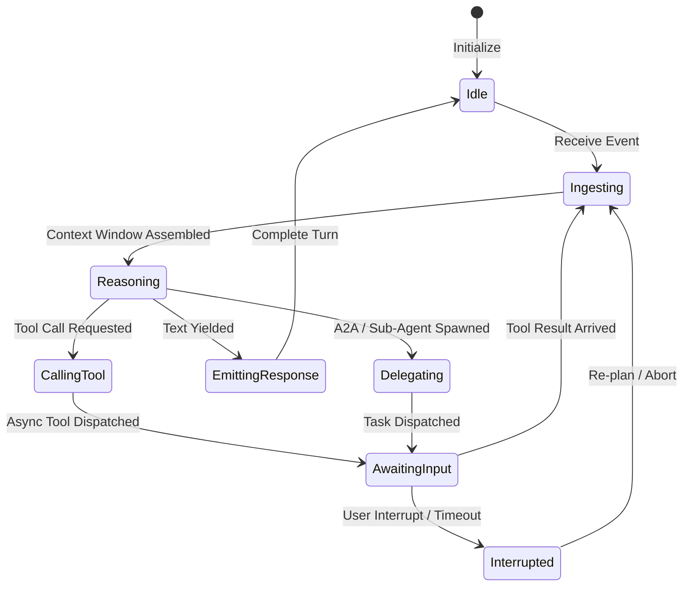

# Event-Driven Agent Core Specification

> **Implementation status.** The reactive event bus and the `AgentEvent` envelope are
> **implemented**: [`src/uclone_x/engine/event_bus.py`](../src/uclone_x/engine/event_bus.py),
> the structural contracts in
> [`src/uclone_x/engine/protocols.py`](../src/uclone_x/engine/protocols.py), and 46 unit
> tests in [`tests/unit/test_event_bus.py`](../tests/unit/test_event_bus.py). Sections
> [3](#3-core-event-envelope), [6](#6-backpressure) and [7](#7-cancellation-and-shutdown)
> describe that code **as shipped**, and every behavioural claim in them cites a durable symbol reference in
> `event_bus.py` or a named test.
>
> **The envelope changed after this document was first written, and §3 is resynchronised
> against the code as of this revision.** What moved: `type` is required and closed and its
> `USER_INPUT` default is gone ([§3.2](#32-type-is-required-and-closed--and-the-default-that-was-removed));
> the model is `strict=True` / `extra="forbid"` ([§3.3](#33-strict-validation-and-forbidden-extras));
> `payload` is deeply immutable (nested mappings and sequences frozen recursively, and unwrapped on serialization) **and is a `Mapping`, not a `dict`, on the way out**
> ([§3.4](#34-payload-immutability-and-the-mapping-on-output-contract)); `model_copy(update=...)` routes through `model_validate` to preserve strict typing and forbidden extras, while `with_sequence()` provides safe sequence stamping (Issue #31); ordering is now
> total ([§3.6](#36-ordering-semantics)); the close sentinel is no longer forgeable
> ([§7.1](#71-closing-a-subscription)); `EventBusError` descends from a rooted error
> taxonomy; and the P6 provenance contract now exists in code **and on this envelope**, as
> the typed optional field `provenance: Provenance | None`
> ([§3.9](#39-provenance-and-the-envelope)). All concurrent subscription reader wakeups are verified.
>
> The agent state machine ([§2](#2-agent-state-machine--lifecycle)) and the agent
> interfaces ([§4](#4-agent-core-interfaces)) remain **specification only** — no
> `BaseAgent` class exists; only the `Protocol` definitions in
> `src/uclone_x/agent/protocols.py`. Persistence ([§8](#8-persistence-and-recovery)) and
> contract versioning ([§9](#9-contract-versioning)) are **Planned — not implemented**.
>
> This document resolves `2026-09-02-021`
> and `2026-09-02-015`. Where the code
> and an issue disagree, the code is stated as the fact and the divergence is named.
> Where a behaviour is genuinely unspecified it is marked **Undefined** rather than filled
> in with plausible prose. [§10](#10-undefined-and-planned-register) is the complete
> register of those gaps.

---

## 1. Concept & Native Engine Implementation Decision

In UClone-X, an agent is not a rigid linear loop that repeatedly blocks on model generation
and tool execution. Instead, every agent is an **event-driven state machine**: it
transitions between lifecycle states in response to inbound events (user messages,
sub-agent responses, tool completion events, timer ticks, cancellation interrupts) and
yields control when awaiting external I/O.

### Why a native event loop over external frameworks?

Rather than taking a heavy external dependency on an agent framework, UClone-X builds its
own event loop engine directly on the standard library and Pydantic v2 (`asyncio` +
`pydantic-core`), which is what the shipped bus is: `asyncio.PriorityQueue` plus immutable
Pydantic models, no third-party runtime.

- **No framework abstraction layers** between a publisher and a subscriber.
- **In-process dispatch** — a fan-out delivers the *same* immutable object to every
  matching subscriber, with no serialization (verified: `EventBus._dispatch_loop` selects the
  matching subscriptions and hands each the same object, which `EventSubscription.deliver` enqueues unchanged
  via `put_nowait`). `frozen=True` on `AgentEvent.model_config` **plus** the frozen
  `payload` view (§3.4) is what makes the sharing safe; `frozen=True` alone was not enough.
- **Deep ontology integration** is intended but not yet wired: nothing in the bus validates
  an ontology today.

> Dispatch latency figures do **not** belong in this document. All performance targets, and
> the fact that they are unmeasured, live in
> [`docs/nfr-performance-budgets.md`](nfr-performance-budgets.md) (`dispatch_latency`,
> **Unmeasured — target only**). Do not cite a sub-millisecond number as observed.

---

## 2. Agent State Machine & Lifecycle

**Status: specification only.** The diagram below is the intended lifecycle. The
enumeration that exists in code is `AgentState` in `src/uclone_x/agent/models.py`,
and it does not match this diagram — see §2.2.



### 2.1 State definitions

* **`IDLE`**: Ready and listening on the event bus for matching session/agent events.
* **`INGESTING`**: Reading and validating incoming events, applying sliding-window context
  pruning, and checking active task cancel tokens.
* **`REASONING`**: Invoking the LLM provider with the current prompt, tools, system
  instructions and schema definitions.
* **`CALLING_TOOL`**: Validating tool input arguments against JSON schemas and dispatching
  execution (local function or remote MCP).
* **`AWAITING_INPUT`**: Non-blocking wait state for tool results, sub-agent returns, or
  human approvals.
* **`EMITTING_RESPONSE`**: Streaming partial tokens or publishing the finalized turn event
  back to the bus.
* **`ERROR`**: Failure state entered when turn reasoning or execution raises an exception.
  Observable between turns; cleared to `IDLE` upon next turn entry.
* **`TERMINATED`**: Terminal shutdown state.

### 2.2 State Machine Contract: ERROR Clear-on-Entry

When a turn encounters an exception (such as an LLM provider outage, connector failure, or tool error), the agent transitions to `AgentState.ERROR` and constructs a failed `TurnResult` (`is_completed=False`, `error=str(exc)`) with truthful degraded provenance.

To ensure observability without causing subsequent turns to fail:
1. **Observable in-between**: `AgentState.ERROR` remains observable on `agent.state` and `agent.context.current_state` while the agent waits for new input.
2. **Clear on turn entry**: On entry to a new reasoning turn (upon receiving a new `USER_INPUT` event or `execute_turn` call), the agent validates its state; if in `AgentState.ERROR`, it explicitly transitions to `AgentState.IDLE` before transitioning to `AgentState.INGESTING`.
3. **Recovery guarantee**: This contract satisfies the transition table (`VALID_TRANSITIONS[ERROR] = {IDLE, TERMINATED}`) and guarantees consecutive turns against failing or recovering providers do not raise illegal state transition errors or drop alternate events (Issue #136b, #150).

### 2.3 Divergence between this section and the code

| This document | `src/uclone_x/agent/models.py` (`AgentState`) |
| :--- | :--- |
| `INTERRUPTED` state, reachable from `AWAITING_INPUT` | **No `INTERRUPTED` member exists.** The enum has `IDLE`, `INGESTING`, `REASONING`, `CALLING_TOOL`, `AWAITING_INPUT`, `EMITTING_RESPONSE`, plus `ERROR` and `TERMINATED`. |
| `Delegating` state in the diagram | No corresponding member. |
| `BaseAgent.cancel()` (§4) | `BaseAgentProtocol` (`src/uclone_x/agent/protocols.py`) declares the properties `agent_id`, `state`, `context`, `config` and the methods `start`, `stop`, `process_event`, `execute_turn` — **there is no `cancel()`**. |

The cancellation semantics that `2026-09-02-015`
§3 asks about therefore have no agent-level implementation to describe. What *is*
implemented is bus and subscription cancellation, documented in [§7](#7-cancellation-and-shutdown).
Agent-level cancellation is **Undefined** (§7.6).

---

## 3. Core Event Envelope

`AgentEvent` is a frozen Pydantic v2 model (`AgentEvent`), decorated with
`@functools.total_ordering` and configured
`ConfigDict(frozen=True, extra="forbid", strict=True)` on `AgentEvent.model_config`. Immutability is
asserted at three levels, because the first level alone was not enough: attribute
rebinding (`test_agent_event_defaults_and_immutability`), payload contents
(`test_delivered_payload_cannot_be_mutated`), and the publisher's own reference
(`test_payload_copies_the_caller_mapping`).

### 3.1 Fields as shipped

Declaration order is the serialization order. **`type` is the one field with no default**,
so `AgentEvent()` raises — see §3.2. Every other field defaults.

| Field | Type | Default | Semantics (as implemented) |
| :--- | :--- | :--- | :--- |
| `event_id` | `str` | `f"evt_{uuid.uuid4().hex}"` (factory on `AgentEvent.event_id`) | Unique identity. Preserved across `with_sequence` / `model_copy`, so an event keeps its id when the bus stamps a sequence. Also the **final ordering tiebreaker** (§3.6). |
| `topic` | `str` | `"default"` | The **primary** routing key, matched against subscription patterns by `EventSubscription.matches_topic`. *Corrected 2026-09-03 (#225): this read "the only routing key". `EventBus._dispatch_loop` calls `sub.matches(event)`, not `sub.matches_topic(...)`, and `matches` applies the `recipient_id` and `session_id` filters below after the topic test.* |
| `type` | `EventType` (`StrEnum`) | **none — required** (`AgentEvent.type`) | Closed classification, eleven members. An unrecognised value is a `ValidationError`. The bus never branches on it: the close sentinel is detected by object identity, not by `type` (§7.1). |
| `source` | `EventSource` (`StrEnum`) | `SYSTEM` (`AgentEvent.source`) | Closed origin: `user`, `agent`, `tool`, `timer`, `system`. Still **publisher-supplied and therefore forgeable** — the field's own description says so and names `2026-09-02-039`, which would move identity stamping to the bus. |
| `sender_id` | `str` | `""` | Informational, unauthenticated. Not used by the bus. |
| `recipient_id` | `str` | `""` | **Routed on, conditionally.** `EventSubscription.matches` rejects the event when the subscription's own `recipient_id` *and* the event's are both non-empty and differ. Either side empty means no filtering. *Corrected 2026-09-03 (#225): this read "the bus does not route on it", and its "verified" example was measured against a subscription created **without** `recipient_id` — the only case in which it holds. Measured on `b00577a`: with `subscribe(recipient_id="me")`, an event addressed to `someone_else` is **not** delivered; addressed to `me`, or unaddressed, it is.* |
| `session_id` | `str` | `""` | **Routed on, conditionally**, by the same rule: `matches` rejects when the subscription's `session_id` and the event's are both non-empty and differ. *Corrected 2026-09-03 (#225): this read "no session filtering exists in the bus". It does, and `BaseAgent.start` relies on it — the agent subscribes with both filters set. The conditional shape is why a `session.*` pattern with `session_id=None` is **not** "every session this agent hosts" but every session on the bus: `test_a_session_wildcard_with_no_session_filter_matches_a_foreign_session` pins it.* |
| `priority` | `EventPriority` (`IntEnum`) | `NORMAL` (50) | Primary ordering key. Under `strict=True` a bare `50` is **rejected** in Python mode; pass the enum member (§3.3). Serializes as the bare integer `50`, not the name. |
| `sequence` | `int` | `0` | Tie-break within a priority. `0` means "unstamped": `EventBus.publish`/`publish_nowait` replace it via `with_sequence` only when it is `0`. A caller-supplied non-zero value is **preserved as-is** (verified), so a caller can inject an out-of-band ordering key. |
| `timestamp` | `float` | `time.time()` (factory on `AgentEvent.timestamp`) | Wall clock, epoch seconds. **Never used for dispatch ordering.** It is read as the secondary key when `_drop_lowest_priority_from_queue` chooses a victim. Non-monotonic; do not derive order from it. |
| `payload` | `ImmutableMapping` (`AgentEvent.payload`) — `Mapping[str, JsonValue]` plus a freeze validator and an unwrap serializer | `{}`, frozen on validation | Free-form JSON-shaped mapping, **read-only after validation and a `Mapping`, not a `dict`, on the way out** (§3.4). No per-`type` schema, no discriminated union. |
| `provenance` | `Provenance \| None` (`core/provenance.py`) | `None` | **In-band P6 attribution for a result carried as an event** (§3.9). Typed on the envelope, not a payload key: `event.provenance.path` is ordinary attribute access after ordinary validation. `None` means *not stated*, never *nothing went wrong*; a consumer that requires it calls `require_provenance`. `degraded` is derived on read and is stripped from any input that asserts it. |
| `trace_id` | `str \| None` | `None` | OpenTelemetry correlation. Top-level, satisfying `PRD.md` FR-1.3 and closing the `trace_id`-placement gap in 2026-09-02-021. Never populated automatically. |
| `correlation_id` | `str \| None` | `None` | Event id of the causing input event (Issue #60). Set by `create_response`, which propagates the causing event's `correlation_id` or, failing that, its `event_id`, so a chain of hops keeps pointing at one root. |
| `idempotency_key` | `str \| None` | `None` | Present on the envelope, but **the bus performs no deduplication**: two events with the same key are both delivered (verified; no test covers it). |
| `schema_version` | `str` | `"1.0.0"` | Carried, **never read**. No component compares it; `schema_version="99.0.0"` is delivered normally (verified). `extra="forbid"` is what gives it any teeth at all (§3.3). See [§9](#9-contract-versioning). |

`provenance` **is** a field on `AgentEvent` as of #117 — verified against
`AgentEvent.model_fields`. §3.9 documents the shape, the producer-side rule that fills
it, and the trade the decision knowingly accepted.

Derived properties: `is_interrupt` is `priority <= INTERRUPT` (`AgentEvent.is_interrupt`) and
`is_critical` is `priority == CRITICAL` (`AgentEvent.is_critical`). Both are covered by
`test_agent_event_ordering`.

`EventPriority` is an `IntEnum` where **lower is more urgent**: `CRITICAL = 0`,
`INTERRUPT = 10`, `NORMAL = 50`, `BACKGROUND = 100`. Asserted by
`test_event_priority_values`.

### 3.2 `type` is required and closed — and the default that was removed

`EventType` is a `StrEnum` with eleven members: the seven event types this
section has always enumerated (`USER_INPUT`, `AGENT_REPLY`, `TOOL_CALL`, `TOOL_RESULT`,
`SUBAGENT_SPAWN`, `SUBAGENT_DONE`, `INTERRUPT`), the two P6 decision-plane notices
(`PROVIDER_FAILOVER`, `RETRY`), `CONTEXT_COMPACTED`, and `SUBSCRIPTION_CLOSED`, which is
the bus's own sentinel type and is never published by a component.

`CONTEXT_COMPACTED` (issue #183) is a member on the same standard as the two P6
notices — a decision-plane fact that must be first-class rather than a free-form
string. A compaction irreversibly changes what every subsequent turn of the session can
see, and it carries a P6-attributable result, since an LLM-written Session Progress
Ledger is a value a foundation model produced. A subscriber that cannot distinguish
"the context was rewritten" from ordinary traffic cannot reason about why an agent's
later answers stopped referring to earlier turns. `BaseAgent.compact_session` publishes
it on `session.{session_id}` with the compactor's attribution forwarded verbatim on the
envelope's `provenance` field.

**What changed, and why the removal of the default is the substance of the fix.**
Previously `type` was an open `str` **with a default of `USER_INPUT`**. Two distinct
failures followed, and only the first is the one that gets noticed:

1. A typo — `"TOOL_RESLUT"` — was a perfectly valid event that matched no handler and
   raised nothing.
2. A **forgotten** `type` was not an error. It was a positive assertion that the event was
   user input. That is worse than the typo and worse than no default at all: an omission
   was silently converted into a specific, plausible, wrong claim, which is exactly the
   default-masquerading-as-a-real-answer that P6 forbids. An unclassified tool result
   entering a reasoning loop labelled as user input is a prompt-injection-shaped bug with
   no attacker required.

A default on a discriminator is therefore not a convenience; it is a defect. The field is
now required, and both halves are pinned by tests:
`test_envelope_requires_a_type` asserts `AgentEvent.model_validate({"topic": ...})` raises
with `type: Field required`, and `test_envelope_rejects_an_unknown_type` asserts an
unrecognised value raises.

`EventSource` was closed in the same change but **kept its `SYSTEM` default** (`AgentEvent.source`),
so the analogous forgotten-`source` failure is narrowed rather than removed — a
mis-attributed event now claims to come from the system rather than from anywhere. That is
tolerable only because `source` is not trusted for anything: it is unauthenticated and
forgeable regardless (2026-09-02-039).

**Consequence for consumers, and a change to the versioning rule.** An unknown `type` can
no longer be quietly ignored by a consumer that does not handle it, because it never
becomes an `AgentEvent` at all — it fails at validation, at the boundary. §9.1(5) is
restated accordingly: closure buys typo-safety at the cost of forward compatibility, and
that trade has to be made deliberately when a new event type is introduced.

### 3.3 Strict validation and forbidden extras

`model_config = ConfigDict(frozen=True, extra="forbid", strict=True)` — `AgentEvent.model_config`.

* **`extra="forbid"`.** An undeclared field is a `ValidationError`, neither silently
  dropped nor silently retained (`test_envelope_rejects_undeclared_fields`). This is what
  makes `schema_version` mean anything at all: a field this version does not declare is
  refused instead of passing through unnoticed.
* **`strict=True`.** No lax coercion in Python mode. This is the detail most likely to
  surprise a caller, and it is asymmetric between Python and JSON input. All verified
  directly against the shipped model:

  | Construction | Result |
  | :--- | :--- |
  | `AgentEvent(type=EventType.USER_INPUT)` | accepted |
  | `AgentEvent(type="USER_INPUT")` | **`ValidationError`** — `Input should be an instance of EventType` |
  | `AgentEvent(type=..., priority=50)` | **`ValidationError`** — pass `EventPriority.NORMAL` |
  | `AgentEvent(type=..., source="agent")` | **`ValidationError`** — pass `EventSource.AGENT` |
  | `AgentEvent(type=..., sequence=1.0)` | **`ValidationError`** — no float-to-int |
  | `AgentEvent(type=..., timestamp=1)` | accepted — `int` is a valid strict input for a `float` field |
  | `AgentEvent.model_validate({"type": "USER_INPUT"})` | **`ValidationError`** — a `dict` is validated in *Python* mode |
  | `AgentEvent.model_validate_json('{"type":"USER_INPUT","priority":50,"source":"agent"}')` | accepted — JSON mode parses the wire forms |

  So the **wire format is unchanged** and deserialising a JSON envelope works exactly as
  §3.5 shows; it is *in-process construction* that now demands the typed members. Any test
  fixture, CLI or adapter that built events from string literals must pass enum members, or
  go through `model_validate_json`.
* **`frozen=True`** blocks attribute rebinding but says nothing about a field's *contents*
  — which is the whole reason §3.4 exists.
* **`with_sequence` / `model_copy` is not re-validation.** `publish` stamps `sequence` with
  `event.with_sequence(...)` / `model_copy(update={...})`, which preserves immutability and bypasses validators and serializers.
  Verified: the copy keeps the frozen payload view and the original `event_id`. It also
  means `model_copy` can write a value that construction would have rejected, so treat it
  as an internal mechanism of the bus, not as a public setter.

### 3.4 Payload immutability and the `Mapping`-on-output contract

`payload` is typed `ImmutableMapping`, defined in
[`src/uclone_x/core/immutable.py`](../src/uclone_x/core/immutable.py) as
`Annotated[Mapping[str, JsonValue], AfterValidator(freeze_mapping), PlainSerializer(...)]`.
`freeze_mapping` returns `MappingProxyType(dict(value))` — a read-only view over a
**private copy**.

**Guarantees**

1. **A consumer cannot mutate a delivered event.** `event.payload["k"] = v` raises
   `TypeError: 'mappingproxy' object does not support item assignment`
   (`test_delivered_payload_cannot_be_mutated`). This is the obligation
   [`docs/a2a-protocol-spec.md`](a2a-protocol-spec.md) §10.3 places on the zero-copy
   fastpath: where objects are shared by reference they MUST be immutable, so P2's
   no-serialisation fan-out cannot become shared mutable state. Before this change,
   `frozen=True` blocked `event.topic = x` and permitted `event.payload["x"] = y` — the
   fastpath's central safety claim was false for the one field that carries the data.
2. **A publisher cannot mutate what it published.** The validator copies the incoming
   mapping, so mutating the dict that was passed in does not reach the event
   (`test_payload_copies_the_caller_mapping`). Freezing without copying would have left the
   publisher holding a writable handle on every subscriber's view.
3. **The frozen payload still serialises.** `model_dump_json()` and
   `model_validate_json()` round-trip (`test_envelope_survives_a_json_round_trip`), and
   `model_dump()["payload"]` is a plain `dict`.

**The non-guarantee that will silently break a downstream consumer: `payload` is a
`Mapping`, not a `dict`.** At runtime it is a `mappingproxy`. Verified:
`isinstance(event.payload, Mapping)` is `True` and `isinstance(event.payload, dict)` is
**`False`**. Consequences, in the order they are likely to be discovered:

* Every mutation raises: `payload["k"] = v`, `.update()`, `.pop()`, `.setdefault()`,
  `.clear()`.
* An `isinstance(payload, dict)` guard now takes the wrong branch — and takes it silently.
* A signature or attribute annotated `dict[str, JsonValue]` is a type error under Pyright
  strict, which is the *good* case: it fails at the quality gate rather than at runtime.
* Reading is unaffected: `payload["k"]`, `.get()`, `in`, iteration, `len()`,
  `dict(**payload)` and `json.dumps(dict(payload))` all work. A consumer that needs a
  mutable working copy writes `dict(event.payload)`.

**Freezing broke serialisation, and that is the trap worth recording.** A `mappingproxy`
is not JSON-serialisable. With only the `AfterValidator` in place, `model_dump_json()`
raises `PydanticSerializationError: Unable to serialize unknown type: <class 'mappingproxy'>`
— verified directly by constructing a model with the freeze validator and no serialiser.
An envelope that cannot be serialised cannot cross the A2A JSON-RPC binding and cannot
reach a telemetry exporter, so for as long as that held, the immutability fix was a worse
defect than the mutable payload it replaced. The repair is that **every** alias in
`core/immutable.py` pairs its `AfterValidator` with a `PlainSerializer` that unwraps the
view back into a plain `dict`. `test_envelope_survives_a_json_round_trip` pins it for
`AgentEvent`. Do not add a frozen-mapping field anywhere without its serialiser, and do not
assume `model_dump()` exercises the same path as `model_dump_json()`.

### 3.5 A valid instance

The following is real output from `AgentEvent(...).model_dump_json()`, re-generated against
the current model, not hand-written pseudo-JSON. Three things it shows: `payload` serialises
as a plain JSON object despite being a frozen `Mapping` in memory (§3.4); `provenance`
serialises as a nested object with the derived `degraded` **included** by a bare
`model_dump_json()`; and this is exactly the form a telemetry exporter sees, because the
strictness in §3.3 constrains in-process construction and not the wire.

```json
{
  "event_id": "evt_9f2c1a8b4d5e4f0a9b7c6d5e4f3a2b1c",
  "topic": "agent.coder",
  "type": "TOOL_RESULT",
  "source": "tool",
  "sender_id": "tool_view_file",
  "recipient_id": "agt_coder_sub",
  "session_id": "sess_workspace_dev",
  "priority": 50,
  "sequence": 42,
  "timestamp": 1756800000.123,
  "payload": {
    "call_id": "call_9876",
    "output": "export function auth() { ... }",
    "token_usage": { "input": 450, "output": 120 }
  },
  "provenance": {
    "path": "retry",
    "requested": { "provider": "tool.view_file", "model": null },
    "served_by": { "provider": "tool.view_file", "model": null },
    "attempts": [
      {
        "provider": "tool.view_file",
        "model": null,
        "error_class": "TimeoutError",
        "status_code": null,
        "span_id": "span_7c1d"
      }
    ],
    "degraded": false
  },
  "trace_id": "trc_45a6b7c8",
  "correlation_id": "evt_1b2c3d4e5f60718293a4b5c6d7e8f900",
  "idempotency_key": "call_9876",
  "schema_version": "1.0.0"
}
```

**What crosses the A2A wire is not quite this.** `a2a/wire.py`'s
`agent_event_to_wire_json` emits the same document with `provenance.degraded` removed,
because a derived value is not something a sender gets to assert (§3.9). Everything else
is byte-identical; verified by generating both from the same event.

### 3.6 Ordering semantics

```python
def __lt__(self, other: object) -> bool:  # AgentEvent.__lt__
    if not isinstance(other, AgentEvent):
        return NotImplemented
    if self.priority != other.priority:
        return self.priority < other.priority
    if self.sequence != other.sequence:
        return self.sequence < other.sequence
    return self.event_id < other.event_id
```

The order is lexicographic over `(priority, sequence, event_id)`. Both queues are
`asyncio.PriorityQueue` (`EventSubscription._queue` and `EventBus._queue`) and `heapq` uses `__lt__` alone, so this method
*is* the dispatch order.

**Ordering is now total, and the trap it closed is worth recording in full.** `event_id` is
the final tiebreaker. Before it existed, two *distinct* events sharing a
`(priority, sequence)` pair compared `False` under **every** operator at once: `a < b`,
`b < a`, `a == b`, `a <= b` and `b <= a` were all false. The cause was the interaction of
two individually reasonable decisions:

* `@functools.total_ordering` on `AgentEvent` derives `__le__`, `__gt__` and `__ge__` from
  `__lt__` **and `__eq__`** — it computes `a <= b` as `a < b or a == b`.
* `__eq__` is not overridden, so it is Pydantic's field-by-field comparison. Two events
  differing only in `event_id` or `timestamp` are never equal, however their sort keys
  compare.

With `__lt__` ending at `self.sequence < other.sequence` and the sequences equal, both
strict comparisons were false and equality was false too — so `total_ordering` produced a
relation that was neither a strict order nor an equivalence. `heapq` then broke ties by
insertion accident, `sorted()` was not reproducible, and `bisect` was meaningless. The
lesson generalises beyond this class: **`total_ordering` is only sound when `__lt__`'s key
and `__eq__`'s key are the same key.** The cheap repair taken here was to extend `__lt__`'s
key until it can only tie between objects that are equal in every field the key reads.
`test_ordering_is_total_for_events_sharing_priority_and_sequence` pins `<`, `>`, `!=` and
`sorted()`.

**What it guarantees**

1. **Priority preemption among co-resident events.** Of the events simultaneously present
   in a queue, the lowest `priority` value leaves first. `test_priority_queue_dispatch_order`
   publishes NORMAL, NORMAL, INTERRUPT, CRITICAL, BACKGROUND and asserts delivery as
   CRITICAL → INTERRUPT → NORMAL → NORMAL → BACKGROUND.
2. **FIFO within one priority**, for events stamped by the same bus instance: the sequence
   counter is a strictly increasing per-instance integer (`EventBus._next_sequence`,
   first value `1`).
3. **Totality and determinism.** For any set of events the order is now total and
   reproducible, *including* for events that share a `(priority, sequence)` pair. There is
   no reliance on insertion order or on the wall clock, and `sorted()`, `heapq` and
   `bisect` are all well-defined. `<=` and `>=` are consistent with `__eq__` for any two
   events that differ in `event_id`.
4. **A testable "notice before result" rule.** Publishing a notice event before the result
   event it describes, at a priority no lower than the result's, guarantees no subscriber
   observes the result first. `docs/principles/details/p6-fail-fast-observability.md`
   depends on exactly this.

**What it does not guarantee**

1. **Not cross-bus or cross-restart.** `EventBus._sequence_counter` is per-`EventBus` instance
   and starts at zero on every construction. Two buses produce colliding
   sequences; a restart reuses them. There is no global or persisted clock.
2. **Not global FIFO.** A `BACKGROUND` event published first is delivered after a `NORMAL`
   event published later while both are resident. Per-publisher and per-topic arrival order
   are *not* preserved across priorities.
3. **No preemption of an event already dispatched.** The dispatcher pops one event
   (`EventBus._dispatch_loop`) and delivers it to completion. A `CRITICAL` event published a moment later
   waits for that delivery; it cannot interrupt it. Preemption is a queueing property, not
   an execution property.
4. **Not stable under a slow subscriber.** Each subscription holds its *own*
   `PriorityQueue` (`EventSubscription._queue`), which re-sorts on the same key. A subscriber that lets events
   accumulate reads them in `(priority, sequence, event_id)` order, not arrival order.
5. **A tie is resolved by a random hex string.** `event_id` defaults to a UUID, so when two
   events genuinely share `(priority, sequence)` the winner is arbitrary — deterministic for
   a given pair of ids, but not meaningful. Totality is not fairness, and it is not FIFO.
6. **The old pathology survives for events sharing a caller-supplied `event_id`.**
   Verified: two events constructed with the same explicit `event_id` and the same
   `sequence` but different `timestamp`s still compare `False` under all five operators,
   because the key ties and `__eq__` sees different timestamps. `event_id` is not enforced
   unique anywhere. Do not reuse an `event_id`; if a component must, sort explicitly on
   `(priority, sequence, event_id)` rather than relying on the operators.
7. **Nothing prevents duplicate sort keys.** Caller-supplied non-zero sequences (§3.1)
   collide with stamped ones freely; the heap then falls back on `event_id`, per (5).

### 3.7 Topic matching

`EventSubscription.matches_topic` accepts `"*"` (match-all), an exact string, or an
`fnmatch` glob. `test_multi_subscriber_pub_sub` covers `"*"`, `"agent.coder"` and
`"agent.*"`. Two consequences that are easy to get wrong:

* **`*` crosses dots.** `"agent.*"` matches `"agent.coder.sub"` (verified). Glob patterns
  are not topic-segment patterns; there is no `#`/`+` single-segment operator.
* **Case sensitivity is platform-dependent by construction.** The implementation calls
  `fnmatch.fnmatch`, which normalizes case via `os.path.normcase`. On POSIX (the supported
  platforms) that is the identity, so matching is case-sensitive — verified on darwin,
  where `"agent.*"` does not match `"AGENT.coder"`. `fnmatch.fnmatchcase` would make this
  invariant rather than incidental.

### 3.8 Where the shipped envelope now stands against 2026-09-02-021

Stated plainly, because these are the rows a reader will otherwise assume are still open —
or still closed.

| Asked for | Shipped | Consequence |
| :--- | :--- | :--- |
| `Literal`/enum for `type` | **`EventType` `StrEnum`, required, no default** (`AgentEvent.type`) | **Closed.** A typo and an omission are both `ValidationError`s. Cost: an unknown type is now rejected at the boundary rather than ignorable, so adding a type is a coordinated change (§3.2, §9.1(5)). |
| `Literal` for `source` | `EventSource` `StrEnum`, default `SYSTEM` (`AgentEvent.source`) | **Closed as to typos, open as to trust.** The value is still publisher-supplied and unverified — `2026-09-02-039`. |
| Discriminated union for `payload`, keyed on `type` | `Mapping[str, JsonValue]`, frozen (`AgentEvent.payload`) | **Still open.** No payload is ever validated against its `type`. **A missing key remains indistinguishable from an absent value**: `payload.get("output")` returns `None` both when the producer omitted the key and when it deliberately sent `null`. A consumer cannot tell a malformed event from a legitimately empty one, which is precisely the ambiguity P6 forbids for results. Immutability (§3.4) fixed *tampering*, not *typing*. |
| `schema_version` | Present, never enforced | Still open — [§9](#9-contract-versioning). `extra="forbid"` at least means an unknown field is refused rather than ignored. |
| `idempotency_key` | Present, never enforced | Still open. No dedup; §5's claim is aspirational. |
| Monotonic `sequence` | Present and used | **Closed**, with the per-instance caveat in §3.6. |
| Topic / broadcast addressing | Present and used | **Closed.** `topic` routes; `recipient_id` does not (§3.1). |
| `trace_id` promoted to the envelope | Present at top level | **Closed.** |
| A valid rendered example | §3.5, generated from the model | **Closed.** |
| Immutable envelope, safe to share by reference | `frozen=True` **and** a frozen `payload` view over a private copy | **Closed** (§3.4), with the `Mapping`-not-`dict` consequence documented rather than hidden. |
| Total, deterministic ordering | `(priority, sequence, event_id)` | **Closed** (§3.6), with the caller-supplied-`event_id` residue in §3.6(6). |

### 3.9 Provenance and the envelope

**`AgentEvent` carries `provenance` as a typed optional envelope field.** Verified:
`provenance` is present in `AgentEvent.model_fields` with annotation
`Provenance | None` and default `None`. This is issue #51's decision — Option B — landed
in code by #117; the decision itself is not reopened here.

**Where the P6 contract lives.**
[`p6-fail-fast-observability.md`](principles/details/p6-fail-fast-observability.md) asks
for provenance on the **result envelope or response object crossing every component
boundary**. It does not demand it on every bus event; #117 nonetheless puts a typed field
on the event envelope, because an `AGENT_REPLY` *is* a result crossing a boundary and a
convention was the only thing making that true before. And
[`src/uclone_x/core/provenance.py`](../src/uclone_x/core/provenance.py) implements it as a
typed model rather than a documented convention. `Provenance | None` is a field on **five**
result-bearing envelopes, in each case **with no default** — a producer must state it or
raise (grep-verified; the count in the previous revision of this table was three):

| Envelope | Field |
| :--- | :--- |
| `ModelResponse` — `src/uclone_x/llm/models.py` | `provenance: Provenance \| None`, required, no default |
| `ToolResult` — `src/uclone_x/tools/models.py` | `provenance: Provenance \| None`, required, no default |
| `TurnResult` — `src/uclone_x/agent/models.py` | `provenance: Provenance \| None`, required, no default |
| `ExecutionResult` — `src/uclone_x/sandbox/models.py` | `provenance: Provenance \| None`, required, no default |
| `TaskResult` — `src/uclone_x/a2a/models.py` | `provenance: Provenance \| None`, required, no default |

`AgentEvent.provenance` is the one that **does** default, to `None`. That difference is
the whole content of the Option B trade below: a result envelope exists only to carry a
result, so requiring the field there costs nothing, whereas the event envelope is shared
by `INTERRUPT` and the close sentinel, which have no result to attribute.

Four properties the principle states are enforced in code. All verified:

1. **Absence is a violation, not a default.** The type is `Provenance | None` *and the field
   is required*. `ModelResponse.model_validate({...})` without `provenance` raises with
   `loc == ('provenance',)`. `None` is representable precisely so that a non-conformant
   value — deserialised from a peer, or produced by a component that has not been updated —
   can be *carried and then rejected* rather than being unrepresentable; it is never
   inherited silently. Consumers call `require_provenance(value, envelope)`
   (`core/provenance.py`), which raises `MissingProvenanceError`
   (`src/uclone_x/errors.py`), so P6's sixth falsifiable check has one implementation
   instead of one per call site.
2. **`degraded` cannot be asserted by the producer.** It is a `computed_field` over
   `served_by != requested` (`Provenance.degraded`), not a stored boolean, so a
   component that substituted a provider cannot report the result as clean. Note the exact
   behaviour, which is *correction* rather than rejection: a `mode="before"` validator
   (`_strip_computed_degraded`) strips any supplied `degraded` key so that
   `model_dump()` output re-validates, and the value is then recomputed. Verified: passing
   `degraded=True` for a primary path is accepted and comes back `False`. A lie is
   discarded, not raised on.
3. **`attempts` is empty if and only if `path` is `PRIMARY`.** The `mode="after"` validator
   `_attempts_match_path` enforces the principle's "if and only if" in both
   directions; verified that a primary path with attempts and a failover path without
   attempts are both rejected. `path` itself has no default.
4. **A `PRIMARY` result is served by the provider that was requested**
   (`_primary_path_names_the_requested_provider`, added for #136, narrowed for #149).
   Rules 2 and 3 together left one encoding open, and it was the attractive one for a
   component that wanted to admit a substitution cheaply: `path=PRIMARY`,
   `served_by.provider != requested.provider`, no attempts. It validated, and `degraded`
   computed `True`, which reads as honest — while P6's falsifiable checks 4 and 5 both
   quantify over "every result with `path != 'primary'`", so the `primary` label exempted
   the substitution from the `PROVIDER_FAILOVER` bus event and the `failover.event` span
   that exist for exactly this case. P6 names the recovery paths by who served — a
   re-attempt hits "the same provider (retry) or a different one (provider failover)" —
   so a different *provider* serving is never `primary`.

   **The model may differ, and this rule says nothing about it.** As first written for
   #136 the rule compared the whole `ServiceRef`, which forbade provider-side alias
   resolution — `gemini-1.5-pro` answered by `gemini-1.5-pro-002` — and that is P6's
   headline case, not a violation: one call, the requested provider answered, nothing
   failed, `path=primary` and `degraded=True`, and check 4 correctly does not apply
   because there is no failover to announce. P6 nowhere states that `primary` implies
   not-degraded; that was an interpretation hardened into a constraint, and #149 is what
   it cost. The narrowed rule compares `provider` only.

   **Residual, stated rather than hidden.** A same-provider *substitution* — asked for
   `gpt-4o`, silently served `gpt-4o-mini` — is structurally identical to an alias and no
   rule over `(requested, served_by, path, attempts)` separates them. It is not made
   invisible by this: `degraded` still computes `True`, so a consumer sees that it is not
   talking to the model it named. What is unavailable is telling a legitimate alias from
   an illegitimate swap, and closing that would need vocabulary P6 does not define. The
   follow-on control is not manual review: `path is PRIMARY and degraded` is
   machine-detectable, so every occurrence can be enumerated for adjudication by a
   consumer, a test, or a lint, even though none of them can classify one.

**Provenance on bus events: Option B, implemented.** A result that travels *as a bus
event* — an `AGENT_REPLY`, a `SUBAGENT_DONE` — carries its attribution in the typed
envelope field, not in `payload`.

*The producer states it, and the guard is reachable.* `BaseAgent.process_event` builds
its reply with `provenance=require_provenance(res.provenance, "TurnResult")`
(`src/uclone_x/agent/base.py`), so `MissingProvenanceError` is raised **before** the
event is constructed. `delegate_task` does the same for `SUBAGENT_DONE`.

That guard only means anything because #117 also **deleted a synthetic fallback**.
`execute_turn` used to write

```python
provenance = resp.provenance or Provenance(
    path=ExecutionPath.PRIMARY,
    requested=ServiceRef(provider="agent.core", model="BaseAgent"),
    served_by=ServiceRef(provider="agent.core", model="BaseAgent"),
)
```

which named `BaseAgent` as the server of a value an LLM connector produced. A connector
returning `ModelResponse(provenance=None)` therefore reached a consumer as
`path=primary served_by=agent.core/BaseAgent degraded=False` — "not stated" laundered
into a positively asserted clean primary, which is exactly the
default-masquerading-as-a-real-answer `core/provenance.py`'s own docstring names. With
that fallback gone, `resp.provenance` is propagated verbatim including `None`, and
`require_provenance` is on a path production traffic can take. Pinned by
`test_connector_provenance_is_propagated_not_defaulted` and
`test_unattributable_turn_result_is_never_published`, the latter driven through a real
connector rather than by patching `execute_turn` — a guard that can only be reached by
patching the method in front of it is decoration.

**The no-LLM `"Ack:"` echo is gone (#136a).** It was described here, and in the code, as
one of two surviving `Provenance` constructions that are "not fallbacks", on the grounds
that `BaseAgent` genuinely authored the echoed bytes and so naming itself as `served_by`
was a true statement. That defence was answering the wrong question. What `served_by`
names is true; what the envelope as a whole asserts is not. An agent configured with
`llm_config.model_name` and no injected connector returned `content="Ack: <input>"`,
`is_completed=True`, `path=primary`, `degraded=False` — indistinguishable, at every
consumer, from a model's answer. P6's Classification Procedure settles it at question 1:
the caller receives a value no real execution of the requested operation produced, so the
verdict is **forbidden** and the procedure stops. No better attribution reaches that
verdict, because the verdict is not about attribution.

`execute_turn` therefore refuses: `LLMConnectorNotConfiguredError` is raised as a
precondition, before the lock, before any state transition and before the input enters
the history, so the agent is left exactly as it was found and no `TurnResult` exists to
attribute. `_event_loop`'s per-event guard absorbs it on the bus path, and `ui/app.py`
and `cli/commands/run.py` both already wire a connector unconditionally
(`create_llm_connector` never returns `None`), so neither depended on the echo.

**Failed turns carry degraded provenance and the `error` payload key (#150).** When an
exception occurs during turn execution (e.g. LLM provider failure, timeout, or runtime error):
* `execute_turn` returns a `TurnResult` with `is_completed=False`, `error=str(exc)`, and a truthful degraded `Provenance` (`path=ExecutionPath.FAILOVER`, `requested=ServiceRef(...)`, `served_by=ServiceRef("agent.core", "error_handler")`, `attempts=(AttemptRecord(..., error_class=...),)`). This ensures a failed turn never reports a clean primary execution (`path=primary, degraded=False`), adhering strictly to P6.
* `process_event` publishes the `AGENT_REPLY` event to the bus with the error reason in the payload under the key `"error": str(exc)` alongside `"is_completed": "False"`. Without this key, a subscriber would receive only an empty content string with no stated cause.
* The event envelope's `provenance` carries `degraded=True`, ensuring the UI SSE stream and all downstream consumers observe the provider failure as degraded rather than clean.

One test did depend on the echo — `test_subagent_task_delegation_and_events` asserted
`"test_foo" in result.content` against an `llm=None` parent, which passed only because
the prompt was echoed back. It now runs against a connector and asserts the connector's
answer.

*The raise does not kill the loop.* `require_provenance` raises inside
`process_event`, which `_event_loop` runs in a `create_task`. An unguarded raise there
left `_running` True and the state reporting `IDLE` while every later event was dropped
forever, visible only as a GC-time "Task exception was never retrieved" — a P1 violation
sitting behind a P6 fix. `_event_loop` now guards each event: the failure is logged with
its traceback, recorded on `BaseAgent.processing_errors` so it is not telemetry-only, the
agent is driven through `ERROR` and back to `IDLE` (staying in `ERROR` would make the
next transition illegal and turn one bad event into a permanently dead agent), and the
event is **dropped, never answered with a substituted result**. Pinned by
`test_event_loop_survives_a_failing_event_and_keeps_consuming`, which was confirmed to
fail — reproducing the dead task and the GC-time traceback — with the guard removed.

*The consumer reads it.* `event.provenance.path`, `event.provenance.degraded`,
`event.provenance.attempts[0].error_class` — ordinary attribute access on a validated
model. No payload-key lookup, no un-freezing of a `mappingproxy`, no JSON-mode
re-parse at the call site. That is the whole point of the change: the previous
convention required a consumer to know the decode recipe, and nothing made a publisher
follow it.

*Attribution is not inherited.* `create_response` takes `provenance` as an explicit
argument and defaults it to `None`; it never copies the causing event's value.
Attribution belongs to whoever produced *this* result — inheritance would let an agent
launder a peer's attribution onto its own output, and its failure mode would be
silent-and-wrong where non-inheritance fails loudly. Pinned by
`test_create_response_does_not_inherit_provenance`.

**Residual, stated rather than hidden:** `provenance` is consequently the only
non-inheriting field on `create_response`, so a producer who simply forgets it publishes
an unattributed result and nothing complains. That is not hypothetical — it is exactly
what both `ui/app.py` publishers did until #117 migrated them. Making the argument
required would half-close it at best, since the far commoner `AgentEvent(...)`
constructor must keep the default for `INTERRUPT` and the close sentinel; the real close
is Option C, and it waits on the taxonomy.

*It survives sequence stamping.* The bus stamps identity and sequence through
`model_copy(update=…)`, which round-trips the whole envelope through
`model_dump()` → `model_validate()` in **Python** mode. That works for `provenance`
because a Python-mode dump keeps `path` as an `ExecutionPath` member and `attempts` as a
`tuple`, and `Provenance`'s `mode="before"` validator drops the `degraded` that the dump
emits. Verified, and pinned by `test_provenance_survives_bus_sequence_stamping` and
`test_publisher_stamping_preserves_provenance`.

*Both transports carry it.* On P2's in-process fastpath the frozen `AgentEvent` is fanned
out **by reference**, so every subscriber holds the identical envelope and therefore the
identical `Provenance` object — no serialisation at all. Across the A2A wire,
`a2a/wire.py`'s `agent_event_to_wire_json` / `agent_event_from_wire_json` apply the same
derived-field policy that `TaskResult` already used: `provenance.degraded` is excluded on
egress, and on ingress `Provenance` discards any `degraded` a peer asserts and recomputes
it from `requested` and `served_by`. Ingress must be handed JSON rather than a decoded
`dict`, for the strict-mode reason in §3.3 — under `strict=True` the string `"failover"`
is not an `ExecutionPath` in Python mode. One test,
`test_published_reply_provenance_survives_both_transports`, drives a real `BaseAgent`
reply through both.

**The interim `payload["provenance"]` convention is RETIRED**, not merely superseded. It
is not written by any producer, not read by any consumer, and not accepted as a fallback:
a publisher that puts a `provenance` key in `payload` gets an ordinary untyped payload
entry that nothing in the system treats as attribution. There is no compatibility shim,
and none is owed: verified by grep, no module under `src/` ever wrote a `provenance` key
into an `AgentEvent.payload`, so the convention this section previously recorded as
"Decided: A" existed only in this document.

**Every `AGENT_REPLY` publisher is migrated.** `BaseAgent` is not the only one:
`src/uclone_x/ui/app.py` publishes real envelopes on both its success and its
exception path, and both were unattributed. The success path now forwards
`turn_result.provenance` verbatim — `None` included, because that endpoint relays a
result it did not produce and must not manufacture attribution for it. The exception
path builds a *truthful degraded* provenance: `requested` names the agent that was
asked, `served_by` names the endpoint that substituted a diagnostic for its answer, so
`degraded` computes `True` instead of being asserted, and the failure rides in
`attempts`. The SSE frame that relays these events used to hard-code
`"degraded": false` on every frame; it now reports `path`/`degraded` only when the event
states them, and omits both otherwise (both are optional in `EventEnvelope`). Without
that fix a genuinely degraded reply would have streamed to the UI as clean the moment
the envelope started carrying real provenance. The `provenance` blocks in `ui/app.py`'s
**HTTP response bodies** remain a separate, hand-rolled DTO shape and are still not
aligned with `Provenance`; that is a known residual, not something this change touched.

**The trade this accepts, stated once.** Every event now declares the field, including the
ones for which attribution is meaningless: an `INTERRUPT`, a `TOOL_RESULT` that only
echoes a call, the bus's own close sentinel. Those carry `None`, and `None` on this
envelope means *not stated* — never *nothing went wrong*. The rule that turns absence into
a failure stays with the consumer that needs it (`require_provenance`), because the
envelope cannot yet tell which events are result-bearing. Option C — a validator requiring
the field for result-bearing types and forbidding it elsewhere — is the intended
destination and is **blocked on the event taxonomy** (§10 rows 3 and 10), which is still
open. Do not add that validator before the taxonomy closes. The trade is recorded on the
field itself, in `AgentEvent.provenance`'s `Field(description=…)`, so it is legible where
someone would try to change it.

**The notice event is now first-class.** P6 condition 3 and falsifiable Check 4 require a
`PROVIDER_FAILOVER` (or `RETRY`) `AgentEvent` published *before* the result event it describes.
Both are members of `EventType`, so the notice is a contract a reader can enumerate rather than a
convention, and a misspelled notice is a `ValidationError` instead of an event nobody handles.

**Autonomous Provenance & Failover Compliance in `BaseAgent` (P6 Checks 4 & 5, Issues #148, #175, #180):**
`BaseAgent` natively and autonomously satisfies P6 Checks 4 and 5 across all callers (CLI, UI, A2A delegation, and direct `EventBus` interactions) without requiring caller-side instrumentation:
1. **Autonomous `failover.event` Telemetry Span Emission (Check 5)**: `BaseAgent` defaults to an active `TelemetryTracer` whenever `tracer=None` is passed. Whenever a turn encounters an exception or provider failure during reasoning/tool execution, `BaseAgent.execute_turn()` records a telemetry span named `"failover.event"` on its tracer, captures the failure error class and message, and threads the resulting `span_id` directly into `AttemptRecord.span_id` within `failover_provenance.attempts`.
2. **Autonomous `EventType.PROVIDER_FAILOVER` Notice Ordering (Check 4)**: When wired to an `EventBus`, `BaseAgent.execute_turn()` publishes a `PROVIDER_FAILOVER` notice onto the bus strictly before returning the failed/degraded `TurnResult`. For event-driven turns processed via `process_event()`, the `PROVIDER_FAILOVER` notice is published prior to constructing and dispatching `AGENT_REPLY`, guaranteeing that `(priority, sequence)` of the failover notice is strictly lower than that of the reply event.

**The notice event alone is still not sufficient**, for the reason in §6.4: it can
be dropped under backpressure, and §3.6(4)'s ordering guarantee is conditional on delivery. In-band
`provenance` on the result envelope and the correlated `failover.event` span together guarantee
falsifiable observability across all transport paths.
---

## 4. Agent Core Interfaces

**Status: specification only** for `BaseAgent`; the `Protocol` in
`src/uclone_x/agent/protocols.py` (`BaseAgentProtocol`) is what exists, and it differs (§2.2). The sketch
below is retained as the target shape, not as a description of code.

```python
from abc import ABC, abstractmethod
from collections.abc import AsyncIterator

from uclone_x.agent.models import AgentConfig
from uclone_x.engine.event_bus import AgentEvent


class BaseAgent(ABC):  # target shape — not implemented
    def __init__(self, config: AgentConfig) -> None:
        self.config = config

    @abstractmethod
    async def handle_event(self, event: AgentEvent) -> AsyncIterator[AgentEvent]:
        """Process an inbound event, yielding output events."""

    @abstractmethod
    async def cancel(self, reason: str = "user_interrupted") -> None:
        """Signal cancellation to active tool calls or LLM streams."""
```

`AgentConfig` itself **is** implemented, in `src/uclone_x/agent/models.py` (`AgentConfig`). The
`cancel()` method above has no counterpart in `BaseAgentProtocol`, and its semantics are
**Undefined** — see §7.6.

### 4.1 Bus-facing interface as shipped

`EventBusProtocol` and `EventSubscriptionProtocol` in
[`src/uclone_x/engine/protocols.py`](../src/uclone_x/engine/protocols.py) are the
structural contracts an agent programs against. The surface is:

| Call | Behaviour |
| :--- | :--- |
| `await bus.publish(event) -> AgentEvent` | Enqueue on the ingress queue; returns the (possibly sequence-stamped) copy. Raises `EventBusError` if stopped, `QueueFullError` under `ERROR`, awaits under `BLOCK`. |
| `bus.publish_nowait(event) -> AgentEvent` | Synchronous variant. Raises `QueueFullError` under **both** `ERROR` and `BLOCK` (`EventBus.publish_nowait`) — a sync caller cannot await capacity. |
| `bus.subscribe(topics="*", maxsize=1000, backpressure_policy=None)` | Creates an `EventSubscription` with its own queue. A `None` policy inherits the bus policy (`EventBus.subscribe`). |
| `bus.subscribe_callback(pattern, cb) -> unsubscribe` | Registers a sync or async callable, invoked inline by the dispatcher (`EventBus.subscribe_callback`). Covered by `test_callback_subscription`. |
| `sub.retarget(topics, *, session_id) -> tuple[AgentEvent, ...]` | Repoints a **live** subscription: swaps its topic set and `session_id` filter in place, keeping the object and its queue (#225). Dispatch scans subscribers and calls `matches`, so there is no topic index to invalidate. Re-queues the buffered events the new target still matches and **returns those it does not** — the *stranded* set — also counting them under `drop_reasons["retarget_stranded"]`. Runs `bus.authorize_subscription_topics` with the subscription's own capabilities **before** mutating, so it cannot reach a topic a fresh `subscribe` would refuse and a refusal changes nothing. Raises `SubscriptionClosedError` if already closed. |
| `bus.authorize_subscription_topics(topics, capabilities)` | The allowlist and wildcard-capability check `subscribe` applies, public so `retarget` runs exactly the same one. |
| `await sub.get()` / `sub.get_nowait()` | Next event in `(priority, sequence, event_id)` order; raises `SubscriptionClosedError` per §7.1. |
| `async for event in sub` | Reactive consumption; see the buffered-event caveat in §7.1. |
| `await bus.wait_until_idle()` / `await bus.join()` | Wait until the ingress queue is drained (`_queue.join()`, `EventBus.wait_until_idle` / `EventBus.join`). See the caveats in §6.5 and §7.3. |
| `await bus.start()` / `await bus.stop()` | §7.2. Also available as `async with EventBus() as bus` (`EventBus.__aenter__` / `EventBus.__aexit__`). |

Errors raised across this surface descend from a single root. `EventBusError` is a subclass
of `UCloneXError` (`EventBusError` in `src/uclone_x/engine/event_bus.py`, `UCloneXError` in `src/uclone_x/errors.py`), and
`QueueFullError` and `SubscriptionClosedError` descend from `EventBusError`
(`src/uclone_x/engine/event_bus.py`). Verified: `issubclass(QueueFullError, UCloneXError)` and
`issubclass(SubscriptionClosedError, UCloneXError)` are both `True`. That matters for P6
rather than for tidiness — a caller can catch every framework failure without catching
bare `Exception`, and a binding can map a raised error without a per-module lookup table.
`src/uclone_x/errors.py` is the single root for the whole runtime, so the bus's errors sit
in the same taxonomy as `MissingProvenanceError` (§3.9) and the A2A error codes.

A publisher never needs to call `start()`: `_ensure_running` (`EventBus._ensure_running`) lazily creates
the dispatcher task on first `publish`/`subscribe` **if an event loop is running**. If none
is, the `RuntimeError` is swallowed in `_ensure_running` and the event sits in the queue with no
dispatcher — which is how the backpressure tests fill the queue deterministically
(`test_backpressure_error_policy`). Verified: such a backlog is delivered once a loop
exists and something re-triggers `_ensure_running`.

---

## 5. Non-Blocking Execution & Reactive Wakeup

1. **No polling loops.** Agents must never poll with `sleep()`. Both queues are awaited
   (`await self._queue.get()` in `EventBus._dispatch_loop`; `await self._queue.get()` in `EventSubscription.get`),
   so a waiting consumer consumes no CPU and resumes on the loop's own notification. This is the P1 obligation,
   and it is satisfied by construction.
2. **Awaiting queue capacity is not polling.** `BackpressurePolicy.BLOCK` suspends a
   publisher on `await queue.put(event)` (`EventBus.publish`, and `EventSubscription.deliver` on a subscription). That is
   a reactive wait on a notification, not a busy-wait, and it does not violate P1's
   prohibition — the distinction 2026-09-02-015 §2 asked to have stated explicitly. It does
   however trade liveness for completeness. On a subscription it does **not** stall the bus:
   the parked `put` runs in a background task the dispatch loop never awaits, at the cost of
   retaining one such task per undeliverable event (§6.5).
3. **Reactive wakeup.** A subscriber blocked in `get()` is woken by the dispatcher's
   `put_nowait` on its queue (`EventSubscription.deliver`); no intermediate scheduler poll exists.
4. **Turn idempotency is aspirational, not implemented.** Every event has a unique
   `event_id`, and `idempotency_key` exists on the envelope, but **no deduplication is
   performed anywhere in the bus**: two publishes with an identical `idempotency_key` are
   both delivered (verified). Any dedup a component needs, it must implement itself.
   Bus-level dedup is **Undefined**.

---

## 6. Backpressure

Resolves `2026-09-02-015` §2. Queues
are **bounded**, and the overflow policy is explicit — there is no unbounded-queue mode and
therefore no unbounded-growth OOM path, at the cost of the losses catalogued below.

### 6.1 Two independent queues

| Queue | Where | Default capacity | Default policy |
| :--- | :--- | :--- | :--- |
| **Ingress** — one per bus | `EventBus._queue` | `maxsize=10000` (`EventBus.__init__`) | `ERROR` (`EventBus.__init__`) |
| **Per-subscription** — one per subscriber | `EventSubscription._queue` | `maxsize=1000` (`EventSubscription.__init__`) | `DROP_OLDEST` (`EventSubscription.__init__`) |

The defaults differ deliberately and the difference is load-bearing: a publisher
overrunning the *bus* gets an exception, while a subscriber that cannot keep up
**silently loses events**. A subscription created through `bus.subscribe()` without an
explicit policy inherits the *bus* policy instead (`EventBus.subscribe`), so a default `EventBus`
hands out `ERROR` subscriptions — and, per §6.3(b), an `ERROR` subscription's failure is
still not visible to anyone but the log. The `DROP_OLDEST` default on
`EventSubscription.__init__` is reached only by constructing a subscription
directly.

### 6.2 The four policies

`BackpressurePolicy` is a `StrEnum` (`BackpressurePolicy`). Behaviour applies only when the target
queue is already full; the non-full path is a plain `put_nowait` (`EventSubscription.deliver`,
`EventBus.publish`, `EventBus.publish_nowait`).

| Policy | Publisher observes (ingress) | Subscriber observes (`deliver`, `EventSubscription.deliver`) | What can be lost |
| :--- | :--- | :--- | :--- |
| `ERROR` | `QueueFullError` from `publish` or `publish_nowait` (`EventBus.publish`, `EventBus.publish_nowait`). Covered by `test_backpressure_error_policy`. | Nothing. `deliver` raises (`EventSubscription.deliver`) but the dispatcher only logs it (§6.3(b)) — the subscriber never receives the event and its queue stays full. | Ingress: nothing (the publisher is told and still holds the event). Subscription: **the event, silently**. |
| `DROP_OLDEST` | Nothing. `publish` returns normally; one already-queued event is evicted — since the fix in §6.3(a), genuinely the oldest. `test_backpressure_drop_oldest_policy` asserts the size stays at `maxsize`. | Nothing. | **The evicted event** — the resident event with the lowest `(sequence, timestamp)`, whatever its priority. |
| `DROP_INCOMING` | Nothing. The event is discarded and `publish` still **returns the event object**, indistinguishable from success (`EventBus.publish`, `EventBus.publish_nowait`). Covered by `test_backpressure_drop_incoming_policy`. | Nothing. | **The new event, silently**. |
| `BLOCK` | `await publish(...)` suspends until capacity frees (`EventBus.publish`); covered by `test_backpressure_block_policy`. `publish_nowait` cannot suspend and instead raises `QueueFullError` (`EventBus.publish_nowait`; verified). | Nothing directly — but the *dispatcher* suspends inside `deliver` (`EventSubscription.deliver`) and stops advancing to the next event. §6.5. | Nothing is dropped. Liveness is traded for completeness. |

Under all four policies the sequence number is stamped *before* the overflow branch
(`EventBus.publish`, `EventBus.publish_nowait`), so a dropped event still consumed a sequence number. Sequence
gaps in a subscriber's stream are therefore evidence of loss — the only such evidence
available, and now doubly meaningful because `DROP_OLDEST` selects its victim by sequence.

### 6.3 One name-versus-behaviour trap fixed, one still live

Both were filed as defects against the earlier revision of this document. Each has been
re-verified against the current module rather than carried forward on trust.

**(a) `DROP_OLDEST` now drops the oldest event — FIXED, re-verified.** The eviction used to
be `self._queue.get_nowait()` on an `asyncio.PriorityQueue`, which pops the queue *head*:
the lowest `(priority, sequence)`, i.e. the **highest-priority** resident event. The policy
therefore preferentially destroyed exactly the `CRITICAL` and `INTERRUPT` events the
priority scheme exists to protect, including a P6 failover notice published at high
priority. That is `2026-09-02-037`,
and it was the most serious finding in the earlier revision.

**It no longer reproduces.** `_drop_oldest_from_priority_queue` (`_drop_lowest_priority_from_queue`) inspects the
queue's underlying heap list, removes the entry with the minimum `(sequence, timestamp)`,
and re-heapifies. All three call sites use it: subscription `deliver` (`EventSubscription.deliver`), `publish`
(`EventBus.publish`) and `publish_nowait` (`EventBus.publish_nowait`).

Re-verified directly on both queues, using the case the existing test cannot distinguish:
fill a `maxsize=2` queue with `NORMAL` (seq 1) and then `CRITICAL` (seq 2), then overflow
with `NORMAL` (seq 3). The **`NORMAL` seq-1 event is evicted and the `CRITICAL` event
survives**; under the old implementation the `CRITICAL` event was the one destroyed.
`test_backpressure_drop_oldest_policy` still publishes three same-priority events only, so
**the fix is verified but not pinned by a test** — a regression here would be silent. That
missing test is the one gap this section would ask a task to close.

Two properties of the fix worth knowing rather than discovering:

* **It reaches into a private CPython attribute.** `getattr(q, "_queue", None)` in `_drop_lowest_priority_from_queue` is
  `asyncio.Queue`'s internal heap list, which is not part of the asyncio contract. The
  `getattr` default and the `if not underlying` guard mean that if the
  attribute ever disappears the helper evicts nothing and the following `put_nowait` raises
  `QueueFull` — loud rather than silent, which is the right failure direction, but this is
  a real coupling to standard-library internals.
* **Eviction is O(N) in queue length**, not O(log N), and the helper calls `q.task_done()`
  so an evicted item does not leave `join()` waiting for a completion that will
  never come. Verified: `maxsize=2` with `DROP_OLDEST` and six publishes still lets
  `wait_until_idle()` return.

**§6.4 is unchanged by this fix.** `DROP_OLDEST` is now honest about *which* event it drops,
but it still drops one silently, and the oldest resident event can perfectly well be the
`CRITICAL` one. Correcting a name-behaviour mismatch did not make a bus event a durable
signal.

**(b) A subscription's `ERROR` policy is observable, but never on the `publish` call —
CORRECTED.** A previous revision of this section stated that the dispatcher discards the
`QueueFullError` and that it "reaches nobody", and attributed that to
`asyncio.gather(*delivery_tasks, return_exceptions=True)` in `_dispatch_loop`. **Both halves
are withdrawn.** The module's only `gather` is in `EventBus.stop`, over
`self._delivery_tasks`; §6.5 records the per-commit check behind that and gives the full
account of what the dispatch path does instead. The error is not discarded.

What the code does: `deliver` raises `QueueFullError` under `ERROR`
(`EventSubscription.deliver`), and both dispatch paths route it to
`EventBus._handle_delivery_error`, which appends it to `EventBus.errors`, records it on
`EventSubscription.errors`, logs at `error` level, and invokes the handler registered
through `EventBus.set_error_handler` if there is one. This is the "or a registered error
handler" branch of `2026-09-02-040`'s
suggested resolution, and that issue is recorded `status: resolved`. It is pinned by
`test_subscriber_error_policy_observability`, which asserts `sub.error_count`,
`sub.last_error`, `bus.error_count`, `bus.last_error` and the handler invocation.

**What remains true, and is a documented asymmetry rather than a swallowed error:**
`publish` itself does not raise. Five publishes to a `maxsize=2`, `ERROR` subscription, on
a bus whose ingress queue is nowhere near full, return normally from `publish` and from
`wait_until_idle()`, leave two events queued, and surface the three overflows only on
`EventBus.errors` / `EventSubscription.errors` and the error handler. Because
`EventBus.__init__` defaults to `ERROR` and `subscribe()` inherits it (`EventBus.subscribe`),
that is the behaviour of **every subscription created the normal way**. `ERROR` is
*publisher-visible in-band* on the ingress queue only; on a subscription it is
**out-of-band observable** — a caller who wants it must read `EventBus.errors` or register
a handler. A caller who relies on `publish` raising will not learn of the loss.

Callbacks are **not** handled the same way, and the difference is measurable. A callback is
*called* inline inside `try/except Exception: logger.exception(...)`
(`EventBus._dispatch_loop`), so a **synchronous** callback that raises is logged by the bus
and leaves it running. An **asynchronous** callback's coroutine is handed to
`asyncio.create_task` with only `self._delivery_tasks.discard` as its done-callback, so
nothing ever retrieves its exception: a raising async callback produced **no record on the
`uclone_x.engine.event_bus` logger at all** when a raising sync callback registered on the
same topic produced one. No test pins this, and it is registered as an open item (§10).
**No failure of a subscriber or a callback propagates to a publisher through `publish`.**

### 6.4 Consequence for anything that relies on a bus event alone

**A bus event is not a durable signal.** Under `DROP_OLDEST` or `DROP_INCOMING`, on either
queue, an event can be discarded with no publisher-visible error, no subscriber-visible
error, and nothing but a `logger.debug` line (`EventSubscription.deliver`, `EventBus.publish`, `EventBus.publish_nowait`) that is invisible at default log levels. Under `ERROR` on a subscription the
loss is at `logger.error` (`EventBus._dispatch_loop`) but still invisible to the publisher (§6.3(b)).
Therefore:

* **No correctness property may depend on a bus event being observed.** This is why
  P6 requires provenance *on the result envelope* in addition to the `PROVIDER_FAILOVER`
  event: provenance carried by the value cannot be dropped while the value survives, and
  the principle document says so explicitly. That field now exists on the result envelopes
  and, since #117, on `AgentEvent` itself (§3.9) — which changes what is lost when a
  result event is dropped, but not this rule. A dropped `AGENT_REPLY` takes its
  `provenance` with it; the field makes attribution inseparable *from the event*, not the
  event durable.
* **A notice event carries ordering, not delivery.** §3.6(4)'s guarantee is conditional:
  *if* both events are delivered, the notice precedes the result. It does not promise the
  notice arrives at all. Note that raising the notice's priority no longer makes it the
  preferred eviction victim (§6.3(a)) — but publishing it *early*, which is exactly what P6
  condition 3 demands, now makes it the oldest resident event and therefore the *first*
  `DROP_OLDEST` victim. The hazard moved from priority to age; it did not disappear.
* **Audit, budget and safety paths must not be bus-only.** Any such flow needs a
  loss-intolerant channel (a policy of `ERROR` or `BLOCK` on the ingress queue plus a
  direct return value or persisted record), not a subscription. Which channel that is, is
  **Undefined** — no such mechanism exists in the codebase.
* **A per-event-class policy does not exist.** 2026-09-02-015 suggested "bounded queues
  with an explicit overflow policy per event class". The shipped policy is per *queue*, not
  per class: one policy governs `CRITICAL` and `BACKGROUND` events alike. Per-class policy
  is **Undefined**.

### 6.5 The dispatch path does not block, and what it costs instead

> **Withdrawn.** Earlier revisions of this section stated that `_dispatch_loop` delivers
> **concurrently via `asyncio.gather`**, and derived from `gather`'s semantics — *"`gather`
> waits for all of its awaitables"* — that the loop **cannot advance past an event that one
> subscriber refuses to accept**, that `BLOCK` on a subscription still stalls the bus, and
> that two events with a 50 ms async callback take ~102 ms to drain. **All of that is
> withdrawn.** The check: for every commit `git log --format=%H -- src/uclone_x/engine/event_bus.py`
> reports, extract `_dispatch_loop` and grep it for `gather` — the count is 0 in all of
> them, back to the commit that introduced the file. The module's only `gather` is in
> `EventBus.stop`, awaiting `self._delivery_tasks`. The stall the section predicted does not
> occur, and the section is what is corrected here — not the code (#306).

`_dispatch_loop` (`EventBus._dispatch_loop`) pops one event and then, for each matching
subscription, takes one of two paths:

* the subscription is **not full**, *or* its policy is **not `BLOCK`** — `deliver_nowait`
  (`EventSubscription.deliver_nowait`), which is synchronous and never parks; the
  policy-specific drop or `QueueFullError` happens inline (§6.3(b));
* the subscription is **full and its policy is `BLOCK`** — `asyncio.create_task` over
  `EventBus._deliver_to_subscriber_async`, added to `self._delivery_tasks` with
  `discard` as its done-callback.

Matching callbacks are then *called* inline; a callback that returns a coroutine has that
coroutine handed to `asyncio.create_task` as well. **The loop awaits nothing between popping
one event and popping the next.** Neither spawned task is ever awaited on the dispatch path;
they are awaited only in `EventBus.stop`, which is where the module's single `gather` lives.

* **What actually replaced the sequential loop.** Deliveries once *were* a sequential
  `for sub in matching_subs: await sub.deliver(event)` with async callbacks awaited inline —
  that much of the earlier account was accurate, and it is the loop
  `2026-09-02-038` was raised against.
  Its replacement is `deliver_nowait` plus `create_task`, not `gather`, and it does more
  than the withdrawn text credited it with: it removes the stall as well as the peer
  starvation. `2026-09-02-038` is recorded `status: resolved`, and both halves are pinned by
  name — `test_slow_blocked_subscriber_does_not_stall_other_subscribers` and
  `test_async_callback_does_not_stall_dispatch_loop`.
* **A `BLOCK` subscriber does not stall the bus.** With a `maxsize=1` `BLOCK` subscriber
  that never reads and a healthy subscriber alongside it, four published events leave
  `bus.qsize()` at 0, `wait_until_idle()` returning rather than timing out, and the healthy
  subscriber holding **all four**. The in-source comment in `_dispatch_loop` — *"Deliver
  concurrently in background to prevent stalling the whole bus"* — describes the result, not
  merely the intent. An earlier revision of this section accused that comment of overstating
  what the code does; the accusation was backed by the absent `gather` and is withdrawn.
* **The bus pipelines; it does not serialise on callbacks.** Two events with a 50 ms async
  callback no longer hold the loop for ~102 ms — the ingress queue drains in well under a
  millisecond, because the callback coroutine is a task rather than an inline `await`.

**What the non-blocking path costs.** The stall was traded for three properties a caller
must not assume away. None is a regression against the sequential loop, but none was stated
before, and a search of `tests/unit/test_event_bus.py` for each found no test asserting it:

* **`wait_until_idle()` means the ingress queue drained, not that anything was delivered.**
  `_dispatch_loop` calls `self._queue.task_done()` in a `finally` that runs immediately
  after the tasks are *spawned*, and `wait_until_idle` is `self._queue.join()`
  (`EventBus.wait_until_idle`), so idle is reached while the spawned work is still pending.
  To see it: register an async callback that sleeps, publish three events to a `maxsize=1`
  never-read `BLOCK` subscription, `await wait_until_idle()`, and inspect the subscriber's
  `qsize()` and the callback's side effect — the subscriber holds the one event that fit and
  the callback has not run. A test that publishes, awaits `wait_until_idle()`, and asserts on
  a callback's side effect is asserting on a race.
* **Delivery tasks accumulate, one per undeliverable event, with no bound.** A task leaves
  `self._delivery_tasks` only by completing or by being cancelled in `stop()`
  (`EventBus._dispatch_loop`, `EventBus.stop`), and a task parked in `await self._queue.put`
  under `BLOCK` (`EventSubscription.deliver`) does neither while the subscriber never reads.
  To see it: publish *N* events to a full, never-read `maxsize=1` `BLOCK` subscription,
  `await wait_until_idle()`, then read `len(bus._delivery_tasks)` — it tracks *N* minus the
  one event that fit. There is no cap, no timeout and no eviction; the ceiling is memory.
* **A raising async callback is not logged by the bus** (§6.3(b)).

**Unchanged and still true:** there is no delivery timeout and no slow-consumer eviction,
and `await bus.stop()` returns promptly (well under a millisecond in the same scenario)
because it cancels the dispatcher and the outstanding delivery tasks. Prefer `BLOCK` on the
ingress queue, where it throttles the publisher, and a dropping or `ERROR` policy on
subscriptions — not because `BLOCK` on a subscription stalls the bus, which it does not, but
because it converts backpressure into unbounded task retention that nothing reports.

---

### 6.6 Subscription drop accounting — every exit that returns, and one that does not

`EventSubscription` keeps its own drop accounting — `dropped_event_count` and a
`drop_reasons` mapping (`EventSubscription.record_drop`) — and `EventBus.dropped_event_count`
sums it across **active** subscribers. P6 forbids an event leaving without a trace, so every
exit that **returns** records itself under a distinct reason:

| Reason | Where | What it means |
| :--- | :--- | :--- |
| `drop_lowest_priority` | `EventSubscription.deliver`, `EventSubscription.deliver_nowait` | Backpressure eviction under `DROP_LOWEST_PRIORITY` / `DROP_OLDEST` (§6.3(a)). |
| `drop_incoming` | `EventSubscription.deliver`, `EventSubscription.deliver_nowait` | Backpressure refusal of the arriving event under `DROP_INCOMING`. |
| `retarget_stranded` | `EventSubscription.retarget` | A queued event the new target does not match, drained and returned to the caller (§7.1, #225). |
| `refused_stale_delivery` | `EventSubscription.deliver`, `EventSubscription.deliver_nowait` | An event matched at dispatch but no longer matched at delivery, refused outright (#307). |
| `subscription_closed` | `EventSubscription.deliver`, `EventSubscription.deliver_nowait` | An event delivered to an already-closed subscription. Neither queued nor raised, so nothing else would have recorded it. |
| `close_sentinel_eviction` | `EventSubscription.close` | A resident event evicted to seat `_CLOSED_SENTINEL` on a full queue (§7.1). |

One increment is one event this subscription did not deliver, so
`dropped_event_count == sum(drop_reasons.values())` always holds and the two reconcile
against each other. The `ERROR` and `BLOCK`-nowait paths do not appear here: they
`record_error` and raise (`EventSubscription.record_error`), which is already observable.
§6.3(b) is about who *receives* that raise, which is a separate and still-live defect.

**Which surface carries which reason.** `EventBus.dropped_event_count` and
`EventBus.drop_reasons` iterate the bus's *live* subscriber list, and
`EventSubscription.close` removes the subscription from that list **before** recording
anything. So `subscription_closed` and `close_sentinel_eviction` are readable on the
subscription object and **never** appear in the bus aggregate; the other four do appear.
Nothing is silent — both write a `logger.warning` — but an operator checking only
`bus.drop_reasons` would be checking the wrong surface for those two.

**Parked `BLOCK` putters on subscription close (#311).** An event parked in
`await put` under `BLOCK` when `close()` runs on the same subscription is deterministically
resolved: `EventSubscription.close` cancels pending delivery tasks tracked in
`_pending_put_tasks`, and the cancelled delivery task records the discarded event under
`subscription_closed` and returns cleanly without task leakage or unhandled exceptions.

### 6.6.1 `refused_stale_delivery` and the retarget race (#307)

**The retarget race and delivery contract.** `EventBus` matches subscriptions at dispatch time. Two windows can repoint a subscription between that match and the enqueue: the scheduling gap before a background delivery task runs, and a `put` parked on a full queue under `BLOCK`. `retarget` (`EventSubscription.retarget`) is synchronous and partitions only what is in the queue at that instant, so a parked putter is invisible to it.

Under #307 (Option A of #291), the delivery contract was updated: a match at dispatch is necessary but not sufficient. `matches` is re-applied right before enqueue (and after a parked `put` under `BLOCK` resumes, by evicting the newly-queued event), and if the subscription no longer matches the event, it is **refused outright**.

**Recorded as a true drop.** Because the refused event never reaches the queue or the reader, it is a true drop. It is recorded under `drop_reasons["refused_stale_delivery"]` and increments `dropped_event_count`. (The former observation counter `unmatched_delivery_count` was removed.)

Reachability is narrow: the parked-putter window needs an explicitly `BLOCK`-configured subscription at its queue ceiling at the instant of a switch, and `EventBus` defaults to `ERROR` (`EventBus.__init__`). The `subscription_closed` and `close_sentinel_eviction` exits are reachable under **every** policy.

---

## 7. Cancellation and Shutdown

Partially resolves `2026-09-02-015` §3:
bus- and subscription-level cancellation are specified here; agent-level cancellation
remains open (§7.6).

### 7.1 Closing a subscription

`close()` (`EventSubscription.close`) is idempotent, synchronous, and does three things in order: sets
`_closed`, removes the subscription from the bus's subscriber list
(`EventBus.remove_subscription`), and enqueues the module-level `_CLOSED_SENTINEL`.
`unsubscribe()` is an alias (`EventSubscription.unsubscribe`), and
`async with bus.subscribe(...)` closes on exit (`EventSubscription.__aexit__`, covered by
`test_subscription_context_manager`).

**Guarantees**

1. **No further events are routed.** The dispatcher iterates the subscriber list
   (`EventBus._dispatch_loop`), from which the subscription is already gone; `deliver`
   returns early anyway if called (`EventSubscription.deliver`), recording the discard
   under `drop_reasons["subscription_closed"]` rather than swallowing it (§6.6). The
   dispatcher deliberately does **not** short-circuit on `is_closed` ahead of that
   counter. Covered by `test_subscriber_unsubscribe` and
   `test_the_bus_lets_the_subscription_count_its_own_closed_discard`.
2. **A blocked reader unblocks immediately.** The sentinel is a real event pushed onto the
   subscription's queue, so a reader suspended in `await self._queue.get()` (`EventSubscription.get`) wakes
   at once and `get()` translates the sentinel into `SubscriptionClosedError`. Covered by `test_waiting_reader_unblocks_on_sub_close`. There is no
   timeout and no deadlock window.
3. **The sentinel is not forgeable — fixed.** `get()` and `get_nowait()` detect it by
   **object identity**, `if event is _CLOSED_SENTINEL` (`EventSubscription.get` and `EventSubscription.get_nowait`), not by matching
   a `type` string. Previously the check was `event.type == "__SUBSCRIPTION_CLOSED__"`, so
   any component could publish an ordinary event with that `type` on a matching topic and a
   subscriber's `get()` would raise `SubscriptionClosedError` while `is_closed` stayed
   `False` — a forged close, and one that closing the `type` enum would *not* have fixed,
   because `SUBSCRIPTION_CLOSED` is a publishable member of that enum (`EventType.SUBSCRIPTION_CLOSED`). Closure
   stops a typo; only identity stops a forgery. Re-verified: publishing
   `AgentEvent(type=EventType.SUBSCRIPTION_CLOSED, ...)` on a subscribed topic delivers an
   ordinary event, the reader receives its payload, and `is_closed` remains `False`. Pinned
   by `test_a_forged_close_sentinel_does_not_close_a_reader`, whose docstring records why
   the identity check rather than the enum is what matters.
4. **Already-buffered events survive for an explicit reader — unless the queue is full.**
   The sentinel carries `priority=BACKGROUND` and `sequence=2**62` (`_CLOSED_SENTINEL`), so it
   sorts *last*. A reader that keeps calling `get()` after `close()` drains every buffered
   event in priority order and only then raises. Verified: three buffered events are all
   returned, then `SubscriptionClosedError`. Once the queue is empty the guard in
   `EventSubscription.get` raises on every subsequent call, so the error is sticky. On a
   **full** queue this guarantee does not hold, because seating the sentinel costs a
   resident event — see the caveat below.
5. **`get_nowait()` behaves identically** (`EventSubscription.get_nowait`), except that it raises
   `asyncio.QueueEmpty` when the subscription is open and merely empty (verified).

**Caveats**

* **`async for` abandons buffered events.** The loop condition is `while not self._closed`
  (`EventSubscription.__aiter__`), checked *before* each `get()`. After `close()` the iterator yields at most one
  more event and then exits, leaving the rest in the queue. Re-verified: a slow `async for`
  consumer with four events buffered at close time consumed one and abandoned the rest, and
  no test covers this. `test_async_iterator_consumption` passes only because it drains
  everything before closing. **If completion matters, drain with `get()` in a loop until
  `SubscriptionClosedError`, not with `async for`.**
* **A full queue costs a buffered event, and now says so.** This paragraph previously
  recorded that `close` wrapped `put_nowait` in `except (asyncio.QueueFull, Exception)` so
  that ~~"on a full queue the sentinel is simply not enqueued"~~, leaving the buffered event
  for the reader. **The code has moved and that is no longer what happens.**
  `EventSubscription.close` now catches `asyncio.QueueFull`, evicts the least urgent
  resident event via `_drop_lowest_priority_from_queue`, and retries the sentinel; a second
  failure is logged. Re-measured on a full `maxsize=1` subscription: the resident event is
  **evicted**, the sentinel is seated, and the next `get_nowait()` raises
  `SubscriptionClosedError` without ever returning that event. So the wake-up guarantee (2)
  is now unconditional, and it is guarantee (4) that is conditional. That eviction was
  itself an uncounted drop until #291; it is now recorded under
  `drop_reasons["close_sentinel_eviction"]` (§6.6), pinned by
  `test_close_counts_the_event_it_evicts_to_seat_the_sentinel`. The separate
  `except Exception` clause still hides any non-`QueueFull` failure behind a log line.
* **Cancelling a reader does not close the subscription.** Verified: a reader task cancelled
  while suspended in `get()` sees `CancelledError`; the subscription stays open and keeps
  buffering. `__aiter__` additionally swallows `CancelledError` and breaks the loop
  (`EventSubscription.__aiter__`) rather than re-raising, which suppresses the cancellation from the
  consuming task's perspective.

### 7.2 Stopping the bus

`stop()` (`EventBus.stop`) is async and performs, in order: set `_stopped = True`; cancel the
dispatcher task and await it, absorbing `CancelledError`; take `_lock`,
snapshot and clear `_subscribers` and `_callbacks`; close every snapshotted
subscription.

**Guarantees**

1. **The dispatcher stops** — `is_running` becomes `False`, and `stop()` returns only after
   the task has been awaited, so no delivery is in progress afterwards.
2. **Every subscription is closed**, with the §7.1 guarantees, so no consumer is left
   blocked. Covered by `test_bus_stop_cancels_cleanly`.
3. **Publishing after stop fails loudly.** `_ensure_running` raises `EventBusError` when
   `_stopped` (`EventBus._ensure_running`), for `publish`, `publish_nowait` *and* `subscribe` — all three
   re-verified; `publish` is also covered by `test_bus_stop_cancels_cleanly`. No event is
   accepted and then silently dropped.
4. **`stop()` is safe from a stalled dispatcher** — including one suspended inside a
   `BLOCK` `deliver` (verified, §6.5) and one suspended inside a hanging async callback
   (verified: `stop()` returned in under a millisecond and the callback never completed).
5. **Restart is possible but lossy in a specific way.** `start()` resets `_stopped` and
   creates a fresh dispatcher (`EventBus.start`); verified that a restarted bus dispatches
   again. But `_subscribers` and `_callbacks` were cleared, so every consumer must
   re-subscribe, while the *ingress queue and sequence counter are retained* — verified
   that the counter continues rather than restarting, so residual events are then dispatched
   to whoever happens to be subscribed after the restart.

### 7.3 In-flight events at shutdown

* **The event being delivered when cancellation lands is partially delivered.**
  `asyncio.CancelledError` is a `BaseException`, so the `except Exception` handlers in
  `EventBus._dispatch_loop` do not absorb it. The earlier account of *where* it lands is
  **withdrawn**: it attributed the split to "the `gather` over the deliveries", and there is
  no `gather` on the dispatch path (§6.5, #306). The loop suspends at exactly one point —
  `await self._queue.get()` — so cancellation of the dispatcher lands there, and everything
  else in flight is a task in `self._delivery_tasks` that `stop()` cancels explicitly before
  awaiting them all under the module's one real `gather`.

  The split is therefore between what had **already been enqueued synchronously** by
  `deliver_nowait` and what was still parked in a background task. Re-verified with a
  `maxsize=1` `BLOCK` subscriber and a healthy peer, three events published and `stop()`
  called without draining: the healthy subscriber holds one, the blocked one holds one, an
  in-flight 500 ms async callback **never completes**, and no delivery task survives.
  **There is no atomic fan-out and no rollback**, and a task cancelled mid-`put` on subscription
  close records its event under `subscription_closed` without task leakage (`EventSubscription.deliver`, #311).
* **The `finally: self._queue.task_done()` in `EventBus._dispatch_loop` still runs** for that event, so
  the ingress queue's accounting stays consistent through cancellation — which is also what
  hides the partial delivery from `join()`.
* **Events still queued on ingress are discarded, not stranded, and `wait_until_idle()`
  after `stop()` returns — CORRECTED.** The previous text recorded this as STILL
  REPRODUCES; it does not. `stop()` drains `_queue` with `get_nowait()`/`task_done()`,
  emitting a `logger.warning` per discarded event (`EventBus.stop`), and
  `wait_until_idle` returns immediately when `self._stopped` is set
  (`EventBus.wait_until_idle`). Re-verified: after `stop()` with three residual events,
  `qsize()` is 0 and `await bus.wait_until_idle()` returns rather than hanging. This is the
  second half of `2026-09-02-038`,
  which is recorded `status: resolved` and is pinned by
  `test_wait_until_idle_after_stop_returns_promptly`.

  **The residual hazard is loss, not a hang.** `stop()` is immediate cancellation with
  discard, not a graceful drain: undelivered ingress events are dropped at `warning` level
  and nothing in the API distinguishes "idle because everything was delivered" from "idle
  because the remainder was discarded". A drain-before-stop mode is still **Undefined**
  (§7.4).
* **Events buffered in subscriptions survive** and can be drained with `get()` per §7.1(4),
  since `stop()` closes subscriptions rather than discarding their queues.

### 7.4 What is not implemented

* **No graceful-shutdown deadline.** `stop()` takes no timeout and defines no grace period;
  it cancels immediately. A deadline-bounded drain is **Undefined**.
* **No drain-then-stop.** See §7.3.
* **No delivery timeout or slow-consumer eviction.** §6.5.

### 7.5 Deadlock-freedom summary

The shipped combination is deadlock-free for consumers under every path exercised above:
a reader always terminates via an event, a sentinel, or `SubscriptionClosedError`; a closed
subscription's error is sticky; `stop()` cannot be blocked by a stuck consumer or a hanging
callback. The two liveness hazards that do exist are both **publisher-side or bus-side**,
both re-verified as still reproducing in §6.5 and §7.3, and neither is detected at runtime:
`BLOCK` on a non-reading subscription, and `join()` after `stop()`.

### 7.6 Cancellation semantics that remain Undefined

None of the following has an implementation to document, and none is defined by the bus.
Each is stated as an open gap rather than guessed at:

| Question (2026-09-02-015 §3) | Status |
| :--- | :--- |
| What `BaseAgent.cancel()` does | **Undefined** — the method does not exist (§2.2). |
| Effect on an in-flight tool execution | **Undefined** — no tool executor exists. |
| Effect on a sandboxed subprocess | **Undefined** — see [`docs/sandbox-execution-architecture.md`](sandbox-execution-architecture.md); no implementation. |
| Effect on a streaming LLM request | **Undefined** — connectors exist under `src/uclone_x/llm/connectors/`, but none defines cancellation semantics. |
| Propagation to descendant sub-agents | **Undefined** — see `2026-09-02-014`. |
| Cancellation deadline and escalation path | **Undefined.** |
| Whether an `INTERRUPT`-priority event cancels anything | **Undefined.** The bus gives `INTERRUPT` *queue* precedence (§3.6) and nothing more; no component acts on it. `EventType.INTERRUPT` is a classification, not a mechanism. |

The one thing that *is* settled is the mechanism available for building these: `asyncio`
task cancellation, which the bus already uses correctly (`stop()` cancelling the
dispatcher), and which propagates to child tasks only if the implementor arranges it.
---

## 8. Persistence and Recovery

**Status: Planned — not implemented.** The bus is purely in-memory, per P3
("Single-Machine Zero-Broker Acceleration"), and there is no persistence code anywhere in
`src/uclone_x/`.

### 8.1 What is lost on process exit

Everything. Concretely, in the shipped implementation:

| State | Where it lives | On exit |
| :--- | :--- | :--- |
| Undelivered ingress events | `EventBus._queue` | Lost. |
| Events buffered in subscriptions | `EventSubscription._queue` | Lost. |
| Subscriptions and callback registrations | `_subscribers`, `_callbacks` (`EventBus._subscribers`, `EventBus._callbacks`) | Lost; consumers must re-subscribe. |
| The monotonic sequence counter | `_sequence_counter` (`EventBus._sequence_counter`) | Lost, and **reset to 0** — post-restart events collide with pre-restart sequences (§3.6(1)). |
| Any event history / ledger | Does not exist | There is no log, no replay, no ledger. The UI event ledger described in [`docs/ui-dashboard-architecture.md`](ui-dashboard-architecture.md) has no backing store. |

An event is delivered at most once per subscription and is never retained after a consumer
reads it: **delivery is at-most-once, fire-and-forget, with no acknowledgement, redelivery
or replay.**

### 8.2 The A2A tension, restated against current documents

`2026-09-02-015` §1 framed this against
an older `a2a-protocol-spec.md` §3.2 (that section is now the Agent Card structure; task
identity is §4/§5.1 of the current document). The tension itself stands: A2A's `taskId`
identifies a unit of work whose `TaskState` a peer can query, and terminal states
(`TASK_STATE_COMPLETED`, `_FAILED`, `_CANCELED`, `_REJECTED`) imply state a peer can still
observe after the work ends — which an in-memory-only engine cannot honour across a
restart. **What a peer receives when it queries a task the engine has forgotten is
Undefined**, and no A2A server implementation exists yet to define it.

### 8.3 What a durable variant would have to preserve

Requirements, not a design — nothing here is implemented, and this section must not be read
as describing behaviour:

1. **A monotonic, restart-safe sequence source.** Per-instance in-memory counters are the
   blocking issue; ordering across a restart is meaningless without this.
2. **A2A task state only, not the whole bus.** A write-ahead log scoped to task
   identity/state/artifacts keeps the durability surface small and leaves P3's in-memory
   fastpath intact for ordinary events.
3. **An explicit answer for a forgotten task**, so a peer gets a determinate reply
   (a "task not found" with a reason) rather than a timeout.
4. **A declared durability tier per event class**, since §6.4 already establishes that some
   signals must not be bus-only.
5. **Idempotent replay**, which requires the `idempotency_key` in §3.1 to actually be
   enforced somewhere — it is not today (§5(4)).

Until such a variant exists, the honest statement of the engine's durability is: **none.**

---

## 9. Contract Versioning

**Status: Planned — not implemented.** `schema_version` exists on the envelope with the
default `"1.0.0"` (`AgentEvent.schema_version`) and **no code reads it**; an event declaring
`schema_version="99.0.0"` is delivered normally (verified). There is no negotiation, no
rejection path, and no compatibility check anywhere in `src/uclone_x/`.

Two things did change under this section's feet, and rules 3 and 5 below are restated
because of them: `extra="forbid"` and the closed `EventType` (§3.2, §3.3) make the envelope
**strictly less forward-compatible** than when this rule was first drafted. That is the
right default for a single-process bus and the wrong default for a cross-version wire, and
the implementing task has to choose deliberately rather than inherit.

### 9.1 The rule to be implemented

Specified here so implementers stop inventing one each; **planned**, and none of it is in
force today.

1. **`schema_version` is `MAJOR.MINOR.PATCH` and describes the envelope**, not the payload
   or the application. It changes only when `AgentEvent`'s field set or field semantics
   change.
2. **Additive-only within a MAJOR.** A MINOR bump may add an optional field with a default.
   It may not remove a field, narrow a type, change a default, or repurpose a name.
3. **Unknown fields must be handled explicitly, and today they are rejected.** The
   original rule said "preserved, not rejected" within a MAJOR, so that a newer producer
   would be readable by an older consumer. `AgentEvent` now sets `extra="forbid"`
   (§3.3), so an envelope carrying a field this version does not declare raises
   `ValidationError` — it is neither dropped (the previous behaviour) nor preserved (the
   rule's intent). Rejecting is strictly better than dropping, because a silent drop
   cannot be distinguished from an absent field; it is not the same as forward
   compatibility. Whoever implements versioning must decide between three options and say
   which: keep `forbid` and require lock-step deployment within a process; add an explicit
   `extensions: Mapping[str, JsonValue]` field so unknown data has a declared home; or
   relax to `extra="allow"` on a *reader-only* deserialisation path. Doing nothing means
   option one by default. **Undefined** which it is.
4. **A MAJOR mismatch is a fail-fast rejection with a reason**, never a best-effort parse.
   Silently accepting an envelope of an unknown shape is exactly the silent-default P6
   forbids.
5. **An unknown `type` is now rejected at validation, not ignored by the consumer.** The
   original rule assumed `type` was an open string, so a new event type could be ignored by
   a consumer that did not handle it. `EventType` is closed (§3.2), so an unrecognised
   value never becomes an `AgentEvent` at all. The trade was made deliberately — it buys
   the elimination of the silent `USER_INPUT` default and of typo'd types — but it means
   **adding an event type is a coordinated change**: every process that must deserialise
   the new type has to ship the new enum member *before* any producer emits it, which is
   the reader-first rollout in (6) applied to enum members and not only to fields.
6. **Rollout order when two components disagree.** Deploy in this order, and never collapse
   the steps:
   1. Add the field as optional-with-default and release the **reader** first: every
      consumer tolerates the field's presence before any producer emits it.
   2. Release the **producer** once all readers tolerate the field.
   3. Only in a later MAJOR may the field become required — and only after a stated
      deprecation window during which both shapes are accepted.
   The reverse order (producer first) is the failure mode this rule exists to prevent.
7. **The version is on the envelope, so a mismatch is detectable before the payload is
   interpreted** — which is the whole reason the field is top-level.
8. **Scope.** This rule covers `AgentEvent` only. A2A envelope versioning is governed by
   the protocol's own `A2A-Version` header ([`docs/a2a-protocol-spec.md`](a2a-protocol-spec.md)),
   and `SKILL.md` / ontology schema versioning is **Undefined** here — see
   [`docs/skill-system-architecture.md`](skill-system-architecture.md) and
   `2026-09-02-015` §4. How a skill
   authored under an older runtime is treated after hot-reload is **Undefined**.

### 9.2 What is missing to make this real

An enforcement point (validation on ingress, or a typed constructor), a test that a MAJOR
mismatch raises, and a documented deprecation window. None exists.

---

## 10. Undefined and Planned Register

Every gap this document declines to fill, in one place. **Undefined** means no
implementation and no specification; **Planned** means specified here or elsewhere but not
implemented; **Closed** means it was open in the previous revision and the shipped code now
satisfies it; **Defect** means the code is wrong and the row records whether it still
reproduces. Nothing here is filled in with plausible prose.

| # | Item | Status | Where |
| :--- | :--- | :--- | :--- |
| 1 | Closed enum for `type`, with no default | **Closed** — `EventType`, required (the `USER_INPUT` default is gone) | §3.2 |
| 2 | Closed enum for `source` | **Closed as to typos** — `EventSource`, but it keeps a `SYSTEM` default | §3.2, §3.8 |
| 3 | Discriminated `payload` union keyed on `type` | Undefined — frozen but untyped `Mapping[str, JsonValue]` | §3.4, §3.8 |
| 4 | Distinguishing a missing `payload` key from a `null` value | Undefined | §3.8 |
| 5 | Envelope immutability safe for zero-copy fan-out | **Closed** — `frozen=True` plus a read-only payload view over a private copy | §3.4 |
| 6 | `payload` is a `Mapping`, not a `dict`, on output | **Breaking change, documented** — mutation raises, `isinstance(..., dict)` is `False` | §3.4 |
| 7 | Frozen mapping fields must pair a validator with a serialiser | **Closed** — `mappingproxy` is not JSON-serialisable; pinned by a round-trip test | §3.4 |
| 8 | `strict=True` rejecting string/int literals in Python mode while JSON mode accepts them | **Intentional asymmetry, documented** | §3.3 |
| 9 | `provenance` on `AgentEvent` | **Closed** — `provenance: Provenance \| None = None`, typed on the envelope (#51 Option B, implemented by #117) | §3.1, §3.9 |
| 10 | How a result published *as a bus event* carries typed provenance | **Closed: B (typed optional envelope field)**. Producer stamps it after `require_provenance`; consumer reads it by ordinary validation; both transports carry it. The interim payload-key convention (`payload["provenance"]`) is **retired**. The residual — that non-result events also declare the field — is the trade the decision took, and Option C remains blocked on row 3 | §3.9 |
| 11 | A closed set of notice types incl. `PROVIDER_FAILOVER` / `RETRY` | **Closed** — both are `EventType` members | §3.9 |
| 12 | Total ordering; `<=`/`>=` consistency with `__eq__` | **Closed** — `event_id` is the final tiebreaker, pinned by a test | §3.6 |
| 13 | Ordering for two events sharing a caller-supplied `event_id` | **Defect, unfixed** — all five operators are `False` again | §3.6(6) |
| 14 | Deduplication on `idempotency_key` | Undefined — field carried, never read | §3.1, §5(4) |
| 15 | Restart-safe / cross-instance monotonic sequence | Undefined | §3.6(1), §8.3 |
| 16 | Routing on `recipient_id` or `session_id` | Undefined — topic-only routing | §3.1 |
| 17 | Authenticated `source` / `sender_id` (identity stamped by the bus) | Undefined — `2026-09-02-039` | §3.1, §3.8 |
| 18 | Case-sensitive topic matching as an invariant (`fnmatch` vs `fnmatchcase`) | Undefined — currently incidental to POSIX | §3.7 |
| 19 | `DROP_OLDEST` evicting the highest-priority event | **Defect FIXED** (`2026-09-02-037`) — re-verified; **no test pins it** | §6.3(a) |
| 20 | Reliance on `asyncio.Queue._queue`, a private CPython attribute | Accepted coupling, documented, fails loudly if it moves | §6.3(a) |
| 21 | Subscription-level `ERROR` reaching a publisher | **Closed as observability, open as ergonomics** (`2026-09-02-040`, `status: resolved`) — routed to `EventBus._handle_delivery_error`: `EventBus.errors`, `EventSubscription.errors` and `set_error_handler`; pinned by `test_subscriber_error_policy_observability`. `publish` itself still does not raise. The withdrawn `gather(return_exceptions=True)` attribution was never in the code (#306) | §6.3(b) |
| 22 | Per-event-class backpressure policy | Undefined — policy is per queue | §6.4 |
| 23 | A loss-intolerant channel for audit/budget/safety signals | Undefined | §6.4 |
| 24 | `BLOCK` on a subscription stalling the dispatch loop | **Closed — the stall does not reproduce** (`2026-09-02-038`, `status: resolved`). `deliver_nowait` plus a background `create_task` per parked delivery; pinned by `test_slow_blocked_subscriber_does_not_stall_other_subscribers`. The previous "STILL REPRODUCES" and its "concurrent `gather`" attribution are withdrawn — no `gather` has ever been on the dispatch path (#306) | §6.5 |
| 25 | Head-of-line blocking from inline async callbacks | **Closed** — an async callback's coroutine is a `create_task`, not an inline `await`; pinned by `test_async_callback_does_not_stall_dispatch_loop`. The ~102 ms figure described the superseded sequential loop and is withdrawn (#306) | §6.5 |
| 26 | Delivery timeout / slow-consumer eviction | Undefined | §6.5 |
| 27 | `async for` draining buffered events after close | **Defect, unfixed**, and no test covers it | §7.1 |
| 28 | Non-forgeable close sentinel | **Closed** — identity comparison, not a `type` match; pinned by a test | §7.1(3) |
| 29 | `wait_until_idle()` / `join()` after `stop()` hanging | **Closed** (`2026-09-02-038`, `status: resolved`) — `stop()` drains and discards ingress at `warning`, `wait_until_idle` short-circuits on `_stopped`; pinned by `test_wait_until_idle_after_stop_returns_promptly`. The residual is loss, not a hang (#306) | §7.3 |
| 29a | `wait_until_idle()` implying delivery rather than ingress drain | **Defect, unfixed** — `task_done()` fires when delivery tasks are *spawned*; at idle a `BLOCK` subscriber held 1 of 3 events and no callback had run. **No test pins it** | §6.5 |
| 29b | Unbounded growth of `EventBus._delivery_tasks` under a non-reading `BLOCK` subscriber | **Defect, unfixed** — one retained task per undeliverable event, no cap, timeout or eviction. **No test pins it** | §6.5 |
| 29c | A raising **async** callback's exception reaching any log | **Defect, unfixed** — `create_task` with only `discard` as done-callback; a raising sync callback on the same topic logged, the async one did not. **No test pins it** | §6.3(b) |
| 30 | Graceful-shutdown deadline; drain-then-stop | Undefined | §7.4 |
| 31 | Agent-level cancellation and its propagation (tools, sandbox, LLM streams, sub-agents) | Undefined | §7.6 |
| 32 | `INTERRUPT` priority causing actual interruption | Undefined | §7.6 |
| 33 | Persistence, replay, event ledger | **Planned — not implemented** | §8 |
| 34 | Reply for an A2A task lost to a restart | Undefined | §8.2 |
| 35 | `schema_version` enforcement and rollout rule | **Planned — not implemented** (rule stated in §9.1) | §9 |
| 36 | Forward compatibility under `extra="forbid"`: lock-step, an `extensions` field, or reader-side `allow` | **Undefined** — a choice the versioning task must make and state | §9.1(3) |
| 37 | Skill / ontology schema versioning and hot-reload compatibility | Undefined | §9.1(8) |
| 38 | `BaseAgent`, the state machine, `INTERRUPTED` | Specification only | §2.2, §4 |

Two rows are worth reading together, because a fix moved a hazard rather than removing it:
row 19 makes `DROP_OLDEST` honest, and §6.4 explains why publishing a P6 notice *early* —
which P6 condition 3 requires — now makes that notice the first eviction candidate. Row 12
closes the ordering defect for stamped events and row 13 records the case it does not cover.

---

## 11. Traceability

Source of truth for §3, §6 and §7:

* [`src/uclone_x/engine/event_bus.py`](../src/uclone_x/engine/event_bus.py) — the
  implementation. References in this document cite durable symbols (e.g.
  `EventBus._dispatch_loop`, `AgentEvent.with_sequence`, `AgentEvent.matches_topic`,
  `EventSubscription.deliver`) rather than volatile numeric line citations, preventing
  documentation drift across codebase revisions.
* [`src/uclone_x/core/immutable.py`](../src/uclone_x/core/immutable.py) — the
  `ImmutableMapping` alias behind `AgentEvent.payload`: the freeze validator and the
  unwrap serialiser that keeps the frozen envelope serialisable (§3.4).
* [`src/uclone_x/core/provenance.py`](../src/uclone_x/core/provenance.py) — the P6 in-band
  provenance model, which **is** a typed optional field on this envelope (§3.9).
* [`src/uclone_x/a2a/wire.py`](../src/uclone_x/a2a/wire.py) — the JSON boundary for both
  `TaskResult` and `AgentEvent`; where `provenance.degraded` is excluded on egress and
  where the strict-mode "give it JSON, not a `dict`" rule is implemented once (§3.9).
* [`src/uclone_x/agent/base.py`](../src/uclone_x/agent/base.py) — the producer side:
  `process_event` and `delegate_task` call `require_provenance` before constructing a
  result event (§3.9).
* [`src/uclone_x/errors.py`](../src/uclone_x/errors.py) — the rooted error taxonomy;
  `EventBusError` descends from `UCloneXError` (§4.1).
* [`src/uclone_x/engine/protocols.py`](../src/uclone_x/engine/protocols.py) — structural
  contracts (`EventBusProtocol`, `EventSubscriptionProtocol`, plus
  `TimerServiceProtocol` and `SchedulerProtocol`, which have **no implementation**).
  Conformance is enforced statically by `tests/unit/test_protocol_conformance.py`, not by
  `isinstance` — see that module's own docstring and 2026-09-02-035.
* [`tests/unit/test_event_bus.py`](../tests/unit/test_event_bus.py) — 46 tests
  (`asyncio_mode = "auto"`, so the async ones need no marker). Claims in this document that
  no test covers are marked "verified" or "re-verified" — established by direct execution
  against the shipped module while writing this revision — rather than attributed to a test.
  A "re-verified" claim is one that was checked again after `event_bus.py` changed, and the
  four backpressure/shutdown findings in §6.3, §6.5 and §7.3 are all in that category.

Related documents and findings:

* [`docs/principles/details/p1-reactive-event-driven.md`](principles/details/p1-reactive-event-driven.md) — names this document as its implementation reference; §5 answers its polling prohibition, and §6.5 states where the reactive promise is currently broken.
* [`docs/principles/details/p6-fail-fast-observability.md`](principles/details/p6-fail-fast-observability.md) — cites §3; §3.9 records where its provenance contract now lives in code and §6.4 states what a bus event still cannot promise.
* [`docs/local-collaboration-engine.md`](local-collaboration-engine.md) — engine context; its §3.2 topic-registration claim is satisfied by `topic`, not by `recipient_id`.
* [`docs/nfr-performance-budgets.md`](nfr-performance-budgets.md) — all latency and throughput targets, marked unmeasured.
* `2026-09-02-021` — envelope contract (§3); §3.8 is the row-by-row status.
* `2026-09-02-015` — persistence, backpressure, cancellation, versioning (§6-§9).
* `2026-09-02-014` — sub-agent cancellation and budget propagation (§7.6).
* `2026-09-02-037` — `DROP_OLDEST`; **fixed**, re-verified (§6.3(a)).
* `2026-09-02-038` — `BLOCK` stall and `join()` after `stop()`; **both halves fixed** and `status: resolved`, each pinned by a named test. The earlier "both still reproduce" is withdrawn (#306) (§6.5, §7.3).
* `2026-09-02-039` — forgeable identity; the close sentinel half is **fixed** (§7.1(3)), the `source`/`sender_id` half is not (§3.1).
* `2026-09-02-040` — subscription `ERROR` swallowed; **fixed** via the "registered error handler" branch and `status: resolved`. `publish` still does not raise, which is an asymmetry, not a swallow. The earlier "still reproduces" is withdrawn (#306) (§6.3(b)).
