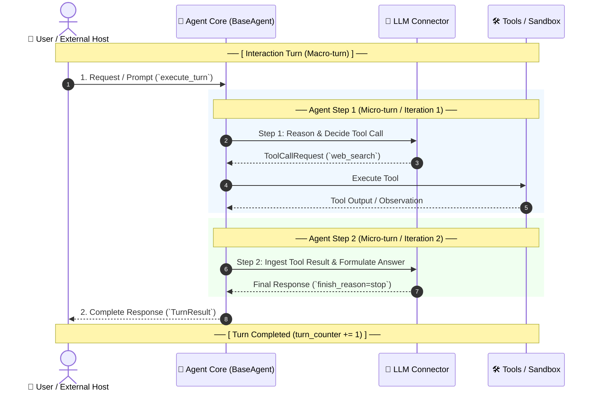
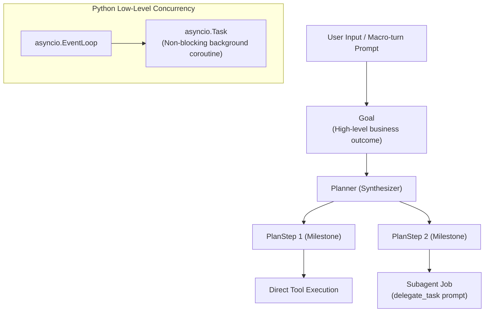
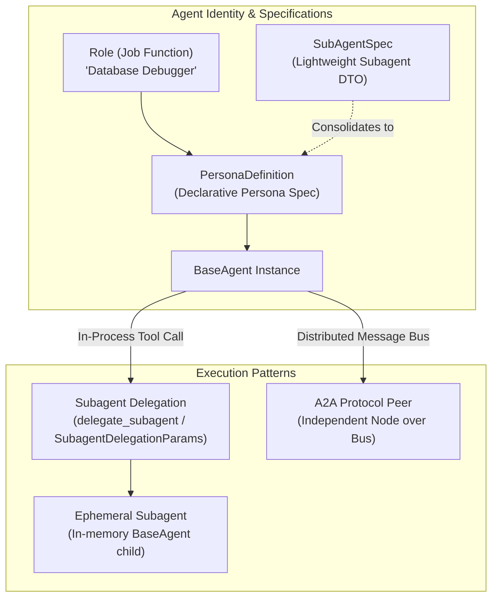
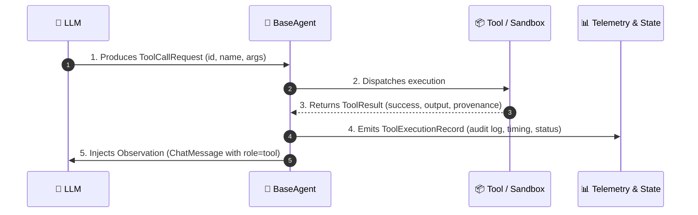
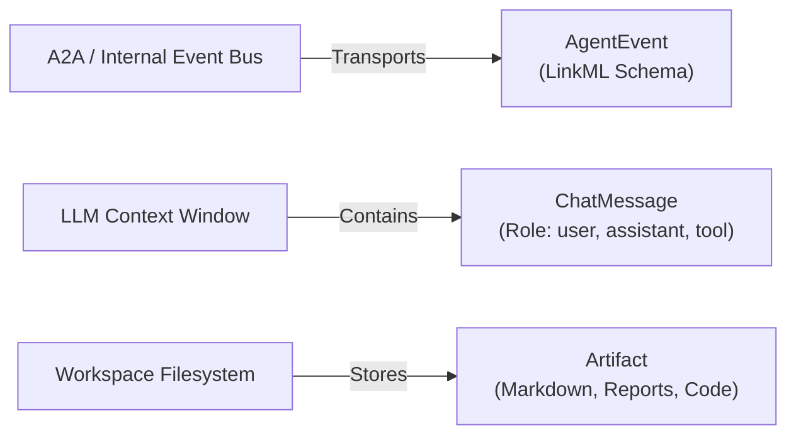
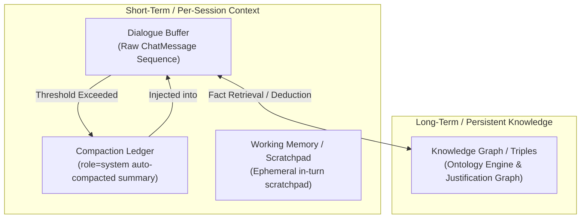
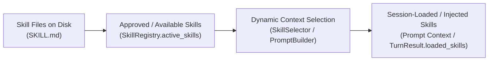
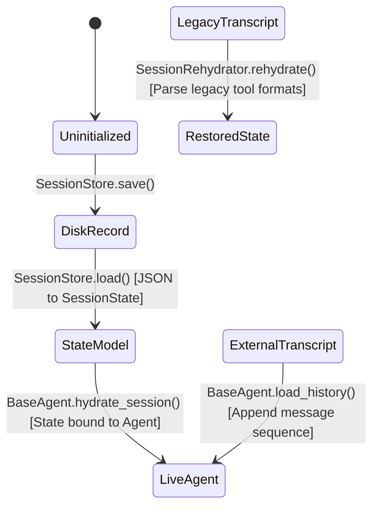
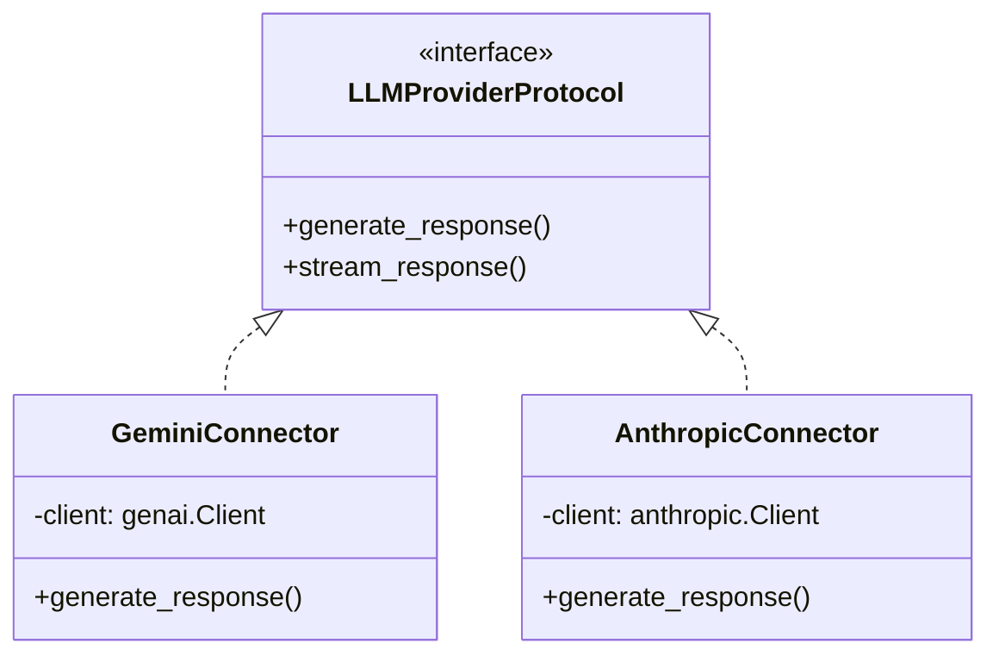

# Agent Runtime Terminology Guide: Comprehensive Reference

This document establishes the canonical terminology across UClone-X runtime architecture. It resolves ambiguities across execution loops, agent identities, subagent delegation, skill lifecycles, session persistence, and LLM connector hierarchies.

---

## Table of Contents
1. [Execution Cycles: Turn, Step, and Iteration](#1-execution-cycles-turn-step-and-iteration)
2. [Task Decomposition & Agency: Goal, PlanStep, Subagent Job, and Async Tasks](#2-task-decomposition--agency-goal-planstep-subagent-job-and-async-tasks)
3. [Agent Identity & Subagent Hierarchy: Persona, Role, Spec, Delegation, and A2A](#3-agent-identity--subagent-hierarchy-persona-role-spec-delegation-and-a2a)
4. [Tool Execution Lifecycle: Call Request, Result, Record, and Observation](#4-tool-execution-lifecycle-call-request-result-record-and-observation)
5. [Communication Taxonomy: Events, Messages, and Artifacts](#5-communication-taxonomy-events-messages-and-artifacts)
6. [Memory & Context Hierarchy: Dialogue Buffer, Compaction Ledger, Working Memory, and Knowledge Graph](#6-memory--context-hierarchy-dialogue-buffer-compaction-ledger-working-memory-and-knowledge-graph)
7. [Skill Lifecycles: Approved/Available Skills vs Injected/Session-Loaded Skills](#7-skill-lifecycles-approvedavailable-skills-vs-injectedsession-loaded-skills)
8. [Session State Transitions: Load vs Hydrate vs Load History vs Rehydrate](#8-session-state-transitions-load-vs-hydrate-vs-load-history-vs-rehydrate)
9. [LLM Integration Hierarchy: Provider, Connector, Client, and Error Taxonomies](#9-llm-integration-hierarchy-provider-connector-client-and-error-taxonomies)
10. [Summary Reference Table](#10-summary-reference-table)
11. [Related Specifications & Policies](#11-related-specifications--policies)

---

## 1. Execution Cycles: Turn, Step, and Iteration

In conversational multi-agent systems, confusing **human conversation turns** with **internal reasoning steps** leads to severe architectural defects:
* Bounding conversation length instead of runaway tool loops (e.g., terminating user chats at 50 messages, design-review finding `2026-09-05-001`, from the register retired in #1037).
* Prematurely terminating tool execution before the agent inspects the tool output ("결과 안보임" defect).
* Miscalculating session saturation and displaying incorrect progress gauges in the UI.

### 1.1 Interaction Turn (대화 턴 / Macro-turn)
* **Definition**: An externally-initiated request-response lifecycle. It begins when an external actor (human operator, A2A peer, or CLI caller) sends a message or event, and completes when the agent returns a final `TurnResult`.
* **State & Tracking**:
  * Tracked by `SessionState.turn_counter`.
  * Monotonically increments by `1` per completed user interaction.
  * **Never bounded by `AgentConfig.max_steps` (or legacy `max_turns`)**: Conversations are open-ended and must not be terminated arbitrarily by interaction counts.

### 1.2 Agent Step (실행 스텝 / Micro-turn)
* **Definition**: A single internal model invocation and its corresponding tool execution round taken *inside* one interaction turn, without returning to the external caller.
* **Lifecycle**: `Thought (LLM) ➔ Action (Tool Dispatch) ➔ Observation (Tool Result Feedback)`.
* **State & Tracking**:
  * Tracked by internal loop variable `step`, exposed via `BaseAgent.run_steps` (and mirrored to legacy `run_turns`).
  * Cleared and reset at the beginning of each interaction turn.
  * **Bounded by `AgentConfig.max_steps`**: This is the ceiling that prevents runaway tool loops and unbounded autonomous spinning (Core Principle P4).

### 1.3 Plan Step & Proof Step
* **Plan Step (`PlanStep`)**: A high-level task milestone synthesized by the planner (`uclone_x.agent.planner.PlanStep`) to achieve a user goal across multiple actions.
* **Proof Step (`ProofStep`)**: A single deductive inference step recorded by the ontology reasoner (`uclone_x.ontology.justification.ProofStep`) documenting rule firings and premises.

### 1.4 Iteration (반복 루프)
* **Definition**: The algorithmic ReAct loop mechanism (`while True: step += 1 ...`) executing consecutive **Agent Steps** until the model terminates with `finish_reason=stop` or hits the step budget.

---

## 2. Task Decomposition & Agency: Goal, PlanStep, Subagent Job, and Async Tasks

In autonomous multi-agent runtimes, the overloaded term **"Task"** creates confusion across planning, delegation, and asynchronous runtime execution. UClone-X establishes strict boundaries:

### 2.1 Goal (최상위 목표)
* **Definition**: The business-level objective or end-state requested by the user or upstream system (e.g., *"Audit the database schema and migrate customer tables"*).
* **Characteristics**: Open-ended, multi-step, evaluated at the interaction turn level upon completion.

### 2.2 PlanStep (플랜 스텝 / 마일스톤)
* **Definition**: A discrete, synthesized milestone produced by the planner (`uclone_x.agent.planner.PlanStep`) that moves the agent closer to the `Goal`.
* **Characteristics**: Sequential or DAG-structured, tracked via `Plan.steps`, executed across one or more **Agent Steps**.

### 2.3 Subagent Job / Delegation Task (서브에이전트 위임 작업)
* **Definition**: An isolated task prompt dispatched to an ephemeral child agent via `BaseAgent.delegate_task(subagent, prompt)`.
* **Characteristics**: Operates within a bounded sub-session, inherits constrained step budgets, and reports back a self-contained `TurnResult`.

### 2.4 `asyncio.Task` (파이썬 비동기 태스크)
* **Definition**: Low-level Python concurrency primitive (`asyncio.create_task()`) used by the engine for non-blocking I/O, event streaming, and background listeners.
* **Guideline**: Never refer to an `asyncio.Task` as an "Agent Task" in architectural documentation. Always explicitly label it as an `asyncio.Task` or background coroutine.

---

## 3. Agent Identity & Subagent Hierarchy: Persona, Role, Spec, Delegation, and A2A

### 3.1 Persona vs. Role vs. Type Name
* **Persona (`PersonaDefinition`)**:
  * The complete declarative specification of an agent's identity, system prompt, tool whitelist, model constraints, and reasoning configuration.
  * Defined under `uclone_x.agent.persona.PersonaDefinition`.
  * `BaseAgent.persona` returns this full structured specification.
* **Role**:
  * A concise, human-readable job title or responsibility tag (e.g., `"Senior Code Reviewer"`, `"Database Debugger"`).
  * Used for routing, UI badges, and builder team assignments.
* **Type Name / Persona Name (`type_name` vs `persona_name`)**:
  * Canonical identifier for invoking or constructing a persona (e.g., `"research"`, `"flutter_a11y_agent"`).
  * **Guideline**: In protocol contracts (`SubagentInvocation`), `persona_name` is preferred over `type_name` to avoid conflation with Python class types.

### 3.2 In-Process Subagent Delegation vs. A2A Peer Node
* **Subagent Delegation (`delegate_subagent` / `SubagentDelegationParams`)**:
  * An ephemeral child agent running **in-process** within the parent agent's execution loop.
  * Shares memory / session scope or operates in a temporary sub-session.
  * Bounded by `max_steps` inherited or scaled down from the parent.
* **A2A Peer Node (`A2ANode` / A2A Protocol)**:
  * An autonomous, standalone agent executing in its own process, container, or network endpoint.
  * Communicates asynchronously across the A2A Event Bus via strict LinkML schema messages.
  * Discovered via peer registry, not directly instantiated via internal function calls.

---

## 4. Tool Execution Lifecycle: Call Request, Result, Record, and Observation

During an Agent Step, tools transition through four distinct stages. Conflating these stages causes lost observations or unrecorded telemetry:

### 4.1 Tool Call Request (`ToolCallRequest`)
* **Scope**: Model Generation ➔ Agent Dispatcher.
* **Definition**: The structured tool invocation payload generated by the LLM (`uclone_x.llm.models.ToolCallRequest`).
* **Fields**: `id` (call ID), `name` (tool identifier), `arguments` (JSON parameter mapping).

### 4.2 Tool Result (`ToolResult`)
* **Scope**: Tool/Sandbox ➔ Agent Core.
* **Definition**: The raw, strongly-typed execution output returned by the tool (`uclone_x.tools.models.ToolResult`).
* **Fields**: `success: bool`, `output: JsonValue`, `error: str | None`, `provenance: Provenance`, `isolation_level`.

### 4.3 Tool Execution Record (`ToolExecutionRecord`)
* **Scope**: Agent Core ➔ Session State & Telemetry.
* **Definition**: The immutable execution trace entry appended to `TurnResult.tool_executions` and dispatched to hooks (`POST_TOOL_USE`) for observability (Core Principle P6).
* **Fields**: `tool_call_id`, `tool_name`, `arguments`, `output`, `status`, `duration_ms`, `error`.

### 4.4 Observation (관측값 / 프롬프트 피드백)
* **Scope**: Agent Core ➔ Next Agent Step Prompt Context.
* **Definition**: The formatted textual observation rendered from `ToolResult.output` and wrapped inside a `ChatMessage(role=MessageRole.TOOL, tool_call_id=...)`.

---

## 5. Communication Taxonomy: Events, Messages, and Artifacts

### 5.1 Agent Event (`AgentEvent`)
* **Layer**: Transport / Event Bus Layer (`uclone_x.engine.event_bus.AgentEvent`).
* **Usage**: Asynchronous publish/subscribe message passing between agents or engine subsystems. Validated against LinkML schemas with routing topics (`topic`), source, and priority.

### 5.2 Chat Message (`ChatMessage`)
* **Layer**: LLM Context Window (`uclone_x.llm.models.ChatMessage`).
* **Usage**: Linear dialogue history formatted for the model API. Follows standard roles (`SYSTEM`, `USER`, `ASSISTANT`, `TOOL`).

### 5.3 Artifact (`Artifact`)
* **Layer**: Persistent Storage Layer (`uclone_x.tools.models.ToolResult.artifacts`).
* **Usage**: Durable user-facing or runtime files produced by tool execution (e.g., reports, generated images, code files). Referenced by URI rather than embedded raw in message history.

---

## 6. Memory & Context Hierarchy: Dialogue Buffer, Compaction Ledger, Working Memory, and Knowledge Graph

### 6.1 Dialogue Buffer (단기 대화 버퍼)
* **Definition**: The chronological sequence of `ChatMessage` objects maintained in memory during the session.
* **Governance**: Subject to sliding-window truncation or compaction when approaching context token limits (Core Principle P5).

### 6.2 Compaction Ledger (컨텍스트 압축 원장)
* **Definition**: A synthetic system message (`ChatMessage(role=MessageRole.SYSTEM, compaction_ledger=True)`) emitted by `ContextCompactor` (issue #196).
* **Usage**: Anchors essential conversation summary and facts while superseding stale dialogue history to preserve token budgets.

### 6.3 Working Memory / Scratchpad (작업 메모리)
* **Definition**: Volatile, per-turn workspace state used during tool executions (e.g., temporary diffs, intermediate search parses). Discarded or committed to artifacts upon turn completion.

### 6.4 Knowledge Graph / Triples (장기 지식 그래프)
* **Definition**: Deterministic, structured semantic memory managed by the Ontology Reasoner (`uclone_x.ontology.engine.OntologyEngine`).
* **Usage**: Stores domain facts, entity relationships, and justification proof trees (`ProofStep`) that persist across turns and sessions.

---

## 7. Skill Lifecycles: Approved/Available Skills vs. Injected/Session-Loaded Skills

### 7.1 Approved / Available Skills (`active_skills`)
* **Definition**: Skills that are registered, validated, safety-checked, and permitted for the agent/persona to invoke.
* **Storage / Field**: `SkillRegistry.active_skills`, `TurnResult.active_skills`.
* **State**: Static or session-scoped configuration indicating the agent *has permission and ability* to use these skills.

### 7.2 Injected / Session-Loaded Skills (`loaded_skills`)
* **Definition**: The subset of available skills whose full markdown instructions, prompt blocks, or tool schemas have actually been *rendered and loaded into the current LLM prompt context window*.
* **Storage / Field**: `TurnResult.loaded_skills`.
* **State**: Dynamic per-turn state. Skills are loaded dynamically to avoid overflowing the model's context window.

---

## 8. Session State Transitions: Load vs. Hydrate vs. Load History vs. Rehydrate

### 8.1 Load (`SessionStore.load`)
* **Scope**: Storage Layer ➔ Domain Model.
* **Action**: Reads raw persistent JSON/YAML from disk or database and parses it into a strongly-typed `SessionState` Pydantic dataclass.
* **No Agent Side-Effects**: Does not attach to or reconfigure a live `BaseAgent` instance.

### 8.2 Hydrate (`BaseAgent.hydrate_session`)
* **Scope**: Domain Model ➔ Live Agent Instance.
* **Action**: Binds an existing `SessionState` instance to a live `BaseAgent` instance. Synchronizes memory buffers, restores step counters, mounts session scratchpads, and configures active persona rules.

### 8.3 Load History (`BaseAgent.load_history`)
* **Scope**: Message Sequence ➔ Agent Memory Context.
* **Action**: Appends an external list of conversation messages (`list[Message]`) into the agent's current active dialogue buffer. Does not reload or reset agent configuration.

### 8.4 Rehydrate (`SessionRehydrator.rehydrate` / UI Restorer)
* **Scope**: Degraded / Legacy Transcripts ➔ Full Structured Session.
* **Action**: Ingests unstructured logs, UI transcripts, or legacy serialized sessions, resolving tool call IDs, matching orphan observations, and reconstructing a valid `SessionState`.

---

## 9. LLM Integration Hierarchy: Provider, Connector, Client, and Error Taxonomies

### 9.1 Hierarchical Layers
* **LLM Provider (`LLMProviderProtocol` / Provider Name)**:
  * The generic protocol interface defining abstract model communication methods.
  * Also refers to the vendor identification string (`"gemini"`, `"anthropic"`, `"openai"`).
* **LLM Connector (`BaseLLMConnector`, `GeminiConnector`, `AnthropicConnector`)**:
  * Framework-level bridge classes implementing `LLMProviderProtocol`. Handles retry policies, token counting, tool schema translation, and rate limit backoff.
* **LLM Client (Vendor SDK Client)**:
  * Low-level third-party SDK client instance (e.g., `google.genai.Client`, `anthropic.Anthropic`) wrapped internally by the Connector.

### 9.2 Error Classification Taxonomies
To ensure fail-fast observability (Core Principle P6), errors must be raised at the exact architectural layer responsible:

| Exception Class | Layer / Boundary & Triggering Condition | Remediation |
| :--- | :--- | :--- |
| **`LLMProviderNotConfiguredError`** | **Agent / Factory Level**: No provider name was specified in `AgentConfig` or environment configuration. | Set `provider="gemini"` (or supported vendor). |
| **`LLMCredentialsNotConfiguredError`** | **Connector Instantiation Level**: Provider is selected, but necessary API key or environment variable (e.g., `GEMINI_API_KEY`) is missing or empty. | Provide the required API key or credentials. |
| **`LLMConnectorNotConfiguredError`** | **Agent Runtime Execution Level**: `BaseAgent.execute_turn()` was called, but no initialized connector instance was injected into the agent. | Ensure connector factory injects the connector before execution. |
| **`LLMOperationalError` / `LLMRateLimitError`** | **Connector Network / SDK Level**: Upstream vendor rate limits (429), context length limits, or network timeouts occurred during execution. | Implement exponential backoff retry policy or scale model context window. |

---

## 10. Summary Reference Table

| Concept Domain | Common Ambiguity | Canonical Term | Code Reference |
| :--- | :--- | :--- | :--- |
| **Execution** | Turn vs. Step vs. Iteration | **Interaction Turn** (Dialog) **Agent Step** (Tool Round) | `execute_turn()`, `run_steps`, `max_steps` |
| **Agency / Tasks** | Task vs. Goal vs. Plan | **Goal** (Outcome) **PlanStep** (Milestone) **asyncio.Task** (Coroutine) | `PlanStep`, `delegate_task` |
| **Identity** | Persona vs. Role vs. Spec | **PersonaDefinition** (Full Spec) **Role** (Title/Badge) | `PersonaDefinition`, `BaseAgent.persona` |
| **Delegation** | Delegation vs. A2A Node | **In-Process Delegation** (Child) **A2A Peer Node** (Distributed) | `delegate_subagent`, `A2ANode` |
| **Tool Execution** | Request vs. Result vs. Observation | **ToolCallRequest** (Action) **ToolResult** (Output) **Observation** (Prompt Feedback) | `ToolCallRequest`, `ToolResult`, `ChatMessage(role=tool)` |
| **Communication** | Event vs. Message vs. Artifact | **AgentEvent** (Bus Transport) **ChatMessage** (Model Context) **Artifact** (File Storage) | `AgentEvent`, `ChatMessage`, `ToolResult.artifacts` |
| **Memory** | Buffer vs. Working vs. Long-term | **Dialogue Buffer** (Short-term) **Compaction Ledger** (Summary) **Knowledge Graph** (Ontology) | `ChatMessage`, `compaction_ledger`, `OntologyEngine` |
| **Skills** | Active vs. Loaded Skills | **Available Skills** (Permitted) **Loaded Skills** (In Prompt Context) | `active_skills`, `loaded_skills` |
| **Session** | Load vs. Hydrate | **Load** (Disk ➔ State Model) **Hydrate** (State Model ➔ Agent) | `SessionStore.load()`, `BaseAgent.hydrate_session()` |
| **LLM Bridge** | Provider vs. Connector | **Provider** (Protocol/Vendor) **Connector** (Engine Adapter) | `LLMProviderProtocol`, `GeminiConnector` |

---

## 11. Related Specifications & Policies

* [docs/principles/core-principles.md](../principles/core-principles.md) — Normative source for P0–P9.
* [docs/principles/details/p4-dynamic-specialization.md](../principles/details/p4-dynamic-specialization.md) — Bounded Agency and Step Bounds.
* [docs/principles/details/p6-fail-fast-observability.md](../principles/details/p6-fail-fast-observability.md) — Fail-Fast Error Taxonomies.
* Design-review finding `2026-09-05-001` (*P4 turn is ambiguous*) — root cause analysis of
  turn/step ambiguity. The Markdown design-review register was retired in #1037 and survives frozen as an eval fixture.
* [docs/local-development-guide.md](../local-development-guide.md) — Developer setup and runtime topologies.
* the meta-agent development guide — Meta-agent and builder guidelines.

