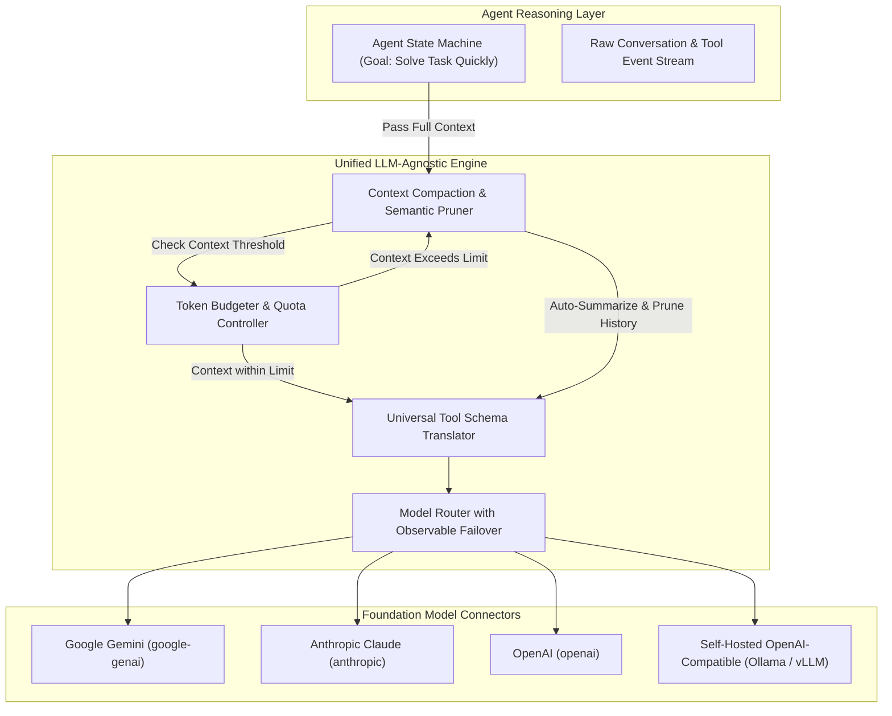

# LLM-Agnostic Interface, Token Management & Auto-Compaction

> **Implementation status (2026-09-02)**: `src/uclone_x/llm/` is fully implemented:
> - `models.py` (the provider-neutral types in §5)
> - `protocols.py` (`LLMProviderProtocol`, `TokenBudgetManagerProtocol`, `ContextCompactorProtocol`)
> - `connectors/` (`base.py`, `anthropic.py`, `gemini.py`, `ollama.py`, `openai.py`,
>   `vllm.py`)
> - `budget.py` (`TokenBudgetManager` with per-provider tracking and fail-fast budget decisions)
> - `compactor.py` (`ContextCompactor` with 70% threshold trigger and sliding-window compaction)
>
> The layer counts tokens only. Cost or price calculation is out of scope for UClone-X:
> `cost.py` (`estimate_cost`, `PRICING_TABLE`) and every cost field and cost ceiling were
> removed on 2026-09-23 (#1392, P5 amendment).
> The provider SDKs are isolated strictly inside `connectors/` modules per Principle 5 and §6.

## 1. Overview & Architectural Role

Per **Principle 5**, UClone-X strictly isolates all token budgeting, model provider switching, rate limiting, and context window compaction into the **LLM-Agnostic Interface Layer**. This is not only an implementation convenience: per [P5](principles/details/p5-llm-token-management.md), the adapter boundary is normative — core agent, tool, and orchestration code may depend only on the provider-neutral types in §5, never on a provider SDK directly, and adding a provider must require changes only inside its connector module.

Agent business logic and tool functions do not count tokens or manage context truncation. The LLM layer handles these infrastructure responsibilities transparently while ensuring maximum reasoning speed and minimal turn latency.

---

## 2. LLM Layer Architecture



---

## 3. Automatic Context Compaction

As agents collaborate and execute multiple tools, message context grows. When context approaches the model's threshold (e.g. 70% of max context window):

1. **Sliding Window + Anchored System State**: Retains the system prompt, agent ontology, and most recent $N$ turns intact.
2. **Semantic Pruning of Intermediate Tool Outputs**: Lengthy tool execution logs (e.g. 500-line file reads or build logs) are compacted into structured key-value summaries.
3. **Observation Compression**: Background summarizer compresses older dialog turns into a concise `"Session Progress Ledger"`.
4. **Bounded Ledger Retention**: A ledger is itself a `SYSTEM` message, so it sits outside everything step 1 and step 2 prune — `keep_recent_turns` is computed over non-`SYSTEM` messages and the tool-output pruner rewrites only `MessageRole.TOOL`. Retaining every prior ledger therefore grew the permanently-resident block by one message per compaction: measured at **939 tokens per pass with no summarizer configured**, which is the default, putting the resident block alone over the 70% trigger of an 8K window in 7 compactions (issue #196). With a summarizer the per-pass rate is not a property of this code but the size of the summary the provider returns — 40 tokens per pass with the mock in `tests/unit/test_llm_compactor.py`, up to roughly 500 under the `max_tokens=500` the compactor sets — so it is unbounded above by the summarizer's verbosity, and the bound cannot be made to depend on a summarizer existing. `ContextCompactor.max_ledgers` (default 2) caps how many ledgers a returned context carries. Dropping one is a real loss — a ledger is the only surviving record of turns already discarded, and a ledger is never fed back into summarization — so the loss is counted on `superseded_ledger_count` / `supersession_reasons`, following `TelemetryTracer.drop_reasons`, and named in band on the replacement ledger. Those counters are **per compactor instance**, not per session: under per-turn construction the cap and the per-pass note stay exact while the running total resets, which is why the note says "by this compactor". `BaseAgent` constructs one compactor **per session** when none is injected (issue #183), so in that default configuration the instance *is* the session accumulator and the two coincide; the note's wording is left as it is because `ContextCompactor` is a public class any caller may drive per turn, and "by this compactor" is the only statement true in every construction pattern. `max_ledgers` is deliberately not exposed through `AgentLLMConfig`: it is unvalidated above, and `max_ledgers=8` reproduces #196 exactly (issue #204), so a configuration surface for it would be a documented route back to the growth #201 bounded.

---

## 4. Token Governance

* **Decoupled Billing**: Token consumption is measured and attributed per-agent, per-session, per-user, **and per-provider** at the LLM layer. Agnosticism at the call boundary (agent code never names a provider) does not mean the accounting is provider-blind: every `TokenUsage` record is tagged with the provider that produced it (see §5), so a quota controller can answer "how many tokens did each provider consume for this session" without any caller having imported that provider's SDK.
* **Token Limits**: Developers set a session token ceiling (`TokenBudget.max_tokens`), and a per-provider token limit can be checked against `per_provider`.
* **No cost**: The layer does not price tokens, estimate monetary cost, or enforce a monetary ceiling. Cost calculation is out of scope for UClone-X (P5, #1392).
* **Observable Failover**: If a primary provider (e.g. Gemini) returns HTTP 429/503, the router falls back to secondary (e.g. Claude), emitting an explicit OpenTelemetry `failover.event` span with zero silent masking of infrastructure state.

---

## 5. Python Adapter Contract (`uclone_x.llm`)

The types and protocols below are transcribed from `src/uclone_x/llm/models.py` and
`src/uclone_x/llm/protocols.py`, not restated from memory. Several of the corrections
from the previous draft were not style choices — the old shape was either
unimplementable or unsafe. The reasoning is kept next to each signature so a later
edit does not reintroduce the defect.

### 5.1 Request and message envelope

```python
class LLMRequest(BaseModel):
    model: str = ""
    messages: tuple[ChatMessage, ...] = ()
    tools: tuple[ToolDefinition, ...] = ()
    temperature: float = 0.7
    max_tokens: int | None = None
    auto_compact: bool = True
    compaction_threshold_tokens: int = 60_000


class ChatMessage(BaseModel):
    role: MessageRole  # StrEnum: system | user | assistant | tool
    content: str | None = None
    name: str | None = None
    tool_call_id: str | None = None
    tool_calls: tuple[ToolCallRequest, ...] = ()
    compaction_ledger: bool = False
```

`LLMRequest` already existed in this document, but no signature consumed it — every
provider method took four loose positional arguments instead. Both provider methods
now take the `LLMRequest` envelope (§5.4); the type is no longer decorative.

`role` is `MessageRole`, a `StrEnum`, not a bare `str` with a comment listing the
four legal values — a comment is not something a type checker enforces.

`compaction_ledger` marks a Session Progress Ledger emitted by `ContextCompactor`
(§3). A ledger carries `role=SYSTEM`, so without the flag a compactor reading its own
prior output cannot tell an artifact it may supersede from the anchored system prompt,
and each pass added one more permanently-resident message (issue #196). It is not a
substitute for the in-band `[Context Auto-Compacted Summary: …]` label, which remains
the provenance a reader sees, and it is not the ledger *kind* — LLM versus heuristic is
carried by `CompactionOutcome.ledger_source` on the return type (§5.6, issue #183). No connector
serialises it: every adapter builds its provider payload from `role`, `content`, `name`,
`tool_call_id` and `tool_calls` explicitly, so the field is not wire-visible.

### 5.2 Token usage and budget

```python
class TokenUsage(BaseModel):
    provider: str  # required — no default
    model: str | None = None
    input_tokens: int = 0
    output_tokens: int = 0
    total_tokens: int = 0
    count_source: TokenCountSource = TokenCountSource.PROVIDER  # or ESTIMATE (#916, #939)


class TokenBudget(BaseModel):
    max_tokens: int = 1_000_000
    used_input_tokens: int = 0
    used_output_tokens: int = 0
    per_provider: Mapping[str, int] = {}  # tokens (input + output) broken out by provider name


class BudgetDecision(BaseModel):
    allowed: bool
    reason: str | None = None
    remaining_tokens: int | None = None
```

**`TokenUsage.provider` is required.** It previously defaulted to `"unknown"`. That
default was not a convenience: usage a connector forgot to attribute did not fail, it
silently aggregated into a bucket literally named `"unknown"` — indistinguishable
from correctly-working per-provider accounting until someone notices that bucket is
the largest one. Making the field required moves that failure to construction time,
where P6 requires it to surface.

That requirement is not confined to `TokenUsage`; it propagates. `ModelResponse.usage`
(§5.3) lost its `default_factory` for the same reason — once `provider` cannot be
defaulted, nothing above it can synthesize a `TokenUsage` for free either, so a
`ModelResponse` can no longer be constructed without a caller stating which
provider's usage it is reporting. This is visible at every construction site, which
is deliberate: it is the enforcement mechanism, not a side effect.

**`count_source` says whether the tokens were counted.** `PROVIDER` means the provider
reported the figures. `ESTIMATE` means it reported no count, or left one out, and the
figures stand in for it (#916, #939). The rule for producing an `ESTIMATE`
is the same in every connector (`connectors/base.py::resolve_token_counts`): a count the
provider reported is used as reported, a count it did not report is estimated from the
request or the reply, and either estimate labels the whole usage. A count left out is
never read as `0`. "Not reported" follows each wire format: Gemini omits zero-valued
fields inside a `usageMetadata` it did send, so there only an absent block is unreported.
A stream that sends no usage at all yields none, and `BaseAgent._invoke_model` labels its
own estimate. The budget ceiling books an estimate like a count and names it in a refusal.
The design
record, with the alternatives rejected and the estimator's error, is
`unified-conversations-and-room-ui.md` §6.7.

**`TokenBudget` carries `per_provider` token counts.** P5 requires "decoupled per-provider
quota tracking." A single pair of session-wide counters cannot express that — a
session that calls two providers would have no way to attribute tokens to either one.
`per_provider` is what makes a per-provider ceiling askable at all (see
`TokenBudgetManagerProtocol.check_budget` in §5.5, which takes an optional
`provider`).

**`check_budget` returns `BudgetDecision`, not `bool`.** A bare `bool` can say a call
is refused but not *why* — which ceiling was hit, session or provider. P6 forbids an unexplained refusal as much as it forbids a silent fallback;
`reason` (plus the remaining headroom) is what lets a caller act on the refusal
instead of merely being stopped by it.

### 5.3 Response and provenance

```python
class FinishReason(StrEnum):
    STOP = "stop"
    LENGTH = "length"
    TOOL_CALLS = "tool_calls"
    CONTENT_FILTER = "content_filter"
    ERROR = "error"


class ModelResponse(BaseModel):
    content: str | None = None
    tool_calls: tuple[ToolCallRequest, ...] = ()
    usage: TokenUsage  # required — no default, no default_factory
    finish_reason: FinishReason = FinishReason.STOP
    model_name: str = "unknown"
    provenance: Provenance | None  # required field; `None` is a legal value


class StreamChunk(BaseModel):
    delta_content: str | None = None
    tool_calls: tuple[ToolCallRequest, ...] = ()
    usage: TokenUsage | None = None
    finish_reason: FinishReason | None = None
```

`FinishReason` is an enum, not a string documented by a comment — the same reasoning
as `MessageRole` in §5.1: an enum is checked, a comment is not.

**`provenance` is `Provenance | None` with no default**, per
`src/uclone_x/core/provenance.py`. This single field carries two distinct rules, and
both matter:

* *Absence stays representable.* `None` is a legal value so that a response
  deserialized from a peer, or produced by a component that predates provenance, can
  be recognized as non-conformant and rejected by `require_provenance()`. A field
  that disallowed `None` could not carry that information at all — there would be no
  way to distinguish "no provenance" from a validation error.
* *Absence is never inherited.* There is no default — `None` included. A producer
  must write the field explicitly. A default of `None` would look, to every existing
  caller, identical to a deliberate "I checked, and there is nothing to report,"
  which is exactly the default-masquerading-as-a-real-answer that Principle 6 exists
  to forbid. The type enforces "absence is a violation, not a default" instead of
  leaving it to convention.

`Provenance.degraded` is a `computed_field`, derived from `requested != served_by`
rather than independently settable. That closes a specific hole: if `degraded` were
an ordinary field, a producer could honestly set `path=FAILOVER` while still writing
`degraded=False`, reporting a substituted result as clean — deliberately or by a copy-
paste mistake. Deriving it removes the ability to do that at all.

**Deriving it is only half the job: a connector must give it two different inputs.**
`requested` names what the connector asked the provider for; `served_by` names what the
provider's response says it ran. All four HTTP connectors used to read `model_name` off
the response and pass it to `Provenance.primary(provider, model=model_name)`, which sets
both sides to the served name — so `degraded` computed `False` however far the served
model had drifted from the requested one, and a `computed_field` derived from two equal
inputs reports nothing (issue #149). They now pass both:

```python
requested_model = request.model or "gpt-4o"  # what we asked for
model_name = str(data.get("model", requested_model))  # what answered
provenance = Provenance.primary(provider="openai", model=requested_model, served_model=model_name)
```

This is the case P6 singles out — "a model swap changes tool-calling behaviour, output
formatting, and determinism, so an agent mid-plan may continue under assumptions that no
longer hold". A provider resolving `gemini-1.5-pro` to `gemini-1.5-pro-002` stays
`path=primary` (one call, nothing failed, no failover to announce) and reports
`degraded=True`. Where nothing is read back from the response, omit `served_model` and
`served_by` is identical to `requested`.

### 5.4 Provider protocol

```python
class LLMProviderProtocol(Protocol):
    @property
    def provider_name(self) -> str: ...

    async def generate(self, request: LLMRequest) -> ModelResponse: ...

    def stream(self, request: LLMRequest) -> AsyncIterator[StreamChunk]: ...
```

There is one streaming method, `stream`, not `generate_stream`, and it is declared
`def`, not `async def`. This is not a naming change — the previous declaration,

```python
async def generate_stream(self, request: LLMRequest) -> AsyncIterator[Dict[str, Any]]:
```

did not describe a streaming API at all. An async generator — a function body
containing `yield`, called to obtain something you iterate with `async for` — is, by
Python's own execution model, a plain (non-async) function that *returns* an async
generator object. Declaring the function itself `async def` instead makes calling it
produce a coroutine, and Python does not allow a function to be both a coroutine
function and an async generator function — so no async generator could ever be
written to satisfy that signature. Any caller, in turn, would have had to `await`
the call before it could even begin to iterate, which defeats the point of
streaming. `def stream(...) -> AsyncIterator[StreamChunk]` is the correct shape: a
plain function whose body may itself be an async generator, returning the iterator
directly and ready for `async for` with no leading `await`.

`generate` and `stream` both take the `LLMRequest` envelope (§5.1) and return
`ModelResponse` / `StreamChunk` (§5.3) — no `Dict[str, Any]` anywhere in the
signature. `Dict[str, Any]` is exactly the untyped shape P8 forbids in a provider
contract: it type-checks over any payload, including one with a missing or malformed
`usage`, so budget tracking would trust whatever a connector handed it instead of a
structurally validated `TokenUsage`.

### 5.5 Budget and compaction protocols

```python
class TokenBudgetManagerProtocol(Protocol):
    def check_budget(self, session_id: str, provider: str | None = None) -> BudgetDecision: ...
    def record_usage(self, session_id: str, usage: TokenUsage) -> None: ...
    def get_budget(self, session_id: str) -> TokenBudget | None: ...


class ContextCompactorProtocol(Protocol):
    keep_recent_turns: int

    def estimate_tokens(self, messages: Sequence[ChatMessage]) -> int: ...
    def should_compact(self, messages: Sequence[ChatMessage], context_limit: int) -> bool: ...
    async def compact(self, messages: Sequence[ChatMessage]) -> CompactionOutcome: ...
```

`compact` returns `CompactionOutcome` (§5.6), not a bare `tuple[ChatMessage, ...]`. The
bare tuple left a caller unable to say which producer wrote the ledger it received,
because the summarization path signals "no LLM ledger" identically whether no summarizer
is configured or a configured one returned empty content. A compaction is a result
crossing a component boundary and an LLM-written ledger is a value a model produced, so
P6 requires it to carry attribution — and the only component that knows which path ran is
the compactor (issue #183).

`estimate_tokens` and `keep_recent_turns` are declared because `should_compact` is
defined in terms of the estimate and the recent window is the boundary a ledger
summarizes up to. A caller reporting how much a compaction saved must use the *same*
estimator the trigger used; one that re-implements it behind a `hasattr` probe reports
savings computed by a different algorithm than the one that decided to compact.

The estimate is `uclone_x.llm.compactor.estimate_message_tokens`, built on
`estimate_text_tokens`: one token per four UTF-8 bytes, plus four tokens of framing per
message and per tool call. The connectors use the same estimator
(`estimate_request_tokens`, `estimate_reply_tokens`) for a count the provider did not
report (§5.2). The estimator counts bytes and not characters because byte-level BPE
tokenizers merge bytes. Latin text is one byte a character, so its figure is the one the old
`(len + 3) // 4` gave, and a Hangul syllable, three bytes, is no longer undercounted
threefold (#939). It is a point estimate, not a bound. `BaseAgent._estimate_stream_usage`,
which the agent uses when a stream sent no count, calls the same `estimate_request_tokens`
and `estimate_reply_tokens` over the request and over the reply text and tool calls the
stream carried, so a watched step and a headless step are estimated alike (#980).
`keep_recent_turns` is a plain attribute rather than a read-only `@property` because
implementations subclass this protocol explicitly, so a protocol-level property is
inherited and `ContextCompactor.__init__` assigning it would raise.

`record_usage` attributes tokens to `usage.provider`, which is why §5.2 makes that
field mandatory rather than optional: a method that trusts an attribution the type
system does not require is not actually enforcing per-provider accounting, only
hoping for it.

---

### 5.6 Compaction outcome

```python
class LedgerSource(StrEnum):
    NONE = "none"  # no ledger written: dialogue within keep_recent_turns
    LLM = "llm"  # a configured summarizer produced the text
    HEURISTIC = "heuristic"  # the compactor's own ledger builder produced it


class CompactionOutcome(BaseModel):
    messages: tuple[ChatMessage, ...] = ()
    ledger_source: LedgerSource  # required — no default
    superseded_ledger_count: int = 0
    provenance: Provenance | None  # required — no default
```

What one `compact` pass produced. `ledger_source` has no default because a defaulted
source would let an unattributed ledger pass as a heuristic one, which is the whole
distinction the type exists to carry.

**Attribution is built by the compactor, not by its caller.** On the `LLM` path the
`provenance` is the summarizer's own `ModelResponse.provenance` **forwarded verbatim**,
including a `None` — naming `uclone_x.llm.compactor` as the server of text a model
produced would turn "not stated" into a positively asserted clean result, the same
reason `BaseAgent.execute_turn` refuses to synthesize one for a model reply. On the
`HEURISTIC` and `NONE` paths the compactor is genuinely the producer: a local execution
of the declared algorithm rather than a substitution for a failed provider call, so it
attributes as `path=primary` with `requested == served_by` and `degraded` computing
`False`, `served_by=uclone_x.llm.compactor/heuristic-ledger` and
`.../tool-output-pruner` respectively.

One case is deliberately left as it stands and reported rather than changed: a
*configured* summarizer that returns empty content still falls back to the heuristic
ledger. That fallback is now at least **attributable** — the outcome says `HEURISTIC`
and carries the compactor's own provenance, so it is no longer silent. Whether an empty
provider response should instead propagate as a failure under P6 is a question about the
compaction algorithm rather than about the agent wiring, and is filed separately.

The Core's session-level counterpart is `uclone_x.agent.session.CompactionResult`, which
adds the session id, the reason the pass ran, and message and token counts before and
after. The split is the P5 boundary rather than duplication: the LLM layer answers "what
did this pass produce and who produced it", the Core answers "what did this do to the
session". Token counts there come from this layer's `estimate_tokens`, never from a
reimplementation — a saving computed by a different estimator than the one that decided
to compact is not a measurement of anything.

## 6. Import Boundary (Enforceable)

This is the falsifiable half of P5's agnosticism requirement — the part a reviewer or
a lint rule can actually check, not a slogan:

* Provider SDKs (`anthropic`, `openai`, `google-genai`, `ollama`, or any future
  provider package) are importable **only** inside `uclone_x.llm.connectors.<provider>`
  modules that implement `LLMProviderProtocol` (§5.4).
* No engine, agent, tool, or orchestration module may import a provider SDK, branch
  on a provider name string, or accept/return a provider-native type in a public
  signature. The only types permitted to cross that boundary are the ones in §5:
  `LLMRequest`, `ChatMessage`, `ToolDefinition`, `ToolCallRequest`, `ModelResponse`,
  `StreamChunk`, `TokenUsage`, `TokenBudget`, and `BudgetDecision`.
* A conforming new provider implements its **wire protocol** entirely inside one new
  connector module — the containment rule above, which does hold: `connectors/vllm.py`
  imports no SDK. It does not implement its **registration** there, and cannot: files
  outside `uclone_x.llm.connectors.*` hold facts a connector has no way to state about
  itself. Three groups, measured against #1304, which added vLLM in 28 files:
  * **Load-bearing** — the provider does not work, or the gate does not pass, without each.
    `llm/connectors/factory.py` (how the provider is named and auto-detected);
    `tests/fitness/test_core_shell_boundaries.py`, which classifies connector
    modules by name, so an undeclared one falls to `llm/`'s kernel default and its
    `openai.py` import reads as kernel → adapter; and `tests/conftest.py`, whose scrub list
    must hold every variable that *selects* a provider, or a developer who exported their
    own endpoint changes what each unconfigured-environment test resolves to. At #1304 this
    group also held `llm/cost.py`, the price table; it was removed with cost calculation (#1392).
  * **Re-exports** — `llm/__init__.py` and `llm/connectors/__init__.py`. Convention, not
    enforcement: every caller in-tree imports the connector module directly.
  * **Enumerations** — the places that list providers in prose or help text. Each one is
    wrong the moment a provider is added, and none of them fails a test: `cli/main.py`'s
    `--provider` help, `cli/commands/llm.py`'s group help, `ui/app.py` and
    `frontend/src/components/SettingsModal.tsx`, the live-suite refusals under
    `evals/suites/`, `scripts/eval_*.py`, `README.md`, `docs/cli-specification.md`, the
    public snapshot's own status table and `.env.example`, and this document — §2's diagram
    and the status block above it were both stale until #1304.
  The checkable claim is **not** a file count, and a reviewer told to expect one files a
  false finding: #1304's own diff is 28 files, not five. It is that **the load-bearing group
  is fixed and does not grow per provider** — a *new kind* of load-bearing file in a
  provider's diff is the finding — and that **an enumeration a provider makes wrong is
  either corrected in the same change or pinned by a test that derives the list from the
  code**. One is: `cli/main.py`'s help, since #1304, by
  `test_the_provider_option_help_names_every_provider_an_installation_can_be_set_to`, which
  reads the accepted names out of `create_llm_connector`'s refusal. The rest are not, which
  is why they go stale.
* `./ucx test check` enforces this with static typing and linting checks (Ruff and Pyright strict) verifying that provider SDK imports remain strictly contained inside `uclone_x.llm.connectors.*`.

---
