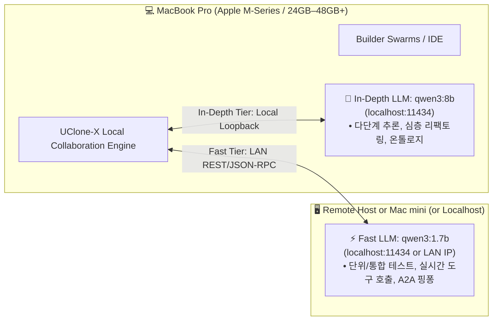

# Local Development & Local LLM Guide ($0 Testing Architecture)

This document provides a comprehensive guide for setting up, automating, and running local LLM-powered development and verification in **UClone-X** with zero cloud API costs.

---

## 1. Executive Architecture: 2-Tier Local LLM Setup

UClone-X employs a **2-Tier Local LLM Topology** to achieve sub-second agent turn responses, high-precision tool calling, and zero-cost regression testing.



### Model Specifications & Roles

| Tier | Host Machine | Model | Footprint | Speed | Primary Roles |
| :--- | :--- | :--- | :---: | :---: | :--- |
| **⚡ Fast Tier** | **Mac mini**<br>`http://192.0.2.10:11434` | `qwen3:1.7b` | ~1.4 GB | **~70–90 tok/s** | • 실시간 턴 루프 (`INGESTING` ➔ `CALLING_TOOL` ➔ `EMITTING_RESPONSE`)<br>• 기본 도구 호출 인자 정합성 검증<br>• A2A 분산 메시지 라우팅 |
| **🧠 In-Depth Tier** | **MacBook Pro**<br>`http://localhost:11434` | `qwen3:8b` | ~5.2 GB | **~35–50 tok/s** | • 복잡한 다단계 도구 체이닝 및 계획(Planning)<br>• LinkML 온톨로지 스키마 추론 및 정합성 검증<br>• 심층 코드 분석 및 에이전트 리팩토링 |
| **🚀 Production** | **Cloud APIs** | Gemini 2.5 Pro / Flash<br>Claude 3.7 Sonnet | N/A | Variable | • 최종 릴리즈 및 대규모 외부 프로덕션 워크플로우 |

> [!NOTE]
> **Empirical Validation (2026-09-04)**: Earlier configurations referenced `qwen2.5-coder:7b` and `qwen2.5-coder:14b`. Empirical evaluation against the 42-probe battery demonstrated that neither `qwen2.5-coder` model emits native tool calls (they emit JSON text into `content` with empty `tool_calls` and `finish_reason=stop`, violating P6).
>
> Following benchmark evaluations:
> 1. **Fast Tier**: `qwen3:1.7b` scored **39/42** (Base 24/24, p50 0.79s) — documented in the local-model tool-calling evaluation note.
> 2. **In-Depth Tier**: `qwen3:8b` scored **39/42** (Base 24/24, p50 2.4s), cleanly outperforming `qwen2.5:7b-instruct` (36/42, Base 18/24) on code tracing and multi-step reasoning — documented in the in-depth local-model candidate report.
>
> Both slots are verified and active as default runtime configurations in `.env.example` and `src/uclone_x/llm/connectors/ollama.py`.

---

## 2. Hardware Requirements & Single MacBook Pro Execution

Can you run both `qwen3:1.7b` and `qwen3:8b` on a single MacBook Pro? **Yes, absolutely.**

Apple Silicon utilizes a high-bandwidth **Unified Memory Architecture (UMA)** where GPU and CPU share the same memory pool. Both models can be concurrently loaded into VRAM without swapping.

### 2.1 Memory Footprint & Resource Matrix

| Model | Parameter Size | Quantization | VRAM Footprint (incl. 40K KV Cache) | Target Speed (Apple Silicon) |
| :--- | :---: | :---: | :---: | :---: |
| ⚡ **`qwen3:1.7b`** (Fast) | 2.0B | Q4_K_M | **~2.2 GB** | 120–150+ tokens/s |
| 🧠 **`qwen3:8b`** (In-Depth) | 8.2B | Q4_K_M | **~7.5 GB** | 45–60+ tokens/s |
| **Combined (Concurrent)** | **10.2B** | - | **~9.7 GB** | Zero-swap simultaneous |

### 2.2 MacBook Pro Compatibility Tier List

* **16 GB Unified Memory (M1/M2/M3/M4/M5)**:
  * Can run either model individually with automatic on-demand swapping.
  * Recommended: Set `OLLAMA_MODEL="qwen3:1.7b"` for rapid single-turn execution.
* **24 GB ~ 36 GB Unified Memory**:
  * Comfortably runs both models concurrently with ~14–26 GB headroom for macOS, Docker, and IDE.
* **48 GB ~ 128 GB Unified Memory (Apple M-Series Pro / Max)**:
  * **Optimal Developer Setup**: Both models reside permanently in memory with >35 GB remaining for concurrent multi-agent builder swarms, Playwright E2E suites, and heavy local builds.

### 2.3 Ollama Dual-Model Concurrent Residency Setup

By default, Ollama unloads idle models or swaps between models sequentially. To eliminate model-swap latency and enable instant switching between the Fast tool loop and In-Depth reasoning:

```bash
# 1. Stop any running Ollama instances
killall ollama 2>/dev/null || true

# 2. Launch Ollama with concurrent model residency and zero idle unloading
export OLLAMA_MAX_LOADED_MODELS=2
export OLLAMA_KEEP_ALIVE="-1"

ollama serve
```

* **`OLLAMA_MAX_LOADED_MODELS=2`**: Instructs Ollama to keep both `qwen3:1.7b` and `qwen3:8b` active in unified VRAM simultaneously.
* **`OLLAMA_KEEP_ALIVE="-1"`**: Disables automatic idle eviction, keeping both models warm and ready for sub-second responses.

**Export `OLLAMA_KEEP_ALIVE` where UClone-X runs too.** UClone-X sends `keep_alive` with every chat request, and a request's value overrides the daemon's own setting. It sends the value of `OLLAMA_KEEP_ALIVE` from its own environment (`-1`, a number of seconds, or a duration such as `1h`). When that is unset it sends `30m`, the default in `src/uclone_x/llm/connectors/ollama.py`. So with `-1` set only in the shell that runs `ollama serve`, models are unloaded after 30 idle minutes.

**Context window.** Left to itself, Ollama loads a model with a window chosen from the machine's memory -- 4096 tokens on a GPU with under 24 GB -- which one persona's instructions alone can fill. So UClone-X asks for 16384 tokens (`num_ctx`). An agent's own `context_limit` is sent instead when it sets one. Otherwise, `OLLAMA_CONTEXT_LENGTH` is sent when it is set to a positive number in the environment UClone-X runs in. As with `OLLAMA_KEEP_ALIVE`, export it there, not only for `ollama serve`. A model trained for a smaller window is loaded at that smaller window; UClone-X reads the window the daemon actually serves and compacts a conversation before it fills it.

---

## 3. Automated Installation & One-Click Setup

UClone-X provides built-in CLI automation through `./ucx` to inspect, download, and configure local models.

### Step 1: Environment & Pre-commit Hook Setup
```bash
./ucx setup
```
* Installs Git pre-commit quality gate (`.git/hooks/pre-commit`).
* Configures Python 3.11+ virtual environment paths.

### Step 2: Configure Environment Variables
Copy `.env.example` to `.env`:
```bash
cp .env.example .env
```
Default values for 2-Tier setup are pre-configured:
```bash
# Fast Tier (Mac mini)
OLLAMA_FAST_BASE_URL="http://192.0.2.10:11434/v1"
OLLAMA_FAST_MODEL="qwen3:1.7b"

# In-Depth Tier (Local MacBook Pro)
OLLAMA_INDEPTH_BASE_URL="http://localhost:11434/v1"
OLLAMA_INDEPTH_MODEL="qwen3:8b"
```

### Step 3: Verify LLM Connectivity
```bash
# Test Mac mini Fast Tier
curl -s http://192.0.2.10:11434/api/tags

# Test Local In-Depth Tier
curl -s http://localhost:11434/api/tags
```

---

## 4. Testing Methodology: 3-Layer Testing Strategy

```text
┌─────────────────────────────────────────────────────────────────────────────┐
│ 1. Deterministic Unit Tests (Mock)  ➔ ./ucx test check (0 cost, 0.2s)      │
├─────────────────────────────────────────────────────────────────────────────┤
│ 2. Live Local Integration Tests    ➔ Ollama 1.7B / 8B ($0 cost, real tokens)│
├─────────────────────────────────────────────────────────────────────────────┤
│ 3. Production E2E Benchmark        ➔ Gemini / Claude Cloud APIs            │
└─────────────────────────────────────────────────────────────────────────────┘
```

1. **Layer 1: Deterministic Unit Tests (`./ucx test check`)**:
   - Always uses `MockLLMProvider` which returns pre-baked `ModelResponse` objects and token counts.
   - Runs in **0.2 seconds** without loading any GPU weights or consuming network bandwidth.
   - Enforces Ruff formatting, Pyright strict typing, and **>= 70% branch coverage**.

2. **Layer 2: Local Live Verification (`./ucx run`)**:
   - Uses `OllamaConnector` pointing to Fast Tier (`qwen3:1.7b`) on Mac mini (or local) or In-Depth Tier (`qwen3:8b`) on MacBook Pro.
   - Tests genuine tool calling, JSON schema generation, and multi-turn prompt reasoning with **$0 API cost**.

3. **Layer 3: Cloud Production Deployment**:
   - Seamlessly switched via `uclone_x.llm` provider routing when `GEMINI_API_KEY` or `ANTHROPIC_API_KEY` is present.

---

## 5. Mac mini Remote Daemon & Power Management (24/7 Always-On)

To operate an auxiliary Mac mini (Apple Silicon) as an always-on 24/7 Fast Tier LLM node, both the Ollama server and macOS host power management must be properly configured so the node never enters system sleep or disconnects from the LAN.

### 5.1 Launching the Ollama Remote Daemon
Ensure Ollama binds to all network interfaces (`0.0.0.0`) so other machines on the LAN can reach port 11434:

```bash
# SSH into Mac mini
ssh macmini

# Launch Ollama with LAN binding (0.0.0.0:11434)
OLLAMA_HOST=0.0.0.0:11434 nohup /Applications/Ollama.app/Contents/Resources/ollama serve > /tmp/ollama.log 2>&1 &
```

### 5.2 Host Sleep Prevention (`pmset` & `caffeinate`)
By default, macOS will enter system sleep after idle timeout, which halts Ollama inference requests and drops incoming LAN socket connections.

#### Option A: Persistent System-Level Power Management (`pmset`)
Run the following configuration on the Mac mini to disable system sleep while allowing the display to sleep:
```bash
# Disable system sleep, set display sleep to 15m, and enable Wake-on-LAN
sudo pmset -a sleep 0 displaysleep 15 womp 1
```
* `sleep 0`: Disables system sleep completely.
* `displaysleep 15`: Allows the monitor/display to sleep after 15 minutes to conserve power.
* `womp 1`: Keeps Ethernet/Wi-Fi active for Wake-on-LAN / Magic Packets.

To inspect current power management settings:
```bash
pmset -g
```

#### Option B: Foreground / Session Sleep Prevention (`caffeinate`)
For ad-hoc tasks or temporary sleep prevention without root access:
```bash
# Prevent system and idle sleep in background
caffeinate -s -i &
```
* `-s`: Prevents system sleep on AC power.
* `-i`: Prevents idle system sleep.

### 5.3 Persistent LaunchAgent Across Reboots
To ensure sleep prevention is automatically active upon system boot and survives reboots, install a user-level LaunchAgent on the Mac mini.

1. Create the LaunchAgent configuration file at `~/Library/LaunchAgents/com.uclone.caffeinate.plist`:

```xml
<?xml version="1.0" encoding="UTF-8"?>
<!DOCTYPE plist PUBLIC "-//Apple//DTD PLIST 1.0//EN" "http://www.apple.com/DTDs/PropertyList-1.0.dtd">
<plist version="1.0">
<dict>
    <key>Label</key>
    <string>com.uclone.caffeinate</string>
    <key>ProgramArguments</key>
    <array>
        <string>/usr/bin/caffeinate</string>
        <string>-s</string>
        <string>-i</string>
    </array>
    <key>RunAtLoad</key>
    <true/>
    <key>KeepAlive</key>
    <true/>
    <key>StandardOutPath</key>
    <string>/tmp/caffeinate.log</string>
    <key>StandardErrorPath</key>
    <string>/tmp/caffeinate.err</string>
</dict>
</plist>
```

2. Load and register the LaunchAgent:
```bash
launchctl load ~/Library/LaunchAgents/com.uclone.caffeinate.plist
```

3. (Optional) To unload or stop the LaunchAgent:
```bash
launchctl unload ~/Library/LaunchAgents/com.uclone.caffeinate.plist
```

---

## 6. Summary of Best Practices

* **Always run `./ucx test check` before any Git commit.**
* **Use Fast Tier (`qwen3:1.7b`) for high-frequency interactive testing and rapid tool-calling loops.**
* **Use In-Depth Tier (`qwen3:8b`) when validating complex multi-agent planning, self-healing, or LinkML schema induction.**
* **On Apple Silicon, launch Ollama with `OLLAMA_MAX_LOADED_MODELS=2 OLLAMA_KEEP_ALIVE="-1" ollama serve` for seamless zero-swap dual-model execution.**
* **Adhere to canonical runtime terminology**: Differentiate between external interaction turns and internal agent steps per [`docs/guides/agent-runtime-terminology.md`](guides/agent-runtime-terminology.md).

---

## 7. Related Developer Guides & Specifications

* [Agent Runtime Terminology Guide (Turn, Step, Iteration)](guides/agent-runtime-terminology.md)
* Meta-Agent Multi-Agent Development Guide
* [Core Principles](principles/core-principles.md)
* Quality Testing & Evaluation Guide
