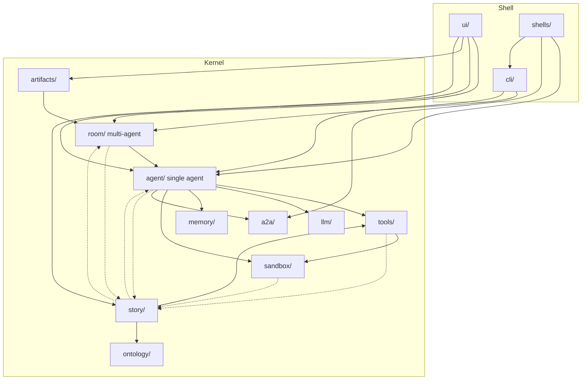

# Module Structure (as built)

> [!NOTE]
> **This document describes the code on `main`, not a design.** It was measured at
> `a42a62d1` (2026-09-26). Every figure below names the command that produced it, so it can
> be re-measured rather than trusted; when the code and this page disagree, the code is right
> and this page is stale. The layering *rule* is specified in
> core-shell-architecture.md §4; the layer each module belongs
> to is declared, and enforced, by
> `tests/fitness/test_core_shell_boundaries.py`.

## 1. The three layers

The runtime is one Python package, `src/uclone_x/`, and one React head, `frontend/`. The
Python package is split into three layers by one question — *does this module touch the
world?* — and imports may only point downward.

```text
 ┌─ SHELL ── owns the process, config and the inbound surface ─────────────────┐
 │  ui/        FastAPI backend of the web head (app.py, rooms.py, room_dock.py, │
 │             artifacts.py, clones.py, knowledge.py)                           │
 │  cli/       `ucx` commands (run, room, loop, a2a, acp, eval, llm, skill …)   │
 │  shells/    entry.py (console script), a2a_server.py, acp/, ui_process.py    │
 │  + single modules: room/resolver.py, room/a2a_handlers.py,                   │
 │    llm/connectors/factory.py, evaluation/answerer.py                         │
 ├─ ADAPTER ── implements a kernel protocol against something real ───────────┤
 │  llm/connectors/*   tools/builtin/*   sandbox/{path_validator,               │
 │  workspace_runner}  telemetry/{otlp,langfuse,otel_sdk,exporter}             │
 │  memory/store  room/store  room/seat_knowledge_import  story/{library,…}    │
 │  artifacts/library  core/{log_writer,logging_setup,failure_journal,…}       │
 │  ontology/{engine,reasoner,rules,justification}  code_intel/  adapters/     │
 ├─ KERNEL ── pure Python; contracts, models, decisions ──────────────────────┤
 │  multi-agent   room/        orchestrator, selectors, service, protocols     │
 │  single agent  agent/       base, composition, session, loop/, prompts      │
 │  domain        story/  artifacts/                                           │
 │  subsystems    llm/ tools/ sandbox/ memory/ ontology/ skills/ a2a/ acp/     │
 │                telemetry/ log/ evaluation/ i18n/                            │
 │  foundation    core/  engine/  errors.py                                    │
 └──────────────────────────────────────────────────────────────────────────────┘
         imports flow downward only ▼        frontend/ ──HTTP/WS──▶ ui/
```

Inside the kernel the rows above are an **intended** order (foundation at the bottom,
multi-agent on top). Nothing enforces it yet; §5 lists the known departures at package level.

## 2. Package inventory

Default layer per package, from `PACKAGE_LAYERS` in the fitness test; single-module
exceptions are in its `MODULE_LAYERS`.

| Package | Layer | Responsibility |
| :--- | :---: | :--- |
| `core/` | K | Cross-subsystem contracts: `Host`, capabilities, `SessionStoreProtocol`, workspace, secrets, provenance, immutable mappings. A few file-bound modules are adapters |
| `engine/` | K | In-process event bus (`AgentEvent`, `EventBus`); `mattermost_bridge.py` is an adapter |
| `errors.py` | K | The one exception root every package imports |
| `llm/` | K | Provider-neutral models, router, token budget, compaction, catalog; `connectors/` are the provider adapters |
| `tools/` | K | `BaseTool`, registry, host binding (`tool_binder`), MCP manager; `builtin/` are the concrete tools |
| `sandbox/` | K | Isolation models and policies; `path_validator.py` and `workspace_runner.py` are adapters. Container and WASM levels exist as models only |
| `memory/` | K | Cross-session memory and retrieval; `store.py` is the file adapter |
| `ontology/` | K | LinkML schemas and validation; engine and reasoner are adapters |
| `skills/` | K | `SKILL.md` packages; auditor and synthesizer are adapters |
| `a2a/`, `acp/` | K | A2A wire models and in-memory transport (`http_transport.py` is an adapter); ACP conformance registry. The servers live in `shells/` |
| `telemetry/`, `log/` | K | In-memory tracer and metrics; session log ordering. Exporters and file readers are adapters |
| `evaluation/`, `i18n/` | K | Evaluation backend seam (protocols, no suites); user-facing language selection |
| **`agent/`** | K | **One agent.** `BaseAgent` (the six-stage state machine), `compose_agent` (the composition root; see §4 for the one exception), its tool catalog (`tool_invoker`), sessions, prompts, persona bootstrap, recurring `loop/` |
| **`room/`** | K | **Many agents.** A shared transcript over agents that keep separate sessions: `RoomOrchestrator` gives the floor, `selectors.py` picks the next speaker, `service.py` owns the room lifecycle |
| `story/`, `artifacts/` | K | The writing domain: which story a conversation has open, and the files clones wrote. Most `story/` modules and `artifacts/library.py` are adapters |
| `code_intel/`, `adapters/` | A | Tree-sitter / SCIP code intelligence; the uclone2 integration |
| **`ui/`**, `cli/`, `shells/` | S | **The heads.** Web backend, `ucx` CLI, and the A2A / ACP servers |

## 3. Dependency direction between packages

Selected edges, chosen to show the agent / multi-agent / UI structure. Every edge drawn is
real (any `import uclone_x.<pkg>` from another package, including deferred and
`TYPE_CHECKING` imports), but not every real edge is drawn: foundation packages (`core`,
`errors`, `engine`) are left out, as are many subsystem-to-subsystem edges and most of what
`ui/` and `cli/` import. The script below prints the full set.



Solid edges follow the intended order. Dotted edges are departures §5 lists; the edges from
`core/` and `errors.py` upward (§5 item 2) are left out with the rest of the foundation.

<details>
<summary>Re-measure the package edges</summary>

```bash
python3 - <<'EOF'
import ast, pathlib, collections
src = pathlib.Path("src/uclone_x"); edges = collections.defaultdict(set)
for f in src.rglob("*.py"):
    rel = f.relative_to(src); pkg = rel.parts[0].removesuffix(".py")
    for n in ast.walk(ast.parse(f.read_text())):
        mods = [a.name for a in n.names] if isinstance(n, ast.Import) else \
               [n.module] if isinstance(n, ast.ImportFrom) and n.module and not n.level else []
        for m in mods:
            p = m.split(".")
            if p[0] == "uclone_x" and len(p) > 1 and p[1] != pkg:
                edges[pkg].add(p[1])
for k in sorted(edges): print(f"{k:12} -> {', '.join(sorted(edges[k]))}")
EOF
```

</details>

## 4. Agent, multi-agent and UI boundaries

**UI ↔ runtime.** No kernel or adapter module imports `ui/`, `cli/` or `shells/`; the fitness
test fails on the first one that does. `frontend/` reaches the runtime only over HTTP and
WebSocket. Inside `frontend/src/`, `ui-kit/` is kept liftable into another head by an
allow-list rule (`lib/kitBoundary.ts`: React and the kit itself, nothing else).

**Single agent ↔ multi-agent.** The direction is one-way: `room/` imports `agent/`, and
`agent/` never imports `room/`. The orchestrator programs against `BaseAgentProtocol`, not
the concrete `BaseAgent`, and every agent — whether a CLI run, a web conversation, a room
seat or an A2A peer call — is built by `agent.composition.compose_agent`. The one exception
is the evaluation answerer (`evaluation/answerer.py`, a shell module), which constructs
`BaseAgent` directly.

There are two multi-agent paths, and they are different things:

| Path | Where | Shape |
| :--- | :--- | :--- |
| Room | `room/` | Peers in one shared conversation; the orchestrator decides who speaks |
| Sub-agent / A2A | `tools/builtin/subagent.py`, `tools/builtin/a2a.py`, `a2a/` | One agent delegating a task to another as a tool call |

**Where each head's routes live.** `ui/rooms.py`, `ui/room_dock.py`, `ui/artifacts.py` and
`ui/clones.py` are thin route modules. The single-agent conversation, settings, model
management and diagnostics routes are all still in `ui/app.py`.

## 5. Known departures

Each item is an edge or a size that disagrees with §1. The fitness test's `ACCEPTED_EDGES`
list is the ratchet for layer violations; the items below that are *inside* the kernel are
not covered by it, because the test compares layers, not rows within one layer.

1. **The writing domain reaches into the core.** No longer through the story's movement:
   since #1732 a composed lifecycle hook moves it (`agent/clone_builder.py` is the one
   `agent/` module importing `story`), and since #1775 the room keeps `TurnResult.story_id`
   rather than importing `story.story_after` (2026-09-27). Still: `tools/registry.py` and
   `tools/builtin/character.py` import story tools; `sandbox/story_jail.py` imports `story.schemas` (deferred to break a cycle,
   as its comment says). The mechanism is generic — a tool declares `opens_story` — but the
   names and imports are story-specific, so a second domain would edit the same places.
2. **Kernel cycles and upward edges.** Package-level cycles: `room ⇄ story` (`story/view.py`
   imports `room.service`), `agent ⇄ story` (`story/__init__.py` imports `agent.models` under
   `TYPE_CHECKING`), and `tools ⇄ story`. The foundation row also imports upward:
   `core → llm, sandbox, tools, telemetry` (`core/host.py` bundles their protocols into
   `Host`) and `errors → agent` (`TYPE_CHECKING` only). `core → agent` and `llm → agent` are
   gone (#1734): `tests/fitness/test_core_shell_boundaries.py` fails on any such import, at
   any scope and relative imports included, and accepts none.
3. **Session ownership.** Since #1734 the session model is in `core/`: the path helpers and
   id rule in `core/session.py`, `SessionState` and its anchor and snapshot types in
   `core/session_state.py`, and the persona, LLM-config and plan models it carries in
   `core/models.py`. `agent/session.py` and `agent/models.py` re-export them under their old
   names, and `agent/session.py` keeps the file-backed `SessionStore`. `room/service.py` takes
   the id rule from `core/session.py`; `room/store.py` still
   imports `resolve_session_path` through `agent/session.py`.
4. **Eager re-exports.** About half of `ACCEPTED_EDGES` is a package `__init__.py`
   re-exporting its own adapters, which is why importing `uclone_x.agent` loads provider
   connectors and OTLP exporters.
5. **Large modules.** `ui/app.py` is several thousand lines
   (`wc -l src/uclone_x/ui/app.py`). `agent/base.py` was the other one until #1736 split
   `BaseAgent` into collaborators behind it as a facade. Moved: the tool catalog
   (held, advertised, bound and resolved tools, and `search_tools`) to
   `agent/tool_invoker.py`; running one tool call (hooks, approval, range and
   persona-flag refusals, the plan tool) to `agent/tool_execution.py`; the context
   sections, turn layers and request record to `agent/prompt_assembler.py`; and the
   evidence, grounding and artifact nudges to `agent/nudges.py`; the turn loop
   (`execute_turn`'s step loop, model calls, tool rounds and window fit) to
   `agent/turn_executor.py`; the session lifecycle (switching, loading, resetting, saving,
   restoring and deleting sessions, and `_LiveSession`) to `agent/session_lifecycle.py`;
   and compaction (when to compact, the pass and its notice) to
   `agent/compaction_driver.py`. The context-window helpers and sub-agent spawning are
   still in `base.py`. In `frontend/src/`,
   `App.tsx`, `components/SettingsModal.tsx` and `components/rooms/RoomConversation.tsx`
   are the largest, and several components call `fetch()` directly instead of going
   through a `lib/*Api.ts` client (`grep -rl "fetch(" frontend/src --exclude='*.test.*'`).

## 6. Frontend layout

| Path | Holds |
| :--- | :--- |
| `App.tsx`, `main.tsx` | The shell of the head: layout, rail, top-level state |
| `components/rooms/` | Conversation list and the room conversation view |
| `components/layout/` | Sidebar, artifacts dock, turn and model-call detail |
| `components/artifacts/` | Files screen, document and story views, knowledge graph |
| `components/settings/`, `SettingsModal.tsx` | Settings, MCP servers, skills, diagnostics |
| `components/personas/`, `components/clones/` | Persona editing, clone profile |
| `views/` | Full-page views (evaluations) |
| `lib/` | API clients, guards, and pure helpers |
| `ui-kit/` | Portable primitives and the rail; imports React only |
| `i18n/` | Locale provider and the `en` / `ko` catalogs |
