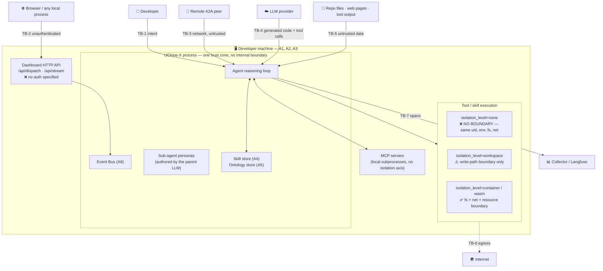

# Security Threat Model

> [!IMPORTANT]
> **This document describes threats, not protections.** UClone-X implements almost
> none of the controls discussed below. Every claim about what UClone-X *does* is
> labelled *specified* or *implemented* per [§0.2](#02-vocabulary), and the
> `Implemented` column of [§6](#6-current-posture) is `No` for every threat.
> A reader must not treat this file as evidence that the framework is hardened.

Resolves `2026-09-02-016`.
Reviewed against the repository at the commit that introduces this file.

---

## 0. How to read this document

### 0.1 Filename

Issue 2026-09-02-016 suggested `docs/security-model.md`; task
`2026-09-02-019` scopes the
deliverable to **`docs/security-threat-model.md`**. This is that file, and no second
file is owed. `SECURITY.md` at the repository root remains the vulnerability
*disclosure* policy; its "no threat model exists" section is now stale and is owed an
update referencing this document (see [§9](#9-follow-ups-owed-outside-this-file)).

### 0.2 Vocabulary

Borrowed deliberately from [`a2a-protocol-spec.md`](a2a-protocol-spec.md) §0, because
the failure it was written to end — asserting an intention as a property — is the
same failure that makes threat models useless:

| Term | Meaning here |
| :--- | :--- |
| **Specified** | Written down in a `docs/` file. Costs nothing and protects nothing. |
| **Implemented** | Code exists in `src/uclone_x/`, is exercised by `tests/`, and passes `./ucx test check`. |
| **Enforced** | Implemented *and* not bypassable by the component it constrains. A limit a caller may raise for itself is specified, never enforced. |
| **Verified** | Demonstrated by an adversarial test that fails when the control is removed. **Nothing in UClone-X has reached this state.** |

A control that is *specified* is a plan. Only an *enforced* control appears in a
mitigation column.

### 0.3 Isolation levels

The isolation axis has four values, defined in
[`sandbox-execution-architecture.md`](sandbox-execution-architecture.md) §2–§4 and
named `SandboxConfig.isolation_level` (renamed from `mode`, per that document §5 and
issue `2026-09-02-019`):

| Level | Specified meaning | What it is *not* |
| :--- | :--- | :--- |
| `none` | Direct host `asyncio.subprocess`. Zero overhead. | Not a boundary of any kind. |
| `workspace` | Filesystem writes confined to a directory or git worktree; `../` traversal blocked. | Not a read boundary, not an environment boundary, not a network boundary. |
| `container` / `wasm` | Ephemeral Docker / WASI sandbox, CPU + memory + network limits, no host filesystem. | Not a defence against anything that happens *before* execution — prompt injection, approval forgery, store poisoning. |

Throughout this document `container`/`wasm` are treated as one column, since the two
differ in implementation cost rather than in the boundary they draw.

> **The single most important sentence in this document.** Under
> `isolation_level="none"` — the current default, mandated by
> [P3](principles/details/p3-single-machine-acceleration.md) — **there is no trust
> boundary between agent-generated code and the developer's machine.** Model-authored
> code runs as a bare host process, with the developer's uid, filesystem, environment
> variables and network. Every boundary drawn in [§3](#3-trust-boundaries) collapses
> to a single trusted zone.

---

## 1. Scope

**In scope:** the local single-machine runtime (event bus, agent loop, tool
execution, sandbox, skill store, ontology store), the developer control plane
(`ucx` CLI and the dashboard HTTP API), the A2A remote surface, MCP tool providers,
and telemetry export.

**Out of scope for this revision, and named so that the omission is deliberate
rather than accidental:** Python and npm dependency supply chain (a compromised
dependency executes in-process, so no isolation level applies); the security of the
LLM providers themselves; multi-tenant or hosted deployment (A2A multi-tenant routing
is declined as O5 in [`a2a-protocol-spec.md`](a2a-protocol-spec.md) §1.2); operating
system and container-runtime vulnerabilities.

---

## 2. Assets

Ordered by what an attacker gains, not by how the code is laid out.

| # | Asset | Why it is worth attacking | Where it lives |
| :--- | :--- | :--- | :--- |
| A1 | **The developer's machine** | Arbitrary code execution as the developer. Persistence via shell profiles, git hooks (`./ucx setup` already writes `.git/hooks/pre-commit`), launch agents. | Host OS |
| A2 | **Source code and the working tree** | The product being built; also destructive edits and history rewrites. | `cwd`, git worktrees |
| A3 | **Credentials** | Direct monetary and lateral value. `ANTHROPIC_API_KEY`, `GEMINI_API_KEY`, `OPENAI_API_KEY`, `LANGFUSE_SECRET_KEY` (see `.env.example`); and, by inheritance, everything else in the developer's environment and home directory — SSH keys, `~/.aws`, `~/.config/gh`, git credential helpers, cloud CLI tokens. | Process environment, `~` |
| A4 | **The skill store** | Executable code that the framework loads and runs, by design, in every future session. The highest-value persistence target in the system. | `ucx-agent-skills/` (empty today, and held that way by `tests/fitness/test_runtime_skill_store_membership.py`, which fails on any package nobody declared — the premise is checked rather than observed) |
| A5 | **The ontology store** | The assertions the agent validates its own actions against. Poisoning it changes what the system believes is correct. | `ontology/` (empty today) |
| A6 | **The event bus** | Every prompt, tool argument, tool result and A2A payload passes through it in cleartext, and any in-process subscriber may read all of it. Also the integrity of control events — cancellation, interrupt, and any future human-approval event. | `uclone_x.engine.event_bus` |
| A7 | **Agent identity and A2A credentials** | The ability to act as this agent toward remote peers, and to consume its quota. | Agent Card, out-of-band credentials |
| A8 | **Telemetry stream** | Prompts, file paths and tool arguments leaving the machine to a third-party collector. | OTLP / Langfuse exporters |
| A9 | **The human's attention** | Approval fatigue is an attack surface. A gate that fires constantly is a gate that is clicked through. | — |

---

## 3. Trust boundaries



| ID | Boundary | Adversary assumed | Enforced today |
| :--- | :--- | :--- | :--- |
| **TB-1** | Human → agent | None. The developer is the principal, and their intent is authoritative. | n/a |
| **TB-2** | Local process / browser → control plane | Any process on the machine, and any web page the developer has open (cross-site request forgery against a localhost port). | **No.** No authentication is specified for `/api/dispatch` or `/api/stream`, and no loopback-binding requirement is stated. |
| **TB-3** | Remote A2A peer → agent | Fully untrusted, possibly malicious, possibly a compromised legitimate partner. | **No.** No A2A code exists; the shipped `TaskMessage` stub has no authentication field at all. |
| **TB-4** | LLM → framework | Not malicious, but **not trusted**: its output is untrusted input that happens to be executable. Also steerable by TB-5. | **No.** |
| **TB-5** | Content → reasoning loop | Untrusted. Repository files, dependency READMEs, web pages, MCP tool output, ontology entries and skill instructions all reach the context window. | **No.** No provenance tagging and no data/instruction separation is specified anywhere. |
| **TB-6** | Sandbox → network | Untrusted outbound. | **No.** `allow_network` defaults to `True` and is documented as silently ignored under `none` and `workspace`. |
| **TB-7** | Runtime → telemetry backend | Semi-trusted third party; treat as a data-exfiltration channel. | **No.** No redaction or attribute allowlist is specified. |

**The boundary that does not exist.** TB-4 and TB-5 are the two boundaries the
framework's architecture most depends on and the two it has never drawn. The process
zone in the diagram has no internal partition: a loaded skill, a spawned sub-agent
and the core runtime share one address space, one event bus, one environment and one
uid. `isolation_level` draws a line around *tool execution*, and only when set above
`none`.

---

## 4. Actors

| Actor | Trusted? | Capability |
| :--- | :--- | :--- |
| **Developer** | Yes — the principal | Everything. |
| **The framework's own LLM-generated code** | **No** | This is the uncomfortable one. A synthesized skill is *untrusted input that arrives as executable code*. It is produced by a model whose context contained attacker-reachable text (TB-5), it is verified by tests the same model wrote, it declares its own sandbox level in its own frontmatter, and it is written to `ucx-agent-skills/` where it will be loaded again in every future session. It is not malicious by intent; it does not need to be. |
| **Parent agent authoring a sub-agent persona** | **No** | `SubagentInvocation` / persona configuration is written by the orchestrating model: `allowed_tools`, `enable_write_tools`, `enable_subagent_tools`, `fs_scope`. Self-granted privilege, decided by a model, at runtime. |
| **Remote A2A peer** | **No** | Sends `SendMessage` payloads that enter the reasoning loop as text; may register push-notification webhooks (deferred as O2); may be a compromised legitimate partner rather than an obvious attacker. |
| **MCP server** | **No** | Arbitrary local subprocess (`MCPConnectionConfig.command`), plus every tool result it returns is untrusted text entering the context. |
| **Content author** | **No** | Whoever wrote the file, page, issue, commit message, dependency README or log line that the agent reads. |
| **Local unprivileged process / open browser tab** | **No** | Reaches the dashboard API over loopback; a browser can issue a cross-origin `POST` to it without the developer's knowledge. |
| **LLM provider** | Semi | Sees prompts, which contain source code. Out of scope, named for completeness. |
| **Telemetry backend** | Semi | Receives spans containing prompts, paths and tool arguments. |

---

## 5. Threats

Mitigation columns use: **✓** stops it · **~** reduces blast radius, does not stop it ·
**✗** no effect · **n/a** isolation is the wrong axis for this threat.

| ID | Threat | Entry point | Attacker gains | `none` | `workspace` | `container`/`wasm` |
| :--- | :--- | :--- | :--- | :---: | :---: | :---: |
| **T1** | Prompt injection reaching tool execution | Any untrusted text (TB-5, TB-3) | Attacker-chosen tool calls with the agent's full authority | ✗ | ~ | ~ |
| **T2** | Synthesized skill escalates its own privilege | Self-authored `SKILL.md` frontmatter | Host execution from "the agent had an idea" | ✗ | n/a | n/a |
| **T3** | Credential exfiltration via a tool or skill | Executed code + inherited env + open egress | A3 in full; lateral movement off the machine | ✗ | ✗ | ~ |
| **T4** | Malicious or compromised remote A2A peer | `SendMessage`; push-notification webhook config | T1 remotely; artifact disclosure; SSRF into the host network | ✗ | ~ | ~ |
| **T5** | Ontology or skill-store poisoning persisting across sessions | Distillation of injected content into `ucx-agent-skills/` or `ontology/` | Permanent influence that outlives its source | ✗ | ✗ | ✗ |
| **T6** | Event-bus resource exhaustion and event forgery | Any in-process component; A2A or dispatch flood | Denial of service; loss of *critical* events; forged provenance | ✗ | ✗ | ✗ |
| **T7** | Unauthenticated local control plane | `POST /api/dispatch`, `GET /api/stream` | Full task injection; full read of every event payload | ✗ | ✗ | ✗ |
| **T8** | Telemetry exfiltration | OTLP / Langfuse export of unredacted spans | Source code and secrets in prompts, to a third party | ✗ | ✗ | ✗ |
| **T9** | Hostile MCP tool provider | `MCPConnectionConfig.command` / tool output | Code execution at config load; a T1 feed | ✗ | ✗ | ✗ |
| **T10** | Self-granted sub-agent privilege | Parent-authored persona | A child with privileges the task never required | ✗ | ~ | ~ |

**Read the matrix before reading the details.** Isolation level is decisive for
exactly one column of one row — it caps the damage of T3 — and is irrelevant to six
of the ten threats. The framework's dominant risks are *authorization and provenance*
problems, not *containment* problems. Choosing a stricter default (see
[§8](#8-open-decisions-for-the-owner)) is necessary and nowhere near sufficient.

### T1 — Prompt injection reaching tool execution

**Entry.** Any text that reaches the context window: a file in the repository being
worked on, a dependency's README, a web page, an MCP tool's output, an A2A peer's
message, a `SKILL.md`'s instruction body, an induced ontology axiom.

**Gain.** The injected text is indistinguishable from the developer's own instruction,
so the attacker obtains the agent's full tool authority — reading and writing files,
running commands, spawning sub-agents, calling remote peers.

**Isolation.** None of the three levels stop this, and it matters that this is said
plainly: isolation constrains *what the resulting tool call can touch*, never
*whether the tool call is made*. Under `container` the injection still succeeds; the
attacker simply gets a container instead of a host. The controls that address T1 are
of a different kind: an explicit data-versus-instruction rule in the agent core, a
tool allowlist per persona, human confirmation on side-effectful tools, provenance
tagging on ingested content, and never letting untrusted content select a tool.

**Today.** Nothing. No document in the repository states that ingested content is
data rather than instruction. `a2a-protocol-spec.md` §8 explicitly defers the question
to this document; this document can only record that the boundary is undrawn.

### T2 — A synthesized skill escalates its own privilege

**Entry.** [`skill-system-architecture.md`](skill-system-architecture.md) §2.1 places
`sandbox_mode` in the `SKILL.md` frontmatter, and §3 shows the synthesizer generating
that frontmatter. The artifact therefore names its own isolation level. Writing
`sandbox_mode: none` into a skill the agent authored is a one-token privilege
escalation.

**Gain.** Host execution, in every future session, for code no human read.

**Isolation.** Marked `n/a` deliberately: no *level* can fix this, because the
attacker chooses the level. The fix is structural — the runtime, not the artifact,
decides the ceiling; the frontmatter value is advisory and clamped downward; only a
human-authored, human-committed skill may ever request `none`.

**Today.** Worse than the issue describes. The shipped `SkillManifest`
(`src/uclone_x/skills/models.py`) has **no sandbox field at all** and is declared
`extra="forbid"`, so the documented frontmatter would be rejected outright — the spec
and the model disagree about what a skill even is. There is also no provenance field
(no originating agent, session, task, model, or source material), no version pinning,
and no quarantine directory. `./ucx skill approve` is referenced by both P9 and
`skill-system-architecture.md` §3 and **does not exist**: `ucx` implements only
`version`, `setup`, `run`, `ui`, `test check` and `dev`
([`cli-specification.md`](cli-specification.md) confirms `ui` and `setup` are stubs).
The human-in-the-loop box in the architecture diagram has no command behind it.

### T3 — Credential exfiltration via a tool or a skill

**Entry.** Any executed code, combined with two facts: the child process inherits the
parent environment unless something strips it, and `allow_network` defaults to `True`.

**Gain.** Every key in `.env` plus everything else in the developer's environment and
home directory (A3), posted anywhere.

**Isolation.** `none` — no effect. `workspace` — **no effect**, and this is the most
commonly misread cell in the matrix: the workspace boundary is a *write-path*
boundary. It does not restrict reads, so `~/.ssh/id_ed25519` and `~/.aws/credentials`
remain readable; it does not scrub the environment; and `allow_network` is documented
as *silently ignored* at this level, so egress remains open. `container`/`wasm` — `~`:
the filesystem half is genuinely closed, but the environment must still be explicitly
scrubbed and egress explicitly denied, or the container simply exfiltrates from
inside the container.

**Today.** No environment allowlist is specified at any level. `ExecutionRequest`
carries `env: dict[str, str] = {}` with no statement of whether the host environment
is inherited or replaced, and no runner exists to answer the question. There is no
egress allowlist. Per issue
`2026-09-02-001`,
`memory_limit_mb`, `cpu_shares` and `allow_network` are accepted and discarded under
`none` and `workspace` — a security control that is accepted and silently ignored is
precisely what [P6](principles/details/p6-fail-fast-observability.md) forbids.

**Append-only Log Redaction on Write (Issue #569).** When credentials (such as API keys,
bearer tokens, or private keys) are pasted into user prompts, returned in tool outputs, or
emitted by models, an append-only log retains them permanently, denying P0's user any remedy.
To mitigate durable credential retention, write-time redaction (Option A) is enforced at the
log writing boundary (`uclone_x.core.log_writer`), application log formatters (`logging_setup`),
session message persistence (`uclone_x.agent.session`), context compaction ledgers/offloading
(`uclone_x.llm.compactor`), and telemetry exporter sinks (`uclone_x.telemetry.exporter`).
*Known limitation*: Pattern-based redaction catches known credential shapes (e.g., `sk-...`,
`ghp_...`, `AKIA...`, private keys, `Bearer ...`). It cannot distinguish an arbitrary
high-entropy string from legitimate data, nor detect structured secrets in formats without
unique prefixes or recognizable assignment keys.


### T4 — Malicious or compromised remote A2A peer

**Entry.** `SendMessage` / `SendStreamingMessage` payloads, and — once O2 ships — a
`TaskPushNotificationConfig` webhook URL supplied by the requester, which is the
server-side request forgery surface issue 016 filed against the invented
`callback_url` field. The field is gone (the previous protocol document was fiction,
corrected under
`2026-09-02-004`), but the *class* of
surface returns with push notifications, and A2A itself requires only that the client
validate the source — it says nothing about the server validating the URL it is asked
to call.

**Gain.** T1 at a distance; disclosure of artifacts and task history; SSRF against
services reachable from the developer's machine, including cloud metadata endpoints
and other loopback ports.

**Isolation.** `workspace` should be the *floor* for A2A-originated work and
`container` the recommendation for work from an unvetted peer. Neither stops the
injection; both cap the filesystem damage.

**Today.** Nothing is implemented — `a2a-protocol-spec.md` §1 marks the `Implemented`
column `No` for all seventeen mandatory requirements. Two forward-looking
requirements deserve emphasis because violating them would be catastrophic rather
than merely absent:

* **The in-process fastpath must never be reachable by a remote peer.**
  `a2a-protocol-spec.md` §10.4 and §12.6 require that the fastpath is not advertised
  in the Agent Card and that its selection rule is never satisfied by a remote peer.
  In-process calls carry no credentials and cross no trust boundary *by assumption*.
  If a loopback or hostname heuristic ever admitted a remote peer to that path, the
  result is an unauthenticated, uncredentialed, trust-free channel into the process —
  the single worst outcome available in this design.
* **Objects passed by reference on the fastpath must be immutable** (§12.3, 12.2).
  Zero-copy sharing of mutable objects between agents is a shared-mutable-state
  vulnerability, not only a correctness bug.

### T5 — Ontology or skill-store poisoning that persists across sessions

**Entry.** The two designed write paths. An agent distils a workflow into `ucx-agent-skills/`
([P9](principles/details/p9-dynamic-skills.md)) and induces axioms into `ontology/`
([P7](principles/details/p7-evolving-ontology.md)). Content ingested from a hostile
repository, web page or A2A peer can be laundered into either.

**Gain.** Persistence. This is the only threat in the list whose effect *outlives its
cause*: the hostile source can be removed, the session ended, the context discarded,
and the poisoned skill or axiom still activates in every future session — and, once a
Builder commits `ucx-agent-skills/`, propagates to every other clone of the repository. The
skill store is executable code; the ontology store is what the agent checks its own
correctness against, so a poisoned axiom does not merely add a capability, it makes
the system reject correct actions and report the rejection as validated (issue
`2026-09-02-003`).

**Isolation.** ✗ across the board. These stores are *inside* every boundary and are
written on purpose. The controls are provenance, authority tiers (human-asserted
always outranks induced; induced-candidate never enforces), promotion criteria,
a review queue, and a retraction path.

**Today.** Nothing. `EntitySchema` / `RelationSchema` in
`src/uclone_x/ontology/models.py` have no author, source, confidence, evidence-count
or approval field, so nothing downstream *can* distinguish a human-seeded assertion
from an induced guess. `./ucx ontology teach` is specified; `./ucx ontology forget` is
not. No skill quarantine, no `revoke`, no registry size or TTL bound.

### T6 — Event-bus resource exhaustion and event forgery

**Entry.** Any in-process component — including a loaded skill and a spawned
sub-agent — plus any external flood that reaches the bus through T4 or T7.

**Gain.** Three distinct wins, and unlike the rest of this document these are
observations about *implemented* code (`src/uclone_x/engine/event_bus.py` is the one
subsystem that is real):

1. **Critical events are the first thing dropped.** `BackpressurePolicy.DROP_OLDEST`
   implements "drop oldest" as `PriorityQueue.get_nowait()`, which returns the
   *highest-priority* item, not the oldest. On a full queue the `CRITICAL` event is
   discarded — a cancellation or interrupt is exactly what an attacker wants dropped
   — and the loss is recorded only at `logger.debug`. Verified against the shipped
   code: filling a bus with `[CRITICAL, NORMAL, NORMAL]` and publishing one
   `BACKGROUND` event leaves `[NORMAL, NORMAL, BACKGROUND]`. This is both a security
   defect and a P6 (no silent loss) violation.
2. **One subscriber can stall every agent (resolved).** Under sequential awaiting of
   deliveries, a subscriber with `BackpressurePolicy.BLOCK` whose queue is full would
   halt dispatch for the entire process. In `src/uclone_x/engine/event_bus.py`, the
   dispatch path is non-blocking: `sub.deliver_nowait(event)` is used for non-full or
   dropping queues, and full subscribers under `BLOCK` are decoupled into background
   tasks (`asyncio.create_task(self._deliver_to_subscriber_async(sub, event))`), with
   callbacks similarly dispatched concurrently. This head-of-line blocking defect was
   filed and resolved as issue
   `2026-09-02-038` (task
   `2026-09-02-028`).
3. **Provenance is forgeable.** `AgentEvent.source`, `sender_id` and `session_id` are
   plain strings with defaults, set by the publisher. The bus stamps only `sequence`.
   Any in-process component may publish an event claiming `source="user"`,
   `type="USER_INPUT"` — so if a human approval is ever delivered as an event (which
   is how the skill-approval gate in `skill-system-architecture.md` §3 would
   naturally be built), forging that approval is trivial. Symmetrically, any
   component may `subscribe("*")` and read every prompt, tool argument and secret on
   the bus; subscription is unauthenticated by construction.

**Isolation.** ✗. The bus is in-process, inside every boundary, and is the mechanism
by which isolation decisions themselves would be communicated.

### T7 — Unauthenticated local control plane

**Entry.** `POST /api/dispatch` and `GET /api/stream`
([`ui-dashboard-architecture.md`](ui-dashboard-architecture.md) §2), served by the
embedded FastAPI runtime on TCP port 5180.

**Gain.** `dispatch` injects a task into an agent holding tool access — full T1
without needing any injection. `stream` is worse in a quieter way: the Event Ledger
view is specified to show "every `AgentEvent` envelope with JSON payload expansion",
so an unauthenticated reader of that endpoint reads every prompt, tool argument and
tool result in the process (A6). Reachable by any local process, by any web page the
developer has open (a cross-origin form `POST` to a localhost port needs no
credentials and no CORS grant), and by the whole LAN if the server ever binds
`0.0.0.0`.

**Isolation.** ✗. The sandbox constrains what a tool may touch; it says nothing about
who is permitted to ask for the tool.

**Today.** `./ucx ui` is a stub that binds nothing, so the surface is not live. The
one existing precedent is good and should become the stated rule: `find_available_port`
in `src/uclone_x/cli/main.py` probes `127.0.0.1` explicitly. Nothing in any document
*requires* loopback binding, requires a session token, or requires an `Origin` check,
and the port-fallback behaviour means the port a client finds the server on is not
fixed — a token is therefore the only thing that can distinguish the real dashboard
from another local process.

### T8 — Telemetry exfiltration

**Entry.** [`telemetry-opentelemetry.md`](telemetry-opentelemetry.md) §3 shows spans
carrying `path="src/auth.ts"` and, by the GenAI semantic conventions it adopts, prompt
and completion content. §4 configures an OTLP endpoint and a Langfuse host from
environment variables. The shipped `SpanRecord.attributes` is `dict[str, Any]` with no
allowlist. §3's own example even contains a finding whose body is
`"Hardcoded JWT secret"` — a demonstration that span payloads carry exactly the
material that must not leave.

**Gain.** Source code, prompts, tool arguments and any secret that appeared in a
prompt, delivered to a third-party backend, in a channel the developer is unlikely to
be auditing.

**Isolation.** ✗ — export happens in the core runtime, not in the sandbox.

### T9 — Hostile MCP tool provider

**Entry.** `MCPConnectionConfig` (`src/uclone_x/tools/models.py`) carries `command`,
`args`, `env` and `transport="stdio"`: connecting to an MCP server *is* spawning an
arbitrary local process with an arbitrary environment. The model has **no isolation
field at all** — `SandboxMode` is not among its fields, so there is no axis on which
to sandbox an MCP server even if a runner existed. Separately, every tool result the
server returns is untrusted text that lands in the context window (T1).

**Gain.** Code execution at configuration-load time, before any agent reasoning
happens, plus a permanent injection feed.

**Isolation.** ✗ as designed, because MCP servers are outside the sandbox axis
entirely. This surface is **not listed in issue 2026-09-02-016** and should be added
to it.

**Update, 2026-09-22 — servers added from Settings.** The paragraphs above describe the
surface as first registered. Two things have changed since. `MCPConnectionConfig` now carries
an `isolation` field, so the "no axis" sentence is out of date. Separately, a user can add
servers from the dashboard's Settings. That feature is `src/uclone_x/tools/mcp_manager.py`
together with the `/api/mcp/servers` routes in `src/uclone_x/ui/app.py`.

Servers added there are saved to `<storage_dir>/mcp_servers.json` and reconnected on every
start. It opens two new entry points:

1. **A stdio server added from the browser.** A request to these routes starts a program on
   this machine, so each route runs `_refuse_unless_local`. That check applies the origin
   check and also refuses any `Host` that is not a loopback name. The `Host` check is what
   stops DNS rebinding: a rebound page sends an `Origin` and a `Host` that agree, so the
   origin check alone lets it through. A local server starts in the workspace with an env
   allowlist (`PATH`, `HOME`, `USER`, `LANG`, `LC_ALL`, `TMPDIR`, `SHELL`) plus whatever the
   user configured. It runs in its own process group, so stopping it also stops what a
   launcher such as `npx` started under it. **Residual:** the rest of the dashboard API still
   has only the origin check. `/api/turn` and `/api/personas` have none at all.
2. **Remote (Streamable HTTP) servers that hold credentials.** Header and env *values* never
   leave the Core: the API returns key names only, and query-string values in an address are
   shown as `...`. The file is written with mode 0600. Values containing control characters
   are refused by field name, because h11 would quote the whole value in its error. Redirects
   are not followed, because httpx strips only `Authorization` when a redirect crosses
   origins. A reply is capped at 16 MiB, and stderr from a local server is drained into a
   4 KiB tail.

**Accepted, not mitigated:**

- Any persona without an `allowed_tools` whitelist is offered every connected server's tools.
  That includes the default `clone`. Such tools are `writes_files=True`, so personas with
  `enable_write_tools: false` are refused them.
- The saved file is started at the next launch without asking. If `storage_dir` lies inside
  the workspace, an agent that can write files could plant a server there.
- Tool output is still a T1 feed.

**Update, 2026-09-23 — the residual was understated (#1413).** The 2026-09-22 note above
called the rest of the dashboard API "only the origin check" and listed that as a residual.
It was worse than a residual. The origin check admits a DNS-rebound page, for the reason
given in item 1, so every other route was open to one: it could read conversations and
settings, and post a chat turn to `/api/turn`. The default `clone` then runs tools,
including `bash_run`, in the user's workspace. That is the T9 gain reached without any MCP
server.

Fixed by `LoopbackHostGuard` in `src/uclone_x/ui/app.py`. It is middleware on the whole
app, so no route, static file or stream can be added without it. While the server is bound
to a loopback address (the `ucx ui` default, `127.0.0.1`), it refuses with 403 any request
whose `Host` is not a loopback name, and tells the user to open the dashboard at
`http://localhost:<port>`. A server started with `--host 0.0.0.0` or another non-loopback
address was exposed on purpose and is not guarded. `_refuse_unless_local` stays on the
`/api/mcp/servers` routes: on such an exposed server, it still lets only this computer start
programs.

### T10 — Self-granted sub-agent privilege

**Entry.** [`dynamic-persona-interface.md`](dynamic-persona-interface.md) §3.1: the
parent agent — an LLM — authors the child's `allowed_tools`, `enable_write_tools`,
`enable_subagent_tools` and `fs_scope`.

**Gain.** A child agent with privileges the task never required, chosen by a model
that may itself be under the influence of T1.

**Isolation.** `~` at best, and only if the sandbox ceiling is enforced by the runtime
rather than requested by the persona. Note that the persona has **no isolation field
at all**, so a sub-agent's isolation level is whatever it inherits — and `fs_scope`
defaults to `"inherit"`, meaning the parent's filesystem context by default.

**Today.** The *specified* defaults are the good news in this section:
`enable_write_tools=False`, `enable_subagent_tools=False`, `allowed_tools=[]`,
`max_depth=2`, `max_concurrent_subagents=5`. The *shipped* defaults invert half of it:
`SubAgentSpec` in `src/uclone_x/agent/models.py` is correctly deny-by-default, but
`AgentConfig` — the top-level agent every sub-agent inherits from — ships
`enable_write_tools=True` and `enable_subagent_tools=True`, so recursive spawning and
write access are on by default at the root (also recorded in issue
`2026-09-02-034`).
None of these fields are *enforced* in the [§0.2](#02-vocabulary) sense — a caller that
may set a field may raise it. The missing rule is monotonicity: a child's privilege set must be
a subset of its parent's, and no agent may grant a capability it does not itself hold.
`sandbox-execution-architecture.md` §5 already states the shape of the answer for the
filesystem axis — the isolation level is a **ceiling**, `fs_scope` selects a location
within what the ceiling permits, and `fs_scope="inherit"` is invalid under
`isolation_level="container"`. That rule needs to generalise to tools.

---

## 6. Current posture

Stated plainly, per the discipline in [§0.2](#02-vocabulary). "Specified" here means
the repository has *written down* a control, not that the control exists.

| Threat | Specified control | Implemented | Enforced | Honest summary |
| :--- | :--- | :---: | :---: | :--- |
| T1 injection | None | No | No | The boundary has never been drawn in any document. |
| T2 skill escalation | Skill Auditor agent; auto-approval policy; `./ucx skill approve` | **No** | No | The auditor is an LLM grading an LLM; the approve command does not exist; the manifest model has no sandbox or provenance field. |
| T3 credentials | Path-traversal blocking in `workspace` | No | No | No env allowlist, no egress allowlist, no read boundary at any level. |
| T4 A2A peer | A2A v1.0.1 conformance target; TLS validation; out-of-band credentials | **No** (all 17 mandatory rows) | No | Nothing exists; the shipped stubs are themselves non-conformant (issue 2026-09-02-031). |
| T5 store poisoning | Tier-1 validator; `./ucx ontology teach` | No | No | No provenance, no authority tiers, no promotion criteria, no retraction. |
| T6 event bus | Bounded queues; explicit backpressure policies | **Yes** — the one implemented subsystem | No | Implemented *and* carrying verified defects (critical-event drop; head-of-line blocking under `BLOCK` resolved under issue 2026-09-02-038) plus forgeable provenance. |
| T7 control plane | None | No (`ucx ui` is a stub) | No | No auth, no loopback requirement, no `Origin` check specified. |
| T8 telemetry | None | No | No | No redaction layer; `attributes` is unconstrained. |
| T9 MCP | None | No | No | Surface not yet acknowledged in the issue register. |
| T10 sub-agent | Deny-by-default persona fields; depth and fan-out caps | No | No | Good defaults, unimplemented, and self-selected by the parent model. |

The `SkillAuditReport` model deserves its own line, because it is the only place in
the repository where a security decision is already expressed in code:

```python
risk_score: float = 0.0  # 0.0 == safe
recommendation: str = "approve"  # unconstrained str
```

Both defaults are **fail-open**: a report constructed with no findings — including one
produced by an auditor that crashed, timed out, or was never invoked — reads as
"risk 0.0, approve". `recommendation` is an unconstrained `str` rather than a
`Literal`, so `"approve"`, `"Approve"` and a typo are all valid values of a field that
gates code execution (also a P8 violation, cf. issue 2026-09-02-011). A security
verdict must default to denial and must be a closed enum.

---

## 7. Findings that exceed the filed issues

Recorded here because they were discovered while writing this document and are not
captured — or are understated — in the issue register. Filing them is outside this
task's scope.

Issues `2026-09-02-032`,
`2026-09-02-033`,
`2026-09-02-034`
and `2026-09-02-035` were
filed by a concurrent Builder while this document was being written and already cover
several of the code-shape findings below; the `Relative to` column says which. The
findings that remain unfiled are **F1, F3, F5, F6, F7 and F11**.

| # | Finding | Severity | Relative to |
| :--- | :--- | :--- | :--- |
| F1 | `BackpressurePolicy.DROP_OLDEST` discards the **highest-priority** event, because "drop oldest" is implemented as `PriorityQueue.get_nowait()`. Cancellation and interrupt events are the first casualties of any flood, and the loss is logged at `debug`. Verified against shipped code. | High | New. Issue -015 discusses backpressure as a missing *specification*; the implemented behaviour is actively wrong. |
| F2 | `BackpressurePolicy.BLOCK` in a subscriber could cause head-of-line blocking if deliveries were awaited sequentially on the dispatch loop. In `src/uclone_x/engine/event_bus.py`, the dispatch path is non-blocking (`deliver_nowait` for non-full queues, `asyncio.create_task` for full queues under `BLOCK`). | High | **Filed and resolved** as issue `2026-09-02-038` (task `2026-09-02-028`), which decoupled subscriber delivery into background tasks. |
| F3 | `AgentEvent.source` / `sender_id` are publisher-supplied and unverified; the bus stamps only `sequence`. Any in-process component can forge a `source="user"` event, so any future event-delivered human approval is forgeable. Any component can `subscribe("*")` and read all traffic. | High | Sharper than issue -021's "contract undefined"; adjacent to -032 (provenance on result envelopes) and -033, neither of which covers publisher-forged `source`. |
| F4 | `SkillManifest` has **no** sandbox field and is `extra="forbid"`, so the `sandbox_mode` frontmatter that `skill-system-architecture.md` §2.1 specifies would be *rejected* by the shipped model. The spec and the code disagree about the artifact's shape. | Medium | **Now filed** as issue -034, which adds the stronger point that `SkillRegistryProtocol.register()` takes no audit report at all, so skipping the auditor entirely is a type-checked, lint-clean call sequence. |
| F5 | `SkillAuditReport` defaults are fail-open (`risk_score=0.0`, `recommendation="approve"`), and `recommendation` is an unconstrained `str`. | High | New. Issue -034 covers the missing quarantine and ceiling fields but not the fail-open verdict defaults. |
| F6 | `./ucx skill approve` / `reject` — the human gate in P9, FR-5.4 and the architecture diagram — **does not exist**. Neither does `./ucx ontology teach` / `forget`. The `never` auto-approval policy is therefore unimplementable today: there is no way for a human to approve anything. | High | Issue -002 proposes the command as a *fix*; that it is already cited as existing is a separate defect (cf. issue -025). |
| F7 | `MCPConnectionConfig` spawns an arbitrary local process with an arbitrary environment and carries no isolation field. MCP is a first-class untrusted-code and injection surface absent from issue -016's table. | High | New. **2026-09-22:** the config has since gained an `isolation` field, and Settings can now add servers. The mitigations and what remains are in T9's update. |
| F8 | `ToolContext.sandbox_mode` defaults to `NONE` and `workspace_root` defaults to `"."`. The insecure default is duplicated in a second module, and the default workspace root is the developer's current working directory — so `workspace` isolation, at its default, bounds writes to the repository the developer cares about most. | Medium | Extends issue -001 into the tools layer; the duplicated `NONE` default is also in -034. |
| F9 | The `mode` → `isolation_level` rename recorded in `sandbox-execution-architecture.md` §5 is **documentation-only**. `src/uclone_x/sandbox/models.py` still exports `SandboxMode` and `ExecutionRequest.sandbox_mode`, and `tools/models.py` imports it. The vocabulary collision issue -019 set out to end still exists in code. | Low | **Now filed** as issue -034, which also finds a fourth `WorkspaceMode` value, `BRANCH`, in no specification. |
| F10 | The documented `SandboxConfig` (`allow_network`, `memory_limit_mb`, `cpu_shares`, `workspace_root`) and the shipped `ExecutionRequest` (`allowed_write_paths`, `env`, no network or resource fields) are different types describing the same thing. Neither has a read boundary. | Medium | **Now filed** as issue -034 for the missing network and resource fields; the absent *read* boundary remains unfiled. |
| F11 | `./ucx setup` writes an executable `.git/hooks/pre-commit` whenever `.git/hooks` exists. Correct for a Builder; worth noting as a host-persistence write performed by the CLI, and a mechanism an agent with write access to `.git/hooks` inherits. | Low | New. |

---

## 8. Open decisions for the project owner

**These are decisions, not findings, and this document does not make them.** Issues
`2026-09-02-001` and
`2026-09-02-002` are both marked
`approval_required: true` because resolving either edits `docs/principles/`. Both are
also product decisions about what UClone-X *is*, not defects with a single correct
repair. This section states the options and their real costs on both sides,
recommends one of each, and stops. No default anywhere in the repository is changed by
this document.

### D1 — What is the default isolation level?

> [!IMPORTANT]
> **Decided 2026-09-02 by the project owner: the default is `workspace`.** `container` and
> `wasm` remain available by user configuration; `none` becomes an explicit opt-in for
> trusted local work and must never be reached by defaulting. Recorded in
> [`docs/governance/principle-amendment-policy.md`](governance/principle-amendment-policy.md)
> §5, the amendment log, and applied to P3, the sandbox specification and PRD FR-7.
>
> The options below are kept as the record of what was weighed. Two points from that
> analysis survive the decision and are **not** closed by it:
>
> * `workspace` stops **no** credential exfiltration (T3). It is a write-path boundary
>   with no read boundary and no environment scrubbing. The environment allowlist and
>   egress deny-by-default remain the change that actually closes T3, at every level
>   including the new default — tracked in
>   `2026-09-02-042`.
> * No isolation level stops prompt injection reaching tool execution (T1), because
>   isolation caps what a call touches and never whether it is made.

The status quo is written into
[P3](principles/details/p3-single-machine-acceleration.md): "Tool execution defaults to
zero-overhead direct host execution (`isolation_level="none"`) for trusted local
development". Changing it is a **Tier A** normative amendment (a mandated default), so it needs the
owner's written approval per
[`docs/governance/principle-amendment-policy.md`](governance/principle-amendment-policy.md)
§3 — and needed it even during the 2026-09 waiver, which never reached Tier A changes
and lapsed on 2026-09-09 (§2).

| Option | What it costs | What it buys |
| :--- | :--- | :--- |
| **A. Keep `none` global** | No host boundary, ever, for any execution path — including the two that are untrusted by construction (A2A-originated tasks, synthesized skills). T1, T2, T3 land directly on A1/A2/A3. The insecure configuration is the one an agent may not question, because it is law. | Zero overhead, sub-millisecond process start, no toolchain mismatch, no Docker, and the developer ergonomics that are P3's actual purpose. This is a real benefit, not a straw man: an agent framework that cannot see the developer's real environment is a materially less useful agent framework. |
| **B. `workspace` global** | ~5 ms per execution and a genuine ergonomic tax: a path-bounded tool cannot read `~/.gitconfig`, a global toolchain, or dependencies outside the tree, so legitimate work breaks in ways that are annoying to diagnose. It also needs `read_paths`/`write_paths` machinery that does not exist (`read_roots` is an allowlist for the read-only file tools, not a process read boundary). **And it does not stop T3** — no read boundary, no env scrubbing, `allow_network` ignored. | A filesystem *write* boundary, which caps destructive edits and is meaningfully better than nothing. |
| **C. `container` global** | Docker or Podman becomes a hard runtime dependency, which collides head-on with P3's zero-external-dependency, "Embedded Pure Runtime" claim and with `local-collaboration-engine.md` §4's self-contained positioning. Start-up is 10²–10³ ms, two to three orders of magnitude above the `< 5 ms` the sandbox document claims for `workspace`. Toolchain mismatch is severe: the container is not the developer's environment. | The only option that actually caps T3, and the right answer for genuinely untrusted code. |
| **D. Provenance-derived floor** (issue -001's proposal) | Complexity in the right place and cost in the wrong one: every execution path must carry a provenance tag from origin to runner, which means the event envelope, the tool context and the sub-agent invocation all need a field they do not have (and, per F3, a trustworthy way to stamp it). Mis-tagging becomes a privilege escalation, so provenance itself becomes security-critical. | The default matches the actual risk instead of a global guess. Human-interactive local work keeps `none` and keeps P3's ergonomics intact; A2A-originated work gets `workspace` as a floor; synthesized-skill execution gets `workspace` as a floor with `container` recommended; MCP-provided tools get `workspace` as a floor. |

**Recommendation: D, with two controls that are not isolation levels at all.**

Reasoning. A and C are the same mistake in opposite directions — both answer a
question about *provenance* with a single global constant, and both are wrong for half
of the traffic. B buys the least defensible thing: enough friction to annoy the
developer, without closing T3. D is the only option under which the ergonomic cost
falls on the untrusted paths and the ergonomic benefit stays on the human's own
interactive work, which is exactly what P3's rationale ("developers need instant local
startup") is actually asking for. It also keeps `none` legal, so it is a narrowing of
P3 rather than a reversal, which should make it a smaller amendment to approve.

The two controls that matter more than the level, and that are independent of this
decision:

1. **Environment allowlist, deny-by-default for secrets.** A child process receives an
   explicitly constructed environment, never an inherited one. A credential-shaped name
   is excluded unless a tool declares it needs it, and "credential-shaped" means any of
   three things: a `SECRET_NAME_TAILS` entry in bare or `*_`-suffixed form; a
   `SECRET_ENV_EXACT_NAMES` entry (credential locators such as `SSH_AUTH_SOCK` and
   `DOCKER_CONFIG`, glued forms such as `PGPASSWORD`, and the `GIT_CONFIG_*`
   config-injection family); or a `SECRET_ENV_FAMILY_PATTERNS` entry (unbounded-arity
   families). The names are deliberately **not** enumerated here — restating them is how
   this document drifted from the code twice. See
   [`sandbox-execution-architecture.md`](sandbox-execution-architecture.md) §5.2 for the
   lists, for the mechanical rule that decides which of the three a name belongs in, and
   for why they match whole trailing segments rather than substrings.

   There are deliberately **no vendor namespace globs**. `AWS_*` / `GH_*` / `GITHUB_*`
   were removed in issue #95: they refused ~24 benign names at construction and swept
   dotted trace attributes into wholesale redaction, while every credential they caught
   is reached by a tail or an exact name. An earlier revision of this document described
   those namespaces as intentional, which is what made the problem hard to revisit —
   noted here so the same framing is not reintroduced.

   **Scope, stated precisely, because this control is easy to overread.** The allowlist
   governs which *variables* a child inherits. It does **not** govern what a child can
   *read*. It therefore closes the part of T3 that runs through the environment block —
   `GH_TOKEN`, `OPENAI_API_KEY`, `AWS_SECRET_ACCESS_KEY` and the rest of A3's
   *environment* half — at every isolation level including `none`. It does **not** close
   A3's *filesystem* half: any child process inheriting `HOME` can read files on disk
   (`~/.aws/credentials`, `~/.config/gh/hosts.yml`, `~/.ssh/`) directly at `none` and
   `workspace` isolation levels alike, regardless of every name denied above, and `HOME`
   is not credential-shaped and should not be. Closing that half needs a filesystem
   boundary — `container` or `wasm` isolation, or a workspace runner that does not pass
   `HOME` through — not a longer name list. The boundary is asserted by
   `test_home_allowlist_governs_variables_not_filesystem_reachability`
   ([#109](https://github.com/UClone-AI/uclone-x/issues/109)) so this scope statement
   cannot drift back into an overclaim.

2. **Egress deny-by-default above `none`, and never silently ignored.** If
   `allow_network` cannot be honoured at a level, setting it must be a *typed error*,
   not a discarded field (P6). Model the configuration as a discriminated union so
   that a limit which cannot be enforced cannot be expressed.

Stated bluntly, so the decision is not mistaken for the fix: **picking an isolated
default does not stop credential exfiltration.** Controls 1 and 2 do, and they are
cheaper than C.

### D2 — May autonomously synthesized skills ever auto-approve?

The status quo is P9 and FR-5.4: three policies, `safe_only` as the default. Narrowing
this is also **Tier A** (it removes a configurable behaviour the principle grants).

| Option | What it costs | What it buys |
| :--- | :--- | :--- |
| **A. Keep `always` available** | A model writes code, a model writes the tests, a model grades the audit, and the artifact persists to disk and hot-reloads into every other agent with no human ever seeing it. With F5's fail-open report defaults, an auditor that *fails* also approves. This is the shortest path in the system from "hostile web page" to "permanent executable code on the developer's machine". | Full autonomy; the strongest form of P9's promise. |
| **B. Keep `safe_only` as default** | "Safe" is a model's judgement, expressed today as an unconstrained `str` (F5). "Read-only and low-risk" is also the wrong safety axis: exfiltration is read-only. And a policy that notifies often trains the developer to approve reflexively — A9. | Autonomy for the common case with a gate on the obvious cases. |
| **C. `never` for synthesized skills** | Capability accrual is throttled by human attention. A review queue nobody clears is functionally identical to disabling P9 — the feature becomes dead weight, which is a worse outcome than a considered gate because it looks like a control while being an abandonment. | The strongest guarantee: no code the framework wrote persists without a human reading it. |
| **D. Split synthesis from persistence** | Two code paths and two lifecycles instead of one. Session-scoped skills need eviction and must not leak into `ucx-agent-skills/`. | The blast radius that actually matters is the persistent, cross-agent, cross-session one, and that is precisely the one a human can afford to gate — it is not on the critical path of the current turn. |

**Recommendation: D, plus one non-negotiable invariant.**

Concretely: a synthesized skill activates immediately, but **only** for the agent and
session that synthesized it, at a runtime-clamped `workspace` ceiling, with no
persistence to `ucx-agent-skills/` and no cross-agent publication. Persisting it, or publishing
it to other agents, is a separate explicit human action. The agent keeps the benefit
inside the window where a human is already watching its work; nothing it wrote
outlives that window unread.

The invariant, which is not a policy setting and should not be configurable: **a
synthesized artifact may never raise its own ceiling.** `sandbox_mode` in a generated
`SKILL.md` is advisory and clamped downward by the runtime. Only a human-authored,
human-committed skill may request `none`. This makes T2 structurally impossible rather
than policy-dependent, and it is the one change in this section that is arguably Tier B
repair rather than Tier A narrowing — P9 already says skills execute "with configurable
sandbox boundaries" without saying *who* configures them.

Two secondary points for the same decision:

* **`always` should be removed or renamed.** As written it means "no human ever sees a
  persistent code artifact the framework wrote". If the option survives, it should be
  spelled so that choosing it is choosing that.
* **At least one gate the synthesizing agent did not author** (a static AST/policy
  lint, or a second model with a different prompt and no access to the first's
  reasoning). Self-graded verification is not verification; a skill that is wrong in
  the way the agent is wrong passes its own exam.

---

## 9. Follow-ups owed outside this file

Named so they are not silently dropped. None are in this task's scope.

1. **`SECURITY.md`** — its "UClone-X does not yet have a documented security posture or
   threat model" section is now stale and should reference this document, while keeping
   the accurate warning that the threats here are largely *unmitigated*.
2. **Issue 2026-09-02-016** — should be amended to add the MCP surface (F7) and the
   event-bus surface (F1–F3), which its table does not list.
3. **New issues** for F1, F3, F5, F6, F7 and F11 — the rest are covered by the concurrently filed -032 to -035 and resolved issue -038.
4. **`a2a-protocol-spec.md` §8** defers to this document; a cross-reference back is
   owed once this file has a stable path.
5. **F9** — the `isolation_level` rename is owed in `src/uclone_x/sandbox/models.py`
   and `src/uclone_x/tools/models.py`.

---

## 10. Related

* `2026-09-02-016` — the finding this document resolves
* `2026-09-02-038` — BLOCK subscriber head-of-line blocking resolution (F2, T6)
* `2026-09-02-001` — insecure sandbox default (D1)
* `2026-09-02-002` — unapproved skill synthesis (D2)
* `2026-09-02-003` — ontology verifiability (T5)
* `2026-09-02-019` — the isolation vocabulary (F9)
* [`sandbox-execution-architecture.md`](sandbox-execution-architecture.md) · [`skill-system-architecture.md`](skill-system-architecture.md) · [`a2a-protocol-spec.md`](a2a-protocol-spec.md) §8
* [`docs/governance/principle-amendment-policy.md`](governance/principle-amendment-policy.md) — why D1 and D2 are the owner's to decide
* [`SECURITY.md`](../SECURITY.md) — vulnerability disclosure
