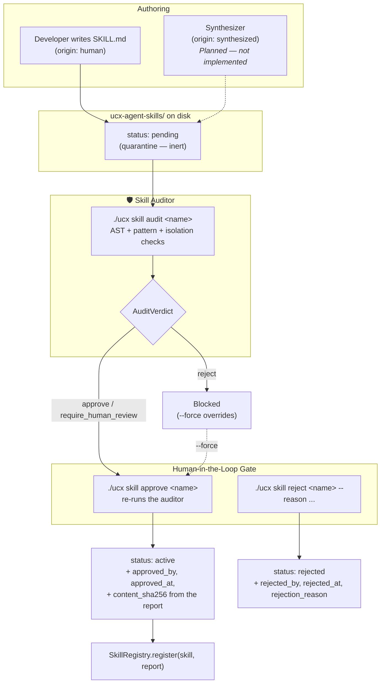

# Dynamic & Self-Evolving Skill System Architecture

> [!NOTE]
> **Implementation status — partly shipped.** The models
> (`src/uclone_x/skills/models.py`), the protocols
> (`src/uclone_x/skills/protocols.py`), and the auditor, registry and SKILL.md
> load/save layer (`src/uclone_x/skills/auditor.py`) exist, together with the
> `./ucx skill` approval CLI (`src/uclone_x/cli/commands/skill.py`). They are exercised
> by `tests/unit/test_skills.py` and `tests/unit/test_cli_skills.py`. The **autonomous
> synthesizer does not exist** — `SkillSynthesizerProtocol` has no implementation, so
> nothing in the shipped system produces a skill without a human writing it. Every
> section below is marked **Implemented** or **Planned**.

## 1. Executive Summary

Per **Principle 9**, UClone-X treats **Skills** as first-class, modular, hot-reloadable capability packages.

Skills bridge the gap between static code tools and dynamic prompt instructions:
1. **Autonomous Synthesis** *(Planned)*: Agents distill successful workflows and bash/python scripts into permanent, reusable skills.
2. **Developer Injection** *(Partly implemented)*: Developers author skills in declarative folders; the load, audit, approve and reject paths exist. Natural-language teaching does not.
3. **Pluggable Execution** *(Partly implemented)*: A skill declares a *requested* isolation level; the runtime decides the actual one.

The two security properties that govern everything below, and that the shipped code
implements structurally rather than by convention:

* **The audit is not optional.** `SkillRegistry.register` takes the audit report as an
  argument, so there is no type-checking, lint-clean call sequence that registers a
  skill without one (§5).
* **The audit fails closed.** `SkillAuditReport` has no default verdict and no default
  risk score, so an auditor that crashed, timed out or was never invoked cannot produce
  a report that reads "safe, approve" (§4).

---

## 2. Skill Package Structure — *Implemented*

Every skill lives in an isolated folder under `ucx-agent-skills/<skill_name>/`:

```text
ucx-agent-skills/
└── database_optimizer/
    ├── SKILL.md             # Required: YAML frontmatter + instructions
    ├── scripts/             # Helper scripts (Python, Bash, SQL)
    │   └── profile_queries.py
    ├── resources/           # Templates, reference schemas
    └── tests/               # Unit verification tests for the skill
```

`SKILL.md` is the only required file. `load_skill_from_dir` raises `SkillAuditError` if
the directory is missing, is not a directory, or has no `SKILL.md`. The auditor walks
`**/*.py` under the package root, so scripts are analysed wherever they sit.

### 2.1 `SKILL.md` Frontmatter — *Implemented*

The frontmatter is a **flat mapping**, parsed by `parse_skill_markdown` and validated by
`manifest_from_dict` into a `SkillManifest`. It is not a list of tools, and isolation is
declared **per skill**, not per tool:

```markdown
---
name: database_optimizer
description: Analyzes slow SQL queries, suggests indexes, and profiles execution plans.
version: 1.0.0
author: agent:agt_database_specialist
origin: synthesized
status: pending
requested_isolation: workspace
entrypoint: scripts/profile_queries.py
scripts:
  - scripts/profile_queries.py
tags:
  - sql
  - performance
content_sha256: 9f2c…
approved_by: human:developer
approved_at: 2026-09-02T12:00:00Z
---

# Database Optimizer Skill

## When to Use
Use this skill when queries take > 100ms or when table scans are detected.

## Step-by-Step Workflow
1. Run `EXPLAIN ANALYZE` on the target query using `scripts/profile_queries.py`.
2. Inspect buffer hit ratios and sequential scans.
3. Propose composite B-tree or GIN index definitions.
```

> Earlier revisions of this document showed a `tools:` list whose entries each carried
> `sandbox_mode: workspace`. That shape does not exist. `SkillManifest` carries a
> single optional `entrypoint`, a `scripts` tuple, and one package-level
> `requested_isolation`.

`parse_skill_markdown` requires a leading `---`, a closing `---`, and a YAML **mapping**
between them; each is a distinct `ValueError`. `manifest_from_dict` requires a non-empty
string `name`. `serialize_skill_markdown` writes the manifest back in a fixed key order
and omits unset optional fields, so `save_skill` → `load_skill_from_dir` round-trips.
*Verified in* `test_skill_markdown_parsing_and_serialization` and `test_save_and_load_skill`.

---

## 3. `SkillManifest` — Who Wrote It, and Whether It May Run — *Implemented*

```python
class SkillManifest(BaseModel):
    model_config = ConfigDict(frozen=True, extra="forbid", strict=True)

    name: str
    description: str
    version: str = "0.1.0"
    author: str | None = None
    scripts: tuple[str, ...] = ()
    tags: tuple[str, ...] = ()
    entrypoint: str | None = None
    origin: SkillOrigin                                  # required, no default
    status: SkillStatus = SkillStatus.PENDING
    requested_isolation: IsolationLevel | None = None    # advisory
    content_sha256: str | None = None
    approved_by / approved_at: str | None = None
    rejected_by / rejected_at / rejection_reason: str | None = None
```

| Field | Why it is shaped this way |
| :--- | :--- |
| `origin: SkillOrigin` | **Required, no default.** A skill that cannot say who wrote it cannot be governed. `SkillOrigin` is `HUMAN` / `SYNTHESIZED`; the distinction is load-bearing because a synthesized skill is code an LLM authored, and the runtime must tell the two apart without inferring it from a directory name. |
| `status: SkillStatus` | **Defaults to `PENDING`** — quarantine. A package exists on disk and is inert until something promotes it. `SkillStatus` is the closed set `PENDING` / `ACTIVE` / `QUARANTINED` / `REJECTED`. |
| `requested_isolation` | **Advisory only.** It is what the `SKILL.md` *asked for*. The runtime decides the actual level, because an agent that writes its own manifest would otherwise grant itself host execution. |
| `content_sha256` | Digest of the package contents at audit time, so a later edit is detectable and **an audit cannot be inherited by different code**. |
| `approved_by` / `approved_at` / `rejected_by` / `rejected_at` / `rejection_reason` | Promotion and rejection provenance, written by the CLI gate (§7). |

`compute_skill_sha256(dir)` hashes every non-dotfile under the package in sorted order,
mixing in each POSIX-relative path so a rename changes the digest. It raises
`SkillAuditError` on a non-existent or non-directory path (a single file is hashed
directly).

> **Loader subtlety.** The model requires `origin`, but `manifest_from_dict` substitutes
> `SkillOrigin.SYNTHESIZED` when the frontmatter omits it, and `SkillStatus.PENDING`
> when `status` is omitted. Both substitutions fail toward *less* trust, which is the
> right direction — but it means an omitted `origin` reads as "an LLM wrote this"
> rather than raising.

*Verified in* `test_skill_manifest_quarantine_defaults_and_lifecycle`, which asserts the
`PENDING` default and null provenance, then the `ACTIVE` and `REJECTED` transitions via
`model_copy`.

---

## 4. The Audit Fails Closed — *Implemented*

```python
class SkillAuditReport(BaseModel):
    model_config = ConfigDict(frozen=True, extra="forbid", strict=True)

    skill_name: str
    is_safe: bool  # required — no safe default for "is this safe"
    recommendation: AuditVerdict  # required, closed set — no default
    risk_score: float | None = None  # None until actually measured
    detected_risks: tuple[str, ...] = ()
    auditor_version: str | None = None
    content_sha256: str | None = None
```

**State the fail direction explicitly.** The previous shape defaulted `risk_score` to
`0.0` and `recommendation` to the string `"approve"`. Under those defaults an auditor
that crashed, timed out, or was never invoked at all produced a report reading *safe,
approve* — the fail-open posture recorded as finding F5 in
[`security-threat-model.md`](security-threat-model.md). Three changes close it:

1. `recommendation` is **required** and typed `AuditVerdict`, a closed `StrEnum` of
   `approve` / `require_human_review` / `reject`. An unwritten field is a
   `ValidationError`, and an unknown verdict string cannot pass — where an unconstrained
   `str` would have.
2. `is_safe` is **required**. There is no safe default for "is this safe".
3. `risk_score` defaults to `None`, not `0.0` — because a defaulted `0.0` is
   indistinguishable from "measured and found harmless".

The consequence is the property worth naming: **an absent audit is now a construction
error, not an approval.** `report.verdict` is a read-only alias for `recommendation`.

*Verified in* `test_skill_audit_report_fail_closed`, which asserts `ValidationError`
matching `is_safe` and `recommendation` when each is omitted, and that a report
constructed without `risk_score` has `risk_score is None`.

---

## 5. `register(skill, report)` — Why the Signature *Is* the Fix — *Implemented*

```python
class SkillRegistryProtocol(Protocol):
    def register(self, skill: SkillProtocol, report: SkillAuditReport) -> None: ...
    def get(self, name: str) -> SkillProtocol | None: ...
    def list_skills(self) -> list[SkillProtocol]: ...
    async def scan(self, skills_dir: Path) -> tuple[SkillManifest, ...]: ...
```

Previously `register(skill)` took no report. Auditing was therefore a *separate step a
caller could forget*: "synthesize, register, hot-reload into every agent" was a legal
call sequence — type-checked, lint-clean, and with the auditor skipped entirely. No
static tool could see the omission, because nothing in the signature said an audit was
owed.

Making the report a **required positional argument** moves the requirement from
documentation into the type system. A caller with no report cannot call the function;
Pyright rejects it before the code runs. That is the fix: not a new check inside
`register`, but the removal of a call shape that should never have been expressible.

`SkillRegistry.register` then verifies, raising `SkillNotApprovedError`:

1. `report.skill_name == skill.manifest.name` — a report cannot be redirected to a
   different package.
2. `report.content_sha256 == skill.manifest.content_sha256` — the report must cover the
   code in front of it, *when both digests are present* (see §9 gap 2).
3. Admission: the report is `is_safe` **and** its recommendation is `APPROVE`.

`scan(skills_dir)` returns the manifests it found rather than a count — a caller needs
to know *which* packages appeared before deciding anything — and **activates nothing**.
It is `async` (via `asyncio.to_thread`) because it touches the filesystem, which under
P1 must not block the event loop. A missing directory returns `()`; a package that
fails to load is skipped. `get` and `list_skills` return only what was admitted.

*Verified in* `test_skill_registry_registration_and_gating` (name mismatch, hash
mismatch, `REJECT` verdict, and the passing case) and `test_skill_registry_scan`.

### 5.1 Synthesis, When It Lands — *Planned*

`SkillSynthesizerProtocol.synthesize_skill(task_name, workflow_steps, quarantine_dir)`
is specified and unimplemented. Its destination parameter is named `quarantine_dir`,
not `output_dir`, deliberately: the returned manifest is `SkillStatus.PENDING`, and
synthesis has **no** path that produces an active skill. Promotion is a separate,
audited act.

---

## 6. The Skill Auditor — What It Actually Detects — *Implemented*

`SkillAuditor` (`src/uclone_x/skills/auditor.py`) implements `SkillAuditorProtocol`.
`audit_skill` is `async`, delegating to a synchronous pass via `asyncio.to_thread`.

> [!WARNING]
> **This is a heuristic, not a guarantee.** Every check below is a static pattern match
> over source text or an `ast` walk. It has no dataflow analysis, no import resolution,
> and no notion of reachability. `getattr(os, "sys" + "tem")("...")`, a base64 payload,
> an `importlib` indirection, a Bash or SQL script (only `*.py` is parsed), or a
> paraphrased injection that avoids the literal phrase list all pass unflagged. A static
> auditor that can be fooled must not be described as a boundary. It raises the cost of
> the obvious attack and is a reasonable *second* opinion the synthesizing agent did not
> author — which is its actual purpose. It is not evidence a package is safe.

### 6.1 Checks, in order

| # | Check | Severity | Detail |
| :--- | :--- | :--- | :--- |
| 1 | **Unisolated host request** | Critical | A `SYNTHESIZED` skill whose `requested_isolation` is `IsolationLevel.NONE`. Only applied to synthesized origin — a human-authored skill may request `none`. |
| 2 | **Weaker than the isolation floor** | Medium | A synthesized skill whose `requested_isolation` is below `isolation_floor`. **See the defect note in §9 gap 1: the comparison is wrong.** |
| 3 | **Prompt injection in instructions** | Critical | Case-insensitive substring match of the markdown body against `PROMPT_INJECTION_PATTERNS` — "ignore previous instructions" and variants, "bypass security policy", "bypass safety filters", `<system>`, `[system_prompt]` and their closers. |
| 4 | **Shell escalation in instructions** | Critical | `DANGEROUS_SHELL_PATTERNS` in the body: `rm -rf`, `sudo `, `curl `, `wget `, `chmod +x`, `nc -e`, `dd if=`, and the classic fork bomb. |
| 5 | **Dangerous builtins** | Critical | AST `Call` on a bare `Name` in `DANGEROUS_CALLS`: `eval`, `exec`, `__import__`, `compile`, `globals`, `locals`. |
| 6 | **Dangerous OS calls** | Critical | `os.<attr>` where attr is in `DANGEROUS_OS_CALLS`: `system`, the `popen*` and `spawn*` families, `kill`, `killpg`, `remove`, `unlink`, `rmdir`. Plus `shutil.rmtree`. |
| 7 | **Process execution** | Medium | `subprocess.{call,check_call,check_output,run,Popen}`. |
| 8 | **Dangerous module import** | Critical | `pty`, `ctypes`. |
| 9 | **Network access** | Medium | Import of `socket`, `http.client`, `urllib.request`, `requests`, `httpx`, `aiohttp`. |
| 10 | **Shell patterns in string literals** | Critical | Any `ast.Constant` string containing a `DANGEROUS_SHELL_PATTERNS` entry. |
| 11 | **Syntax error** | Critical | An unparseable `*.py` is a critical risk, reported as `Syntax error in script '<name>'`, **not** silently skipped. Any other analysis exception is likewise recorded as a critical risk. |

Every risk carries the file and line number where it was found.

### 6.2 Score and verdict

`risk_score` is derived from the highest severity present: critical →
`min(1.0, 0.8 + (n-1)·0.1)`; else medium → `min(0.7, 0.4 + (n-1)·0.1)`; else low →
`min(0.3, 0.1·n)`; else `0.0`. Then:

* any critical risk, or `risk_score >= 0.7` → `is_safe=False`, verdict **`REJECT`**;
* any medium risk, or `risk_score >= 0.2` → `is_safe=False`, verdict
  **`REQUIRE_HUMAN_REVIEW`**;
* otherwise → `is_safe=True`, and the verdict depends on the auto-approval policy
  (§8): `NEVER` yields `REQUIRE_HUMAN_REVIEW`, `SAFE_ONLY` and `ALWAYS` yield `APPROVE`.

Note that `is_safe=False` accompanies `REQUIRE_HUMAN_REVIEW`, so "not safe" here means
"not established safe", not "known malicious".

### 6.3 It fails on a missing directory

`_audit_sync` raises `SkillAuditError` — not a low-confidence report — when the
directory does not exist, when it is not a directory, or when `SKILL.md` is missing.
The protocol states the same contract: *"It must not return a report claiming safety it
did not establish."* Combined with §4, an audit that cannot be completed produces an
exception, and there is no report object for a caller to mistake for approval.

### 6.4 `isolation_floor` — a floor, not a ceiling

`SkillAuditorProtocol.isolation_floor` is the weakest isolation a skill may run under,
decided by the runtime. A `SKILL.md` states what it wants; the runtime resolves that
against this floor with `effective_isolation_level`
([`sandbox-execution-architecture.md`](sandbox-execution-architecture.md) §4.1),
so a request can only **strengthen** isolation. P3 as amended for
`2026-09-02-001`: a requesting
artifact never raises its own ceiling.

It is named a *floor* because "clamping" reads in opposite directions depending on
whether one measures isolation (more is stronger — a lower bound) or privilege (more is
weaker — an upper bound), and that ambiguity is the kind that produces an escalation.
The concrete `SkillAuditor` constructor defaults `isolation_floor` to
`IsolationLevel.WORKSPACE`.

*Verified in tests*: `test_skill_auditor_critical_dangerous_code` (`os.system`, `eval`,
score ≥ 0.8, `REJECT`), `test_skill_auditor_medium_risk_network` (`socket` →
`REQUIRE_HUMAN_REVIEW`), `test_skill_auditor_flags_prompt_injection`,
`test_skill_auditor_flags_unisolated_host_request`,
`test_skill_auditor_syntax_error_in_script`, `test_skill_auditor_fail_fast_on_missing_dir`
and `test_skill_auditor_safe_skill`.

---

## 7. Lifecycle and the CLI Approval Gate — *Implemented*



### 7.1 Real state transitions

The transitions are **writes to the `SKILL.md` frontmatter on disk**, performed by
`./ucx skill` and re-serialized by `save_skill`. There is no separate registry database.

| Command | Effect |
| :--- | :--- |
| `./ucx skill list [--pending] [--all] [--dir PATH]` | Loads every `<dir>/*/SKILL.md` and tables name, version, origin, status, requested isolation, approver, description. `--pending` filters to `PENDING` and `QUARANTINED`; `REJECTED` is hidden unless `--all`. Unparseable packages are skipped silently. |
| `./ucx skill audit <name> [--policy safe_only\|never\|always]` | Runs the auditor and prints verdict, `is_safe`, risk score, evaluated policy, content digest and every detected risk. **Read-only** — it changes no status. Exits 1 on an audit error or an invalid policy. |
| `./ucx skill approve <name> [--approver ID] [--force]` | Re-runs the auditor, then on a non-`REJECT` verdict writes `status: active`, `approved_by`, `approved_at` (UTC ISO-8601), and `content_sha256` **from the fresh report** — binding the approval to the bytes that were just audited. Clears any prior rejection fields. A `REJECT` verdict exits 1 and lists the risks unless `--force` is given. An already-`ACTIVE` skill is a no-op without `--force`. |
| `./ucx skill reject <name> [--reason TEXT] [--rejecter ID]` | Writes `status: rejected` plus `rejected_by`, `rejected_at`, `rejection_reason`. Runs **no** audit and has no `--force`; rejection needs no justification from the auditor. |

Reachable states: `PENDING` (the default on disk) → `ACTIVE` via `approve`, or
→ `REJECTED` via `reject`; `REJECTED` → `ACTIVE` via `approve` (which clears the
rejection fields). `QUARANTINED` is a defined `SkillStatus` that **no shipped code
path ever writes** — only `list` reads it. There is no `./ucx skill revoke`.

`--force` is worth naming plainly: it is a documented override that promotes a skill the
auditor rejected. It records the human approver in `approved_by`, so the act is
attributable — but it means a `REJECT` verdict is advisory at the CLI, not binding.

*Verified in* `test_cli_skills.py`: `test_cli_skill_approve_promotes_skill`,
`test_cli_skill_approve_blocks_dangerous_unless_forced`,
`test_cli_skill_reject_records_provenance`, `test_cli_skill_audit_command`,
`test_cli_skill_list_and_filtering` and the two missing-skill exit-code cases.

---

## 8. Auto-Approval Policy — an Open Decision

```python
class AutoApprovalPolicy(StrEnum):
    ALWAYS = "always"
    SAFE_ONLY = "safe_only"
    NEVER = "never"
```

| Policy | Behaviour in the shipped auditor |
| :--- | :--- |
| `always` | A clean package (no critical, no medium risk) gets `APPROVE`. Identical to `safe_only` in the current implementation — nothing distinguishes them, because the auditor already withholds approval from anything it flagged. |
| `safe_only` | A clean package gets `APPROVE`; anything flagged gets `REQUIRE_HUMAN_REVIEW` or `REJECT`. |
| `never` | A clean package gets `REQUIRE_HUMAN_REVIEW`. Nothing is ever auto-approved. |

> [!IMPORTANT]
> **Whether synthesized skills may auto-approve at all is not decided.** It is an open
> governance question for the project owner, registered as
> `2026-09-02-002` and weighed as
> decision **D2** in [`security-threat-model.md`](security-threat-model.md), which
> records four options and a recommendation — *not* a ruling. The recommendation there
> (split synthesis from persistence: a synthesized skill activates for its own agent and
> session only, at a runtime-clamped `workspace` ceiling, with persistence to `ucx-agent-skills/`
> and cross-agent publication as separate explicit human acts) is **not implemented**.
>
> `AutoApprovalPolicy` therefore designates no member as the policy, and
> `SkillAuditorProtocol.policy` is a bare read-only property — the protocol states that
> an auditor *has* a policy and takes no position on which.
>
> **This document does not state a default, because none has been ratified.** Note the
> divergence: the concrete `SkillAuditor.__init__` and `./ucx skill approve` both pass
> `AutoApprovalPolicy.SAFE_ONLY`, carried over from the pre-decision status quo in P9 /
> PRD FR-5.4. That constructor value is an unratified implementation placeholder and
> must not be read as the settled position. It also currently costs nothing in practice:
> with no synthesizer implemented, every package in `ucx-agent-skills/` was written by a human.

---

## 9. Gaps, Defects and Non-Guarantees

Stated so the shipped state is not mistaken for the specified one. Items 1–3 were found
by reading the code against this specification and are not yet filed as register
findings.

1. **Isolation-floor comparison and strength ordering (Issue #44 — Resolved).**
   Previous implementation compared isolation levels lexicographically as strings
   (`manifest.requested_isolation.value < self._isolation_floor.value`), creating 6
   discrepancies out of 16 `(requested, floor)` pairs (3 false positives penalising
   stronger levels and 3 false negatives permitting weaker levels to pass without review).
   This is resolved: `SkillAuditor` now uses `is_weaker_isolation` strength ordering
   and validates that `isolation_floor` is an available runtime level at initialization,
   preventing both false positives and unreviewed escalations past the floor.
2. **`status: active` in a manifest bypasses the verdict entirely.**
   `SkillRegistry.register` checks `skill.manifest.status is SkillStatus.ACTIVE`
   **before** the `is_safe`/`APPROVE` test and returns early on a match. A package whose
   own frontmatter says `status: active` therefore registers even against a `REJECT`
   report — confirmed by direct execution. The content-hash binding does not close this,
   because it is skipped whenever *either* digest is `None`, and nothing requires a
   manifest to carry one. Since `status` is a field a synthesized `SKILL.md` writes
   about itself, this is the same self-granted-privilege shape that
   `2026-09-02-002` raised about
   `sandbox_mode`, relocated to another field. The intent of the branch — honour a prior
   human approval recorded on disk — is sound; the trust placed in an unauthenticated
   self-declared field is not.
3. **Nothing verifies an approval.** `approved_by` is whatever string `--approver` was
   given (default `human:developer`); there is no signature, no identity check, and no
   audit log outside the frontmatter itself. The same file the skill controls records who
   approved it.
4. **No synthesizer** (§5.1), so autonomous synthesis — P9's headline claim and PRD
   FR-5.2 — is unimplemented. Consequently the whole quarantine mechanism is currently
   unexercised by real synthesized code.
5. **No hot-reload, and no binding path.** PRD FR-5.3's runtime hot-reload does not
   exist. `SkillRegistry` is an in-process dict with no watcher; `registry.load_all()`
   and `agent.bind_skill(...)` — shown in earlier revisions of this document — are not
   defined anywhere in `src/`. Nothing consumes a registered skill yet.
6. **`./ucx skill add` and `./ucx skill teach` do not exist.** Earlier revisions of this
   document showed both. The implemented commands are exactly `list`, `audit`,
   `approve`, `reject`.
7. **No revoke, no version pinning, no TTL or size bound** on `ucx-agent-skills/`, all of which
   `2026-09-02-002` asked for.
8. **`QUARANTINED` is unreachable** (§7.1).
9. **The auditor parses only Python.** Bash, SQL and every other script in a package is
   unexamined except for the shell-pattern scan of the markdown body.
10. **`requested_isolation` is advisory and nothing consumes it.** No execution path
    reads it and resolves it against a floor; the auditor only comments on it. The
    clamping function exists and is tested in the sandbox layer, but the skill layer
    does not yet call it.

---

## 10. Python API — *Implemented*

```python
from pathlib import Path

from uclone_x.skills import (
    AuditVerdict,
    AutoApprovalPolicy,
    Skill,
    SkillAuditor,
    SkillAuditReport,
    SkillManifest,
    SkillOrigin,
    SkillRegistry,
    SkillStatus,
    compute_skill_sha256,
    load_skill_from_dir,
    save_skill,
)

registry = SkillRegistry()
auditor = SkillAuditor(policy=AutoApprovalPolicy.NEVER)  # state the policy explicitly

# Discover without activating anything.
manifests = await registry.scan(Path("skills"))

for manifest in manifests:
    skill_dir = Path("skills") / manifest.name
    report = await auditor.audit_skill(skill_dir)  # raises SkillAuditError
    if report.recommendation is AuditVerdict.APPROVE:
        registry.register(load_skill_from_dir(skill_dir), report)  # raises SkillNotApprovedError
```

Errors, all from `uclone_x.errors`: `SkillAuditError` (audit could not be completed —
missing directory, missing or unparseable `SKILL.md`, unhashable package) and its
subclass `SkillNotApprovedError` (the report does not admit this package).

`SkillProtocol` is the loaded-package contract (`manifest`, `instructions_markdown`
properties); `Skill` is the concrete implementation and additionally exposes
`directory`. Neither `SkillProtocol` nor `SkillAuditorProtocol` is `@runtime_checkable`:
on a protocol carrying a `@property`, `issubclass()` raises `TypeError` and
`isinstance()` invokes the object's getters as a side effect of the type test, and
neither form checks a signature — which is what actually drifted. Conformance is
enforced statically, by the bindings in `tests/unit/test_protocol_conformance.py`.

---

## 11. Related

* [`sandbox-execution-architecture.md`](sandbox-execution-architecture.md) — `IsolationLevel`, the discriminated union, and `effective_isolation_level`
* [`security-threat-model.md`](security-threat-model.md) — F5 (fail-open report defaults), T1/T2 (injection, self-granted privilege), D2 (the open auto-approval decision)
* `2026-09-02-002` — the finding this subsystem answers
* `2026-09-02-001` — the isolation default and the clamping rule
* [`cli-specification.md`](cli-specification.md) — the `./ucx skill` command surface
