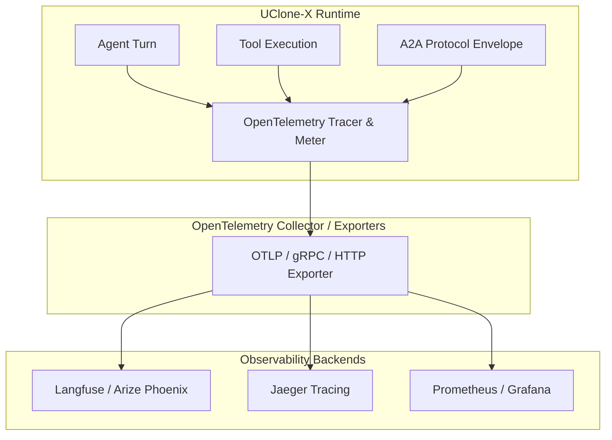

# OpenTelemetry (OTel) Integration Specification

> [!NOTE]
> **Implementation status (2026-09-02)**: `src/uclone_x/telemetry/` is fully implemented:
> - `models.py` (`SpanRecord`, `MetricRecord`, `SpanKind`, `SpanStatus`, `MetricKind`)
> - `protocols.py` (`TraceRecorderProtocol`, `TracerProtocol`, `MetricRecorderProtocol`, `TelemetryExporterProtocol`, `SpanStreamProtocol`)
> - `tracer.py` (`TelemetryTracer`, `SpanContextManager`)
> - `metrics.py` (`MetricsCollector`)
> - `exporter.py` (`InMemoryTelemetryExporter`, `CompositeTelemetryExporter`, `create_telemetry_exporter`, `redact_span_attributes`)
> - `otlp.py` (`OTLPTelemetryExporter` for standard OTel Collector HTTP JSON export)
> - `langfuse.py` (`LangfuseTelemetryExporter` for Langfuse trace/generation ingestion)
> All models adhere to Principle 8 strict typing (`frozen=True, extra="forbid", strict=True`) with immutable attributes mappings.

## 1. Overview & Open Observability

UClone-X natively instruments all agent reasoning, tool invocations, and A2A communications using the open **OpenTelemetry (OTel)** standard.

By avoiding vendor-locked telemetry SDKs, developers can export traces and metrics to any OpenTelemetry-compliant collector or platform:
* **Langfuse / Phoenix** (LLM-specific evaluation & tracing)
* **Jaeger / Zipkin** (Distributed trace visualization)
* **Prometheus / Grafana** (Real-time agent metrics)
* **Datadog / Dynatrace / GCP Cloud Trace** (Enterprise observability)

---

## 2. Implementation Status

`src/uclone_x/telemetry/` currently ships:

```text
src/uclone_x/telemetry/
├── __init__.py     # Re-exports models, protocols, tracer, metrics, and exporters
├── models.py       # SpanRecord, MetricRecord, SpanKind, SpanStatus, MetricKind
├── protocols.py    # TraceRecorderProtocol, TracerProtocol, MetricRecorderProtocol, TelemetryExporterProtocol
├── tracer.py       # TelemetryTracer (in-memory tracer with async context manager spans)
├── metrics.py      # MetricsCollector (counters, gauges, histograms)
├── exporter.py     # InMemoryTelemetryExporter, CompositeTelemetryExporter, create_telemetry_exporter
├── otlp.py         # OTLPTelemetryExporter (OpenTelemetry ResourceSpans/ResourceMetrics over HTTP)
└── langfuse.py     # LangfuseTelemetryExporter (Langfuse batch ingestion)
```

The in-memory tracer and metrics collector provide zero-overhead telemetry across agent turns, tool calls, and A2A transports. Telemetry exporters raise `TelemetryExportError` on failure (Principle 6 fail-fast) instead of returning silent booleans.

---

## 3. Telemetry Architecture (target design)



`Tracer` above corresponds to `TelemetryTracer` implementing `TraceRecorderProtocol` and
`SpanStreamProtocol` (§6); `OTLPSpanExporter` corresponds to `OTLPTelemetryExporter` (or `LangfuseTelemetryExporter` / `CompositeTelemetryExporter`) implementing `TelemetryExporterProtocol` (§6).

---

## 4. Span Hierarchy & Semantic Conventions

Every agent turn produces a hierarchical trace following GenAI OpenTelemetry semantic conventions:

```text
[Trace: trc_01J6A79BX8Z9G4K2M1P0]
 └── span: agent.run (agent_id="agt_architect", session_id="sess_dev")
      ├── span: ontology.validate_pre_condition (status="OK")
      ├── span: llm.generate (provider="google", model="gemini-2.5-pro", tokens=570)
      ├── span: tool.execute (tool="view_file", path="src/auth.ts", duration=12ms)
      ├── span: a2a.delegate (target="agt_security_reviewer", protocol="google-a2a/v1")
      │    └── span: subagent.run (agent_id="agt_security_reviewer")
      │         └── span: llm.generate (provider="anthropic", model="claude-3-7-sonnet")
      └── span: ontology.validate_post_condition (status="OK")
```

`status="OK"` in this diagram denotes the value of the `SpanStatus` enum (§5), not a
free-form string.

---

## 5. Data Model

Defined in [`src/uclone_x/telemetry/models.py`](../src/uclone_x/telemetry/models.py).
All three record/enum groups are Pydantic v2 `BaseModel`s with
`frozen=True, extra="forbid", strict=True` — a span or metric, once constructed, cannot
be mutated or silently widened by an extra field.

### 5.1 Enums: `SpanKind`, `SpanStatus`, `MetricKind`

```python
class SpanKind(StrEnum):
    INTERNAL = "INTERNAL"
    SERVER = "SERVER"
    CLIENT = "CLIENT"
    PRODUCER = "PRODUCER"
    CONSUMER = "CONSUMER"


class SpanStatus(StrEnum):
    OK = "OK"
    ERROR = "ERROR"
    UNSET = "UNSET"


class MetricKind(StrEnum):
    COUNTER = "counter"
    GAUGE = "gauge"
    HISTOGRAM = "histogram"
```

**Why enums, not strings.** All three were previously plain `str` fields with the
legal values documented only in a trailing comment — `status_code: str = "OK"  #
"OK" | "ERROR"` (issue
`2026-09-02-036`,
the same pattern issue
`2026-09-02-011` catalogued
across the codebase). A comment is not enforced by anything: `pyright --strict` accepts
`status_code="ok "` or `status_code="pending"` with equal silence, because nothing in
the type says otherwise. `status` is a discriminator a consumer branches on — an
exporter, a UI, a test assertion — and P8 ("strict typing … across agent interfaces")
is specifically about closing exactly this kind of open string on a public contract.
`StrEnum` keeps the wire representation identical (`SpanStatus.OK == "OK"` and it
serializes as the plain string `"OK"`) while making an invalid value a construction-time
`ValidationError` instead of a value nothing rejects until some downstream branch falls
through to a default it shouldn't.

### 5.2 `SpanRecord`

```python
class SpanRecord(BaseModel):
    trace_id: str
    span_id: str
    name: str
    parent_span_id: str | None = None
    kind: SpanKind = SpanKind.INTERNAL
    start_time_ns: int = 0
    end_time_ns: int = 0
    attributes: ImmutableJsonMapping = Field(default_factory=dict)
    status: SpanStatus = SpanStatus.UNSET
    error_message: str | None = None
```

`attributes` is an `ImmutableJsonMapping` (`Mapping[str, JsonValue]`, frozen on validation,
defined in [`core/immutable.py`](../src/uclone_x/core/immutable.py)) — this is the field
§7 below is about: it is unconstrained in *shape* (any JSON-serializable value, by
design, since span attributes are open-ended) but it is exactly the field that must be
scrubbed before anything leaves the process.

### 5.3 `MetricRecord`

```python
class MetricRecord(BaseModel):
    name: str
    kind: MetricKind
    value: float
    unit: str = "1"
    timestamp_ns: int = 0
    attributes: ImmutableStrMapping = Field(default_factory=dict)
```

Note `MetricRecord.attributes` is `ImmutableStrMapping` (`Mapping[str, str]`), narrower
than `SpanRecord.attributes` — metric dimensions are labels, not arbitrary payloads, so
there is no equivalent JSON-value case here.

---

## 6. Protocols

Defined in
[`src/uclone_x/telemetry/protocols.py`](../src/uclone_x/telemetry/protocols.py). Each
subsection below documents the contract as shipped, together with why that shape —
rather than an earlier, plausible-looking alternative — is the correct one. The earlier
shapes are recorded so the same mistake does not re-enter through a future edit.

### 6.1 `TraceRecorderProtocol`

```python
class TraceRecorderProtocol(Protocol):
    def start_span(
        self,
        name: str,
        kind: SpanKind = SpanKind.INTERNAL,
        parent_span_id: str | None = None,
        attributes: Mapping[str, Any] | None = None,
    ) -> str: ...

    def end_span(
        self,
        span_id: str,
        status: SpanStatus = SpanStatus.OK,
        error_message: str | None = None,
    ) -> SpanRecord | None: ...

    def span(
        self,
        name: str,
        kind: SpanKind = SpanKind.INTERNAL,
        parent_span_id: str | None = None,
        attributes: Mapping[str, Any] | None = None,
    ) -> AbstractAsyncContextManager[str]: ...
```

**`span()` is typed `AbstractAsyncContextManager[str]`.** It was previously annotated
`-> AsyncIterator[str]` (issue
`2026-09-02-036`)
while callers were expected to use it with `async with recorder.span("tool.execute") as
span_id:`. **Those two facts cannot both be true.** `AsyncIterator[str]` is what an
`async def` generator function returns to a type checker; it is consumed with
`async for`, and it does not implement `__aenter__` / `__aexit__` — the pair `async
with` actually calls. A plain object typed as an `AsyncIterator` has no context-manager
protocol to enter, so code written exactly as the (now-corrected) documentation showed
it would fail `pyright --strict` and fail at runtime with `AttributeError:
__aenter__`. The documented usage was not merely awkward, it was **impossible** — no
implementation could satisfy both the annotation and the calling convention at once.
The general rule this pins down: **a method meant to be used as a context manager is
annotated as one** — `AbstractAsyncContextManager[T]` (or the `@asynccontextmanager`
decorator on the function that produces it) — and **`AsyncIterator[T]` is reserved for
what an `async for` loop consumes**. The two annotations describe different consumption
protocols, and swapping one for the other is a type error, not a style choice. The same
distinction is why `SpanStreamProtocol.stream_spans()` (§6.4) below is correctly typed
`AsyncIterator[SpanRecord]`: it *is* meant to be consumed with `async for`, never
`async with`.

### 6.2 `MetricRecorderProtocol`

```python
class MetricRecorderProtocol(Protocol):
    def record(
        self,
        name: str,
        value: float,
        kind: MetricKind,
        unit: str = "1",
        attributes: Mapping[str, str] | None = None,
    ) -> MetricRecord: ...

    def drain(self) -> tuple[MetricRecord, ...]: ...
```

**This protocol did not exist before.** The module shipped `MetricRecord` (a data
envelope) and `TelemetryExporterProtocol.export_metrics` (a sink) with nothing between
them, while §1 above advertises "real-time agent metrics" and the module docstring
spoke of "metrics collectors." A producer and a consumer with no recording step in
between is not a metrics pipeline — there was no method anywhere in the module that
returned a `MetricRecord`, so nothing could ever have populated the tuple
`export_metrics` receives. `record(...)` is the missing producer: it takes a
measurement and returns the `MetricRecord` it built, so a counter increment or a
gauge/histogram observation has somewhere to go. `drain()` is the buffer handoff: it
returns everything recorded since the last drain and empties the buffer, which is the
shape an exporter's periodic flush needs — take what accumulated, hand it to
`export_metrics`, and do not double-send on the next tick.

### 6.3 `TelemetryExporterProtocol`

```python
class TelemetryExporterProtocol(Protocol):
    async def export_spans(self, spans: tuple[SpanRecord, ...]) -> None: ...
    async def export_metrics(self, metrics: tuple[MetricRecord, ...]) -> None: ...
```

**Both methods return `None` and raise on failure**, not `-> bool`. A boolean return on
an export call gives the exporter a way to report failure that costs the caller nothing
to ignore — `await exporter.export_spans(batch)` compiles and runs identically whether
the return value is checked or not, and nothing about `bool` forces a caller to look at
it. A discarded `False` is then indistinguishable from a discarded `True`: the trace
that P6 relies on for observing failover and diagnosing failures is silently lost, and
the only symptom is a gap in a dashboard nobody was watching. Principle 6 ([Fail-Fast &
Zero Silent Fallbacks](principles/details/p6-fail-fast-observability.md)) forbids
exactly this shape: "no component may hand its caller a value that the failed operation
did not produce," and a `False` masquerading as a normal return is a silent
substitution for a real answer. Raising removes the choice — an export failure
propagates like any other failure unless a caller explicitly catches it, which is a
visible decision at the call site rather than an ignorable return value.

### 6.4 `SpanStreamProtocol`

```python
class SpanStreamProtocol(Protocol):
    def stream_spans(self) -> AsyncIterator[SpanRecord]: ...
```

For the developer UI to consume spans as they complete. Note the method itself is a
plain `def`, not `async def` — implementations are expected to be `async def
stream_spans(self): yield ...` async-generator functions, whose *call* returns an
`AsyncIterator[SpanRecord]` synchronously (the coroutine machinery starts only once
iterated). Consumed with `async for span in recorder.stream_spans(): ...`, never `async
with` — see the rule stated in §6.1.

---

## 7. Security: Telemetry as an Egress Path

Telemetry is a data-exfiltration surface, not merely a debugging convenience — PRD
**FR-10.3** and threat **T8** (Telemetry exfiltration) in
[`docs/security-threat-model.md`](security-threat-model.md) both treat it as such:

> Telemetry is an egress path and must be scrubbed. Spans carry prompts, tool arguments
> and results. Before export, credential-shaped values and payload contents must be
> redacted or omitted by default, and enabling full-payload export must be a deliberate
> opt-in that says what it sends.

The reason this is a real risk rather than a theoretical one: `SpanRecord.attributes`
(§5.2) is an open `Mapping[str, JsonValue]`, by design — a span needs to carry whatever
attributes the call site attaches, including a tool's arguments, its result, and (per
the semantic conventions in §4) potentially the prompt and completion text of an
`llm.generate` span. §3's architecture sends that mapping to `export_spans` (§6.3),
which per T8 hands it to a **third-party backend outside the process boundary**
(Langfuse, an OTLP collector, Jaeger). Unlike a tool-execution sandbox, this path runs
in the core runtime, not inside any isolation boundary — sandboxing a tool call does
nothing to stop its result from leaving through a span attribute.

**Normative requirements for any exporter implementation:**

1. **Redact or omit credential-shaped attribute values by default.** "Credential-shaped"
   here means the same notion `src/uclone_x/sandbox/models.py` already defines for
   environment variable names — `SECRET_ENV_PATTERNS` and `is_secret_env_name()`, built
   from `SECRET_NAME_TAILS` (see
   [`sandbox-execution-architecture.md`](sandbox-execution-architecture.md) §5.2). An
   exporter must apply that check to attribute *keys* (and, where feasible, scan
   attribute *values* for the same shapes) before a span leaves the process — this
   document intentionally does not restate or fork that pattern list; it references the
   one source of truth so the two never drift apart.

   An exporter **may** be stricter than the environment predicate, and
   `InMemoryTelemetryExporter` is: `SENSITIVE_KEY_SUBSTRINGS` adds bare substrings
   (`token`, `auth`, `bearer`, `authorization`) that the environment predicate must not
   adopt. The asymmetry is intentional and only runs one way. Over-matching an
   attribute key costs a `[REDACTED]` in a trace; over-matching an environment name is
   a *construction refusal* that breaks a tool (`GIT_AUTHOR_NAME`), so the
   exporter's list may be a superset of the environment predicate's and never a subset —
   which is what guarantees a name too sensitive to appear in a trace is also too
   sensitive to inherit into an untrusted child process (FR-12.3 treats them as one
   control).

   **Token count & metric attribute exemption:** While `SENSITIVE_KEY_SUBSTRINGS` includes
   the bare substring `token`, operational metric keys representing token counts or
   performance telemetry — such as keys ending with `_tokens` (`input_tokens`,
   `output_tokens`, `prompt_tokens`, `completion_tokens`, `total_tokens`, `max_tokens`),
   namespaced keys (`llm.input_tokens`, `llm.output_tokens`, `llm.max_tokens`,
   `llm.total_tokens`, `llm.prompt_tokens`, `llm.completion_tokens`), and exact metric
   terms (`token_count`, `tokens_per_second`, `num_tokens`, `tokens`) — are recognized
   and exempted via `is_benign_metric_attribute_key()`. Security boundaries for real
   credentials (`GITHUB_TOKEN`, `API_TOKEN`, `AUTH_TOKEN`, `api_token`, `auth_token`,
   `access_token`, `github.token`, `session_token`) are strictly preserved by checking
   `is_secret_env_name()` first before evaluating the benign metric exemption. Thus, token
   count metrics survive redaction at every depth while credential tokens remain strictly
   scrubbed to `[REDACTED]`.
2. **Full payload content (tool arguments, tool results, prompt/completion text) is
   redacted or omitted by default.** An exporter ships with a default that exports span
   structure (names, timing, status, span/trace IDs, non-sensitive attributes like
   `provider` or `model`) without the request/response bodies.
3. **Full-payload export is an opt-in, not a default**, and enabling it must state, in
   its own configuration, what it sends — e.g. a config flag named for what it does
   (`export_full_payloads: true`) rather than a generic `verbose: true` that a reader
   cannot infer the consequence of.
4. **Requirements 1 and 2 hold at every depth.** `attributes` is an open JSON mapping,
   and `{"llm": {"prompt": ...}}` is the *ordinary* shape of an `llm.generate` span, not
   an edge case — a redactor that checks only top-level keys, or that checks nested keys
   against the credential predicate but not the payload predicate, exports that prompt
   verbatim. Both predicates apply to every key inside every nested mapping, and inside
   every list or tuple element. The walk is depth-bounded (`MAX_REDACTION_DEPTH`) and
   withholds anything below the bound behind a placeholder that is **distinct** from the
   redaction placeholder (`DEPTH_LIMITED_PLACEHOLDER`) — "this was a credential" and
   "this was never inspected" are different statements about the exported span.

   That bound is a **policy cap** on how much nested structure an exporter will inspect,
   not a defence against unbounded recursion. Nothing unbounded can reach an exporter:
   `attributes` is `ImmutableJsonMapping`, and pydantic-core's recursion guard rejects
   both a cyclic mapping and an over-deep one at `SpanRecord` construction. Tolerance of
   cycles and of extreme depth belongs to the public `redact_span_attributes` helper,
   reachable only by calling it directly and bypassing `SpanRecord`. State the cap as a
   policy and it needs no mechanism to justify it — two earlier revisions of this
   section justified it by a mechanism (first cycles, then the recursion limit) that
   this same validator makes unreachable.

`InMemoryTelemetryExporter` (§2) enforces all four via `redact_span_attributes`. Any
further exporter — an OTLP or Langfuse backend — must satisfy them independently; the
requirements are on the export path, not on one class.

---

## 8. Relationship to In-Band Provenance (P6)

**A telemetry span is necessary but never sufficient for Principle 6 compliance.**
[`docs/principles/details/p6-fail-fast-observability.md`](principles/details/p6-fail-fast-observability.md)
is explicit about this, and it is worth restating here because this document is where a
reader is most likely to reach the opposite, wrong conclusion:

> A telemetry span records a failover for a human reading a trace later; it never
> enters the calling agent's reasoning context. An agent that cannot tell a primary
> result from a failover result cannot reason about the reliability of its own
> conclusions.

Concretely: when a `failover.event` span (§4's `a2a.delegate` / `llm.generate` spans
are the same family) is emitted for a provider failover, that span is one of **four**
independently required signals, not a substitute for the other three. P6 requires the
retry/failover policy to be declared in advance, the failover to be announced on the
event bus as a first-class `PROVIDER_FAILOVER` event *before* the result event, and —
the one most relevant to this document — the result envelope itself to carry a
`provenance` block naming the path taken (`"primary"` / `"retry"` / `"failover"`) with
the span's own `span_id` cross-referenced in `provenance.attempts`. The span and the
in-band `provenance` field must name the *same* event so the trace and the envelope
cannot drift apart; the span is what a human inspects after the fact, `provenance` is
what the agent that received the result can act on immediately. A design that emits a
correct span and stops there has covered exactly one of P6's four conditions, and — per
P6's own classification procedure — a result with no `provenance` block "must fail
fast" on the consuming side; a well-formed span next to it changes nothing about that.
This document's exporters and spans are the observability half of P6, never the
compliance mechanism by themselves.

---

## 9. Configuration

Configured via standard OpenTelemetry and Langfuse environment variables or `create_telemetry_exporter()`:

### 9.1 Environment Variables

| Variable | Description | Default |
|---|---|---|
| `OTEL_EXPORTER_OTLP_ENDPOINT` | Base OTLP Collector HTTP endpoint | `http://localhost:4318` |
| `OTEL_EXPORTER_OTLP_TRACES_ENDPOINT` | Traces ingestion endpoint | `$OTEL_EXPORTER_OTLP_ENDPOINT/v1/traces` |
| `OTEL_EXPORTER_OTLP_METRICS_ENDPOINT` | Metrics ingestion endpoint | `$OTEL_EXPORTER_OTLP_ENDPOINT/v1/metrics` |
| `OTEL_EXPORTER_OTLP_HEADERS` | Comma-separated headers (`key1=val1,key2=val2`) | None |
| `OTEL_EXPORTER_OTLP_TIMEOUT` | Request timeout in seconds | `10.0` |
| `OTEL_SERVICE_NAME` | Service name in ResourceSpans envelope | `uclone-x` |
| `LANGFUSE_PUBLIC_KEY` | Langfuse Project Public Key | None |
| `LANGFUSE_SECRET_KEY` | Langfuse Project Secret Key | None |
| `LANGFUSE_HOST` | Langfuse Host URL | `http://localhost:3000` |

### 9.2 Exporter Factory (`create_telemetry_exporter`)

`create_telemetry_exporter()` auto-detects configured telemetry backends:
- If `OTEL_EXPORTER_OTLP_ENDPOINT` or explicit OTLP endpoint is provided -> `OTLPTelemetryExporter`
- If `LANGFUSE_PUBLIC_KEY` and `LANGFUSE_SECRET_KEY` are provided -> `LangfuseTelemetryExporter`
- If both are provided -> `CompositeTelemetryExporter` fan-out
- If neither is provided -> `InMemoryTelemetryExporter` (zero network overhead fallback)

All exporters enforce secret and payload redaction by default (`export_full_payloads=False, redact_secrets=True`).

