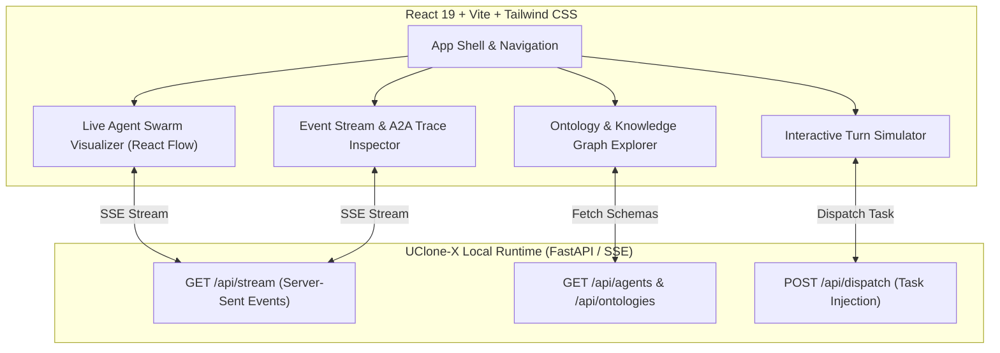

# UI Head Architecture (React + Vite)

## 1. Objectives & Scope

UClone-X ships an embedded **React + Vite** head served by the local runtime.

Who it is for is settled in [`PRD.md` §1.3](PRD.md) and operationalised for builders in
`.claude/skills/ui-authoring/SKILL.md`. In short:
**U0 — the person who installs the product and does not read its code — owns the default
state, and U1/U3 own what is reachable from it.**

> This section previously read *"to lower the barrier for developers testing complex
> multi-agent swarms"*, and titled the document *Developer UI Dashboard*. That is a testbench,
> in the same words [P0](principles/details/p0-product-purpose.md) uses to say what the head
> must not be: *"a product surface rather than a testbench"*. The head was consequently built
> for two audiences at once — see
> `2026-09-11-001`.

The head provides:
- **A conversation** with a named default agent, present unconditionally — the product surface.
- **Runtime internals, one action away**: agent swarm topology, the live event ledger, tool
  execution detail, ontology, skills, token budget, and evaluation results.
- **Per-turn attribution** — which persona and which provider/model served each turn, read from
  the turn result and never inferred from its text (FR-13.4).

### 1.1 The UI holds no primary session state (P8)

P8 requires that "all business logic, session state, conversation histories, tool
execution outcomes, and reasoning loops MUST reside exclusively in the Core Engine", and
that this dashboard "MUST NEVER hold primary state, manage independent conversation
lifecycles, or implement logic that is absent from the Core".

Until #183 `AgentSessionManager` was the only session persistence in the tree: it owned
the storage directory, the path-traversal guard, the atomic write, and its own reset
semantics — one of three reset implementations in the repository that disagreed with
each other. The conversation now lives in `uclone_x.agent.session.SessionStore` and this
class is its client.

What remains here is the **presentation transcript**: per-message ids, timestamps,
latency, token counts, the display provenance block, and on a prompt the optional
`client_turn_id` the head sent the turn with (#1000) — how a head reloading the
conversation recognises its own turn's saved copy without comparing prompt text — which
are view data the Core has no reason to model. A `client_turn_id` must be 1–128 ASCII
letters, digits, `-` or `_`; a field present outside that is refused with 422 before the
turn runs, and leaving it out sends the turn without one (#1007). The two are stored in different files on purpose — the transcript
keeps `<storage_dir>/<session_id>.json`, the Core conversation goes under
`<storage_dir>/core/` — because their schemas differ and one filename would mean silent
mutual overwrite.

A turn that failed is saved in that transcript as a **failure record** -- `role: "failure"`,
`content` the text the page showed, `error` the turn's own reason -- and not as an assistant
reply (#969): a failure is not something the agent said. The page shows it, and
`reconstruct_history` never rebuilds it into model context. A transcript saved before #969
holds its failures as assistant rows reading `Error: ...` under degraded provenance; those
are served as they were saved and, by that shape, are also kept out of a rebuilt context.

**How a turn ended is a structured field, and the head names it from nothing else** (#1007
item 4). The `/api/turn` result and every saved agent row carry `outcome`
(`ChatTurnOutcome` in `uclone_x.ui.app`), and a failed turn also carries `error` and
`refusal`. The chat head shows one chip per turn from it:

| `outcome` | Chip | Covers | Detail |
| :--- | :--- | :--- | :--- |
| `completed` | none | an answer from the requested model -- including one that answered but was not persisted, which `durability` reports | -- |
| `degraded` | `degraded` | the Core's meaning only: `Provenance.degraded`, an answer served by a model other than the one requested | the `Served by` badge |
| `failed` | `Failed` | the turn's own error, a turn that raised, an HTTP error, a network error, and a turn the page refused before sending | the row's text says why; a network error keeps the partial text that arrived |
| `interrupted` | `Interrupted` | Stop (saved as `role: "cancelled"`), and a stream that ended without saying how the turn ended | the row's text |

The display block's `provenance.degraded` is **not** that meaning: on a chat row it is also
true for failures, offline turns, cancelled turns and unpersisted answers, so it names no
chip. A row saved before `outcome` existed is named by its `role` (`failure` is `Failed`,
`cancelled` is `Interrupted`); one that states neither shows no chip rather than one guessed
from its provenance or its text.

`refusal` is the `RoomTurnRefusal` rooms carry (#1022), mapped from the turn's
`TurnResult.stop_reason` by the one `turn_refusal` both heads call, never from `error`'s
wording. A failed row with `refusal: "budget_exceeded"` -- a token ceiling, which
only grows -- offers no **Retry last turn**: it shows the stored error with the remedy, as a
room's row does (#969 question 1). Every other failure keeps Retry, including the step
budget (`step_budget_exceeded`: `run_steps` resets per turn) and `TokenBudgetExhaustedError`
(the model's own completion allowance for one request).

**A transcript export includes failure records as failures** (#969 question 2). No export
exists yet; when one is built, each `role: "failure"` row is exported marked as a failure,
with its `error` -- never as assistant text, and never as model context. A failure is not
something the agent said, in an export any more than on screen.

| Endpoint | Delegates to | Notes |
| :--- | :--- | :--- |
| `DELETE /api/session/history` | `AgentSessionManager.clear_session_history` | Clears the transcript and resets the Core session. |

`POST /api/chat/reset` (`BaseAgent.reset_session`) and `POST /api/chat/compact`
(`BaseAgent.compact_session`) were rows in this table until #1208 retired the playground
that called them, and they have **no** successor: nothing else on the head reset or
compacted a session by hand. Neither capability is lost at the Core, and neither is
reachable from a browser. A room's agents compact themselves --- `AgentLLMConfig.auto_compact`
defaults on and `_auto_compact_if_needed()` runs before every dispatch --- and a new
conversation is what a reset now means, which is the design's §3.2.5 reading and not a
re-implementation of the routes. The manual triggers are listed as **missing** there.

Path resolution for both the transcript and the Core record goes through the single
`uclone_x.agent.session.resolve_session_path`. It previously existed twice, and a
duplicated security control is one that gets fixed in a single copy.

**One P8 gap remains, deliberately**: `get_or_create_agent` still reconstructs
`ChatMessage` history from the presentation transcript when the Core store holds no
record for a session. That is conversation-rehydration logic living in the UI, and it is
kept only so installs with an existing transcript and no Core record still resume. The
Core record is tried first.

---

## 2. UI Architecture Diagram



---

## 3. Layout: two regions, not a tab bar

```
Rail (toggle)  │  Conversation (always, no condition)  │  Workspace Dock (toggle, closed by default)
conversations  │  inline tool steps                    │  Clone · Turn · Docs & Artifacts
clones         │  per-turn attribution                 │  Remembers · Activity & Tools · Resource
               │  composer                             │  developer mode only (off by default):
               │                                        │  Knowledge Graph · DAG · EventBus · Ontology
               │                                        │  — 360–900px, capped to window
```

The conversation is U0's default state, so it carries **no condition** and cannot be navigated
away from. The dock's surfaces are U1's and U3's, plus U0's own generated docs and artifacts,
and they sit one keystroke away.

**No gauges in the rail (#1059).** This diagram read `budget gauges` in the Rail column until
then, and the rail did draw them: a step-budget bar, a turn counter with a saturation badge, and
a token total, on U0's default screen. That is the thing `ui-authoring`
§2 step 4 calls an instrument, and it contradicted `ui-kit/rail/ConversationList.tsx`'s own
docstring ("The rail's one job: list conversations") a few lines from the code that drew it.
Nothing was deleted: **the readings are surface 6, Resource, below** — two clicks from the
default screen, `Workspace` then `Resource`, with the saturation badge carried over intact.
What they *count* changed afterwards (#1272): they were derived from the retired single-agent
history rather than from the conversation on screen, and two of the four turned out to have no
room-level equivalent at all. The `estimated` qualifier (#939) went with the figure it
qualified — see surface 6. The Clones section stayed in the rail: since #1187 a
clone's row expands to *the conversations that clone is in*, which is an index into the list
above it rather than the active conversation's roster, and the roster is the second job
`unified-conversations-and-room-ui.md` §3.2.4
moved to the conversation header.

They were seven mutually exclusive peers of the conversation until 2026-09-11, which meant
reading the DAG cost you the conversation, and both side regions were additionally conditioned
on the chat tab being active — leaving FR-13.1's persistent session sidebar unmet.

Every control that opens this one dock — the header's toggle, and the floating opener the
conversation places above its composer — is named **Workspace**, and the component is
`ArtifactsDock` (`frontend/src/components/layout/ArtifactsDock.tsx`). The dock does not carry
"Internals" as a name anywhere in the surface any more: that name described an earlier,
diagnostics-only version of this region, and having both "Workspace" and "Internals" refer to
the same toggle, under two different labels a few pixels apart, was a defect in its own right
(#1055).

**The dock is scoped to the conversation on screen and one seat in it** (owner ruling,
2026-09-22, #1356). `App` passes the room the centre column shows and a seat: the clone last
picked or inspected in the rail if it is seated there, else the agent that spoke last, else the
first seated. Activity, Remembers and the Knowledge Graph describe that seat; a **Showing**
picker appears above them only when the room seats more than one clone. Opening another
conversation re-scopes every surface without a reload. No dock surface reads the retired
single-agent session or its fixed default id any more. Where a seat's session could not be
written after its turn, the reply's row in the conversation says so in a quiet line
(`persist_error`), since what that turn added will not survive a restart.

**Dock surfaces**

Primary tab bar (always visible, and the only surfaces the dock offers while developer mode is
off):

1. **Clone** — one clone's profile, to view, edit or create (`CloneProfile`); the rail's
   inspect, edit and new-clone controls open the dock here.
2. **Turn** — the turn whose `why ›` was pressed (`TurnDetail`).
3. **Docs & Artifacts** — the files **this conversation** wrote (`DocViewer`), read from
   `GET /api/rooms/{id}/artifacts`, and nothing else in the workspace. Where the room could
   not attribute a write, or a turn recorded no tools, the Core's note is shown as a sentence
   above the list. **Open in Docs** — on an Activity row that wrote a file, on an inline
   generated image, on a media card — fronts this surface on that file (`OpenInDocsContext`).
   A failed read of the list shows the Core's own `detail` or a fixed sentence, and a file
   whose content cannot be read shows a fixed sentence; never transport text (#1435).
4. **Remembers** — what the seat's clone remembers, one plain sentence per item, in two
   groups (`RemembersPanel`, `GET /api/rooms/{id}/knowledge?agent_id=`). **Saved to memory**
   (`saved_facts[]`, #1401) is the facts the clone saved to its own memory, from any
   conversation, never another clone's; the ones saved here are
   marked. **Known in this conversation** (`remembers[]`) is the seat's knowledge record for
   this conversation. Where a group has nothing to list, or cannot be read, the panel
   says that none are listed or that it could not be read, never "nothing was learned" (P6). A
   failed read shows the Core's own `detail` or a fixed sentence, never transport text. A seat that is not running is read from its saved knowledge
   record (#1367); a turn that set an unreadable record aside says so on its row; the clone's saved memory facts are another file and stay listed. This is U0's view of the same knowledge the developer Knowledge Graph draws; nothing
   on it names the graph's parts (#1357).
5. **Activity & Tools** — the seat's tool calls in this conversation (`ActivityTimeline`):
   the recorded ones from `GET /api/rooms/{id}/seats/{pid}/history`, plus live `TOOL_CALL` /
   `TOOL_RESULT` envelopes on topic `room.{id}.tool`, matched without regard to case (#1353).
   A turn whose tools were not recorded is counted and its reason quoted, never shown as
   "used none". A failed read shows the Core's own `detail` or a fixed sentence, never
   transport text (#1435).
6. **Resource** — the open conversation's own readings (`ResourceSummary`). Since #1059 this
   is the *only* place they are drawn, and since #1272 they are read from the **room on
   screen** rather than from `GET /api/session/history`. That history is the retired
   single-agent store, which follows the rail's clone selection; since #1208 the centre column
   is unconditionally a room, so every figure derived from it named a transcript the user
   could not open.

   Two of the four have **no room-level equivalent**, and the surface says so in a sentence
   rather than showing a number from somewhere else (P6):

   - **No token total.** `RoomMessage.usage` is declared and nothing populates it on the
     orchestrated path (`room/models.py`), so there is no per-turn count to total, and no
     HTTP route serves a room token total. (The room cost report, `room/costs.py`, which
     classified every such turn `NO_USAGE` and refused to total the room, was removed with
     cost calculation on 2026-09-23, #1392.) **This is why the
     `estimated` qualifier (#939) is gone from this surface**: it qualified whose count a
     token figure was, and there is no token figure for a room to qualify. The mapping
     itself still exists — `App.tsx` still reads `token_count_source` off a reloaded
     transcript row, and `test_ui_server.py` still pins it on the wire — so the qualifier
     returns with the figure if `RoomMessage.usage` is ever populated. It was measured out,
     not forgotten.
   - **No step count.** `AgentConfig.max_steps` bounds the model invocations inside one agent
     run; a room is served by one such run per seat per turn and reports none of their step
     counts on any route the head can call.

   The two that do exist are read from the wire:

   - **Agent replies since your last message** — `turn_state.agent_turns_since_human` against
     `policy.max_agent_turns_per_human_message`, what `room/models.py` calls "the room's P4
     step budget". Deliberately not labelled "Step Budget" (it is not a step count) or "Turn
     Budget" (the old wrong name, which filled a red bar to 51/50 in an ordinary
     conversation). Re-read after every landed turn.
   - **Turns in context, per seat** — `GET /api/rooms/{id}/context`, one row per seat with
     its `Saturated` badge at the Core's own `saturation_threshold` rather than a constant
     duplicated in the head. **Never totalled**: each seat keeps its own context, so a sum or
     a max over them is a room-level figure no producer wrote. Re-read after every landed
     turn, on the same occasion as the room itself.
     - **These used to be sampled, and are not any more (#1286).** A `contextReadIsDue`
       predicate asked at most every four landed turns and stopped asking altogether once a
       seat was saturated, because the read could cost one Core session load per seat. That
       cadence was set for the *banner* — a one-way boolean allowed to be four turns late —
       and #1272 (PR #1283) put the same data on screen as counts, which a reader takes for
       current. PR #1283 could only label the staleness (`room-seat-turns-sampled`:
       "counted up to 4 turns ago").
     - **The maintainers' decision on #1286** is that the load being sampled against does not exist
       here: this is a local install, the seat that just answered is alive in memory as
       `live_agent`, and `SessionManager.active_turns` asks that object rather than loading a
       persisted session. `refreshRoom` already runs on every landed turn, so the context
       read joins it. The predicate, the `CONTEXT_REREAD_EVERY_TURNS` constant and the
       staleness label are all gone — the label because it had become false, which on this
       surface is worse than no label. #1256's cost objection was the load, so it falls with
       it. The retry #1256 added for a read whose answer arrives into a moved generation
       (`CONTEXT_READ_ATTEMPTS`) stays: nothing else re-asks that question, because the turn
       that prompted the read may have been the conversation's last.

   The session ledger's `total_used_tokens` is a different quantity again and is the "Token
   Quota" line on this same surface, beside these rather than instead of them.

   **The session ledger's breakdowns live here too.** A separate **Budget** surface read the
   same `GET /api/budget` and was folded into this one: its per-provider input/output split and
   model list, and each compaction event's reason, token counts and kept turns, are on the
   Resource rows. Budget's role attribution was not carried over: the Core returns `roles: {}`
   on every call (`llm/budget.py` `get_summary`), so the section could only ever say that
   nothing was attributed (owner ruling, 2026-09-22). It returns when the ledger records tokens
   by role.

Developer drawer (rendered only in developer mode; see below):

7. **Knowledge Graph** — the seat's knowledge graph in this conversation
   (`KnowledgeGraphViewer`, `GET /api/rooms/{id}/knowledge?agent_id=`).
8. **DAG** — the conversation's seats, its turns in order, the tools each called and the
   helpers a seat started (`TopologyTab`, `GET /api/rooms/{id}/topology`), in the order the
   Core's edges give (#1355).
9. **EventBus** — virtualized ledger of every `AgentEvent` envelope, with payload expansion,
   trace ids and latency.
10. **Ontology** — entity nodes, properties, relationships and rule invariants.

**Developer mode is off by default** (owner ruling, 2026-09-22). Surfaces 7–10 live only in the
**Developer Tools** drawer beneath the primary row, and the dock renders that drawer only while
developer mode is on: with it off there is no tab for any of them and the label does not
appear. The switch is **Developer mode** in Settings (`SettingsModal`); it takes
effect at once and is kept in this browser under the `localStorage` key
`uclone-x.developer-mode` (`frontend/src/lib/developerMode.ts`), and a storage read or write the
browser refuses reads as off. It is a head preference beside the dock's width and the rail's
open state, not a Core setting, because a second head attached to the same Core would not need
it (ui-authoring §3). If a developer surface is the selected one while the mode is off — it was
switched off with one open — the dock shows Docs & Artifacts instead and keeps the selection,
so switching the mode back on returns to it. Nothing else in the page opens the dock on a
developer surface: the rail's inspect, edit and new-clone controls open Clone, and a turn's
`why ›` opens Turn.

**Studio mode: the clone editor takes the main column, and `App` owns it (#1347, #1377).**
While Clone is editing or creating a clone, the editor's **Studio mode** button gives it the
room the conversation and the dock share. `App.tsx` holds the flag (`cloneStudioRequested`,
screen state and so the head's, P8) and derives `cloneStudio` from it: it holds only while the
dock is open on Clone in a non-view mode, and it ends when the editor does. While it is on,
`App` hides the conversation's `<main>` — hidden, not unmounted, so its scroll and state
survive — and `ArtifactsDock` drops its dragged width and resize handle and becomes
`relative flex-1 min-w-0`, so the dock itself fills the column the conversation had. The rail
stays where it is. `CloneProfile` only receives `studio` / `onStudioChange` and centres the
same editor wrapper at a reading width; toggling re-renders that wrapper rather than remounting
it, so what was typed survives the switch in both directions.

**Why the host and not the editor.** Studio mode used to be `CloneProfile`'s own state, drawn as
a `position: fixed` panel over the page. The dock's `<aside>` carries `backdrop-blur-md`, and
any `backdrop-filter` (like `transform` or `filter`) makes an element the **containing block of
its `position: fixed` descendants**, so the "full-screen" panel was laid out against the dock's
own box: in a 1600px window the 520px dock gave a 455px card inset 32px, drawn inside the dock. Nothing
inside the dock can escape that, which is why the room has to come from the layout that owns
the row. **A change that moves a full-screen or pop-over surface into the dock hits the same
trap**; render it from `App`, or give the dock the space as Studio mode does.
`tests/e2e/test_clone_profile_e2e.py` asserts the rendered boxes — the editor wider than the
dock it was opened from and starting in the conversation's column — because jsdom does no
layout and no component test can see the difference.

**Leaving it.** The button, Cancel, a save that lands, or **Escape**. Escape leaves Studio mode
and keeps the draft: leaving Studio mode is not leaving the editor, and the same editor returns
to the dock with the edit still unsaved in it. It claims the lowest Escape layer (`'studio'`,
below), so a dialog, a rail rename or a menu open on top closes first, and it leaves alone an
Escape pressed on a dropdown or one that ends an input method's composition.

**Skills, ACP and Evals are not dock surfaces** (owner ruling, 2026-09-22; #1358). The dock is
about the conversation on screen, and none of the three is.

- **Skills** — the P9 catalogue with per-skill approval state — is a section of Settings,
  directly below Agents (`PersonaManager`), and is not behind developer mode: which skills are
  registered and approved is configuration of the installation, like the clone definitions
  beside it. It reads `GET /api/skills` when Settings shows it, and states a read failure or an
  empty catalogue in words.
- **ACP** — what this build answers of the Agent Client Protocol, and whether anything serves
  it (see [`acp-protocol-spec.md`](acp-protocol-spec.md)) — and **Evals** — the latest quality
  and evaluation run, with a failed read's cause (#1344) — make up Settings' **Diagnostics**
  section, directly below the Developer mode switch. It is mounted only while developer mode is
  on, so turning the switch on shows it in the same dialog, one deliberate action away. It
  reads `GET /api/acp/status` and `GET /api/evaluations/latest` only while it is shown.
  **Problem reporting** (`DiagnosticsPanel`) at the top of Settings is a different thing: a
  consent every user is asked, shown whatever the mode.

Both sections carry `.dock-scope`, so the panels' grids answer to the dialog's width as they
did to the dock's (ui-authoring §3). App no longer fetches any of the three routes at start-up.

There is no separate Tool Detail
surface: an Activity row's expanded card shows everything the
retired Tool Detail drawer did — arguments, result, error, the execution time (or "not timed"
when nothing timed the call), and a copy of the whole call record as JSON.

**Room-scoped reads for the dock (#1353, #1354, #1355, #1357).** Owner ruling
(2026-09-22): the dock describes the conversation on screen and the seat selected in it, not
the workspace and not the retired single-agent session. The Core half has landed as four reads
in `src/uclone_x/ui/room_dock.py`, and each surface now reads its own (#1356); the table
records what each one replaced:

| Surface | Reads | What it replaces, and why that could not answer |
| :--- | :--- | :--- |
| Docs & Artifacts | `GET /api/rooms/{id}/artifacts` | `GET /api/artifacts`, which lists the whole workspace. The room read lists only the paths its seats wrote through a tool that declares `writes_files` (#1167). `unattributed_writes` counts calls that may have written without naming a path (a shell, a helper); the list never claims that nothing was written |
| Knowledge Graph (developer drawer) | `GET /api/rooms/{id}/knowledge?agent_id=<seat>` | `GET /api/knowledge-graph`, which reads the manager's shared engine. That engine is never a seat's (P7). A seat not running in this process is read from its saved knowledge (#1367); with none saved the room read answers `status: "not_recorded"` with `null` lists, never an empty graph |
| Remembers | `saved_facts[]` and `remembers[]` of the same knowledge read | Nothing: U0 had no view of what a clone remembers. The saved facts are listed on every status; `not_recorded`, `unreadable` and `no_ontology` show the Core's `reason` for the conversation's record |
| Activity & Tools | `GET /api/rooms/{id}/seats/{seat}/history`, live on `room.{id}.tool` | The session's tool trace, which a seat's traces never reach (G2). A turn whose tools were not recorded carries `tools: null` and a reason, never `[]` |
| DAG (developer drawer) | `GET /api/rooms/{id}/topology` | `GET /api/agents`, which lists the chat manager's agents. A seat is not among them. Every seated agent is a node, including an idle one |

Response shapes and the bus rows are in
`design/unified-conversations-and-room-ui.md`
§3.5 and §3.6 (**[Rev 31]**). The workspace-wide routes stay for compatibility.

Panels in the dock lay themselves out against the **dock's** width, not the viewport's: the
dock is dragged by the operator (360-900px), so a viewport breakpoint renders a three-column
grid inside a 360px panel. Two rules do this (#1029):

- `ArtifactsDock`'s aside carries `.dock-scope`, a container query (`index.css`): at 480px of
  content or less every `grid-cols-*` grid is one column, the same threshold `.column-scope`
  uses. Above 480 the panels' viewport classes still decide, so the default 520px dock keeps
  its columns.
- A panel's header and filter rows are `flex-wrap` rows, not rows that stack at a viewport
  breakpoint: where the row fits nothing changes, and where it does not its last controls move
  to a second line instead of running past the dock's edge.

The **dock itself** is sized against the workspace row, which is the quantity a container query
inside it cannot see. The row is the rail plus the conversation plus the dock, so what decides
whether the dock fits *in* the row is what is left of the window once the rail has taken its
240px — not the window, and not the dock's own width. When the remainder cannot seat it, the
dock is drawn *over* the workspace instead of beside it, at the full width of the window; a
320px window cannot seat a 240px rail, a conversation and a 360px dock in one row, and until
#1019 it did not try to — it took its stored 520px and the surplus left the window, taking the
close button and the right-hand tabs with it. Being drawn over the workspace changes no state:
the rail is where it was when the dock closes again. Whether the rail yields at a narrow window
was left open here (#1013/#1018); #1062 settled it, below.

**The rail divides the row from 600px and is drawn over it below (#1062).** The breakpoint is
the rail's 240px plus the narrowest conversation it may leave beside itself, 360px — the dock's
own minimum (`RAIL_OVERLAY_BELOW_PX` in `frontend/src/lib/rail.ts`). Below it the open rail is
an overlay on the conversation's left edge, above the dock so that the dock's close control on
its right edge still takes a click, and it holds **none** of the row: `App` tells the dock the
rail reserves 0. So every piece of dock arithmetic in this section that says "with the rail
open" holds at 600px and above; below 600px the dock is sized as if the rail were closed. A
first run starts with the rail open where it can sit beside the conversation and closed where it
cannot. After that the user's own choice wins at every width: an explicit toggle is written to
`localStorage` (`uclone-x.rail.open`) — in the browser and not the Core, because collapse
state is the screen's (§1.1, P8) — and a resize is not a choice, so it moves the open rail
between the row and the overlay without closing it or writing anything.

The rule reads the window and the rail, not the dock, and that is its gap: with the dock
seated, the conversation gets the window less the rail less the dock, and the dock seats itself
whenever that is more than 0. At 761px with the rail open and a 520px dock the conversation is
1px wide. That was so before #1062 and is unchanged by it; neither rule guarantees the
conversation a width once both side regions are open.

**The row's arithmetic is the whole of the rule, and two simpler rules were tried and are
wrong.** Deciding from the window and the dock's width alone cannot express "the rail is
already holding 240 of this", and fails in both directions (#1030):

* it **over-fires above ~600px**, where narrowing back into the row would have been fine — a
  drag to the window's edge stored the window as the width, and a rule that then refused to
  narrow made the width unrecoverable from inside the surface at every window up to 900px;
* it **under-fires at 400px with the rail open** (the rail was in the row there until #1062;
  the same shape now sits at 600px), where no width the drag can reach fits
  beside the rail, so narrowing put the dock back into a row it overflowed — `x 240..600`,
  close button off the window, and stored, so a reload found it there.

**One width changed side when the arithmetic replaced the window-only rule, and it is a
deliberate change rather than drift.** At exactly **760px with the rail open**, the old rule
seated the dock in the row: 240 + 520 is 760, so it fitted — with a **0px conversation column**.
The row's arithmetic overlays it instead, because `760 - 240 = 520` is not *more* than the
dock's 520 and the threshold is `<=`. A 0px conversation is the complaint #1019 was filed
about, and the dock is inside the window either way, so this is the right side of the line; but
760 was not off-window before, which makes it the one width where a reader comparing the two
trees sees a change that is not a fix to something broken. 761 and above are unchanged
(`x 241..761`), as is every width with the rail closed. Pinned by
`frontend/src/components/layout/ArtifactsDock.test.tsx` ::
`overlays a 760px window the open rail leaves exactly its own width of`. **Not** by
`tests/e2e/test_workspace_layout_e2e.py::test_the_open_dock_stays_in_the_window_where_the_rail_leaves_it_no_room`,
whose `760` parameter covers the width but asserts only that the dock is inside the window —
which it is under both rules, so it passes under both (measured on a production build of a
window-only-rule tree: that case's `600` and `700` fail and its `760` passes).

760 with the rail open is the **equality boundary with the rail open**, and that case is the
only one anywhere that pins it. Every other rail-open case is an *interior* point of the
predicate, so together they pin the width it effectively subtracts only to an interval — about
`[180, 248)` against a true 240 — and mutations landing inside it (`reservedWidth * 0.9`,
`Math.max(0, reservedWidth - 1)`) escaped the entire suite until this case was added. The one
other equality boundary, `overlays a window exactly its own width, and not one a pixel wider`,
is at rail 0, which any mutation that vanishes at 0 walks straight past.

The quantity itself is not optional. `ArtifactsDock`'s `reservedWidth` is a **required** prop
with no default: it defaulted to `0` until #1042, and `0` is precisely the window-only rule
above, so a mount site that forgot the prop would have restored the defect silently and with
nothing going red.

Deriving the decision from the *rendered* width instead was not a third option, and this is
worth recording because it is the remedy the defect report proposed first. Under the window-only
rule the rendered width was `min(width, window)`, so `window <= min(width, window)` and
`window <= width` are the same predicate at every input — substituting one for the other changes
nothing at all.

The resize handle is therefore never refused. A drag always writes the width the user asked
for; it is the layout that declines to seat it, by drawing the dock over the workspace rather
than off the edge of it. That keeps the dock's width recoverable by the same gesture that
changed it, which a control offering a `col-resize` cursor has to be.

**A stored width outliving the window it was chosen in is that same arithmetic, read again
after a resize (#1035).** The report is a width dragged at a wide window that the window can no
longer seat once it narrows: at its 360px minimum at 900px, narrowed to 400px, the dock was
measured at `x 240..600` with the close control past the right edge and the state surviving a
reload. Both terms of that reading are gone — #1042 made the dock subtract the rail's share
rather than compare the window with its own width, and #1062 stopped the rail holding any of
the row below 600px, so 240 + 360 in a 400px window no longer describes any state — and the
whole sweep of widths passes on `main` unchanged. What the dock reads is `window.innerWidth` as
*state* (`useWindowWidth`), so a narrowing re-decides the same predicate with no stored width
touched; nothing here is a special case of the resize, and nothing in it depends on how
#1013/#1018 answers whether the rail should collapse, since the property holds under both of
the rail's states. Pinned by
`tests/e2e/test_workspace_layout_e2e.py::test_no_width_dragged_at_a_wide_window_leaves_the_close_control_off_a_narrow_one`,
which is the only browser case that moves the viewport under an already-dragged dock: every
other one fixes the window before the dock mounts, and `ArtifactsDock.test.tsx` narrows in
jsdom, where a dock with the right `style.width` and a box pushed out of the window by the row
around it reads exactly like a correct one.

**The rail's conversation order is the Core's, not the head's (#1053).** `RoomService.list_rooms`
(`src/uclone_x/room/service.py`) returns conversations **most recently updated first**, and
equal stamps by `room_id` ascending, so the order is total and the same on every call.
`GET /api/rooms` and `ucx room list` both pass it through; `ui-kit/rail/ConversationList.tsx` renders the
rows in the order they arrive and does **not** sort them again.

It is in the Core by the P8 test in
`.claude/skills/ui-authoring/SKILL.md` §3: a second
head attached to the same Core would need the same order. uclone2 is that second head, and
two heads each carrying their own `.sort()` over the same list are two places free to
disagree about which conversation came last. The legacy "Past chats" list is still sorted in
the head (`fetchSessions` in `App.tsx`); it is not changed here.

Before this, the listing was `RoomStore.list_room_ids()` order: a string sort of
`room_<12 random hex>`, which is stable across reloads and says nothing about the
conversations. What the order is taken from, precisely:

* **`updated_at` is the room record's last write** -- a message, an agent's reply, a rename,
  a roster change, and also a composing notice (`POST /api/rooms/{id}/typing` saves the room).
  So a conversation someone started typing into and never sent to counts as active. That is
  the field the listing already carried; a "last message" order would need a stamp the
  summary does not have.
* **Compared as an instant, not as a string.** The store only writes UTC, but a record carried
  from another machine or edited by hand need not be, and `10:00+09:00` sorts after
  `05:00+00:00` as text while naming an earlier moment. A stamp with no offset is read as UTC;
  one that is not a date sorts last rather than failing the listing.
* **The tiebreak does not lean on the store.** `RoomStoreProtocol.list_room_ids` promises no
  order (`RoomStore` happens to sort), so `list_rooms` sorts by `room_id` itself.

Pinned by `tests/unit/test_room_service.py` :: `test_list_rooms_*`.

Each row also says **when it was last active**, in words: "just now", "5 minutes ago",
"yesterday", "last week" (`frontend/src/lib/relativeTime.ts`). Under a day that counts
elapsed time; from a day on it counts calendar days in local time, so "yesterday" is the day
before today and not "24 to 48 hours ago". The wording is re-read every minute, and the exact
time is the row's tooltip. The rail re-reads the listing after every message the user sends,
so the conversation just used moves to the top without a reload. It does **not** re-read on an
agent's reply or on activity in a conversation that is not open, so those reorder the rail at
the next send or reload. Pinned in the browser by
`tests/e2e/test_room_chat_e2e.py::test_the_rail_lists_the_most_recently_active_conversation_first`.

The rail still has no filter and no grouping: ordering helps a person find last week's
conversation, and once the list is long it is not enough on its own.

**Persona detail, one click inside the rail's Agents list (#1056, scope (a)).** `GET
/api/personas` has always returned nine fields per persona -- `name`, `role`, `description`,
`allowed_tools`, `model_name`, `temperature`, `max_tokens`, `enable_write_tools`,
`enable_subagent_tools` -- and the Agents list rendered two of them. The other seven include
the two safety boundaries (`enable_write_tools`, `enable_subagent_tools`), so a user picking a
persona had no way to see what it was permitted to do. (Found unenforced in #892 -- copied
into `AgentConfig` and read by nothing -- and enforced since #1167, so the card now describes
a boundary that holds.)

The rail's persona row (`ui-kit/rail/Rail.tsx`) now carries a second control beside the existing select
button: a chevron toggle (`persona-detail-toggle-<name>`) that expands `ui-kit/rail/PersonaDetail.tsx`
inline, below that row, showing all nine fields. At most one persona's card is open at a time
(`expandedPersona` state, a single slot rather than a set) so the rail does not grow past a
comfortable scroll length. The two controls are separate elements rather than one, because a
`<button>` cannot nest inside a `<button>` and selecting a persona and inspecting it are
different actions -- toggling the card must never change `selectedAgent`.

This is U1's surface (a framework developer checking what a persona may do before running it),
so per `.claude/skills/ui-authoring/SKILL.md` §2 it sits one action away rather than as a peer of
the conversation, and it stays read-only: nothing in the rail writes a persona definition.

**Create and edit live in Settings (#892, scope (b)).** The owner overrode the design docs'
deferral of a write endpoint on 2026-09-19
(decision).
`POST /api/personas` and `PUT /api/personas/{name}` write `<workspace>/.uclone/personas/<name>.yaml`,
and `GET /api/personas` now also returns `system_prompt`, `append_default_prompt`, `model_tier`,
`builtin`, `overrides_builtin`, the runtime's `available_tools` and the `personas_dir` saves go
to. The editor is `components/personas/PersonaEditor.tsx` inside `PersonaManager.tsx`, both
props-only (#1063 D): the catalogue, the words (`lib/personaCopy.ts`) and the icons come in as
props, and the save goes out through `onSave`, which `SettingsModal.tsx` wires to
`lib/personasApi.ts`. Settings is the entry point because it is already the one place that
changes runtime configuration; the rail, the dock and the Playground toolbar are unchanged.
Tools are pills from `available_tools` and the model is a dropdown of the detected models, so
nothing is recalled from memory; a refusal from the server is shown in its own words and keeps
the form open. After a save the Settings callback re-fetches the metadata, so the rail's Agents
list names the new agent without a reload. The write and delegation switches are offered
again now that #1167 enforces them; each is labelled as `BaseAgent`'s refusal quotes it, so a
refused tool names a switch the person can actually find. A save reaches chat agents already using the persona, not
room agents, which take it when the room is next seated.

The empty-tools case follows P6: an `allowed_tools` of `[]` renders the sentence "No tool list
-- this persona can use every tool the runtime has" (`PersonaDetail.NO_TOOLS_CAUSE`), never a
blank list. It said "can only converse" until #892, which was the opposite of what the runtime
does: an empty list is no restriction, not an empty toolset. The two
permission flags render as capability sentences (`describeWriteAccess`,
`describeSubagentAccess`, e.g. "Can write files" / "Cannot write files"), never as a raw
`true`/`false` or the field's own snake_case name.

**Escape does not close the dock, and that is a decision rather than an omission.** The dock
is not modal: it traps no focus, the workspace underneath does not scroll-lock, and its close
button is reachable by Tab and activated by Enter, so nothing here is unreachable without
Escape.

**The key has one owner (#1036).** Five surfaces used to listen for it independently --
`SettingsModal.tsx`, the composer's stop-turn shortcut (`PlaygroundTab.tsx`, deleted by
#1208 --- four surfaces listen now), the room
completion menu (`RoomConversation.tsx`), the delete-conversation dialog
(`ui-kit/rail/DeleteConversationDialog.tsx`) and the rail's title editor
(`ui-kit/rail/ConversationTitleEditor.tsx`) -- and none called `stopPropagation()`, so a
native Escape reached every one of them that happened to be mounted, not just the one
nearest to what the user meant to dismiss. `lib/escapePrecedence.ts` replaces all five with
a single shared `window.addEventListener('keydown', …)`, a small registry of currently-active
layers, and one precedence order:

```
'dialog' (SettingsModal, the delete-conversation dialog)
  > 'turn' (stop a running turn from the composer)
    > 'overlay' (the room's @-mention menu, the rail's title editor)
      > 'studio' (leave the clone editor's Studio mode, #1377)
```

Each surface calls `useEscapeOwner(layer, active, onEscape)` instead of adding its own
listener; on Escape, only the highest-precedence *active* layer's handler runs, so a dialog
open behind a running turn is what closes, not the turn, and a stray Escape while renaming a
conversation never reaches a settings modal sitting underneath it. The dock still claims none
of the first three layers -- consistent with the paragraph above, this remains a decision rather
than an omission. `'studio'` is the clone editor's, not the dock's: it exits a mode and closes
nothing, and it ranks last because a mode outlasts every transient drawn over it.

Two of the five live in `ui-kit/`, which may import nothing from outside itself but `react`
(#1158), so they cannot reach `lib/escapePrecedence.ts` directly. They take the hook the same
way they take their words and their glyphs: as a prop. `Rail` and `ConversationList` carry a
`useEscape: UseKitEscape`, and the head's adapters
(`components/layout/WorkspaceSidebar.tsx`, `components/rooms/ConversationList.tsx`) bind it to
`useEscapeOwner` beside `copy` and `icons`. The kit keeps one owner for Escape without
knowing whose registry it is.

**The rail lives in a UI kit, portable by construction (#1063 D, #1158).** The workspace rail is
the first surface in `frontend/src/ui-kit/`, a kit meant to be mounted by
another head (uclone2 first) as it stands. It holds:

| Path | What it is |
|---|---|
| `ui-kit/rail/Rail.tsx` | The rail: conversations and the Clones quick switcher. No readouts since #1059 — the step budget, turns and tokens are the dock's Resource surface. Owns `RAIL_WIDTH_PX` / `RAIL_WIDTH_CLASS`. |
| `ui-kit/rail/ConversationList.tsx` | The conversation list, with its title editor and delete dialog beside it. |
| `ui-kit/rail/PersonaDetail.tsx` | The read-only persona card. |
| `ui-kit/rail/types.ts` | The data shapes the rail reads (structural, wire field names), and its copy and icon interfaces. |
| `ui-kit/primitives/` | The kit's own `Button`, `Avatar`, `StatusDot`. |
| `ui-kit/index.ts` | The public surface. |

**The rule is an allow-list: a file under `ui-kit/` imports `react` and other files under
`ui-kit/`, and nothing else.** So the kit reads no store, calls no API, holds no copy, and
imports no icon library -- this repo is on lucide-react 1.x and uclone2 on 0.378, so even a
dependency both have is not one they share. `frontend/src/ui-kit.test.ts` enforces it over
every script under `ui-kit/` (the rule itself is `lib/kitBoundary.ts`), including
`export ... from`, bare and dynamic `import`, `require`, and refuses `import.meta` and a
non-literal `import()` outright because their targets cannot be read. The test sits outside
the kit because it imports `vitest`, which the rule refuses; for the same reason no test lives
inside `ui-kit/`.

What the kit needs from a head arrives as props:

- **Words** as one copy object (`RailCopy`, nesting `ConversationListCopy` and
  `PersonaDetailCopy`). Sentences that vary are functions (`renameLabel(name)`,
  `emptyCause(modelConfigured, agentCount)`, `lastActive(timestamp, now)`), so plural, locale and
  relative-time rules stay the head's. The rail calls the one `emptyCause` it is given for both
  of its regions, which keeps #1060's "one fact, one sentence" true across heads too.
- **Glyphs** as components (`RailIcons`, each a `KitIcon`: anything that takes `className`).

Class conflicts are not resolved inside the kit: it cannot import `tailwind-merge`, so its
`cx` only joins. Where the head's primitives relied on a call site overriding a variant's
classes, the kit names the result as a variant instead (`Button`'s `quiet`, `compact` and
`danger`), with the same resolved class set.

This head's side is three adapters at the old paths, so `App.tsx` and the existing tests import
what they always did: `components/layout/WorkspaceSidebar.tsx` (`RAIL_COPY`, `RAIL_ICONS`),
`components/rooms/ConversationList.tsx` (`CONVERSATION_LIST_COPY`, `CONVERSATION_LIST_ICONS`,
built from `lib/emptyStates.ts` and `lib/relativeTime.ts`), and
`components/layout/PersonaDetail.tsx` (`PERSONA_DETAIL_COPY`, `NO_TOOLS_CAUSE`,
`describeWriteAccess`, `describeSubagentAccess`). `frontend/src/ui-kit.rail.test.tsx` mounts the
kit rail with every string replaced by a marker and checks no word of this head's copy reaches
the screen, so a sentence written back into the kit's markup fails there.

---

## 4. Zero-Setup Deployment & Embedded UI Packaging

The UI source code lives in `frontend/` (React 19 + Vite). During build, static assets are bundled directly into `src/uclone_x/ui_static/`:
* **Zero Node.js dependency for Python users**: Anyone running `pip install uclone-x` can run `./ucx ui`, and the embedded FastAPI runtime immediately serves the bundled dashboard from `src/uclone_x/ui_static/`.
* **Independent Frontend Dev**: Frontend developers can run `cd frontend && npm run dev` for instant Vite Hot Module Replacement (HMR).

```bash
./ucx ui
# Opens http://localhost:5180 serving the embedded dashboard
```

